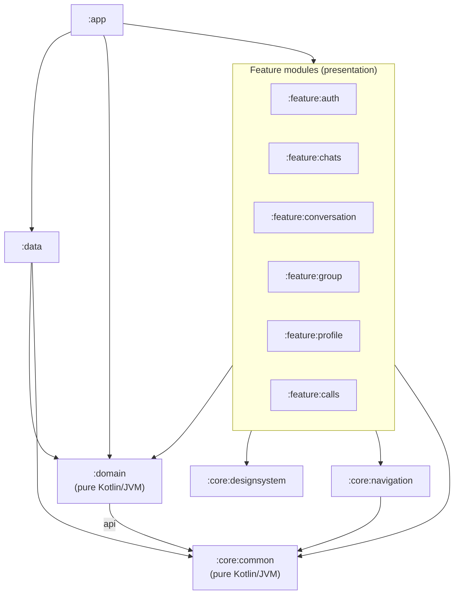
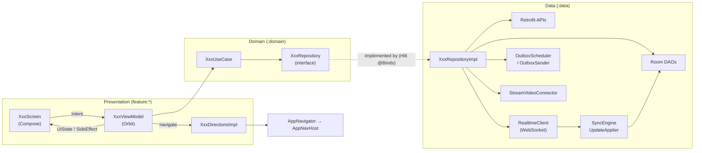
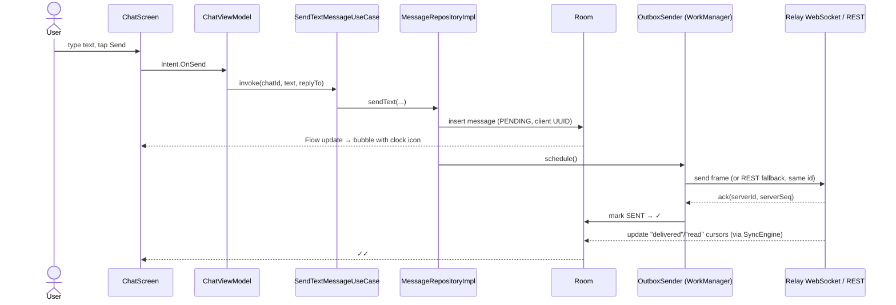
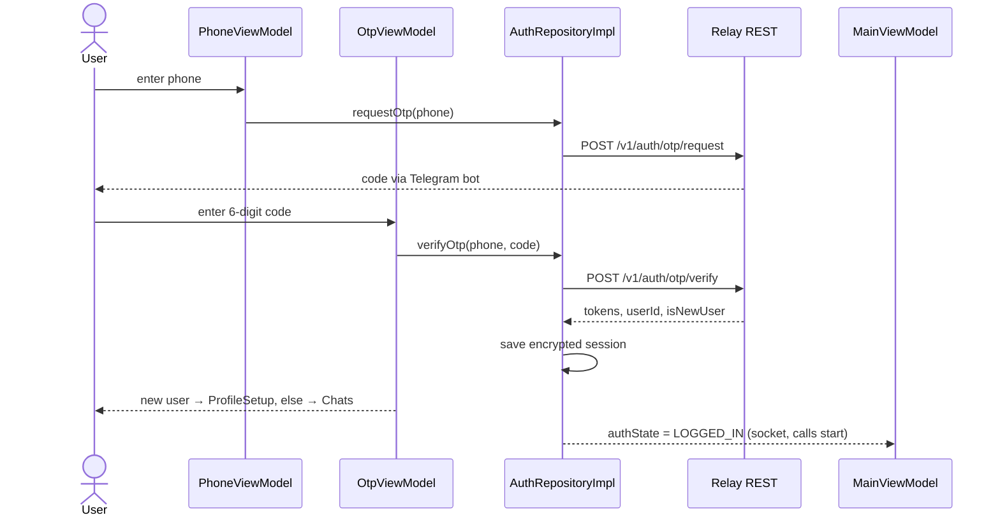

<div align="center">

# SwiftChat

**An offline-first, Telegram-style Android messenger for the Relay server — with audio/video calls.**

[English](README.md) · [O'zbekcha](README.uz.md)

[](https://github.com/AdilxanKenesov/SwiftChat/actions/workflows/ci.yml)
[](https://github.com/AdilxanKenesov/SwiftChat/releases/latest)


</div>

> **Download:** the signed APK is on the [Releases page](https://github.com/AdilxanKenesov/SwiftChat/releases/latest) (Android 8.0+, ARM phones).

---

## Table of contents

1. [Project Overview & Architecture Vision](#1-project-overview--architecture-vision)
2. [API & Data Layer Details](#2-api--data-layer-details)
3. [Tech Stack & Dependencies](#3-tech-stack--dependencies)
4. [Module Structure & Architectural Rationale](#4-module-structure--architectural-rationale)
5. [End-to-End Execution Flow](#5-end-to-end-execution-flow)
6. [Build, Test & Release](#6-build-test--release)
7. [Detailed module documentation](#7-detailed-module-documentation)

---

## 1. Project Overview & Architecture Vision

### What the app does

SwiftChat is a native Android client for the **Relay Server API** — a Telegram-class messaging backend.
It is built **offline-first**: everything the user sees is read from a local database, and the network only
keeps that database in sync. Messages can be written without internet; they are queued and delivered
automatically when the connection returns.

| Area | Capabilities |
|---|---|
| **Sign-in** | Phone number + one-time code delivered by a Telegram bot; Telegram account linking flow; profile setup (name, unique username) |
| **Chats** | Direct and group chats; tabs (All / Direct / Groups); unread counters; typing indicator; online / last-seen presence; mute for 1 h / 8 h / 1 day / forever |
| **Messages** | Text, photo, video and file messages; reply, edit (48 h window), delete; ✓ sent / ✓✓ delivered / read status; local search inside a chat |
| **Media** | Resumable chunked upload, streamed download with progress, full-screen viewer (zoom, video player), save to gallery with a progress notification |
| **Groups** | Create, rename, add/remove members, admin roles, leave |
| **Calls** (Stream Video) | 1:1 audio/video calls with ringing, group video chat (open room), picture-in-picture, emoji reactions, raise hand, screen sharing, background blur / virtual backgrounds, call history in the chat |
| **Contacts & profile** | Local contact list, add by username, user profiles, edit own profile |
| **Settings** | Uzbek / Russian / English (switchable in-app), light / dark / system theme, notifications toggle |

### Architecture summary

| Principle | How it is applied |
|---|---|
| **Multi-module** | 12 Gradle modules: `app`, `domain`, `data`, 3 `core:*`, 6 `feature:*` |
| **Clean Architecture** | `feature` (presentation) → `domain` (pure Kotlin) ← `data` (implementation). Features never see `data`. |
| **Unidirectional data flow (MVI)** | Orbit MVI: `Intent` → `ViewModel` → immutable `UiState` + one-shot `SideEffect` |
| **Declarative UI** | 100 % Jetpack Compose, custom design system (`SwiftChatTheme`) |
| **Single source of truth** | Room database; UI observes `Flow`s from Room, network writes into Room |
| **Navigation** | Navigation 3 with a type-safe `NavKey` per screen and a navigation **event bus** (`AppNavigator`) |
| **Dependency Injection** | Hilt, with assisted injection for screens that take arguments |

### Module dependency graph



```text
                                ┌──────────┐
                                │   :app   │  Application, MainActivity, NavHost
                                └────┬─────┘
          ┌──────────────┬───────────┼────────────────────────────┐
          ▼              ▼           ▼                            ▼
 ┌──────────────────────────────────────────────┐          ┌────────────┐
 │ :feature:auth  :feature:chats  :feature:group │          │   :data    │
 │ :feature:conversation  :feature:profile       │          │ Retrofit,  │
 │ :feature:calls                                 │          │ Room, WS,  │
 └───────┬───────────────┬───────────────┬───────┘          │ Stream SDK │
         │               │               │                  └─────┬──────┘
         ▼               ▼               ▼                        │
 ┌──────────────┐ ┌──────────────────┐ ┌──────────────────┐        │
 │   :domain    │ │:core:designsystem│ │ :core:navigation │        │
 │ models, repo │ │ theme+components │ │ NavKeys, event   │        │
 │ interfaces,  │ └──────────────────┘ │ bus              │        │
 │ use cases    │◄────────────────────────────────────────────────┘
 └──────┬───────┘                      └────────┬─────────┘
        ▼                                       ▼
 ┌─────────────────────────────────────────────────┐
 │ :core:common  — AppResult, AppError, dispatchers │
 └─────────────────────────────────────────────────┘
```

### Layers and the classes that connect them



```text
 Compose Screen ──Intent──► ViewModel ──► UseCase ──► Repository (interface, :domain)
       ▲                       │                              ▲
       │ UiState / SideEffect   │ Directions                   │ @Binds (Hilt)
       └───────────────────────┤                              │
                               ▼                     RepositoryImpl (:data)
                        AppNavigator ─► AppNavHost      │   │    │     │      │
                                                     Retrofit Room  WS  Outbox Stream
                                                        │     ▲    │
                                                        └─────┴────┘  network writes into Room;
                                                                      UI observes Room Flows
```

---

## 2. API & Data Layer Details

### Servers

| Name | Value / source | Purpose |
|---|---|---|
| `BASE_URL` | `https://relay.zokirov-mob-dev.uz/` | Relay REST API |
| `WS_URL` | `wss://relay.zokirov-mob-dev.uz/v1/ws` | Relay real-time WebSocket |
| `STREAM_API_KEY` | `local.properties` | Stream Video public API key |
| `STREAM_TOKEN_URL` | `local.properties` | Cloudflare Worker that issues Stream call tokens ([`server/stream-token`](server/stream-token/README.md)) |

### REST endpoints

Three OkHttp/Retrofit clients exist: **Public** (no token — login/refresh), **Authorized** (adds the access token and
refreshes it on `401`), **Media** (authorized, no body logging, long timeouts).

| API | Method & path | Body / params | Returns |
|---|---|---|---|
| **AuthApi** (Public) | `POST v1/auth/otp/request` | `OtpRequest(phone)` | — |
| | `POST v1/auth/otp/verify` | `VerifyOtpRequest(phone, code, deviceName)` | `TokenPairResponse` |
| | `POST v1/auth/refresh` | `RefreshTokenRequest(refreshToken)` | `TokenPairResponse` |
| **SessionApi** | `POST v1/auth/logout` | — | — |
| **UserApi** | `GET v1/users/me` | — | `UserMeResponse` |
| | `PATCH v1/users/me` | `UpdateMeRequest(displayName?, username?)` | `UserMeResponse` |
| | `GET v1/users/{id}` | — | `UserResponse` |
| | `GET v1/users/search` | `q`, `limit=20` | `UserSearchResponse` |
| **ChatApi** | `GET v1/chats` | `limit=100`, `cursor?` | `ChatListPageResponse` |
| | `GET v1/chats/{id}` | — | `ChatResponse` |
| | `POST v1/chats/direct` | `CreateDirectRequest(peerUserId)` | `ChatResponse` (get-or-create) |
| | `POST v1/chats/group` | `CreateGroupRequest(title, memberIds)` | `ChatResponse` |
| | `PATCH v1/chats/{id}` | `UpdateChatRequest(title)` | `ChatResponse` |
| | `PUT v1/chats/{id}/settings` | `ChatSettingsRequest(muted, mutedUntil?)` | `ChatResponse` |
| | `POST v1/chats/{id}/members` | `AddMembersRequest(userIds)` | `MembersResponse` |
| | `DELETE v1/chats/{id}/members/{userId}` | — | — |
| | `PATCH v1/chats/{id}/members/{userId}` | `ChangeRoleRequest(role)` | `ChatMemberResponse` |
| | `POST v1/chats/{id}/leave` | — | — |
| **MessageApi** | `GET v1/chats/{id}/messages` | `beforeSeq?`, `limit=50` | `MessagePageResponse` |
| | `POST v1/chats/{id}/messages` | `SendMessageRequest(clientMessageId, type, body?, mediaIds?, replyTo?)` | `SendMessageResultResponse` (idempotent) |
| | `PATCH v1/messages/{serverId}` | `EditMessageRequest(body)` | `MessageResponse` |
| | `DELETE v1/messages/{serverId}` | — | — (tombstone) |
| | `POST v1/chats/{id}/read` · `/received` | `UpToSeqRequest(upToSeq)` | — |
| **SyncApi** | `GET v1/updates/state` | — | `UpdatesStateResponse` |
| | `GET v1/updates` | `since`, `limit=500` | `UpdatesPageResponse` |
| **MediaApi** (Media) | `POST v1/media/uploads` | `StartUploadRequest(kind, mime, size, sha256, …)` | `StartUploadResponse` |
| | `PUT v1/media/uploads/{uploadId}` | header `Upload-Offset`, raw chunk | `ChunkAckResponse` |
| | `HEAD v1/media/uploads/{uploadId}` | — | offset in `Upload-Offset` header |
| | `GET v1/media/{mediaId}` | `Range` supported | file bytes (used by Coil, ExoPlayer, downloads) |
| **StreamTokenApi** | `POST <STREAM_TOKEN_URL>` | Relay token in `Authorization` | `StreamTokenResponse(token, userId, expiresAt)` |

### Real-time WebSocket

| Direction | Frames |
|---|---|
| Client → server | `auth{token, deviceId, cursor}` (first, within 10 s), `send`, `read`, `received`, `typing` |
| Server → client | `auth_ok{userId, updateSeq}`, `ack`, `nack`, `update{updateSeq, kind, payload}`, `typing`, `presence`, `error` |

| Close code | Meaning | Client reaction |
|---|---|---|
| `4001` | access token expired | refresh token, reconnect immediately |
| `4003` | unauthorized | refresh once; a second `4003` ends the session |
| `4009` | session replaced by another connection | stop (avoids reconnect ping-pong) |
| `4008` | auth timeout | reconnect immediately |
| other | network / server | exponential backoff 1 → 30 s + jitter |

The socket is open only while the user is signed in **and** the app is in the foreground (closed 5 s after going to background).

### Synchronization (never lose or duplicate an event)

Every change on the server gets a per-user, gap-free number `updateSeq`. The app stores the last applied one (the *cursor*).

```text
 live update arrives with seq N, local cursor = C
   N <= C      → IGNORE   (already applied)
   N == C + 1  → APPLY    (in order)
   N >  C + 1  → CATCH_UP (a gap: page through GET /v1/updates?since=C until caught up)
 no cursor yet or server says "tooLong" → full BOOTSTRAP (state → all chats → users → one transaction)
```

`UpdateApplier` applies updates in three phases: **(1)** fetch missing chats/users from the network, **(2)** one Room
transaction that applies every update idempotently and moves the cursor forward, **(3)** side effects (clear typing,
send *delivered* receipts).

### Data models: DTO → Entity → Domain

| Network DTO (`data/model/response`) | Room entity (`data/source/local/database/entity`) | Domain model (`domain/model`) | Mapper |
|---|---|---|---|
| `UserMeResponse`, `UserResponse` | `UserEntity` (`users`) | `User` | `UserMapper.kt` |
| `ChatResponse`, `MessagePreviewResponse` | `ChatEntity` (`chats`) + `LastMessageEmbedded` | `ChatSummary`, `LastMessage` | `ChatMapper.kt` |
| `MessageResponse`, `MediaMetaResponse` | `MessageEntity` (`messages`) + `MediaItemEntity` (JSON column) | `Message`, `MessageMedia` | `MessageMapper.kt` |
| `ChatMemberResponse` | `ChatMemberEntity` (`chat_members`) | `ChatMember` | `MemberMapper.kt` |
| `TokenPairResponse` | encrypted `Session` (DataStore) | `AuthState` | `Mappers.kt` |
| — | `MemberCursorEntity`, `SyncStateEntity`, `UploadEntity`, `ContactEntity` | message status ✓/✓✓, sync cursor, upload progress, contacts | `MessageMapper.kt` |

> Message status is **computed**, not stored: a message is *delivered* / *read* when the other members' cursors
> (`member_cursors`) reach its `serverSeq`. Raising one cursor updates all earlier messages at once.

**Room database:** `relay.db`, version 6, 8 tables (`chats`, `users`, `messages`, `chat_members`, `member_cursors`,
`sync_state`, `uploads`, `contacts`).

### Additional data-layer features

| Feature | Implementation |
|---|---|
| **Token management** | `TokenInterceptor` adds `Bearer` token · `TokenAuthenticator` refreshes on `401` and retries once · `TokenRefresher` is single-flight (Mutex) because refresh tokens rotate and a parallel refresh would revoke the session |
| **Encrypted session** | `SessionStorage`: DataStore encrypted with Tink AES-256-GCM, key in Android Keystore |
| **Error model** | `safeApiCall` turns every exception into `AppResult.Error(AppError.Api / Network / Unknown)` with server error codes and a `retryable` flag |
| **Outbox** | New messages are saved as `PENDING` with a client UUID, then `OutboxWorker` (WorkManager, network constraint) sends them in order: socket first, REST fallback with the same id (idempotent) |
| **Resumable upload** | `MediaUploader`: server-chosen chunk size, server-confirmed offsets, resumes after app restart, handles `OFFSET_MISMATCH` / `UPLOAD_EXPIRED` |
| **Media preparation** | `MediaPreparer`: copies the file, SHA-256, size/duration/rotation, tiny thumbnail, video poster |
| **Save to gallery** | `MediaSaveWorker`: foreground worker with progress notification, writes to `Pictures/SwiftChat` / `Movies/SwiftChat` |
| **Image / video loading** | Coil and ExoPlayer use the authorized media client (Range requests for video) |
| **Settings & language** | `AppSettingsStorage` (DataStore), `AppLocaleManager` (system per-app language on Android 13+, compatible fallback below) |
| **Connectivity** | `NetworkMonitor` + socket state + sync state → one indicator (*Offline / Updating / Connecting / Connected*) |
| **Calls** | `StreamVideoConnector` ties the Stream client to the Relay session; tokens come from the token server, which verifies the Relay token |

---

## 3. Tech Stack & Dependencies

| Layer | Library (version) | Why |
|---|---|---|
| **Language & build** | Kotlin 2.4, AGP 9.4, KSP 2.3, Gradle version catalog | Modern Kotlin; KSP is faster than kapt for code generation |
| **UI** | Jetpack Compose (BOM 2026.08), Material 3, Activity Compose, SplashScreen | Declarative UI, previews, testability |
| **Design system** | custom `SwiftChatTheme` + Figtree font | One consistent look in light and dark themes |
| **Architecture / MVI** | Orbit MVI 12.0 | Predictable state, one-shot side effects, built-in test DSL |
| **Navigation** | Navigation 3 (1.2), Lifecycle ViewModel Navigation3 | Type-safe keys, back stack as plain state, per-screen ViewModel scope |
| **DI** | Hilt 2.60, Hilt WorkManager, Hilt ViewModel Compose | Compile-time DI, assisted injection for screen arguments |
| **Async** | Kotlin Coroutines & Flow 1.11 | Structured concurrency; Room / network as streams |
| **Network** | Retrofit 3.0, OkHttp 5.5, kotlinx.serialization 1.9 | Type-safe REST + WebSocket on one HTTP stack |
| **Persistence** | Room 2.8, DataStore 1.2, Tink 1.23 | Local source of truth; encrypted session storage |
| **Background** | WorkManager 2.12 | Reliable outbox sending and gallery saves |
| **Images & video** | Coil 3.6, Media3 ExoPlayer 1.11 | Authenticated image loading, streaming video playback |
| **Calls** | Stream Video Android 1.35 (+ video filters) | Production-grade calling, ringing, PiP, screen share without our own media server |
| **Server (calls)** | Cloudflare Worker (plain JS, no dependencies) | Keeps the Stream secret off the device |
| **Testing** | JUnit 4, kotlinx-coroutines-test, Turbine, Orbit Test, Robolectric 4.17, Compose UI Test, Roborazzi 1.76 | Unit, ViewModel, Compose UI and screenshot tests on the JVM — no emulator |
| **CI** | GitHub Actions | Build, tests, screenshots, lint on every PR |

---

## 4. Module Structure & Architectural Rationale

### Why modules

- **Separation of concerns** — business rules (`domain`) don't know about Android, Retrofit or Room, so they are trivial to test and can't be broken by UI changes.
- **Enforced boundaries** — a feature literally cannot import `data` or another feature: the Gradle dependency does not exist.
- **Faster builds** — a change in one feature recompiles only that module.
- **Parallel work** — each feature can be developed and tested in isolation (fake repositories from `domain` test fixtures).

### Modules

| Module | Type | Role | Docs |
|---|---|---|---|
| `:app` | Android app | Entry point: `App` (startup), `MainActivity` (splash, theme, language), `MainViewModel` (start screen, incoming calls), `AppNavHost` (back stack) | [app](docs/en/modules/app.md) |
| `:domain` | pure Kotlin | Models, 11 repository interfaces, 58 use cases | [domain](docs/en/modules/domain.md) |
| `:data` | Android library | Repository implementations, Retrofit, WebSocket, Room, sync, outbox, media, Stream | [data](docs/en/modules/data.md) |
| `:core:common` | pure Kotlin | `AppResult`, `AppError`, error codes, dispatchers | [core](docs/en/modules/core.md) |
| `:core:designsystem` | Android library | Theme tokens, typography, shared Compose components | [core](docs/en/modules/core.md) |
| `:core:navigation` | Android library | `NavKey`s for every screen, `AppNavigator` event bus | [core](docs/en/modules/core.md) |
| `:feature:auth` | Android library | Phone → OTP → profile setup | [auth](docs/en/modules/feature-auth.md) |
| `:feature:chats` | Android library | Chat list, search, new message, add contact | [chats](docs/en/modules/feature-chats.md) |
| `:feature:conversation` | Android library | Chat screen, media viewer, in-chat search | [conversation](docs/en/modules/feature-conversation.md) |
| `:feature:group` | Android library | Create group / add members, group info | [group](docs/en/modules/feature-group.md) |
| `:feature:profile` | Android library | My profile & settings, edit profile, user profile | [profile](docs/en/modules/feature-profile.md) |
| `:feature:calls` | Android library | Call screen (Stream Video UI) | [calls](docs/en/modules/feature-calls.md) |

### Dependency rules

1. `feature:*` → `domain`, `core:*` only. **Never** `data`, never another `feature`.
2. Screens navigate to other features only through `NavKey`s in `core:navigation`.
3. `domain` → `core:common` only — no Android, no libraries with platform code.
4. `data` implements `domain` interfaces; Hilt binds them (`RepositoryModule`).
5. Third-party SDK types (Retrofit, Room, Stream) stay inside `data` (and the Stream UI inside `feature:calls`).
6. Only `app` sees every module — it wires everything together.

---

## 5. End-to-End Execution Flow

### 5.1 Startup

```text
 App.onCreate()                       (:app)
   ├─ StrictMode (debug builds)
   ├─ OutboxScheduler.schedule()      → send messages left from the last session
   ├─ RealtimeCoordinator.start()     → WebSocket while signed in & in foreground
   └─ StreamVideoConnector.start()    → calls client for the signed-in user
 MainActivity
   ├─ system splash kept until theme + start screen are known
   ├─ language (AppLocaleManager), edge-to-edge, SwiftChatTheme(light/dark/system)
   └─ AppNavHost(startKey)
 MainViewModel.startKey: LOGGED_OUT → PhoneKey · NEEDS_PROFILE → ProfileSetupKey · LOGGED_IN → ChatsKey
```

### 5.2 UI layer — the MVI loop (same in every screen)

| Piece | File pattern | Responsibility |
|---|---|---|
| Contract | `XxxContract.kt` | `Intent` (user actions), `UiState` (everything the screen draws), `SideEffect` (snackbar, open URL…), `Directions` (where it can go) |
| ViewModel | `XxxViewModel.kt` | `onEventDispatcher(intent)` → `intent { reduce { … } ; postSideEffect(…) }`; observes use-case `Flow`s |
| Screen | `XxxScreen.kt` | Stateful wrapper (ViewModel, side effects, snackbar) + stateless `XxxContent(uiState, onEventDispatcher)` used by previews and tests |
| Directions | `XxxDirectionsImpl.kt` | Turns "go to chat" into `AppNavigator.navigate(To(ChatKey(id)))` |
| Entries | `XxxEntries.kt` | Registers `entry<Key> { Screen(...) }` in the app's `NavDisplay` |

### 5.3 Domain layer

Use cases are small classes with `operator fun invoke`. Most delegate to a repository; some hold real rules
(e.g. `SetChatMutedUseCase` turns "8 hours" into an absolute end time, `SearchUsersUseCase` strips `@` and skips empty
queries). Shared rules live in models: `ProfileRules`, `GroupPermissions`, `CallLogFormat`, `OtpRules`.

### 5.4 Data layer

Repository implementations combine Room (read), Retrofit / WebSocket (write & sync) and mappers. UI never waits for
the network to show data: it observes Room, and network results land in Room.

### 5.5 Example: sending a message



### 5.6 Example: receiving a message

```text
 Relay ──update(seq)──► RealtimeClient ─► RealtimeCoordinator ─► SyncEngine (IGNORE / APPLY / CATCH_UP)
                                                                     │
                                                                     ▼
                                     UpdateApplier: fetch missing users/chats → one Room transaction
                                                                     │
                       Room Flow ─► ObserveMessagesUseCase ─► ChatViewModel.reduce ─► ChatScreen redraws
                                                                     │
                                          ReceiptSender: "delivered" back to the sender (their ✓✓)
```

### 5.7 Example: sign-in



### 5.8 Example: a call

```text
 ChatScreen 📞 ─► ChatViewModel ─► StartCallUseCase ─► CallRepositoryImpl ─► Stream: create call (ring = true)
                                                                                │
 callee's app: CallRepositoryImpl.observeIncomingCalls ─► MainViewModel ─► CallScreen (ringing)
                                                                                │
 Stream token: StreamVideoConnector ─► Cloudflare Worker ─► Relay /v1/users/me ─► signed JWT
                                                                                │
 hang up: CallViewModel.finish() ─► leave() ─► "📞 Call · video · 2:31" message in the chat (via outbox)
```

Every file of every module, with its responsibility and connections, is listed in the
[detailed module documentation](#7-detailed-module-documentation).

---

## 6. Build, Test & Release

### Requirements

- Android Studio with JDK 17, Android SDK 37.
- `local.properties` (not committed) — only names are shown here:

| Key | Needed for |
|---|---|
| `sdk.dir` | Android SDK path |
| `STREAM_API_KEY` | calls |
| `STREAM_TOKEN_URL` | calls (token server URL; debug builds fall back to a development token if empty, release builds disable calls) |
| `RELEASE_STORE_FILE`, `RELEASE_STORE_PASSWORD`, `RELEASE_KEY_ALIAS`, `RELEASE_KEY_PASSWORD` | signing release builds (if absent, the release build is produced unsigned) |

### Commands

| Task | Command |
|---|---|
| Debug APK | `./gradlew assembleDebug` |
| Signed release APK | `./gradlew assembleRelease` |
| Unit, ViewModel & Compose UI tests (227) | `./gradlew testDebugUnitTest :domain:test` |
| Screenshot tests (19 goldens) | `./gradlew verifyRoborazziDebug` · update goldens: `recordRoborazziDebug` |
| Lint | `./gradlew lintDebug` |
| Token server tests | `node --test server/stream-token/test/index.test.mjs` |

### Quality gates

- **CI** ([`.github/workflows/ci.yml`](.github/workflows/ci.yml)) runs on every PR and push to `develop`: build → tests →
  screenshots → token-server tests → lint. On success the debug APK is attached to the run.
- **Tests** — 227 JVM tests: business rules, mappers, error handling, every ViewModel (with fake repositories), Compose UI
  behaviour (Robolectric) and 19 screenshot goldens (light & dark).
- **Branches** — features in `feature/*`, fixes in `bug/*`, PRs into `develop`; `master` is updated by the owner.

### Release

Release APKs are signed with the project keystore and published on
[GitHub Releases](https://github.com/AdilxanKenesov/SwiftChat/releases). Release builds keep only ARM ABIs.

### Known limitations

- Push notifications (FCM) are **not implemented yet**: messages and calls arrive while the app is open or recently backgrounded.
- Profile photos (avatar upload) are not implemented yet — avatars show initials.
- Release code shrinking (R8) is disabled for now.

---

## 7. Detailed module documentation

| Module | English | O'zbekcha |
|---|---|---|
| app | [docs/en/modules/app.md](docs/en/modules/app.md) | [docs/uz/modules/app.md](docs/uz/modules/app.md) |
| core (common, designsystem, navigation) | [core.md](docs/en/modules/core.md) | [core.md](docs/uz/modules/core.md) |
| domain | [domain.md](docs/en/modules/domain.md) | [domain.md](docs/uz/modules/domain.md) |
| data | [data.md](docs/en/modules/data.md) | [data.md](docs/uz/modules/data.md) |
| feature:auth | [feature-auth.md](docs/en/modules/feature-auth.md) | [feature-auth.md](docs/uz/modules/feature-auth.md) |
| feature:chats | [feature-chats.md](docs/en/modules/feature-chats.md) | [feature-chats.md](docs/uz/modules/feature-chats.md) |
| feature:conversation | [feature-conversation.md](docs/en/modules/feature-conversation.md) | [feature-conversation.md](docs/uz/modules/feature-conversation.md) |
| feature:group | [feature-group.md](docs/en/modules/feature-group.md) | [feature-group.md](docs/uz/modules/feature-group.md) |
| feature:profile | [feature-profile.md](docs/en/modules/feature-profile.md) | [feature-profile.md](docs/uz/modules/feature-profile.md) |
| feature:calls | [feature-calls.md](docs/en/modules/feature-calls.md) | [feature-calls.md](docs/uz/modules/feature-calls.md) |

Each module document contains a diagram of the module, every source file with its responsibility and connections,
screen contracts (intents, state, side effects, navigation) and the module's tests.
