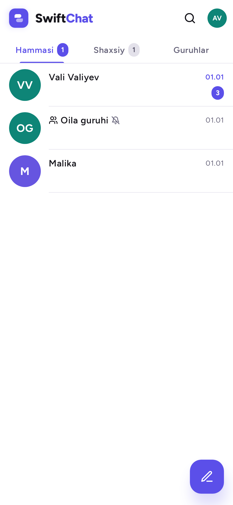
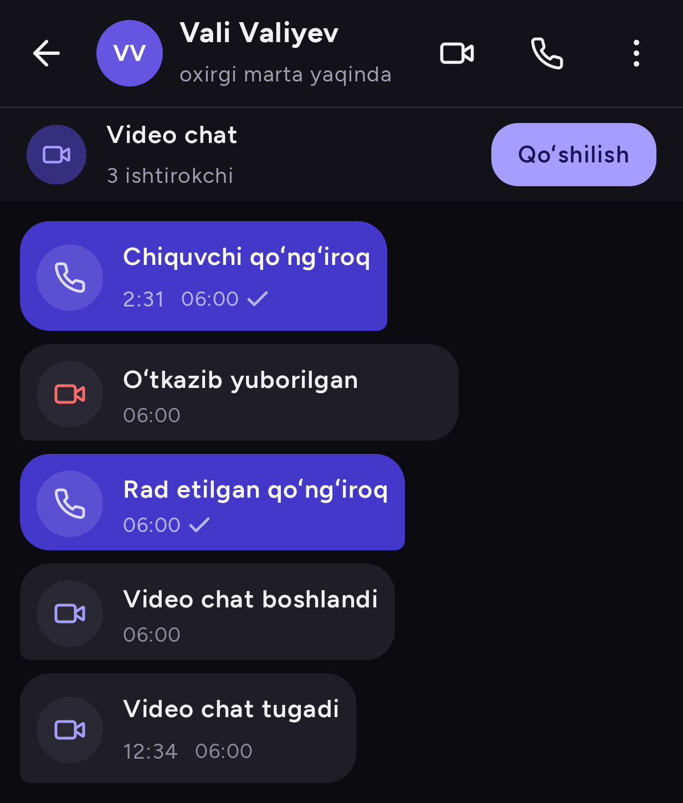
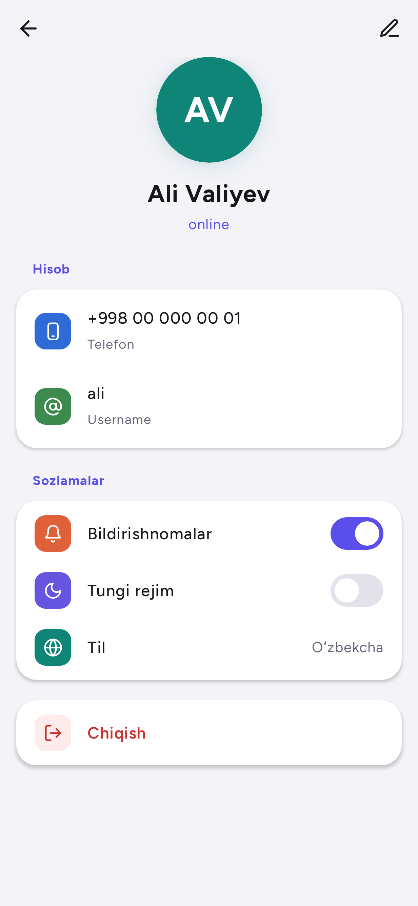
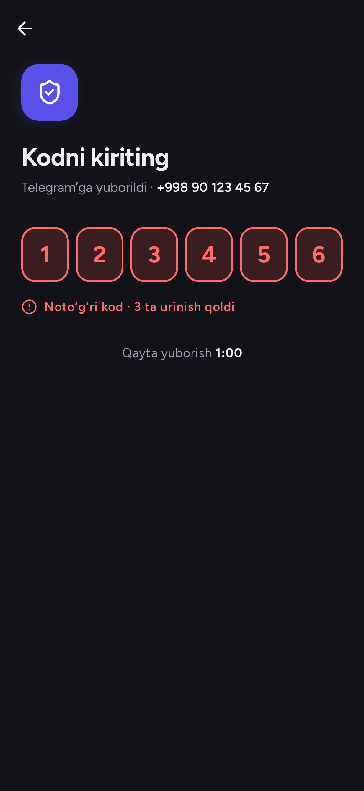
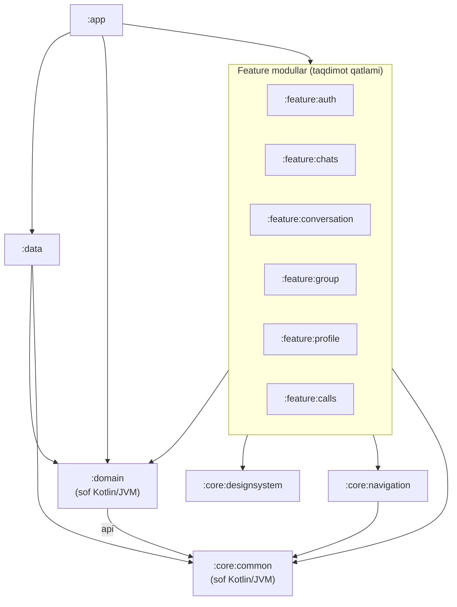
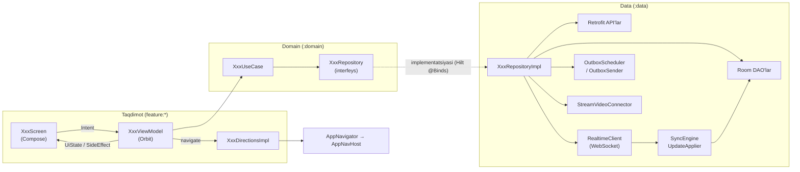
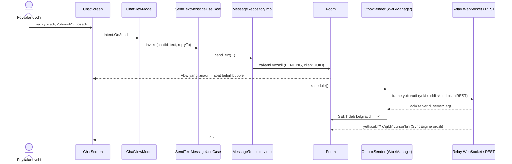
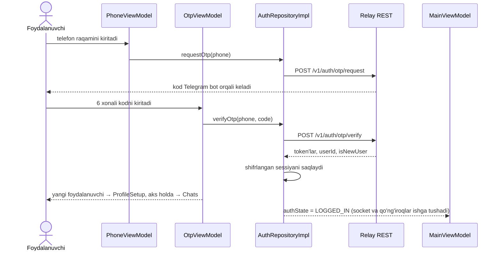

<div align="center">

# SwiftChat

**Relay serveri uchun offline-first, Telegram uslubidagi Android messenjer — audio va video qo'ng'iroqlar bilan.**

[English](README.md) · [O'zbekcha](README.uz.md)

[](https://github.com/AdilxanKenesov/SwiftChat/actions/workflows/ci.yml)
[](https://github.com/AdilxanKenesov/SwiftChat/releases/latest)







</div>

> **Yuklab olish:** imzolangan APK [Releases sahifasida](https://github.com/AdilxanKenesov/SwiftChat/releases/latest) (Android 8.0+, ARM telefonlar).

---

## Mundarija

1. [Loyiha haqida va arxitektura](#1-loyiha-haqida-va-arxitektura)
2. [API va ma'lumotlar qatlami](#2-api-va-malumotlar-qatlami)
3. [Texnologiyalar va kutubxonalar](#3-texnologiyalar-va-kutubxonalar)
4. [Modullar tuzilmasi va arxitektura sabablari](#4-modullar-tuzilmasi-va-arxitektura-sabablari)
5. [Boshidan oxirigacha ishlash oqimi](#5-boshidan-oxirigacha-ishlash-oqimi)
6. [Build, test va release](#6-build-test-va-release)
7. [Modullar bo'yicha batafsil hujjatlar](#7-modullar-boyicha-batafsil-hujjatlar)

---

## 1. Loyiha haqida va arxitektura

### Ilova nima qiladi

SwiftChat — **Relay Server API** uchun native Android mijoz (client). Relay — Telegram darajasidagi messenjer backendi.
Ilova **offline-first** tamoyilida qurilgan: foydalanuvchi ko'radigan hamma narsa telefondagi lokal bazadan o'qiladi,
tarmoq esa faqat shu bazani server bilan sinxron ushlab turadi. Xabarni internetsiz ham yozish mumkin: u navbatga
qo'yiladi va aloqa tiklanishi bilan o'zi yetkaziladi.

| Yo'nalish | Imkoniyatlar |
|---|---|
| **Kirish** | Telefon raqami + Telegram bot orqali keladigan bir martalik kod; Telegram akkauntini bog'lash; profilni to'ldirish (ism, noyob username) |
| **Chatlar** | Shaxsiy va guruh chatlari; tablar (Hammasi / Shaxsiy / Guruhlar); o'qilmaganlar soni; "yozmoqda…" belgisi; online / oxirgi marta ko'rilgan vaqt; 1 soat / 8 soat / 1 kun / butunlay ovozsiz qilish |
| **Xabarlar** | Matn, rasm, video va fayl; javob berish, tahrirlash (48 soat ichida), o'chirish; ✓ yuborildi / ✓✓ yetkazildi / o'qildi holatlari; chat ichida lokal qidiruv |
| **Media** | Uzilsa davom etadigan bo'laklab yuklash, progress bilan yuklab olish, to'liq ekranli ko'ruvchi (kattalashtirish, video pleyer), progress bildirishnomasi bilan galereyaga saqlash |
| **Guruhlar** | Yaratish, nomini o'zgartirish, a'zo qo'shish/chiqarish, admin rollari, guruhdan chiqish |
| **Qo'ng'iroqlar** (Stream Video) | Jiringlaydigan 1:1 audio/video qo'ng'iroqlar, guruh video chati (ochiq xona), kichik oyna (picture-in-picture), emoji reaksiyalar, qo'l ko'tarish, ekranni ulashish, orqa fonni xiralashtirish / almashtirish, chatda qo'ng'iroqlar tarixi |
| **Kontaktlar va profil** | Lokal kontaktlar ro'yxati, username orqali qo'shish, foydalanuvchi profillari, o'z profilini tahrirlash |
| **Sozlamalar** | O'zbek / rus / ingliz tillari (ilova ichida almashadi), kunduzgi / tungi / tizim temasi, bildirishnomalarni yoqish-o'chirish |

### Arxitektura qisqacha

| Tamoyil | Qanday qo'llangan |
|---|---|
| **Multi-module** | 12 ta Gradle moduli: `app`, `domain`, `data`, 3 ta `core:*`, 6 ta `feature:*` |
| **Clean Architecture** | `feature` (taqdimot qatlami) → `domain` (sof Kotlin) ← `data` (implementatsiya). Feature'lar `data`ni ko'rmaydi. |
| **Bir yo'nalishli ma'lumot oqimi (MVI)** | Orbit MVI: `Intent` → `ViewModel` → o'zgarmas `UiState` + bir martalik `SideEffect` |
| **Deklarativ UI** | 100 % Jetpack Compose, o'zimizning dizayn tizimimiz (`SwiftChatTheme`) |
| **Yagona haqiqat manbai** | Room bazasi; UI Room'dagi `Flow`larni kuzatadi, tarmoq natijalari Room'ga yoziladi |
| **Navigatsiya** | Navigation 3: har ekran uchun tipli `NavKey` va navigatsiya **event bus**'i (`AppNavigator`) |
| **Dependency Injection** | Hilt; argument oladigan ekranlar uchun assisted injection |

### Modullar bog'lanish grafi



```text
                                ┌──────────┐
                                │   :app   │  Application, MainActivity, NavHost
                                └────┬─────┘
          ┌──────────────┬───────────┼────────────────────────────┐
          ▼              ▼           ▼                            ▼
 ┌──────────────────────────────────────────────┐          ┌────────────┐
 │ :feature:auth  :feature:chats  :feature:group │          │   :data    │
 │ :feature:conversation  :feature:profile       │          │ Retrofit,  │
 │ :feature:calls                                 │          │ Room, WS,  │
 └───────┬───────────────┬───────────────┬───────┘          │ Stream SDK │
         │               │               │                  └─────┬──────┘
         ▼               ▼               ▼                        │
 ┌──────────────┐ ┌──────────────────┐ ┌──────────────────┐        │
 │   :domain    │ │:core:designsystem│ │ :core:navigation │        │
 │ modellar,    │ │ tema+komponentlar│ │ NavKey'lar,      │        │
 │ repo interf.,│ └──────────────────┘ │ event bus        │        │
 │ use case'lar │◄────────────────────────────────────────────────┘
 └──────┬───────┘                      └────────┬─────────┘
        ▼                                       ▼
 ┌─────────────────────────────────────────────────┐
 │ :core:common  — AppResult, AppError, dispatcher'lar │
 └─────────────────────────────────────────────────┘
```

### Qatlamlar va ularni bog'lovchi klasslar



```text
 Compose Screen ──Intent──► ViewModel ──► UseCase ──► Repository (interfeys, :domain)
       ▲                       │                              ▲
       │ UiState / SideEffect   │ Directions                   │ @Binds (Hilt)
       └───────────────────────┤                              │
                               ▼                     RepositoryImpl (:data)
                        AppNavigator ─► AppNavHost      │   │    │     │      │
                                                     Retrofit Room  WS  Outbox Stream
                                                        │     ▲    │
                                                        └─────┴────┘  tarmoq Room'ga yozadi;
                                                                      UI Room Flow'larini kuzatadi
```

---

## 2. API va ma'lumotlar qatlami

### Serverlar

| Nomi | Qiymat / manba | Vazifasi |
|---|---|---|
| `BASE_URL` | `https://relay.zokirov-mob-dev.uz/` | Relay REST API |
| `WS_URL` | `wss://relay.zokirov-mob-dev.uz/v1/ws` | Relay real-time WebSocket |
| `STREAM_API_KEY` | `local.properties` | Stream Video ochiq API kaliti |
| `STREAM_TOKEN_URL` | `local.properties` | Qo'ng'iroq token'larini beradigan Cloudflare Worker ([`server/stream-token`](server/stream-token/README.md)) |

### REST endpoint'lar

Uchta OkHttp/Retrofit klienti bor: **Public** (tokensiz — login/refresh), **Authorized** (access token qo'shadi va `401`
kelganda uni yangilaydi), **Media** (authorized, body log qilinmaydi, uzun timeout'lar).

| API | Metod va yo'l | Body / parametrlar | Javob |
|---|---|---|---|
| **AuthApi** (Public) | `POST v1/auth/otp/request` | `OtpRequest(phone)` | — |
| | `POST v1/auth/otp/verify` | `VerifyOtpRequest(phone, code, deviceName)` | `TokenPairResponse` |
| | `POST v1/auth/refresh` | `RefreshTokenRequest(refreshToken)` | `TokenPairResponse` |
| **SessionApi** | `POST v1/auth/logout` | — | — |
| **UserApi** | `GET v1/users/me` | — | `UserMeResponse` |
| | `PATCH v1/users/me` | `UpdateMeRequest(displayName?, username?)` | `UserMeResponse` |
| | `GET v1/users/{id}` | — | `UserResponse` |
| | `GET v1/users/search` | `q`, `limit=20` | `UserSearchResponse` |
| **ChatApi** | `GET v1/chats` | `limit=100`, `cursor?` | `ChatListPageResponse` |
| | `GET v1/chats/{id}` | — | `ChatResponse` |
| | `POST v1/chats/direct` | `CreateDirectRequest(peerUserId)` | `ChatResponse` (bor bo'lsa qaytaradi, yo'q bo'lsa yaratadi) |
| | `POST v1/chats/group` | `CreateGroupRequest(title, memberIds)` | `ChatResponse` |
| | `PATCH v1/chats/{id}` | `UpdateChatRequest(title)` | `ChatResponse` |
| | `PUT v1/chats/{id}/settings` | `ChatSettingsRequest(muted, mutedUntil?)` | `ChatResponse` |
| | `POST v1/chats/{id}/members` | `AddMembersRequest(userIds)` | `MembersResponse` |
| | `DELETE v1/chats/{id}/members/{userId}` | — | — |
| | `PATCH v1/chats/{id}/members/{userId}` | `ChangeRoleRequest(role)` | `ChatMemberResponse` |
| | `POST v1/chats/{id}/leave` | — | — |
| **MessageApi** | `GET v1/chats/{id}/messages` | `beforeSeq?`, `limit=50` | `MessagePageResponse` |
| | `POST v1/chats/{id}/messages` | `SendMessageRequest(clientMessageId, type, body?, mediaIds?, replyTo?)` | `SendMessageResultResponse` (idempotent) |
| | `PATCH v1/messages/{serverId}` | `EditMessageRequest(body)` | `MessageResponse` |
| | `DELETE v1/messages/{serverId}` | — | — (tombstone — "o'chirildi" belgisi) |
| | `POST v1/chats/{id}/read` · `/received` | `UpToSeqRequest(upToSeq)` | — |
| **SyncApi** | `GET v1/updates/state` | — | `UpdatesStateResponse` |
| | `GET v1/updates` | `since`, `limit=500` | `UpdatesPageResponse` |
| **MediaApi** (Media) | `POST v1/media/uploads` | `StartUploadRequest(kind, mime, size, sha256, …)` | `StartUploadResponse` |
| | `PUT v1/media/uploads/{uploadId}` | `Upload-Offset` sarlavhasi, xom bo'lak | `ChunkAckResponse` |
| | `HEAD v1/media/uploads/{uploadId}` | — | offset `Upload-Offset` sarlavhasida |
| | `GET v1/media/{mediaId}` | `Range` qo'llab-quvvatlanadi | fayl baytlari (Coil, ExoPlayer, yuklab olish ishlatadi) |
| **StreamTokenApi** | `POST <STREAM_TOKEN_URL>` | `Authorization`da Relay token | `StreamTokenResponse(token, userId, expiresAt)` |

### Real-time WebSocket

| Yo'nalish | Frame'lar |
|---|---|
| Client → server | `auth{token, deviceId, cursor}` (birinchi bo'lib, 10 s ichida), `send`, `read`, `received`, `typing` |
| Server → client | `auth_ok{userId, updateSeq}`, `ack`, `nack`, `update{updateSeq, kind, payload}`, `typing`, `presence`, `error` |

| Close code | Ma'nosi | Ilova qanday javob beradi |
|---|---|---|
| `4001` | access token muddati tugagan | token'ni yangilab, darhol qayta ulanadi |
| `4003` | ruxsat yo'q | bir marta yangilaydi; ketma-ket ikkinchi `4003` sessiyani tugatadi |
| `4009` | sessiya boshqa ulanish bilan almashtirildi | to'xtaydi (bir-birini uzib qayta ulanishning oldini oladi) |
| `4008` | auth uchun ajratilgan vaqt tugadi | darhol qayta ulanadi |
| boshqa | tarmoq / server | 1 → 30 s gacha oshib boruvchi kutish + tasodifiy qo'shimcha |

Socket faqat foydalanuvchi tizimga kirgan **va** ilova ekranda ochiq bo'lganda ochiq turadi (fonga o'tgandan 5 s keyin yopiladi).

### Sinxronizatsiya (birorta hodisa yo'qolmaydi va takrorlanmaydi)

Serverdagi har bir o'zgarish foydalanuvchi uchun bo'shliqsiz ketma-ket raqam — `updateSeq` oladi. Ilova oxirgi qo'llangan raqamni (*cursor*) saqlaydi.

```text
 seq N bilan jonli update keldi, lokal cursor = C
   N <= C      → IGNORE   (allaqachon qo'llangan)
   N == C + 1  → APPLY    (tartib bilan keldi)
   N >  C + 1  → CATCH_UP (bo'shliq bor: GET /v1/updates?since=C ni sahifalab yetib olinadi)
 cursor hali yo'q yoki server "tooLong" desa → to'liq BOOTSTRAP (state → barcha chatlar → foydalanuvchilar → bitta tranzaksiya)
```

`UpdateApplier` update'larni uch bosqichda qo'llaydi: **(1)** yetishmayotgan chat va foydalanuvchilarni tarmoqdan oladi,
**(2)** bitta Room tranzaksiyasida har bir update'ni idempotent (qayta qo'llansa ham natija o'zgarmaydigan) tarzda
qo'llab, cursor'ni oldinga suradi, **(3)** qo'shimcha ishlar (typing belgisini tozalash, *yetkazildi* tasdiqlarini yuborish).

### Ma'lumot modellari: DTO → Entity → Domain

| Tarmoq DTO (`data/model/response`) | Room entity (`data/source/local/database/entity`) | Domain model (`domain/model`) | Mapper |
|---|---|---|---|
| `UserMeResponse`, `UserResponse` | `UserEntity` (`users`) | `User` | `UserMapper.kt` |
| `ChatResponse`, `MessagePreviewResponse` | `ChatEntity` (`chats`) + `LastMessageEmbedded` | `ChatSummary`, `LastMessage` | `ChatMapper.kt` |
| `MessageResponse`, `MediaMetaResponse` | `MessageEntity` (`messages`) + `MediaItemEntity` (JSON ustun) | `Message`, `MessageMedia` | `MessageMapper.kt` |
| `ChatMemberResponse` | `ChatMemberEntity` (`chat_members`) | `ChatMember` | `MemberMapper.kt` |
| `TokenPairResponse` | shifrlangan `Session` (DataStore) | `AuthState` | `Mappers.kt` |
| — | `MemberCursorEntity`, `SyncStateEntity`, `UploadEntity`, `ContactEntity` | xabar holati ✓/✓✓, sync cursor, yuklash progressi, kontaktlar | `MessageMapper.kt` |

> Xabar holati bazada saqlanmaydi, **hisoblanadi**: boshqa a'zolarning cursor'lari (`member_cursors`) xabarning
> `serverSeq`iga yetganda u *yetkazildi* / *o'qildi* bo'ladi. Bitta cursor ko'tarilsa, undan oldingi barcha xabarlar birdaniga yangilanadi.

**Room bazasi:** `relay.db`, 6-versiya, 8 ta jadval (`chats`, `users`, `messages`, `chat_members`, `member_cursors`,
`sync_state`, `uploads`, `contacts`).

### Data qatlamidagi qo'shimcha imkoniyatlar

| Imkoniyat | Qanday amalga oshirilgan |
|---|---|
| **Token boshqaruvi** | `TokenInterceptor` `Bearer` token qo'shadi · `TokenAuthenticator` `401` kelganda yangilab, bir marta qayta yuboradi · `TokenRefresher` bir vaqtda faqat bitta yangilashga ruxsat beradi (Mutex), chunki refresh token har safar almashadi va parallel yangilash sessiyani bekor qilib yuborardi |
| **Shifrlangan sessiya** | `SessionStorage`: Tink AES-256-GCM bilan shifrlangan DataStore, kalit Android Keystore'da |
| **Xatolar modeli** | `safeApiCall` har qanday exception'ni server xato kodlari va `retryable` belgisi bilan `AppResult.Error(AppError.Api / Network / Unknown)`ga aylantiradi |
| **Outbox** | Yangi xabar mijozda yaratilgan UUID bilan `PENDING` holatida saqlanadi, keyin `OutboxWorker` (WorkManager, tarmoq sharti bilan) ularni tartib bilan yuboradi: avval socket orqali, bo'lmasa xuddi shu id bilan REST orqali (idempotent) |
| **Uzilsa davom etadigan yuklash** | `MediaUploader`: bo'lak hajmini server belgilaydi, offset'ni server tasdiqlaydi, ilova qayta ochilganda davom etadi, `OFFSET_MISMATCH` / `UPLOAD_EXPIRED` holatlarini hal qiladi |
| **Media tayyorlash** | `MediaPreparer`: faylni nusxalaydi, SHA-256, o'lcham/davomiylik/burilish, kichik thumbnail, video posteri |
| **Galereyaga saqlash** | `MediaSaveWorker`: progress bildirishnomasi bilan foreground worker, `Pictures/SwiftChat` / `Movies/SwiftChat`ga yozadi |
| **Rasm va video yuklash** | Coil va ExoPlayer authorized media klientidan foydalanadi (video uchun Range so'rovlari) |
| **Sozlamalar va til** | `AppSettingsStorage` (DataStore), `AppLocaleManager` (Android 13+ da tizimning per-app tili, undan pastida mos zaxira yo'l) |
| **Aloqa holati** | `NetworkMonitor` + socket holati + sync holati → bitta indikator (*Offline / Yangilanmoqda / Ulanmoqda / Ulangan*) |
| **Qo'ng'iroqlar** | `StreamVideoConnector` Stream klientini Relay sessiyasiga bog'laydi; token'lar Relay token'ini tekshiradigan token serveridan olinadi |

---

## 3. Texnologiyalar va kutubxonalar

| Qatlam | Kutubxona (versiya) | Nega tanlangan |
|---|---|---|
| **Til va build** | Kotlin 2.4, AGP 9.4, KSP 2.3, Gradle version catalog | Zamonaviy Kotlin; KSP kod generatsiyasida kapt'dan tezroq |
| **UI** | Jetpack Compose (BOM 2026.08), Material 3, Activity Compose, SplashScreen | Deklarativ UI, preview'lar, test qilish osonligi |
| **Dizayn tizimi** | o'zimizning `SwiftChatTheme` + Figtree shrifti | Kunduzgi va tungi temada bir xil, izchil ko'rinish |
| **Arxitektura / MVI** | Orbit MVI 12.0 | Bashorat qilinadigan holat, bir martalik side effect'lar, tayyor test DSL |
| **Navigatsiya** | Navigation 3 (1.2), Lifecycle ViewModel Navigation3 | Tipli kalitlar, back stack oddiy holat sifatida, har ekranga alohida ViewModel |
| **DI** | Hilt 2.60, Hilt WorkManager, Hilt ViewModel Compose | Kompilyatsiya vaqtidagi DI, ekran argumentlari uchun assisted injection |
| **Asinxronlik** | Kotlin Coroutines va Flow 1.11 | Tuzilmali parallellik; Room va tarmoq oqim (stream) sifatida |
| **Tarmoq** | Retrofit 3.0, OkHttp 5.5, kotlinx.serialization 1.9 | Tipli REST + bitta HTTP stack ustida WebSocket |
| **Saqlash** | Room 2.8, DataStore 1.2, Tink 1.23 | Lokal yagona haqiqat manbai; shifrlangan sessiya |
| **Fon ishlari** | WorkManager 2.12 | Outbox va galereyaga saqlashning ishonchli bajarilishi |
| **Rasm va video** | Coil 3.6, Media3 ExoPlayer 1.11 | Autentifikatsiyali rasm yuklash, videoni oqim bilan ijro etish |
| **Qo'ng'iroqlar** | Stream Video Android 1.35 (+ video filtrlari) | O'z media serverimizsiz production darajasidagi qo'ng'iroqlar, jiringlash, PiP, ekran ulashish |
| **Server (qo'ng'iroqlar)** | Cloudflare Worker (oddiy JS, kutubxonasiz) | Stream maxfiy kalitini telefondan tashqarida saqlaydi |
| **Testlar** | JUnit 4, kotlinx-coroutines-test, Turbine, Orbit Test, Robolectric 4.17, Compose UI Test, Roborazzi 1.76 | Unit, ViewModel, Compose UI va screenshot testlari JVM'da — emulyatorsiz |
| **CI** | GitHub Actions | Har PR'da build, testlar, screenshot'lar, lint |

---

## 4. Modullar tuzilmasi va arxitektura sabablari

### Nega modullarga bo'lingan

- **Vazifalarni ajratish** — biznes qoidalari (`domain`) Android, Retrofit yoki Room haqida bilmaydi, shuning uchun ularni test qilish oson va UI o'zgarishlari ularni buzolmaydi.
- **Qat'iy chegaralar** — feature `data`ni yoki boshqa feature'ni umuman import qila olmaydi: Gradle'da bunday bog'lanish yo'q.
- **Tezroq build** — bitta feature o'zgarsa, faqat o'sha modul qayta kompilyatsiya qilinadi.
- **Parallel ishlash** — har bir feature alohida ishlab chiqiladi va test qilinadi (`domain` test fixture'laridagi soxta repository'lar bilan).

### Modullar

| Modul | Turi | Vazifasi | Hujjat |
|---|---|---|---|
| `:app` | Android ilova | Kirish nuqtasi: `App` (ishga tushish), `MainActivity` (splash, tema, til), `MainViewModel` (boshlang'ich ekran, kiruvchi qo'ng'iroqlar), `AppNavHost` (back stack) | [app](docs/uz/modules/app.md) |
| `:domain` | sof Kotlin | Modellar, 11 ta repository interfeysi, 58 ta use case | [domain](docs/uz/modules/domain.md) |
| `:data` | Android kutubxona | Repository implementatsiyalari, Retrofit, WebSocket, Room, sync, outbox, media, Stream | [data](docs/uz/modules/data.md) |
| `:core:common` | sof Kotlin | `AppResult`, `AppError`, xato kodlari, dispatcher'lar | [core](docs/uz/modules/core.md) |
| `:core:designsystem` | Android kutubxona | Tema tokenlari, tipografiya, umumiy Compose komponentlari | [core](docs/uz/modules/core.md) |
| `:core:navigation` | Android kutubxona | Har bir ekran uchun `NavKey`, `AppNavigator` event bus'i | [core](docs/uz/modules/core.md) |
| `:feature:auth` | Android kutubxona | Telefon → OTP → profilni to'ldirish | [auth](docs/uz/modules/feature-auth.md) |
| `:feature:chats` | Android kutubxona | Chatlar ro'yxati, qidiruv, yangi xabar, kontakt qo'shish | [chats](docs/uz/modules/feature-chats.md) |
| `:feature:conversation` | Android kutubxona | Chat ekrani, media ko'ruvchi, chat ichida qidiruv | [conversation](docs/uz/modules/feature-conversation.md) |
| `:feature:group` | Android kutubxona | Guruh yaratish / a'zo qo'shish, guruh ma'lumoti | [group](docs/uz/modules/feature-group.md) |
| `:feature:profile` | Android kutubxona | Mening profilim va sozlamalar, profilni tahrirlash, foydalanuvchi profili | [profile](docs/uz/modules/feature-profile.md) |
| `:feature:calls` | Android kutubxona | Qo'ng'iroq ekrani (Stream Video UI) | [calls](docs/uz/modules/feature-calls.md) |

### Bog'lanish qoidalari

1. `feature:*` → faqat `domain` va `core:*`. **Hech qachon** `data`ga ham, boshqa `feature`ga ham emas.
2. Ekranlar boshqa feature'larga faqat `core:navigation`dagi `NavKey`lar orqali o'tadi.
3. `domain` → faqat `core:common` — Android ham, platformaga bog'liq kutubxonalar ham yo'q.
4. `data` `domain` interfeyslarini implementatsiya qiladi; Hilt ularni bog'laydi (`RepositoryModule`).
5. Uchinchi tomon SDK tiplari (Retrofit, Room, Stream) `data` ichida qoladi (Stream UI esa `feature:calls` ichida).
6. Barcha modullarni faqat `app` ko'radi — u hammasini bir-biriga ulaydi.

---

## 5. Boshidan oxirigacha ishlash oqimi

### 5.1 Ishga tushish

```text
 App.onCreate()                       (:app)
   ├─ StrictMode (debug build'larda)
   ├─ OutboxScheduler.schedule()      → oldingi sessiyadan qolgan xabarlarni yuboradi
   ├─ RealtimeCoordinator.start()     → tizimga kirilgan va ilova ochiq bo'lsa WebSocket
   └─ StreamVideoConnector.start()    → kirgan foydalanuvchi uchun qo'ng'iroqlar klienti
 MainActivity
   ├─ tema va boshlang'ich ekran aniqlanguncha tizim splash'i ushlab turiladi
   ├─ til (AppLocaleManager), edge-to-edge, SwiftChatTheme(kunduzgi/tungi/tizim)
   └─ AppNavHost(startKey)
 MainViewModel.startKey: LOGGED_OUT → PhoneKey · NEEDS_PROFILE → ProfileSetupKey · LOGGED_IN → ChatsKey
```

### 5.2 UI qatlami — MVI aylanishi (har bir ekranda bir xil)

| Qism | Fayl nomi namunasi | Vazifasi |
|---|---|---|
| Contract | `XxxContract.kt` | `Intent` (foydalanuvchi harakatlari), `UiState` (ekran chizadigan hamma narsa), `SideEffect` (snackbar, havolani ochish…), `Directions` (qayerga o'ta oladi) |
| ViewModel | `XxxViewModel.kt` | `onEventDispatcher(intent)` → `intent { reduce { … } ; postSideEffect(…) }`; use case'lardagi `Flow`larni kuzatadi |
| Screen | `XxxScreen.kt` | Holatli o'rov (ViewModel, side effect'lar, snackbar) + preview va testlar ishlatadigan holatsiz `XxxContent(uiState, onEventDispatcher)` |
| Directions | `XxxDirectionsImpl.kt` | "chatga o'tish"ni `AppNavigator.navigate(To(ChatKey(id)))`ga aylantiradi |
| Entries | `XxxEntries.kt` | Ilovaning `NavDisplay`ida `entry<Key> { Screen(...) }`ni ro'yxatdan o'tkazadi |

### 5.3 Domain qatlami

Use case'lar `operator fun invoke`ga ega kichik klasslar. Ko'pchiligi shunchaki repository'ga uzatadi, ba'zilarida
haqiqiy qoida bor (masalan, `SetChatMutedUseCase` "8 soat"ni aniq tugash vaqtiga aylantiradi, `SearchUsersUseCase`
`@`ni olib tashlaydi va bo'sh so'rovni yubormaydi). Umumiy qoidalar modellarda: `ProfileRules`, `GroupPermissions`,
`CallLogFormat`, `OtpRules`.

### 5.4 Data qatlami

Repository implementatsiyalari Room (o'qish), Retrofit / WebSocket (yozish va sync) hamda mapper'larni birlashtiradi.
UI ma'lumotni ko'rsatish uchun tarmoqni kutmaydi: u Room'ni kuzatadi, tarmoq natijalari esa Room'ga tushadi.

### 5.5 Misol: xabar yuborish



### 5.6 Misol: xabar qabul qilish

```text
 Relay ──update(seq)──► RealtimeClient ─► RealtimeCoordinator ─► SyncEngine (IGNORE / APPLY / CATCH_UP)
                                                                     │
                                                                     ▼
                       UpdateApplier: yetishmayotgan user/chatlarni oladi → bitta Room tranzaksiyasi
                                                                     │
                       Room Flow ─► ObserveMessagesUseCase ─► ChatViewModel.reduce ─► ChatScreen qayta chiziladi
                                                                     │
                                          ReceiptSender: yuboruvchiga "yetkazildi" (uning ✓✓ belgisi)
```

### 5.7 Misol: tizimga kirish



### 5.8 Misol: qo'ng'iroq

```text
 ChatScreen 📞 ─► ChatViewModel ─► StartCallUseCase ─► CallRepositoryImpl ─► Stream: qo'ng'iroq yaratish (ring = true)
                                                                                │
 qabul qiluvchi ilova: CallRepositoryImpl.observeIncomingCalls ─► MainViewModel ─► CallScreen (jiringlaydi)
                                                                                │
 Stream token: StreamVideoConnector ─► Cloudflare Worker ─► Relay /v1/users/me ─► imzolangan JWT
                                                                                │
 tugatish: CallViewModel.finish() ─► leave() ─► chatda "📞 Call · video · 2:31" xabari (outbox orqali)
```

Har bir modulning har bir fayli — vazifasi va bog'lanishlari bilan —
[modullar bo'yicha batafsil hujjatlarda](#7-modullar-boyicha-batafsil-hujjatlar) keltirilgan.

---

## 6. Build, test va release

### Talablar

- JDK 17 bilan Android Studio, Android SDK 37.
- `local.properties` (git'ga kirmaydi) — bu yerda faqat kalit nomlari ko'rsatilgan:

| Kalit | Nima uchun kerak |
|---|---|
| `sdk.dir` | Android SDK yo'li |
| `STREAM_API_KEY` | qo'ng'iroqlar |
| `STREAM_TOKEN_URL` | qo'ng'iroqlar (token server manzili; bo'sh bo'lsa debug build'lar development token ishlatadi, release build'larda qo'ng'iroqlar o'chiriladi) |
| `RELEASE_STORE_FILE`, `RELEASE_STORE_PASSWORD`, `RELEASE_KEY_ALIAS`, `RELEASE_KEY_PASSWORD` | release build'ni imzolash (bo'lmasa release imzosiz yig'iladi) |

### Buyruqlar

| Vazifa | Buyruq |
|---|---|
| Debug APK | `./gradlew assembleDebug` |
| Imzolangan release APK | `./gradlew assembleRelease` |
| Unit, ViewModel va Compose UI testlari (211 ta) | `./gradlew testDebugUnitTest :domain:test` |
| Screenshot testlari (19 ta golden) | `./gradlew verifyRoborazziDebug` · golden'larni yangilash: `recordRoborazziDebug` |
| Lint | `./gradlew lintDebug` |
| Token server testlari | `node --test server/stream-token/test/index.test.mjs` |

### Sifat nazorati

- **CI** ([`.github/workflows/ci.yml`](.github/workflows/ci.yml)) har bir PR'da va `develop`ga har bir push'da ishlaydi: build →
  testlar → screenshot'lar → token server testlari → lint. Muvaffaqiyatli bo'lsa, debug APK shu run'ga biriktiriladi.
- **Testlar** — JVM'da 211 ta test: biznes qoidalari, mapper'lar, xatolarni qayta ishlash, har bir ViewModel (soxta
  repository'lar bilan), Compose UI xatti-harakati (Robolectric) va 19 ta screenshot golden (kunduzgi va tungi).
- **Branch'lar** — yangi imkoniyatlar `feature/*`da, tuzatishlar `bug/*`da, PR'lar `develop`ga; `master`ni egasi yangilaydi.

### Release

Release APK'lar loyiha keystore'i bilan imzolanadi va
[GitHub Releases](https://github.com/AdilxanKenesov/SwiftChat/releases)da e'lon qilinadi. Release build'larda faqat ARM ABI'lar qoladi.

### Ma'lum cheklovlar

- Push bildirishnomalar (FCM) **hali qilinmagan**: xabar va qo'ng'iroqlar ilova ochiq yoki yaqinda fonga o'tgan paytda keladi.
- Profil rasmi (avatar yuklash) hali qilinmagan — avatarlarda bosh harflar ko'rsatiladi.
- Release'da kodni qisqartirish (R8) hozircha o'chiq.

---

## 7. Modullar bo'yicha batafsil hujjatlar

| Modul | English | O'zbekcha |
|---|---|---|
| app | [docs/en/modules/app.md](docs/en/modules/app.md) | [docs/uz/modules/app.md](docs/uz/modules/app.md) |
| core (common, designsystem, navigation) | [core.md](docs/en/modules/core.md) | [core.md](docs/uz/modules/core.md) |
| domain | [domain.md](docs/en/modules/domain.md) | [domain.md](docs/uz/modules/domain.md) |
| data | [data.md](docs/en/modules/data.md) | [data.md](docs/uz/modules/data.md) |
| feature:auth | [feature-auth.md](docs/en/modules/feature-auth.md) | [feature-auth.md](docs/uz/modules/feature-auth.md) |
| feature:chats | [feature-chats.md](docs/en/modules/feature-chats.md) | [feature-chats.md](docs/uz/modules/feature-chats.md) |
| feature:conversation | [feature-conversation.md](docs/en/modules/feature-conversation.md) | [feature-conversation.md](docs/uz/modules/feature-conversation.md) |
| feature:group | [feature-group.md](docs/en/modules/feature-group.md) | [feature-group.md](docs/uz/modules/feature-group.md) |
| feature:profile | [feature-profile.md](docs/en/modules/feature-profile.md) | [feature-profile.md](docs/uz/modules/feature-profile.md) |
| feature:calls | [feature-calls.md](docs/en/modules/feature-calls.md) | [feature-calls.md](docs/uz/modules/feature-calls.md) |

Har bir modul hujjatida modul diagrammasi, har bir manba fayli (vazifasi va bog'lanishlari bilan), ekran
kontraktlari (intent'lar, holat, side effect'lar, navigatsiya) va modul testlari bor.
