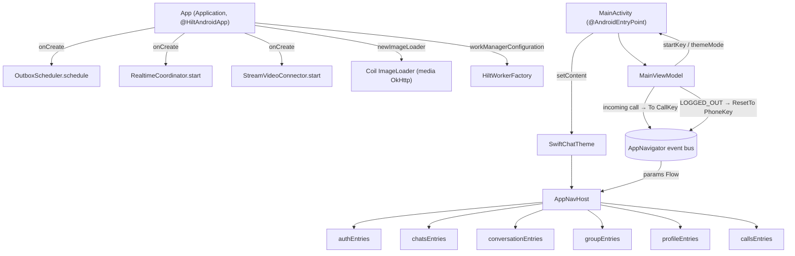
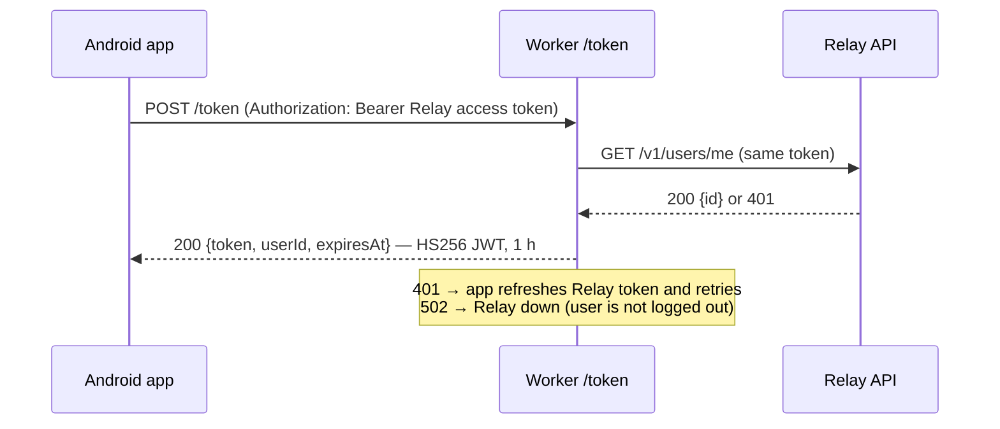

# `:app` — Application shell

[← Back to README](../../../README.md)

`:app` is the only **Android application** module. It contains almost no business logic. Its job is to **assemble** everything else:

- create the Hilt root component;
- start the long-running background parts (realtime socket, outbox, Stream Video);
- host the single `MainActivity`;
- own the one navigation back stack that all feature screens are registered into.

| | |
|---|---|
| Module type | `com.android.application` (Compose, Hilt, KSP, kotlinx.serialization) |
| applicationId | `uz.relay.app`. It must not change: the Firebase project is registered for this package only, so no `applicationIdSuffix` is used |
| SDK | compileSdk 37 · minSdk 26 · targetSdk 37 · Java 11 |
| Depends on | `:domain`, `:data`, `:core:common`, `:core:designsystem`, `:core:navigation`, all six `:feature:*` modules |
| Source files | 4 Kotlin files |

---

## 1. How the app module wires things together



```text
App (Application) ── onCreate ──► StrictMode(debug) → OutboxScheduler.schedule()
                                  → RealtimeCoordinator.start() → StreamVideoConnector.start()
MainActivity ──► MainViewModel (themeMode, startKey, incoming calls, logout reset)
     │
     └─ SwiftChatTheme ─► AppNavHost ◄── AppNavigationHandler.params (event bus)
                              │
                              └─ entryProvider { auth | chats | conversation | group | profile | calls }
```

---

## 2. Startup sequence

| Step | Where | What happens |
|---|---|---|
| 1 | `App.onCreate` | **Debug only:** `StrictMode` logs main-thread disk/network work, leaked closeables and SQLite objects. It only warns and never crashes the app. |
| 2 | `App.onCreate` | `OutboxScheduler.schedule()` re-queues messages a previous session left unsent. |
| 3 | `App.onCreate` | `RealtimeCoordinator.start()` keeps the WebSocket open only while the user is logged in **and** the app is in the foreground. |
| 4 | `App.onCreate` | `StreamVideoConnector.start()` ties the Stream Video client to the Relay session. If no API key is set, calls are disabled. |
| 5 | `MainActivity.attachBaseContext` | `AppLocaleManager.wrap` applies the chosen language on Android 8–12. On 13+ the system `LocaleManager` does it. |
| 6 | `MainActivity.onCreate` | The system splash screen stays visible until **both** `themeMode` and `startKey` are known. This avoids a theme flash and a second "fake" splash. |
| 7 | `MainActivity.onCreate` | `enableEdgeToEdge()`. Status and navigation bar icons follow the **app** theme, not the phone theme. |
| 8 | `setContent` | `SwiftChatTheme(dark)` → `AppNavHost(navigationHandler, startKey)` |

Theme resolution in `MainActivity`:

| `ThemeMode` | Result |
|---|---|
| `DARK` | dark |
| `SYSTEM` | follows `isSystemInDarkTheme()` |
| `LIGHT` or not loaded yet | light |

---

## 3. `MainViewModel`

| Member | Type | Meaning |
|---|---|---|
| `themeMode` | `StateFlow<ThemeMode?>` | `null` until DataStore is read, which keeps the splash on screen |
| `startKey` | `StateFlow<NavKey?>` | first screen from the first `AuthState`: `LOGGED_IN → ChatsKey`, `NEEDS_PROFILE → ProfileSetupKey`, `LOGGED_OUT → PhoneKey` |
| `navigationHandler` | `AppNavigationHandler` | passed to `AppNavHost` |
| init: incoming calls | — | `ObserveIncomingCallsUseCase` → `navigate(To(CallKey(callId)))` opens the call screen from any screen. `singleTop` prevents opening it twice. |
| init: session end | — | `authState.drop(1).filter { LOGGED_OUT }` → `ResetTo(PhoneKey)`. Logout, or a revoked session on any screen, returns to login. |

---

## 4. `AppNavHost` and back-stack rules

`AppNavHost` uses **Navigation 3**:
- `rememberNavBackStack(startKey)` creates the stack. Keys are `@Serializable`, so the stack survives process death.
- `NavDisplay` shows it, with two entry decorators:
  - a SaveableStateHolder, giving each screen its own `rememberSaveable` state;
  - a ViewModelStore, so a screen's ViewModel is cleared when the screen leaves the stack.

Every navigation command arrives from the event bus (`AppNavigationHandler.params`) and is applied by the pure function `MutableList<NavKey>.apply(param)`:

| Command | Effect on the stack |
|---|---|
| `To(key, singleTop = true)` | push `key`; ignored if `singleTop` and `key` is already on top |
| `Replace(key)` | pop the top entry, then push `key` |
| `Back` | pop. The last entry is **never** removed, because an empty stack would crash `NavDisplay`. |
| `BackTo(key, inclusive)` | pop back to the last `key`, also removing it if `inclusive`. Does nothing if `key` is not in the stack. |
| `BackToOrTo(key)` | go back to `key` if it is in the stack, otherwise push it. This avoids a second copy of the same chat. |
| `ResetTo(key)` | clear the stack and keep only `key`. No-op if the stack is already exactly `[key]`. |

---

## 5. Manifest highlights

| Item | Value / reason |
|---|---|
| Permissions declared here | `INTERNET` |
| Permissions merged from `:data` | `ACCESS_NETWORK_STATE`, `FOREGROUND_SERVICE`, `FOREGROUND_SERVICE_DATA_SYNC`, `POST_NOTIFICATIONS`. They are used by network monitoring and the gallery-save foreground worker. |
| Permissions merged from the Stream SDK | camera, microphone and call-related permissions, through manifest merging |
| `android:localeConfig` | Android 13+ shows the app language picker in system settings (uz / ru / en) |
| `MainActivity` | single activity, `adjustResize` (the composer stays above the keyboard), `supportsPictureInPicture="true"` |
| `configChanges` | `screenSize\|smallestScreenSize\|screenLayout\|orientation`. Entering or leaving Picture-in-Picture does not recreate the activity, so video renderers keep running. |
| WorkManager initializer | removed from `androidx.startup`. `App` provides `Configuration` with `HiltWorkerFactory`, so workers get injected dependencies. |

---

## 6. Build types, release and signing

| Setting | Debug | Release |
|---|---|---|
| ABIs | all (emulators included) | `arm64-v8a`, `armeabi-v7a` only. ML Kit and WebRTC native libraries are 20–35 MB per ABI. |
| Code shrinking (R8) | off | **off for now** (`optimization { enable = false }`). Planned, not implemented yet. |
| App name | "SwiftChat dev" (`src/debug/res`) | "SwiftChat" |
| AAB language split | — | disabled (`bundle.language.enableSplit = false`), so in-app switching between uz/ru/en always works |

**Release signing:**
- `signingConfigs.release` reads four values: `RELEASE_STORE_FILE`, `RELEASE_STORE_PASSWORD`, `RELEASE_KEY_ALIAS`, `RELEASE_KEY_PASSWORD`. It looks in `local.properties` first and falls back to environment variables of the same name (for CI).
- If any value or the keystore file is missing, the release build is produced **unsigned** instead of failing.
- The keystore (`/keystore/`, `*.jks`) and `local.properties` are git-ignored.

Signed APKs are published on **GitHub Releases** (`v1.0`).

---

## 7. Continuous integration (`.github/workflows/ci.yml`)

Runs on pull requests to `develop`/`master`, on pushes to `develop`, and on manual dispatch. It has one job, on `ubuntu-latest` with JDK 17 Temurin and the Gradle cache.

| # | Step | Command |
|---|---|---|
| 1 | Build | `./gradlew assembleDebug` |
| 2 | Unit + ViewModel + Compose UI tests | `./gradlew testDebugUnitTest :domain:test` |
| 3 | Screenshot tests (Roborazzi golden images) | `./gradlew verifyRoborazziDebug` |
| 4 | Token server tests | `node --test server/stream-token/test/index.test.mjs` |
| 5 | Lint (fails on errors) | `./gradlew lintDebug` |
| 6 | Artifacts | reports on failure (14 days), `app-debug.apk` on success (7 days) |

Other workflow settings:
- New pushes to the same branch cancel the older run (`concurrency`).
- The workflow token only has read access to the repository (`permissions: contents: read`).

---

## 8. Stream token server (`server/stream-token`)

This small **Cloudflare Worker** has no dependencies. It issues Stream Video user tokens, so the Stream **API Secret never ships inside the APK**. Data-layer details are in [data.md](data.md).



```text
app ──POST /token + Bearer──► Worker ──GET /v1/users/me──► Relay
app ◄── {token,userId,expiresAt} ── Worker   (signed with STREAM_API_SECRET, a Cloudflare secret)
```

| Route | Response |
|---|---|
| `GET /health` | `{ "ok": true }` |
| `POST /token` | `200 {token, userId, expiresAt}`. 401 for a bad or missing Relay token, 502 if Relay is unavailable, 500 if `STREAM_API_SECRET` is not configured. |
| anything else | 404 or 405 |

| File | Purpose |
|---|---|
| `src/index.js` | Worker: verifies the Relay token through `/v1/users/me`, then signs the JWT with Web Crypto |
| `wrangler.toml` | Worker name and `RELAY_BASE_URL`. The secret is **not** here; it is set with `wrangler secret put`. |
| `test/index.test.mjs` | 7 Node tests: signature, success, 401, missing header, 502, missing secret, routing |
| `README.md` | deploy instructions |

---

## 9. Every file in `:app` (src/main)

| File | Class(es) | Responsibility | Depends on / used by |
|---|---|---|---|
| `uz/relay/app/App.kt` | `App` | Application. Hilt root, starts the outbox, realtime and Stream, provides the WorkManager config (Hilt worker factory) and the single Coil `ImageLoader`, enables StrictMode in debug. | uses `RealtimeCoordinator`, `OutboxScheduler`, `StreamVideoConnector`, `HiltWorkerFactory`, `ImageLoader` (`:data`) |
| `uz/relay/app/MainActivity.kt` | `MainActivity` | Single activity. Splash hold, edge-to-edge, per-app locale (wrap + recreate on old Android), theme resolution, hosts `AppNavHost`. | uses `MainViewModel`, `AppLocaleManager`, `SwiftChatTheme`, `AppNavHost` |
| `uz/relay/app/MainViewModel.kt` | `MainViewModel` | Theme and start key for the splash, global incoming-call navigation, reset to login when the session ends. | uses `ObserveThemeModeUseCase`, `ObserveAuthStateUseCase`, `ObserveIncomingCallsUseCase`, `AppNavigator`, `AppNavigationHandler` |
| `uz/relay/app/navigation/AppNavHost.kt` | `AppNavHost`, `apply()`, `pop()` | Navigation 3 back stack. Applies `AppNavigationParam` commands and registers every feature's `*Entries()`. | uses `core:navigation`, all `:feature:*` entry functions |
| `uz/relay/app/navigation/SwipeBackGesture.kt` | `Modifier.swipeBack(enabled)` | Swipe right anywhere to go back. Sends the same events as the system predictive back (`DirectNavigationEventInput` → `NavigationEventDispatcher`), so `NavDisplay` animates the previous screen underneath and screen `BackHandler`s still win. Completes past 35% width or on a fast fling; children that consume horizontal drags (pagers, swipe-to-reply) take priority. | `AppNavHost` |

File count check: `find app/src/main -name '*.kt'` returns **4**.

---

## 10. Tests

| Test | Type | Notes |
|---|---|---|
| `app/src/test/.../navigation/BackStackApplyTest.kt` | JVM (10 tests) | every `AppNavigationParam` command on the back stack: single-top, replace, back never empties the stack, `BackTo` (inclusive / missing key), `BackToOrTo`, `ResetTo` |
| `app/src/test/.../navigation/SwipeBackGestureTest.kt` | Robolectric (4) | long swipe right goes back; short slow swipe, swipe left and disabled (root) screens do not |
| `app/src/androidTest/.../ExampleInstrumentedTest.kt` | instrumented | template stub |

The rest of the app shell is exercised through feature tests and CI builds.
