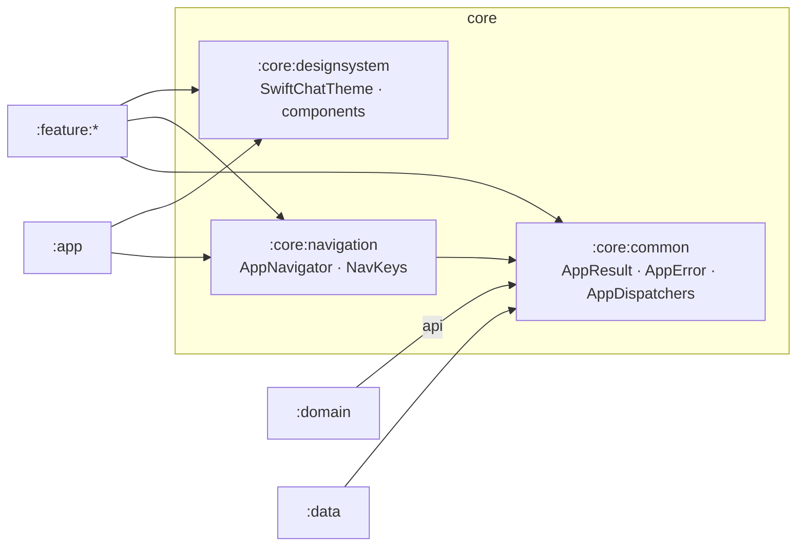
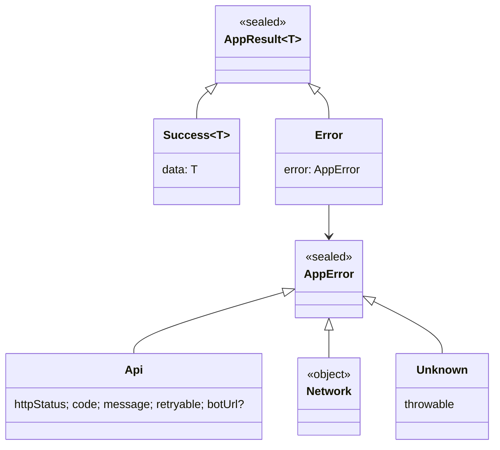
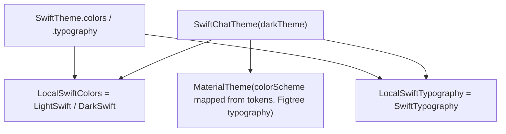
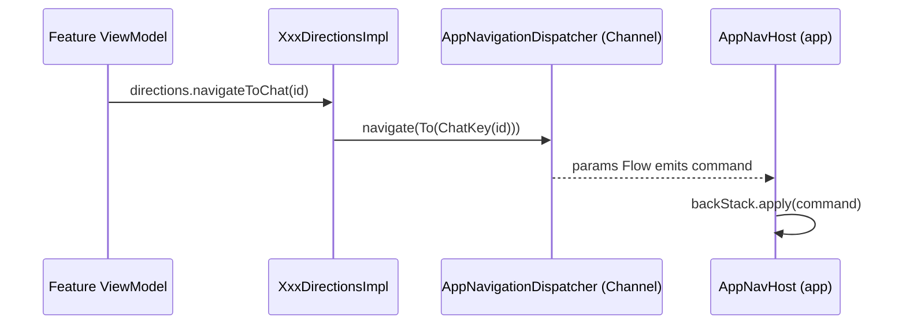

# `:core:*` — Shared foundations

[← Back to README](../../../README.md)

The three `core` modules hold what **every** other module shares. None of them knows about any feature.

| Module | Type | Purpose | Depends on |
|---|---|---|---|
| [`:core:common`](#1-corecommon) | pure Kotlin/JVM | the result/error types and dispatchers that every layer speaks | — |
| [`:core:designsystem`](#2-coredesignsystem) | Android library (Compose) | theme, colour/typography tokens and reusable UI components | — |
| [`:core:navigation`](#3-corenavigation) | Android library | navigation commands, NavKeys and the event bus between ViewModels and the UI | `:core:common` |



```text
:core:common ◄── :core:navigation
     ▲                ▲
     │ (api)          │
 :domain   :data   :feature:*  ──► :core:designsystem
                       ▲
                     :app  (uses all three)
```

---

## 1. `:core:common`

A pure Kotlin module (`java-library`, no Android). It defines **how results and errors travel** through the app. Repositories return values instead of throwing exceptions.



| Type | Meaning |
|---|---|
| `AppResult<T>` | `Success(data)` or `Error(AppError)`. Extensions: `map`, `onSuccess`, `onError`. |
| `AppError.Api` | the server answered with an error body: HTTP status, `code`, message, `retryable`, optional `botUrl` (Telegram OTP bot link) |
| `AppError.Network` | no internet or a timeout |
| `AppError.Unknown` | unexpected failure, such as broken JSON |
| `AppError.isRetryable` | `Api → retryable`, `Network → true`, `Unknown → false` |
| `ErrorCodes` | string constants. **Server:** `INVALID_OTP`, `OTP_LOCKED`, `TELEGRAM_NOT_LINKED`, `USERNAME_TAKEN`, `RATE_LIMITED`, `EDIT_WINDOW_EXPIRED`, … **Media:** `PAYLOAD_TOO_LARGE`, `OFFSET_MISMATCH`, `UPLOAD_EXPIRED`, `SHA256_MISMATCH`, … **Client-only:** `CALLS_UNAVAILABLE`, `CALL_FAILED`, `MEDIA_FILE_MISSING` |
| `AppDispatchers(io, default, main)` | injectable coroutine dispatchers. Values are provided by `:data` (`DispatchersModule`). |
| `@ApplicationScope` | qualifier for the app-wide `CoroutineScope` (`SupervisorJob + Default`) |

### Files

| File | Class(es) | Responsibility | Depends on / used by |
|---|---|---|---|
| `uz/relay/core/common/dispatcher/AppDispatchers.kt` | `AppDispatchers`, `@ApplicationScope` | dispatcher bundle and app-scope qualifier | provided in `:data` DI; used by repositories, `StreamVideoConnector` |
| `uz/relay/core/common/result/AppError.kt` | `AppError`, `isRetryable`, `ErrorCodes` | the error model and error code constants | produced by `safeApiCall` (`:data`); mapped to text by each feature's `messageRes()` |
| `uz/relay/core/common/result/AppResult.kt` | `AppResult`, extensions | success/error wrapper | returned by every repository and use case |

File count check: **3** files.

---

## 2. `:core:designsystem`

All visual building blocks live here, so every screen looks consistent and dark mode works everywhere. Screens never hard-code colours. They read `SwiftTheme.colors` / `SwiftTheme.typography`.

### 2.1 Theme



**Colour tokens** (`SwiftColors`, 34 tokens, light and dark palettes). Brand colour is `#5B4FE9`.

| Group | Tokens |
|---|---|
| Surfaces | `bg`, `surface`, `surface2`, `page`, `card`, `cardBorder`, `wall` (chat background), `menu`, `scrim`, `skeleton` |
| Text and lines | `text`, `text2`, `line`, `outline`, `meta`, `metaOut`, `muted`, `onMuted` |
| Brand | `primary`, `onPrimary`, `primaryContainer`, `onPrimaryContainer` |
| Chat bubbles | `bubbleIn`, `bubbleOut`, `onBubbleOut`, `replyIn`, `replyOut`, `replyOutAccent`, `tickRead`, `chip`, `onChip` |
| Status | `online`, `error`, `errorContainer` |

Extra palettes:
- `AvatarColors` (7), chosen from a stable hash of the user id;
- `SenderNameColors` (4), for names in group chats;
- `SettingsTileColors`, for the profile screen icon tiles.

**Typography** (`SwiftTypography`, Figtree font bundled in 5 weights):

| Style | Size / weight |
|---|---|
| `displayTitle` | 28 Bold |
| `appTitle` | 22 ExtraBold |
| `title` | 17 Bold |
| `body` | 15 / line height 21 |
| `bodyStrong` | 16 SemiBold |
| `supporting` | 15 |
| `label` | 13 SemiBold |

### 2.2 Components

| Component | What it is |
|---|---|
| `Avatar(name, colorSeed, size, online)` | circle with initials and a deterministic colour, optional green online dot. Photo avatars are not implemented yet. |
| `BrandTile(icon, …)` | rounded brand-coloured icon tile with a soft glow (auth screens, dialogs) |
| `CountBadge(count, muted)` | unread counter, a perfect circle for 1–9, "99+" above 99 |
| `ConnectionTitle(text)` | "Connecting…" / "Updating…" title with a small spinner |
| `OfflineBanner(text)` | "No internet" banner |
| `SkeletonChatRow` | loading placeholder for the chat list |
| `SwiftPrimaryButton` / `SwiftTonalButton` | 56 dp pill buttons with a loading state |
| `SwiftDialog` | the app's single confirm dialog: icon tile, question, two equal pill buttons, red when `destructive` |
| `SwiftInputDialog` | dialog with one text field (for example rename group). Confirm is enabled only for a valid, changed value. |
| `SwiftSwitch` | switch in brand colours that looks the same in both themes |
| `SwiftFab` | 60 dp floating action button with a brand shadow |
| `SwiftLogoTile` / `SwiftWordmark` | logo and "Swift**Chat**" wordmark |
| `SwiftSnackbarHost` | snackbar shown at the **top** of the screen |
| `SwiftTextField` | 58 dp outlined field with the label on the border and leading/trailing slots |
| `formatPresence(...)` | "online" / "last seen just now / N min / N h / yesterday HH:mm / dd.MM.yyyy / recently" |

Resources:
- 53 vector icons (`ic_*.xml`, Lucide style);
- 5 Figtree font files;
- presence strings in Uzbek (default), Russian and English.

### Files

| File | Class(es) | Responsibility | Depends on / used by |
|---|---|---|---|
| `uz/relay/core/designsystem/component/Avatar.kt` | `Avatar`, `avatarColor`, `initialsOf` | initials avatar with online dot | chat list, chat header, profiles, members |
| `uz/relay/core/designsystem/component/BrandTile.kt` | `BrandTile` | brand icon tile | auth screens, empty states |
| `uz/relay/core/designsystem/component/Indicators.kt` | `CountBadge`, `ConnectionTitle`, `OfflineBanner`, `SkeletonChatRow` | small status indicators | chat list, tabs |
| `uz/relay/core/designsystem/component/SwiftButtons.kt` | `SwiftPrimaryButton`, `SwiftTonalButton` | pill buttons | auth, profile, dialogs |
| `uz/relay/core/designsystem/component/SwiftDialog.kt` | `SwiftDialog`, `SwiftInputDialog`, `SwiftSwitch` | dialogs and switch | logout, delete, leave, rename, settings |
| `uz/relay/core/designsystem/component/SwiftFab.kt` | `SwiftFab` | floating action button | chat list ("new chat") |
| `uz/relay/core/designsystem/component/SwiftLogo.kt` | `SwiftLogoTile`, `SwiftWordmark` | logo | chat list top bar |
| `uz/relay/core/designsystem/component/SwiftSnackbar.kt` | `SwiftSnackbarHost` | top snackbar | every screen with errors |
| `uz/relay/core/designsystem/component/SwiftTextField.kt` | `SwiftTextField` | outlined text field | phone, profile, group name, input dialog |
| `uz/relay/core/designsystem/theme/Color.kt` | `SwiftColors`, `LightSwift`, `DarkSwift`, `Brand`, palettes | colour tokens | `Theme.kt`, all screens |
| `uz/relay/core/designsystem/theme/Theme.kt` | `SwiftChatTheme`, `SwiftTheme`, locals | theme provider and Material mapping | `MainActivity`, previews, tests |
| `uz/relay/core/designsystem/theme/Type.kt` | `FigtreeFontFamily`, `SwiftTypography`, `SwiftMaterialTypography` | typography scale | `Theme.kt` |
| `uz/relay/core/designsystem/util/Haptics.kt` | `rememberGestureThresholdHaptic` | one light haptic tick when a gesture crosses its threshold | swipe to reply |
| `uz/relay/core/designsystem/util/Presence.kt` | `formatPresence` | online / last-seen text | chat header, contacts, profiles |

File count check: **13** files.

---

## 3. `:core:navigation`

Features never call each other. A ViewModel says **where** to go by sending a command. Only the `:app` module applies that command to the back stack. This keeps features independent and makes navigation testable.

### 3.1 The event bus



```text
ViewModel → Directions (interface in Contract) → DirectionsImpl → AppNavigator.navigate(param)
          → AppNavigationDispatcher (Channel, capacity 16) → AppNavigationHandler.params → AppNavHost.apply()
```

How it works:
- `AppNavigationDispatcher` is a `@Singleton` that implements both `AppNavigator` (the sending side, used by Directions) and `AppNavigationHandler` (the receiving side, used by the UI).
- It uses a `Channel` instead of a `StateFlow`, because navigation is an **event**, not state. Each command is delivered **exactly once**, so it is not replayed after a screen rotation.

### 3.2 Commands (`AppNavigationParam`)

| Command | Use |
|---|---|
| `To(key, singleTop = true)` | open a screen |
| `Replace(key)` | open a screen in place of the current one (for example search → chat) |
| `Back` | go back one screen |
| `BackTo(key, inclusive = false)` | go back to a screen (for example after leaving a group) |
| `BackToOrTo(key)` | return to an existing screen, or open it if missing |
| `ResetTo(key)` | clear the stack, used on login and logout |

### 3.3 NavKeys (all `@Serializable`, so the stack survives process death)

| Key | Arguments | Screen (module) |
|---|---|---|
| `PhoneKey` | — | phone entry (auth) |
| `OtpKey` | `phone` | OTP code (auth) |
| `ProfileSetupKey` | — | first-time profile (auth) |
| `ChatsKey` | — | chat list (chats) |
| `SearchKey` | — | global search (chats) |
| `NewMessageKey` | — | new message, contacts (chats) |
| `AddContactKey` | — | add contact (chats) |
| `ChatKey` | `chatId`, `focusMessageId?` | conversation (conversation) |
| `ChatSearchKey` | `chatId` | in-chat search (conversation) |
| `MediaViewerKey` | `chatId`, `clientMessageId` | full-screen media (conversation) |
| `GroupCreateKey` | `addToChatId?` | create group / add members (group) |
| `GroupInfoKey` | `chatId` | group info (group) |
| `MyProfileKey` | — | my profile and settings (profile) |
| `EditProfileKey` | — | edit profile (profile) |
| `UserProfileKey` | `userId` | another user's profile (profile) |
| `CallKey` | `callId`, `video?`, `chatId?`, `group` | call screen (calls) |

### Files

| File | Class(es) | Responsibility | Depends on / used by |
|---|---|---|---|
| `uz/relay/core/navigation/AppNavigationParam.kt` | `AppNavigationParam` (+6 variants) | navigation command model | sent by every `*DirectionsImpl`, applied in `AppNavHost` |
| `uz/relay/core/navigation/AppNavigator.kt` | `AppNavigator` | sending interface (`suspend navigate`) | injected into `*DirectionsImpl`, `MainViewModel` |
| `uz/relay/core/navigation/AppNavigationHandler.kt` | `AppNavigationHandler` | receiving interface (`params: Flow`) | `MainViewModel` → `AppNavHost` |
| `uz/relay/core/navigation/AppNavigationDispatcher.kt` | `AppNavigationDispatcher` | Channel-based event bus implementing both interfaces | bound in `NavigationModule` |
| `uz/relay/core/navigation/di/NavigationModule.kt` | `NavigationModule` | Hilt `@Binds` for both interfaces | Hilt SingletonComponent |
| `uz/relay/core/navigation/key/AuthKeys.kt` | `PhoneKey`, `OtpKey`, `ProfileSetupKey` | auth destinations | auth feature, `MainViewModel` |
| `uz/relay/core/navigation/key/MainKeys.kt` | 13 keys (see table above) | main-app destinations | all features |

File count check: **7** files.

---

## 4. Tests

| Module | Test | Notes |
|---|---|---|
| `:core:designsystem` | `SwiftDialogTest` (Robolectric) | confirm and dismiss buttons call the right callbacks |
| `:core:common` | — | indirectly covered by `:data` tests (`SafeApiCallTest`) and the ViewModel tests |
| `:core:navigation` | — | not implemented yet |
