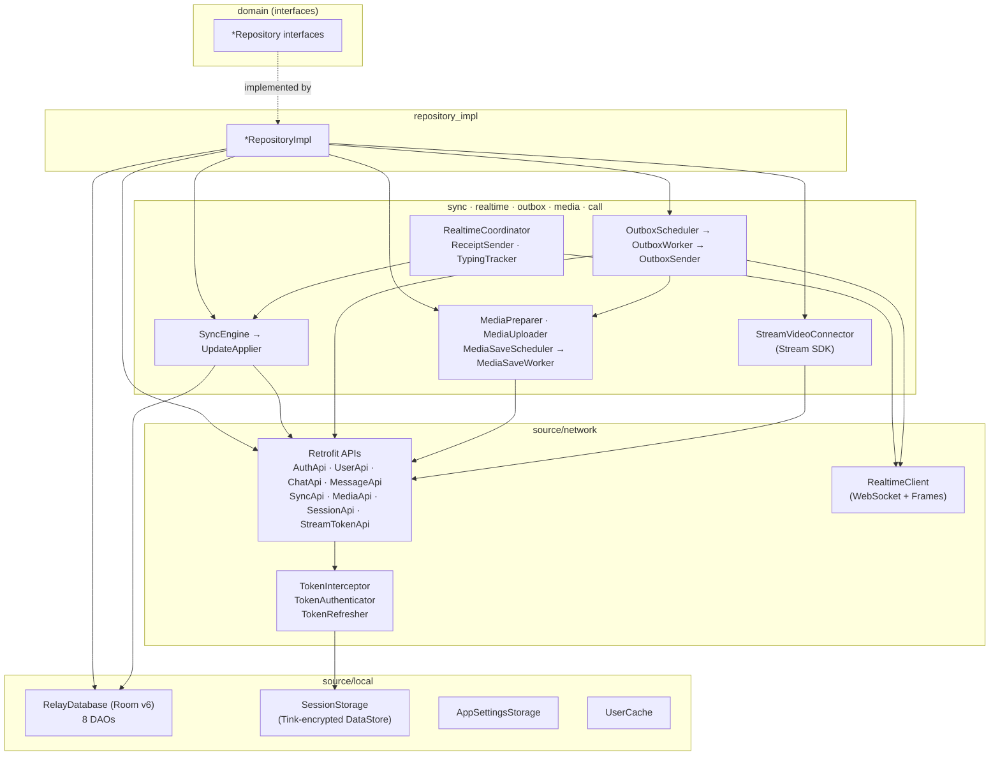
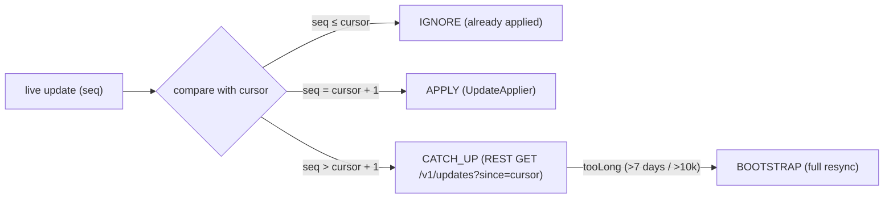

# `:data` — Data layer

[← Back to README](../../../README.md)

`:data` is the only module that talks to the outside world. It implements every repository interface declared in
`:domain` using the Relay REST API (Retrofit), the Relay WebSocket (OkHttp), a local Room database, encrypted
DataStore preferences, WorkManager jobs and the Stream Video SDK. Everything the UI shows is read from Room
(**offline-first**): network responses and live socket updates are written to the database first, and screens observe
the database through Kotlin `Flow`s. Feature modules never depend on `:data` — they only see domain interfaces, and Hilt
binds the implementations at runtime.

- Package: `uz.relay.data`
- Type: Android library (Hilt, KSP, kotlinx.serialization, BuildConfig)
- Depends on: `:domain`, `:core:common`
- Source files: **92** (`data/src/main/java/uz/relay/data/**`)

---

## 1. Internal structure



```text
domain  *Repository (interfaces)
            ▲ implemented by (Hilt @Binds, di/RepositoryModule)
repository_impl/*RepositoryImpl
   ├── source/network/api/*Api ──► interceptor/TokenInterceptor + TokenAuthenticator ──► TokenRefresher ──► SessionStorage
   ├── source/local/database (RelayDatabase, 8 DAOs) ◄── UserCache
   ├── sync/SyncEngine ──► UpdateApplier ──► Room (one transaction)
   ├── outbox/OutboxScheduler ──► OutboxWorker ──► OutboxSender ──► RealtimeClient (WS) or MessageApi (REST)
   │                                                     └──► media/MediaUploader ──► MediaApi
   ├── media/MediaPreparer · MediaSaveScheduler ──► MediaSaveWorker ──► GallerySaver
   └── call/StreamVideoConnector ──► StreamTokenApi ──► Cloudflare Worker ──► Stream Video SDK
realtime/RealtimeCoordinator ──► RealtimeClient (frames) ──► SyncEngine / ReceiptSender / TypingTracker
```

---

## 2. Configuration (BuildConfig)

| Field | Value / source | Purpose |
|---|---|---|
| `BASE_URL` | `https://relay.zokirov-mob-dev.uz/` | Relay REST base URL (all three Retrofit instances) |
| `WS_URL` | `wss://relay.zokirov-mob-dev.uz/v1/ws` | Relay WebSocket |
| `STREAM_API_KEY` | `local.properties` | Public Stream Video API key (calls disabled when blank) |
| `STREAM_TOKEN_URL` | `local.properties` | Stream token server (Cloudflare Worker) `…/token`. Blank → dev token in debug, calls disabled in release |

No secret is stored in the app. The Stream API secret lives only in the Cloudflare Worker (`server/stream-token`).

---

## 3. REST API

Three OkHttp/Retrofit clients are provided by `di/NetworkModule` and selected with qualifiers from `di/Qualifiers.kt`:

| Qualifier | Adds | Used for |
|---|---|---|
| `@PublicClient` | logging only | login/OTP/refresh (must not wait for a token) |
| `@AuthorizedClient` | `TokenInterceptor` (Bearer) + `TokenAuthenticator` (refresh on 401) | all normal API calls |
| `@MediaClient` | same as authorized, no body logging, 60 s timeouts | uploads, downloads, Coil, ExoPlayer |

JSON: kotlinx.serialization with `ignoreUnknownKeys = true` (the server contract is additive-only).

| Interface (client) | Method | Path | Params | Returns |
|---|---|---|---|---|
| **AuthApi** (`@PublicClient`) | POST | `v1/auth/otp/request` | body `OtpRequest` | `Unit` (204) |
| | POST | `v1/auth/otp/verify` | body `VerifyOtpRequest` | `TokenPairResponse` |
| | POST | `v1/auth/refresh` | body `RefreshTokenRequest` | `TokenPairResponse` |
| **SessionApi** (`@AuthorizedClient`) | POST | `v1/auth/logout` | – | `Unit` (204) |
| **UserApi** (`@AuthorizedClient`) | GET | `v1/users/me` | – | `UserMeResponse` |
| | PATCH | `v1/users/me` | body `UpdateMeRequest` | `UserMeResponse` |
| | GET | `v1/users/{id}` | path `id` | `UserResponse` |
| | GET | `v1/users/search` | query `q`, `limit=20` | `UserSearchResponse` |
| **ChatApi** (`@AuthorizedClient`) | GET | `v1/chats` | query `limit=100`, `cursor?` | `ChatListPageResponse` |
| | GET | `v1/chats/{id}` | path | `ChatResponse` |
| | POST | `v1/chats/direct` | body `CreateDirectRequest` | `ChatResponse` (get-or-create) |
| | POST | `v1/chats/group` | body `CreateGroupRequest` | `ChatResponse` |
| | PATCH | `v1/chats/{id}` | body `UpdateChatRequest` | `ChatResponse` |
| | PUT | `v1/chats/{id}/settings` | body `ChatSettingsRequest` | `ChatResponse` |
| | POST | `v1/chats/{id}/members` | body `AddMembersRequest` | `MembersResponse` |
| | DELETE | `v1/chats/{id}/members/{userId}` | path ×2 | `Unit` (204) |
| | PATCH | `v1/chats/{id}/members/{userId}` | body `ChangeRoleRequest` | `ChatMemberResponse` |
| | POST | `v1/chats/{id}/leave` | path | `Unit` (204) |
| **MessageApi** (`@AuthorizedClient`) | GET | `v1/chats/{id}/messages` | query `beforeSeq?`, `limit=50` | `MessagePageResponse` |
| | POST | `v1/chats/{id}/messages` | body `SendMessageRequest` | `SendMessageResultResponse` (idempotent by `clientMessageId`) |
| | PATCH | `v1/messages/{serverId}` | body `EditMessageRequest` | `MessageResponse` (48 h edit window) |
| | DELETE | `v1/messages/{serverId}` | path | `Unit` (tombstone) |
| | POST | `v1/chats/{id}/read` | body `UpToSeqRequest` | `Unit` |
| | POST | `v1/chats/{id}/received` | body `UpToSeqRequest` | `Unit` |
| **SyncApi** (`@AuthorizedClient`) | GET | `v1/updates/state` | – | `UpdatesStateResponse` |
| | GET | `v1/updates` | query `since`, `limit=500` | `UpdatesPageResponse` |
| **MediaApi** (`@MediaClient`) | POST | `v1/media/uploads` | body `StartUploadRequest` | `StartUploadResponse` |
| | PUT | `v1/media/uploads/{uploadId}` | header `Upload-Offset`, raw body | `ChunkAckResponse` |
| | HEAD | `v1/media/uploads/{uploadId}` | path | `Response<Void>` (offset in header) |
| **StreamTokenApi** (`@AuthorizedClient`) | POST | full `@Url` = `STREAM_TOKEN_URL` | – | `StreamTokenResponse` |

Media files are downloaded from `GET v1/media/{mediaId}` (built by `mediaUrl()` in `MessageMapper.kt`) with the
`@MediaClient` OkHttp client — by Coil (images), ExoPlayer (video, HTTP Range) and `MediaRepositoryImpl.download` (files).

> Not implemented yet: reading limits from `GET /v1/server/info` — the 100 MB upload limit is currently a constant in `MediaPreparer`.

---

## 4. WebSocket (realtime)

`RealtimeClient` keeps one OkHttp WebSocket to `WS_URL` (ping 30 s). The token is sent in the first frame, not a header.

| Direction | Frame (`type`) | Fields |
|---|---|---|
| client → server | `auth` | `token`, `deviceId`, `cursor` (must be first, within 10 s) |
| | `send` | `clientMessageId`, `chatId`, `messageType`, `body?`, `mediaIds?`, `replyTo?` |
| | `read` / `received` | `chatId`, `upToSeq` |
| | `typing` | `chatId` |
| server → client | `auth_ok` | `userId`, `updateSeq` |
| | `ack` | `clientMessageId`, `serverId`, `serverSeq`, `serverCreatedAt` |
| | `nack` | `clientMessageId`, `code`, `message`, `retryable` |
| | `update` | `updateSeq`, `kind`, `payload` |
| | `typing` | `chatId`, `userId` |
| | `presence` | `userId`, `online`, `lastSeenAt?` |
| | `error` | `code`, `message` |

Unknown frame types are ignored (forward compatibility).

| Close code | Meaning | Client reaction |
|---|---|---|
| 4001 | access token expired | `TokenRefresher.refresh`, reconnect immediately |
| 4003 | unauthorized | refresh once; second 4003 in a row → clear session |
| 4009 | session replaced by another connection | stop (avoid two sockets kicking each other) |
| 4008 | auth timeout | reconnect immediately |
| other / network | – | exponential backoff 1, 2, 4 … 30 s + jitter; `reconnectNow()` on network return |

`RealtimeCoordinator` opens the socket only while the user is logged in **and** the app is in the foreground
(`ProcessLifecycleOwner`, 5 s grace on background) and routes frames:
`auth_ok` → outbox + catch-up · `update` → `SyncEngine.onLiveUpdate` · `presence` → `UserDao` · `typing` → `TypingTracker`.
`ack`/`nack` are consumed directly by `OutboxSender`.

---

## 5. Sync algorithm (`sync/`)

Every change for the user has a per-user, gap-free `updateSeq`. The last applied value is the local **cursor**
(`sync_state` table).



| Step | What happens |
|---|---|
| **Bootstrap** (first login / resync) | `GET /v1/updates/state` (cursor first) → page through `GET /v1/chats` → fetch missing users → one transaction: upsert users, replace chats, delete synced messages (outbox kept), reset cursors, set cursor |
| **Catch-up** | page `GET /v1/updates?since=cursor` until reaching `state.updateSeq` |
| **Live** | `classifyLiveUpdate` → IGNORE / APPLY / CATCH_UP, all under one `Mutex` |
| **Apply** (`UpdateApplier`) | 1) network outside the transaction (missing chats/users); 2) one Room transaction applying `message_new`, `message_edit` (only newer `editVersion`), `message_delete` (tombstone), `read`/`delivered` (cursors only move forward), `member`, `chat`, then cursor = max(old,new); 3) side effects: clear typing, send `received` receipt |

Read/delivered receipts are sent by `ReceiptSender` (socket if connected, otherwise REST).

---

## 6. Room database (`RelayDatabase`, version 6)

File `relay.db`, `fallbackToDestructiveMigration(dropAllTables = true)`, TypeConverter `MediaConverters`
(JSON list of `MediaItemEntity`).

| Table (Entity) | Key | Notable columns |
|---|---|---|
| `chats` (`ChatEntity`) | `id` | type, title, peerUserId, embedded last message, unreadCount, readUpToSeq, topSeq, muted, mutedUntil |
| `users` (`UserEntity`) | `id` | displayName, username, avatar, online, lastSeenAt, phone (own profile only) |
| `messages` (`MessageEntity`) | `clientMessageId` | chatId, serverId?, serverSeq?, type, body, replyTo, edit/delete stamps, `status` (PENDING/SENT/FAILED), media JSON |
| `chat_members` (`ChatMemberEntity`) | (`chatId`,`userId`) | role, joinedAt |
| `member_cursors` (`MemberCursorEntity`) | (`chatId`,`userId`) | readUpToSeq, deliveredUpToSeq |
| `uploads` (`UploadEntity`) | `clientMessageId` | local file, sha256, uploadId, mediaId, chunkSize, confirmedBytes, completed |
| `contacts` (`ContactEntity`) | `userId` | addedAt (contacts are local-only) |
| `sync_state` (`SyncStateEntity`) | `id = 0` | updateSeq (the sync cursor) |

| DAO | Main operations |
|---|---|
| `ChatDao` | chat list JOIN peer user + member cursors (`ChatListItem`), single/direct chat, forward-only `markRead`, `replaceAll` |
| `ChatMemberDao` | members JOIN users ordered by role (`MemberItem`), replace/upsert/delete |
| `ContactDao` | contacts JOIN users, ids, insert/delete |
| `MemberCursorDao` | forward-only `raise` of read/delivered cursors |
| `MessageDao` | observe (pending first), local LIKE search, edit/delete tombstones, outbox queue (`nextPending`, `markSent`, `markFailed`) |
| `SyncStateDao` | get/observe/set the cursor |
| `UploadDao` | upload session + progress |
| `UserDao` | users, presence, name map |

---

## 7. Model mapping (DTO → Entity → Domain)

| Server DTO (`model/response`) | Room entity | Domain model | Mapper |
|---|---|---|---|
| `TokenPairResponse` | – (`Session` in `SessionStorage`) | – | `mapper/Mappers.kt` |
| `UserMeResponse`, `UserResponse` | `UserEntity` | `User` | `mapper/UserMapper.kt` |
| `ChatResponse`, `MessagePreviewResponse` | `ChatEntity` (+ `LastMessageEmbedded`) | `ChatSummary`, `LastMessage` | `mapper/ChatMapper.kt` |
| `MessageResponse`, `MediaMetaResponse` | `MessageEntity`, `MediaItemEntity` (+ `UploadEntity`) | `Message`, `MessageMedia`, `UploadProgress` | `mapper/MessageMapper.kt` |
| `ChatMemberResponse` | `ChatMemberEntity` | `ChatMember` | `mapper/MemberMapper.kt` |
| `SystemMessageBodyResponse` (JSON in body) | stored as message body | `SystemEvent` | `parseSystemEvent` in `ChatMapper.kt` |

Message status (✓ / ✓✓) is **not stored**: `outgoingStatus()` computes SENDING / SENT / DELIVERED / READ from the
send status and the other members' read/delivered cursors, so one cursor update ticks every earlier message.

---

## 8. Cross-cutting features

### Token management
- `TokenInterceptor` adds `Authorization: Bearer <access>` from the in-memory session.
- `TokenAuthenticator` reacts to HTTP 401: refreshes once and retries the request.
- `TokenRefresher` is the **single place** that refreshes (REST 401 and WS 4001/4003), guarded by a `Mutex` —
  the server rotates refresh tokens, so two parallel refreshes would revoke the session (`TOKEN_REUSED`).
- `SessionStorage` keeps tokens in a DataStore encrypted with Tink AES-256-GCM, key wrapped by the Android Keystore.
- `safeApiCall` converts exceptions into `AppResult.Error(AppError.Api | Network | Unknown)`; cancellation is rethrown.

### Outbox (offline sending)
1. `MessageRepositoryImpl` inserts a `PENDING` row with a UUID `clientMessageId` → the message is visible immediately.
2. `OutboxScheduler` enqueues unique WorkManager work (requires network, exponential backoff).
3. `OutboxSender` sends FIFO: uploads media first, then tries the socket and waits up to 10 s for `ack`, otherwise falls
   back to REST with the same `clientMessageId` (idempotent — no duplicates). Retryable errors stop the queue; permanent
   errors mark the message `FAILED` (the user can retry).

### Media
- **Prepare** (`MediaPreparer`): copy the picked file into app storage while hashing SHA-256, detect kind, read
  dimensions/duration, make a ≤8 KB thumbnail and a video poster; reject files over 100 MB.
- **Upload** (`MediaUploader`): resumable chunked upload — start session, PUT chunks at the server-confirmed offset,
  re-query with HEAD on `OFFSET_MISMATCH`, restart expired sessions; progress is saved after each chunk.
- **Download** (`MediaRepositoryImpl.download`): streams to a `.part` file with progress, reuses local/cached copies.
- **Save to gallery**: `MediaSaveScheduler` → `MediaSaveWorker` (foreground, dataSync) → `GallerySaver` (MediaStore
  `Pictures/SwiftChat` or `Movies/SwiftChat`) with progress/done/failed notifications (`MediaSaveNotifications`).

### Other
- `AppLocaleManager` — per-app language (system `LocaleManager` on Android 13+, SharedPreferences + context wrap below).
- `AppSettingsStorage` — theme and notification switches, plus recently used emoji (key `recent_emojis`, newline-separated, ordered by `RecentEmojis.push`) (DataStore, survives logout).
- `NetworkMonitor` — internet availability `StateFlow`.
- `TypingTracker` — in-memory "typing…" state with 5 s TTL (implements `TypingRepository`).
- `UserCache` — fetches missing user profiles (max 4 in parallel).
- `StreamVideoConnector` — ties the Stream Video client to the Relay session: on login fetches the first token from the
  token server (retries 2→16 s), builds the client, refreshes tokens through a `TokenProvider`; logs out on logout.
- `CallRepositoryImpl` — 1:1 ringing calls (15 s auto-cancel), incoming-call stream, group video rooms
  (`group_<chatId>`, no ringing) and their participant count.

### Dependency injection (`di/`)

| Module | Provides |
|---|---|
| `NetworkModule` | `Json`, logger, 3 OkHttp clients, 3 Retrofit instances |
| `ApiModule` | the 8 Retrofit API interfaces |
| `DatabaseModule` | `RelayDatabase` and its 8 DAOs |
| `MediaModule` | Coil `ImageLoader` and Media3 `DataSource.Factory` on the media client |
| `DispatchersModule` | `AppDispatchers` and the app-wide `@ApplicationScope CoroutineScope` |
| `RepositoryModule` | `@Binds` of the 11 domain repository interfaces |
| `Qualifiers.kt` | `@PublicClient`, `@AuthorizedClient`, `@MediaClient` |

---

## 9. Repository implementations

| Implementation | Domain interface | Uses | Role |
|---|---|---|---|
| `AuthRepositoryImpl` | `AuthRepository` | AuthApi, SessionApi, SessionStorage, RealtimeClient, OutboxScheduler, MediaFiles, RelayDatabase | auth state, OTP login, profile-setup flag, ordered logout cleanup |
| `UserRepositoryImpl` | `UserRepository` | UserApi, UserDao, SessionStorage | own profile, other users, search, name map |
| `ChatRepositoryImpl` | `ChatRepository` | ChatApi, ChatDao, SyncEngine, UserCache, UserDao, SessionStorage | chat list/one chat/DM, sync status, refresh, open DM, mute |
| `MessageRepositoryImpl` | `MessageRepository` | MessageApi, Message/Chat/User/MemberCursor/Upload DAOs, MediaPreparer, OutboxScheduler, ReceiptSender, RealtimeClient, UserCache | messages, history paging, send via outbox, edit/delete, read, typing, local search |
| `GroupRepositoryImpl` | `GroupRepository` | ChatApi, Chat/ChatMember/Message/MemberCursor/User DAOs, UserCache, SessionStorage | members, create, add/remove, roles, rename, leave |
| `ContactRepositoryImpl` | `ContactRepository` | ContactDao, UserDao, UserCache | local contacts |
| `MediaRepositoryImpl` | `MediaRepository` | media OkHttp, MediaFiles, MediaSaveScheduler | download with progress, schedule gallery save |
| `SettingsRepositoryImpl` | `SettingsRepository` | AppSettingsStorage, AppLocaleManager | theme, notifications, language, recent emoji |
| `ConnectionRepositoryImpl` | `ConnectionRepository` | NetworkMonitor, RealtimeClient, SyncEngine | combined status OFFLINE > UPDATING > CONNECTING > CONNECTED |
| `CallRepositoryImpl` | `CallRepository` | StreamVideoConnector, Stream SDK | 1:1 calls, incoming calls, group rooms |
| `TypingTracker` (`realtime/`) | `TypingRepository` | – | in-memory typing state |

---

## 10. Every file

Paths are relative to `data/src/main/java/uz/relay/data/`.

| File | Class(es) | Responsibility | Depends on / used by |
|---|---|---|---|
| `call/StreamVideoConnector.kt` | `StreamVideoConnector` | Stream Video client lifecycle bound to the Relay session; token provider | AuthRepository, UserRepository, StreamTokenApi / App, CallRepositoryImpl |
| `connection/NetworkMonitor.kt` | `NetworkMonitor` | internet availability `StateFlow` | ConnectivityManager / RealtimeCoordinator, ConnectionRepositoryImpl |
| `di/ApiModule.kt` | `ApiModule` | provides Retrofit APIs | Retrofit instances / repositories |
| `di/DatabaseModule.kt` | `DatabaseModule` | provides Room DB and DAOs | Room / repositories, sync |
| `di/DispatchersModule.kt` | `DispatchersModule` | `AppDispatchers`, `@ApplicationScope` scope | core:common / long-lived components |
| `di/MediaModule.kt` | `MediaModule` | Coil ImageLoader, ExoPlayer DataSource on media client | @MediaClient / App, MediaViewer |
| `di/NetworkModule.kt` | `NetworkModule` | Json, logger, 3 OkHttp clients, 3 Retrofit | interceptors / ApiModule |
| `di/Qualifiers.kt` | `PublicClient`, `AuthorizedClient`, `MediaClient` | client qualifiers | DI modules |
| `di/RepositoryModule.kt` | `RepositoryModule` | binds repository interfaces | domain / all features |
| `locale/AppLocaleManager.kt` | `AppLocaleManager` | per-app language, context wrap for Android 8–12 | SettingsRepositoryImpl, MainActivity |
| `mapper/ChatMapper.kt` | functions | chat DTO → entity → `ChatSummary`; system event parsing; type enums | SyncEngine, UpdateApplier, ChatRepositoryImpl |
| `mapper/Mappers.kt` | functions | `TokenPairResponse` → `Session` | AuthRepositoryImpl, TokenRefresher |
| `mapper/MemberMapper.kt` | functions | member DTO → entity → `ChatMember` | GroupRepositoryImpl, UpdateApplier |
| `mapper/MessageMapper.kt` | `PeerCursors`, functions | message/media mapping, status from cursors, `mediaUrl`, send request | MessageRepositoryImpl, OutboxSender, UpdateApplier |
| `mapper/UserMapper.kt` | functions | user DTO ↔ entity ↔ `User` | UserRepositoryImpl, UserCache |
| `media/GallerySaver.kt` | `GallerySaver` | download + insert into MediaStore | MediaSaveWorker |
| `media/MediaFiles.kt` | `MediaFiles` | outbox/download directories, cleanup on logout | MediaPreparer, MediaRepositoryImpl, AuthRepositoryImpl |
| `media/MediaPreparer.kt` | `MediaPreparer` | copy, SHA-256, metadata, thumbnail, poster | MessageRepositoryImpl |
| `media/MediaSaveNotifications.kt` | `MediaSaveNotifications` | channel + progress/done/failed notifications | MediaSaveWorker |
| `media/MediaSaveScheduler.kt` | `MediaSaveScheduler` | enqueue gallery-save work | MediaRepositoryImpl |
| `media/MediaSaveWorker.kt` | `MediaSaveWorker` | foreground WorkManager job saving media | GallerySaver, notifications |
| `media/MediaUploader.kt` | `MediaUploader` | resumable chunked upload | MediaApi, UploadDao / OutboxSender |
| `model/request/AuthRequests.kt` | `OtpRequest`, `VerifyOtpRequest`, `RefreshTokenRequest` | auth request bodies | AuthApi |
| `model/request/ChatRequests.kt` | `CreateDirectRequest`, `CreateGroupRequest`, `UpdateChatRequest`, `ChatSettingsRequest`, `AddMembersRequest`, `ChangeRoleRequest` | chat/group request bodies | ChatApi |
| `model/request/MessageRequests.kt` | `SendMessageRequest`, `EditMessageRequest`, `StartUploadRequest` | message/upload bodies | MessageApi, MediaApi |
| `model/request/UpdateMeRequest.kt` | `UpdateMeRequest` | profile PATCH body | UserApi |
| `model/request/UpToSeqRequest.kt` | `UpToSeqRequest` | read/received receipt body | MessageApi |
| `model/response/ChatResponses.kt` | `ChatResponse`, `MessagePreviewResponse`, `ChatListPageResponse` | chat DTOs | ChatApi |
| `model/response/ErrorResponse.kt` | `ErrorResponse` | server error body | safeApiCall |
| `model/response/MediaResponses.kt` | `StartUploadResponse`, `ChunkAckResponse` | upload DTOs | MediaApi |
| `model/response/MemberResponses.kt` | `ChatMemberResponse`, `MembersResponse`, `UserSearchResponse` | member/search DTOs | ChatApi, UserApi |
| `model/response/MessagePageResponse.kt` | `MessagePageResponse`, `SendMessageResultResponse` | history page, send result | MessageApi |
| `model/response/MessageResponse.kt` | `MessageResponse`, `MediaMetaResponse`, `SystemMessageBodyResponse` | message DTOs | MessageApi, sync |
| `model/response/StreamTokenResponse.kt` | `StreamTokenResponse` | token server reply | StreamTokenApi |
| `model/response/SyncResponses.kt` | `UpdatesStateResponse`, `UpdateResponse`, `UpdatesPageResponse`, `UpdateKinds`, payloads | sync DTOs | SyncApi, UpdateApplier |
| `model/response/TokenPairResponse.kt` | `TokenPairResponse` | login/refresh tokens | AuthApi |
| `model/response/UserMeResponse.kt` | `UserMeResponse` | own profile (with phone) | UserApi |
| `model/response/UserResponse.kt` | `UserResponse` | public profile | UserApi, ChatResponse |
| `outbox/OutboxScheduler.kt` | `OutboxScheduler` | enqueue/cancel unique outbox work | MessageRepositoryImpl, RealtimeCoordinator, App |
| `outbox/OutboxSender.kt` | `OutboxSender`, `FlushResult` | FIFO sender (upload → socket or REST) | RealtimeClient, MessageApi, MediaUploader |
| `outbox/OutboxWorker.kt` | `OutboxWorker` | WorkManager worker running `flush()` | OutboxSender |
| `realtime/RealtimeCoordinator.kt` | `RealtimeCoordinator` | socket on/off by login + foreground; frame routing | RealtimeClient, SyncEngine / App |
| `realtime/ReceiptSender.kt` | `ReceiptSender` | read/received receipts via socket or REST | MessageRepositoryImpl, UpdateApplier |
| `realtime/TypingTracker.kt` | `TypingTracker` | in-memory typing state, `TypingRepository` | RealtimeCoordinator / chat screens |
| `repository_impl/AuthRepositoryImpl.kt` | `AuthRepositoryImpl` | see §9 | |
| `repository_impl/CallRepositoryImpl.kt` | `CallRepositoryImpl` | see §9 | |
| `repository_impl/ChatRepositoryImpl.kt` | `ChatRepositoryImpl` | see §9 | |
| `repository_impl/ConnectionRepositoryImpl.kt` | `ConnectionRepositoryImpl` | see §9 | |
| `repository_impl/ContactRepositoryImpl.kt` | `ContactRepositoryImpl` | see §9 | |
| `repository_impl/GroupRepositoryImpl.kt` | `GroupRepositoryImpl` | see §9 | |
| `repository_impl/MediaRepositoryImpl.kt` | `MediaRepositoryImpl` | see §9 | |
| `repository_impl/MessageRepositoryImpl.kt` | `MessageRepositoryImpl` | see §9 | |
| `repository_impl/SettingsRepositoryImpl.kt` | `SettingsRepositoryImpl` | see §9 | |
| `repository_impl/UserRepositoryImpl.kt` | `UserRepositoryImpl` | see §9 | |
| `source/local/AppSettingsStorage.kt` | `AppSettingsStorage` | DataStore for theme/notifications/recent emoji | SettingsRepositoryImpl |
| `source/local/Session.kt` | `Session` | tokens, userId, deviceId | SessionStorage |
| `source/local/SessionStorage.kt` | `SessionStorage` | encrypted session store + memory cache | interceptors, repositories, RealtimeClient |
| `source/local/cache/UserCache.kt` | `UserCache` | fetch missing profiles | UserApi / sync, repositories |
| `source/local/database/RelayDatabase.kt` | `RelayDatabase` | Room DB v6, 8 entities | DatabaseModule |
| `source/local/database/dao/ChatDao.kt` | `ChatDao`, `ChatListItem` | chat queries with JOINs | ChatRepositoryImpl, sync |
| `source/local/database/dao/ChatMemberDao.kt` | `ChatMemberDao`, `MemberItem` | member queries | GroupRepositoryImpl, sync |
| `source/local/database/dao/ContactDao.kt` | `ContactDao` | contacts JOIN users | ContactRepositoryImpl |
| `source/local/database/dao/MemberCursorDao.kt` | `MemberCursorDao` | forward-only cursors | sync, MessageRepositoryImpl |
| `source/local/database/dao/MessageDao.kt` | `MessageDao` | messages, tombstones, outbox queue | MessageRepositoryImpl, OutboxSender, sync |
| `source/local/database/dao/SyncStateDao.kt` | `SyncStateDao` | sync cursor | SyncEngine |
| `source/local/database/dao/UploadDao.kt` | `UploadDao` | upload sessions/progress | MediaUploader, MessageRepositoryImpl |
| `source/local/database/dao/UserDao.kt` | `UserDao`, `UserName` | users, presence, names | repositories, RealtimeCoordinator |
| `source/local/database/entity/ChatEntity.kt` | `ChatEntity`, `LastMessageEmbedded` | `chats` table | ChatDao |
| `source/local/database/entity/ChatMemberEntity.kt` | `ChatMemberEntity` | `chat_members` table | ChatMemberDao |
| `source/local/database/entity/ContactEntity.kt` | `ContactEntity` | `contacts` table | ContactDao |
| `source/local/database/entity/MediaItemEntity.kt` | `MediaItemEntity`, `MediaConverters` | media JSON column + converter | MessageEntity |
| `source/local/database/entity/MemberCursorEntity.kt` | `MemberCursorEntity` | `member_cursors` table | MemberCursorDao |
| `source/local/database/entity/MessageEntity.kt` | `MessageEntity`, `SendStatus` | `messages` table | MessageDao |
| `source/local/database/entity/SyncStateEntity.kt` | `SyncStateEntity` | `sync_state` table | SyncStateDao |
| `source/local/database/entity/UploadEntity.kt` | `UploadEntity` | `uploads` table | UploadDao |
| `source/local/database/entity/UserEntity.kt` | `UserEntity` | `users` table | UserDao |
| `source/network/api/AuthApi.kt` | `AuthApi` | OTP and refresh endpoints | AuthRepositoryImpl, TokenRefresher |
| `source/network/api/ChatApi.kt` | `ChatApi` | chat and member endpoints | ChatRepositoryImpl, GroupRepositoryImpl, sync |
| `source/network/api/MediaApi.kt` | `MediaApi` | resumable upload endpoints | MediaUploader |
| `source/network/api/MessageApi.kt` | `MessageApi` | history, send, edit, delete, receipts | MessageRepositoryImpl, OutboxSender, ReceiptSender |
| `source/network/api/SessionApi.kt` | `SessionApi` | logout | AuthRepositoryImpl |
| `source/network/api/StreamTokenApi.kt` | `StreamTokenApi` | Stream token server | StreamVideoConnector |
| `source/network/api/SyncApi.kt` | `SyncApi` | updates state and feed | SyncEngine |
| `source/network/api/UserApi.kt` | `UserApi` | me, user, search | UserRepositoryImpl, UserCache |
| `source/network/interceptor/TokenAuthenticator.kt` | `TokenAuthenticator` | refresh on 401 and retry | TokenRefresher |
| `source/network/interceptor/TokenInterceptor.kt` | `TokenInterceptor` | adds Bearer header | SessionStorage |
| `source/network/interceptor/TokenRefresher.kt` | `TokenRefresher`, `RefreshOutcome` | single-flight refresh | AuthApi, SessionStorage / authenticator, RealtimeClient |
| `source/network/realtime/Frames.kt` | `ClientFrame`, `ServerFrame` | WebSocket frame types + JSON helpers | RealtimeClient |
| `source/network/realtime/RealtimeClient.kt` | `RealtimeClient`, `RealtimeState` | WebSocket, handshake, close codes, backoff | RealtimeCoordinator, OutboxSender |
| `sync/SyncEngine.kt` | `SyncEngine` | bootstrap, catch-up, gap logic | SyncApi, ChatApi, DAOs, UpdateApplier |
| `sync/UpdateApplier.kt` | `UpdateApplier` | applies update kinds to Room | DAOs, ReceiptSender, TypingTracker |
| `utils/SafeApiCall.kt` | `safeApiCall` | Retrofit call → `AppResult` | all repositories |

Total: **92 files**.

---

## 11. Tests

| Test class | Covers |
|---|---|
| `mapper/MessageMapperTest` | entity → domain message (ownership, system events, media, upload progress, send request) |
| `mapper/OutgoingStatusTest` | ✓/✓✓ status from member cursors |
| `utils/SafeApiCallTest` | HTTP/JSON errors, retryable 5xx/429, IO, serialization, cancellation |
| `ExampleUnitTest` | template stub |

Run: `./gradlew :data:testDebugUnitTest`
