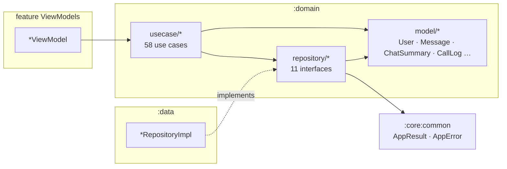

# `:domain` — Business layer

[← Back to README](../../../README.md)

`:domain` is the center of the Clean Architecture. It contains **pure Kotlin** (JVM, no Android) business models, the
repository **interfaces** the rest of the app talks to, and **use cases** — one small class per user action. Feature
modules (UI) depend only on `:domain`; `:data` implements its repository interfaces. Because `:domain` knows nothing
about Retrofit, Room, Stream or Android, business rules (validation, permissions, call-log format) are tested with plain
JUnit in milliseconds, and the data source can be replaced without touching the UI.

- Package: `uz.relay.domain`
- Type: JVM library (`java-library` + Kotlin JVM + `java-test-fixtures`)
- Depends on: `:core:common` (exposed as `api` — `AppResult` / `AppError` are part of the domain API)
- Source files: **83** = 14 model files + 11 repository interfaces + 58 use cases

---

## 1. Internal structure



```text
feature *ViewModel ──► usecase/<area>/<Action>UseCase ──► repository/<Area>Repository (interface)
                                   │                               ▲
                                   └──────► model/*  ◄─────────────┘ implemented in :data (*RepositoryImpl)
results: AppResult<T> = Success(data) | Error(AppError)   (from :core:common)
```

Every use case is a class with `@Inject constructor(repository)` and `operator fun invoke(...)`, so a ViewModel calls it
like a function: `requestOtp(phone)`. Most use cases only delegate; the ones marked **logic** below add a rule.

---

## 2. Models (`model/`)

| File | Types | Meaning |
|---|---|---|
| `AppLanguage.kt` | `AppLanguage` (UZ, RU, EN) | in-app language with BCP-47 tag; unknown tag → UZ |
| `AuthState.kt` | `AuthState` (LOGGED_OUT, NEEDS_PROFILE, LOGGED_IN) | chooses the start screen |
| `CallLog.kt` | `CallOutcome`, `CallLog`, `CallLogFormat` | call history entry stored in chat as plain text, e.g. `📞 Call · audio · 2:31`, `📞 Group call · video · started`; `format`/`parse`/`duration` |
| `Chat.kt` | `ChatType`, `MessageType`, `MessageStatus`, `ChatSummary`, `LastMessage`, `SystemEvent` | chat-list row, last message preview, delivery status (SENDING → SENT → DELIVERED → READ, or FAILED), parsed SYSTEM event |
| `ChatMember.kt` | `MemberRole`, `ChatMember`, `GroupPermissions` | group member and server-equal permission rules (manage, change role, remove, delete others' messages) |
| `ConnectionStatus.kt` | `ConnectionStatus` | OFFLINE > UPDATING > CONNECTING > CONNECTED (header indicator) |
| `Media.kt` | `MediaKind`, `MessageMedia`, `UploadProgress`, `Attachment`, `DownloadState` | media attached to a message, upload progress, picked file, download progress/done |
| `Message.kt` | `Message` | one chat message (clientMessageId, serverId/seq, reply, edited/deleted, status, media, upload) |
| `MuteDuration.kt` | `MuteDuration` | 1 h, 8 h, 1 day, forever |
| `OtpRules.kt` | `OtpRules` | OTP code length (6) |
| `ProfileRules.kt` | `ProfileRules` | name 1–128 chars, username `[a-zA-Z0-9_]{3,32}` (same as server) |
| `SyncStatus.kt` | `SyncStatus` | syncing / bootstrapped flags |
| `ThemeMode.kt` | `ThemeMode` (SYSTEM, LIGHT, DARK) | app theme |
| `User.kt` | `User` | profile (id, username, displayName, avatar, phone, online, lastSeenAt) |

---

## 3. Repository interfaces (`repository/`)

| Interface | Methods | Implemented by |
|---|---|---|
| `AuthRepository` | `authState: Flow<AuthState>`, `requestOtp(phone)`, `verifyOtp(phone, code): Boolean (isNewUser)`, `completeProfileSetup()`, `logout()` | `AuthRepositoryImpl` |
| `UserRepository` | `updateProfile(name, username)`, `observeMe()`, `refreshMe()`, `observeUserNames()`, `search(query)`, `observeUser(id)`, `refreshUser(id)`, `observeKnownUsers()` | `UserRepositoryImpl` |
| `ChatRepository` | `observeChats()`, `observeChat(id)`, `observeDirectChat(peerId)`, `observeSyncStatus()`, `refresh()`, `openDirect(peerId)`, `setMuted(chatId, muted, mutedUntil?)` | `ChatRepositoryImpl` |
| `MessageRepository` | `observeMessages`, `loadLatest`, `loadOlder` (→ hasMore), `sendText`, `sendMedia`, `cancelUpload`, `retry`, `edit`, `delete`, `sendTyping`, `markRead`, `search` | `MessageRepositoryImpl` |
| `GroupRepository` | `observeMembers`, `refreshMembers`, `createGroup`, `addMembers`, `removeMember`, `changeRole`, `rename`, `leave` | `GroupRepositoryImpl` |
| `ContactRepository` | `observeContacts()`, `observeContactIds()`, `add(userId)`, `remove(userId)` (local, device-only) | `ContactRepositoryImpl` |
| `MediaRepository` | `download(media, fileName): Flow<DownloadState>`, `saveToGallery(media, fileName)` | `MediaRepositoryImpl` |
| `SettingsRepository` | `themeMode` / `setThemeMode`, `notificationsEnabled` / `setNotificationsEnabled`, `language` / `setLanguage` | `SettingsRepositoryImpl` |
| `ConnectionRepository` | `status: Flow<ConnectionStatus>` | `ConnectionRepositoryImpl` |
| `TypingRepository` | `typing: Flow<Map<chatId, Set<userId>>>` | `TypingTracker` |
| `CallRepository` | `startCall(peerUserId, video)`, `observeIncomingCalls()`, `prepareGroupCall(chatId, memberIds)`, `observeGroupCall(chatId)` | `CallRepositoryImpl` (Stream Video) |

Suspend functions that can fail return `AppResult<T>`; observations return `Flow<T>` backed by the local database.

---

## 4. Use cases (`usecase/`) — 58

| Package | Use case | Purpose |
|---|---|---|
| `auth` | `RequestOtpUseCase` | ask the server to send an OTP (via Telegram bot) |
| | `VerifyOtpUseCase` | check the code; returns whether the user is new |
| | `CompleteProfileSetupUseCase` | mark the first-time profile as finished |
| | `ObserveAuthStateUseCase` | observe LOGGED_OUT / NEEDS_PROFILE / LOGGED_IN |
| | `LogoutUseCase` | log out and clear local data |
| `call` | `StartCallUseCase` | ring a user (1:1 audio/video) |
| | `ObserveIncomingCallsUseCase` | incoming call ids |
| | `PrepareGroupCallUseCase` | get-or-create the group video room |
| | `ObserveGroupCallUseCase` | participants in the group room (0 = none) |
| `chat` | `ObserveChatsUseCase` | chat list |
| | `ObserveChatUseCase` | one chat |
| | `ObserveDirectChatUseCase` | the DM with a user (if any) |
| | `ObserveSyncStatusUseCase` | sync flags |
| | `ObserveConnectionStatusUseCase` | header connection status |
| | `ObserveTypingUseCase` | who is typing per chat |
| | `OpenDirectChatUseCase` | get-or-create a DM |
| | `RefreshChatsUseCase` | bootstrap / catch-up sync |
| | `SetChatMutedUseCase` **logic** | toggle mute, or turn a `MuteDuration` into an absolute end time |
| `contact` | `AddContactUseCase` | add local contact |
| | `RemoveContactUseCase` | remove local contact |
| | `ObserveContactsUseCase` | contacts list |
| | `ObserveContactIdsUseCase` | contact id set |
| `group` | `CreateGroupUseCase` **logic** | create group (title trimmed) |
| | `RenameGroupUseCase` **logic** | rename group (title trimmed) |
| | `AddMembersUseCase` | add members |
| | `RemoveMemberUseCase` | remove a member |
| | `ChangeMemberRoleUseCase` | make admin / member |
| | `LeaveGroupUseCase` | leave group |
| | `ObserveMembersUseCase` | members list |
| | `RefreshMembersUseCase` | reload members from server |
| `media` | `SendMediaMessageUseCase` **logic** | send photo/video/file (blank caption → none) |
| | `CancelUploadUseCase` | cancel an upload |
| | `DownloadMediaUseCase` | download with progress |
| | `SaveMediaToGalleryUseCase` | save to phone gallery |
| `message` | `SendTextMessageUseCase` **logic** | send text (trimmed; empty text is not sent) |
| | `EditMessageUseCase` **logic** | edit text (trimmed) |
| | `DeleteMessageUseCase` | delete message |
| | `RetryMessageUseCase` | resend a failed message |
| | `LoadLatestMessagesUseCase` | newest page |
| | `LoadOlderMessagesUseCase` | older page (→ hasMore) |
| | `MarkChatReadUseCase` | send read receipt |
| | `ObserveMessagesUseCase` | messages of a chat |
| | `SearchMessagesUseCase` **logic** | local search (blank query → empty, no DB call) |
| | `SendTypingUseCase` | "typing…" signal |
| `settings` | `ObserveThemeModeUseCase` / `SetThemeModeUseCase` | theme |
| | `ObserveLanguageUseCase` / `SetLanguageUseCase` | language |
| | `ObserveNotificationsEnabledUseCase` / `SetNotificationsEnabledUseCase` | notifications switch |
| `user` | `ObserveMeUseCase` | my profile |
| | `RefreshMeUseCase` | reload my profile |
| | `UpdateProfileUseCase` | change name / username |
| | `ObserveUserUseCase` / `RefreshUserUseCase` | another user's profile |
| | `ObserveUserNamesUseCase` | id → name map (for group senders, system texts) |
| | `ObserveKnownUsersUseCase` | users cached on device (group creation candidates) |
| | `SearchUsersUseCase` **logic** | search by username (trims, strips `@`; blank → empty, no server call) |

---

## 5. Every file

Paths are relative to `domain/src/main/java/uz/relay/domain/`.

| File | Class(es) | Responsibility | Used by |
|---|---|---|---|
| `model/AppLanguage.kt` | `AppLanguage` | language enum | settings, profile |
| `model/AuthState.kt` | `AuthState` | auth state | MainViewModel, auth |
| `model/CallLog.kt` | `CallOutcome`, `CallLog`, `CallLogFormat` | call history format | chat, calls, chat list preview |
| `model/Chat.kt` | `ChatType`, `MessageType`, `MessageStatus`, `ChatSummary`, `LastMessage`, `SystemEvent` | chat models | chats, conversation, group |
| `model/ChatMember.kt` | `MemberRole`, `ChatMember`, `GroupPermissions` | members & permissions | group, conversation |
| `model/ConnectionStatus.kt` | `ConnectionStatus` | connection indicator | chats, profile |
| `model/Media.kt` | `MediaKind`, `MessageMedia`, `UploadProgress`, `Attachment`, `DownloadState` | media models | conversation |
| `model/Message.kt` | `Message` | message model | conversation |
| `model/MuteDuration.kt` | `MuteDuration` | mute presets | chats |
| `model/OtpRules.kt` | `OtpRules` | OTP length | auth |
| `model/ProfileRules.kt` | `ProfileRules` | profile validation | auth, profile |
| `model/SyncStatus.kt` | `SyncStatus` | sync flags | chats |
| `model/ThemeMode.kt` | `ThemeMode` | theme enum | app, profile |
| `model/User.kt` | `User` | user model | everywhere |
| `repository/AuthRepository.kt` | `AuthRepository` | auth contract | auth use cases |
| `repository/CallRepository.kt` | `CallRepository` | calls contract | call use cases |
| `repository/ChatRepository.kt` | `ChatRepository` | chats contract | chat use cases |
| `repository/ConnectionRepository.kt` | `ConnectionRepository` | connection contract | `ObserveConnectionStatusUseCase` |
| `repository/ContactRepository.kt` | `ContactRepository` | contacts contract | contact use cases |
| `repository/GroupRepository.kt` | `GroupRepository` | groups contract | group use cases |
| `repository/MediaRepository.kt` | `MediaRepository` | media contract | media use cases |
| `repository/MessageRepository.kt` | `MessageRepository` | messages contract | message/media use cases |
| `repository/SettingsRepository.kt` | `SettingsRepository` | settings contract | settings use cases |
| `repository/TypingRepository.kt` | `TypingRepository` | typing contract | `ObserveTypingUseCase` |
| `repository/UserRepository.kt` | `UserRepository` | users contract | user use cases |
| `usecase/auth/CompleteProfileSetupUseCase.kt` | `CompleteProfileSetupUseCase` | see §4 | ProfileSetup |
| `usecase/auth/LogoutUseCase.kt` | `LogoutUseCase` | see §4 | MyProfile |
| `usecase/auth/ObserveAuthStateUseCase.kt` | `ObserveAuthStateUseCase` | see §4 | MainViewModel |
| `usecase/auth/RequestOtpUseCase.kt` | `RequestOtpUseCase` | see §4 | Phone, Otp |
| `usecase/auth/VerifyOtpUseCase.kt` | `VerifyOtpUseCase` | see §4 | Otp |
| `usecase/call/ObserveGroupCallUseCase.kt` | `ObserveGroupCallUseCase` | see §4 | Chat |
| `usecase/call/ObserveIncomingCallsUseCase.kt` | `ObserveIncomingCallsUseCase` | see §4 | MainViewModel |
| `usecase/call/PrepareGroupCallUseCase.kt` | `PrepareGroupCallUseCase` | see §4 | Chat |
| `usecase/call/StartCallUseCase.kt` | `StartCallUseCase` | see §4 | Chat |
| `usecase/chat/ObserveChatsUseCase.kt` | `ObserveChatsUseCase` | see §4 | Chats, Search |
| `usecase/chat/ObserveChatUseCase.kt` | `ObserveChatUseCase` | see §4 | Chat, GroupInfo |
| `usecase/chat/ObserveConnectionStatusUseCase.kt` | `ObserveConnectionStatusUseCase` | see §4 | Chats, MyProfile |
| `usecase/chat/ObserveDirectChatUseCase.kt` | `ObserveDirectChatUseCase` | see §4 | UserProfile |
| `usecase/chat/ObserveSyncStatusUseCase.kt` | `ObserveSyncStatusUseCase` | see §4 | Chats |
| `usecase/chat/ObserveTypingUseCase.kt` | `ObserveTypingUseCase` | see §4 | Chats, Chat |
| `usecase/chat/OpenDirectChatUseCase.kt` | `OpenDirectChatUseCase` | see §4 | Search, NewMessage, UserProfile, GroupInfo |
| `usecase/chat/RefreshChatsUseCase.kt` | `RefreshChatsUseCase` | see §4 | Chats |
| `usecase/chat/SetChatMutedUseCase.kt` | `SetChatMutedUseCase` | see §4 | Chats, UserProfile, GroupInfo |
| `usecase/contact/AddContactUseCase.kt` | `AddContactUseCase` | see §4 | AddContact, UserProfile |
| `usecase/contact/ObserveContactIdsUseCase.kt` | `ObserveContactIdsUseCase` | see §4 | AddContact, UserProfile |
| `usecase/contact/ObserveContactsUseCase.kt` | `ObserveContactsUseCase` | see §4 | NewMessage |
| `usecase/contact/RemoveContactUseCase.kt` | `RemoveContactUseCase` | see §4 | NewMessage, UserProfile |
| `usecase/group/AddMembersUseCase.kt` | `AddMembersUseCase` | see §4 | GroupCreate (add mode) |
| `usecase/group/ChangeMemberRoleUseCase.kt` | `ChangeMemberRoleUseCase` | see §4 | GroupInfo |
| `usecase/group/CreateGroupUseCase.kt` | `CreateGroupUseCase` | see §4 | GroupCreate |
| `usecase/group/LeaveGroupUseCase.kt` | `LeaveGroupUseCase` | see §4 | GroupInfo |
| `usecase/group/ObserveMembersUseCase.kt` | `ObserveMembersUseCase` | see §4 | Chat, GroupInfo, GroupCreate |
| `usecase/group/RefreshMembersUseCase.kt` | `RefreshMembersUseCase` | see §4 | Chat, GroupInfo |
| `usecase/group/RemoveMemberUseCase.kt` | `RemoveMemberUseCase` | see §4 | GroupInfo |
| `usecase/group/RenameGroupUseCase.kt` | `RenameGroupUseCase` | see §4 | GroupInfo |
| `usecase/media/CancelUploadUseCase.kt` | `CancelUploadUseCase` | see §4 | Chat |
| `usecase/media/DownloadMediaUseCase.kt` | `DownloadMediaUseCase` | see §4 | Chat |
| `usecase/media/SaveMediaToGalleryUseCase.kt` | `SaveMediaToGalleryUseCase` | see §4 | MediaViewer |
| `usecase/media/SendMediaMessageUseCase.kt` | `SendMediaMessageUseCase` | see §4 | Chat |
| `usecase/message/DeleteMessageUseCase.kt` | `DeleteMessageUseCase` | see §4 | Chat |
| `usecase/message/EditMessageUseCase.kt` | `EditMessageUseCase` | see §4 | Chat |
| `usecase/message/LoadLatestMessagesUseCase.kt` | `LoadLatestMessagesUseCase` | see §4 | Chat |
| `usecase/message/LoadOlderMessagesUseCase.kt` | `LoadOlderMessagesUseCase` | see §4 | Chat |
| `usecase/message/MarkChatReadUseCase.kt` | `MarkChatReadUseCase` | see §4 | Chat |
| `usecase/message/ObserveMessagesUseCase.kt` | `ObserveMessagesUseCase` | see §4 | Chat, MediaViewer |
| `usecase/message/RetryMessageUseCase.kt` | `RetryMessageUseCase` | see §4 | Chat |
| `usecase/message/SearchMessagesUseCase.kt` | `SearchMessagesUseCase` | see §4 | ChatSearch |
| `usecase/message/SendTextMessageUseCase.kt` | `SendTextMessageUseCase` | see §4 | Chat, Call (call history) |
| `usecase/message/SendTypingUseCase.kt` | `SendTypingUseCase` | see §4 | Chat |
| `usecase/settings/ObserveLanguageUseCase.kt` | `ObserveLanguageUseCase` | see §4 | MyProfile |
| `usecase/settings/ObserveNotificationsEnabledUseCase.kt` | `ObserveNotificationsEnabledUseCase` | see §4 | MyProfile |
| `usecase/settings/ObserveThemeModeUseCase.kt` | `ObserveThemeModeUseCase` | see §4 | MainViewModel, MyProfile |
| `usecase/settings/SetLanguageUseCase.kt` | `SetLanguageUseCase` | see §4 | MyProfile |
| `usecase/settings/SetNotificationsEnabledUseCase.kt` | `SetNotificationsEnabledUseCase` | see §4 | MyProfile |
| `usecase/settings/SetThemeModeUseCase.kt` | `SetThemeModeUseCase` | see §4 | MyProfile |
| `usecase/user/ObserveKnownUsersUseCase.kt` | `ObserveKnownUsersUseCase` | see §4 | GroupCreate |
| `usecase/user/ObserveMeUseCase.kt` | `ObserveMeUseCase` | see §4 | Chats, Chat, MyProfile, EditProfile, MediaViewer |
| `usecase/user/ObserveUserNamesUseCase.kt` | `ObserveUserNamesUseCase` | see §4 | Chats, Chat, ChatSearch, MediaViewer |
| `usecase/user/ObserveUserUseCase.kt` | `ObserveUserUseCase` | see §4 | UserProfile |
| `usecase/user/RefreshMeUseCase.kt` | `RefreshMeUseCase` | see §4 | Chats, MyProfile |
| `usecase/user/RefreshUserUseCase.kt` | `RefreshUserUseCase` | see §4 | UserProfile |
| `usecase/user/SearchUsersUseCase.kt` | `SearchUsersUseCase` | see §4 | Search, AddContact, GroupCreate |
| `usecase/user/UpdateProfileUseCase.kt` | `UpdateProfileUseCase` | see §4 | ProfileSetup, EditProfile |

Total: **83 files**.

---

## 6. Test fixtures and tests

`domain/src/testFixtures/` is shared with every feature module's tests via `testImplementation(testFixtures(project(":domain")))`:

| File | Contents |
|---|---|
| `FakeRepositories.kt` | in-memory fakes of all 11 repositories (`FakeAuthRepository`, `FakeUserRepository`, `FakeChatRepository`, `FakeMessageRepository`, `FakeGroupRepository`, `FakeContactRepository`, `FakeMediaRepository`, `FakeSettingsRepository`, `FakeConnectionRepository`, `FakeTypingRepository`, `FakeCallRepository`) — state in `MutableStateFlow`, configurable results, recorded calls |
| `MainDispatcherRule.kt` | JUnit rule replacing `Dispatchers.Main` for ViewModel tests |
| `TestData.kt` | ready-made `User`, `ChatSummary`, `ChatMember`, API errors |

| Test class | Covers |
|---|---|
| `model/CallLogFormatTest` | call-log text format ↔ parse round trip, group format, invalid text, durations |
| `model/ProfileRulesTest` | username/name rules |
| `model/GroupPermissionsTest` | OWNER / ADMIN / MEMBER permissions |
| `usecase/UseCaseLogicTest` | user search, message search, mute end time, media caption |

Run: `./gradlew :domain:test`
