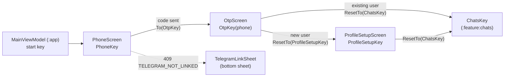

# `:feature:auth` — Sign-in & profile setup

[← Back to README](../../../README.md)

## Role

Everything a user sees before the main app: entering a phone number, typing the one-time code (OTP) delivered by the Relay Telegram bot, and — for new users — choosing a display name and username. The start screen itself is decided by `MainViewModel` in `:app` (logged out → `PhoneKey`, profile pending → `ProfileSetupKey`, logged in → `ChatsKey`).

**Depends on:** `:domain`, `:core:common`, `:core:designsystem`, `:core:navigation`. Never on `:data` or on other features.

## Screen flow



```text
MainViewModel ──► Phone ──(OTP requested)──► Otp ──(new user)──────► ProfileSetup ──► Chats
                    │                         └──(existing user)──────────────────► Chats
                    └──(409 TELEGRAM_NOT_LINKED)──► TelegramLinkSheet (open bot / resend)
```

## Pattern

Each screen is a **Contract + ViewModel + Screen + DirectionsImpl** quartet (Orbit MVI). The Screen sends `Intent`s to `onEventDispatcher`, the ViewModel reduces `UiState` and posts one-shot `SideEffect`s, and navigation goes through `Contract.Directions` → `AppNavigator`. See the README section [End-to-End Execution Flow](../../../README.md#5-end-to-end-execution-flow) for the full explanation.

## Screens

| Screen (NavKey) | Intents | UiState | SideEffects | Directions → target | Use cases |
|---|---|---|---|---|---|
| **Phone** (`PhoneKey`) | `OnPhoneChange`, `OnGetCode`, `OnOpenBot`, `OnResendCode`, `OnDismissTelegramSheet` | `digits`, `loading`, `botUrl` (set on 409 `TELEGRAM_NOT_LINKED`); derived `continueEnabled` (9 digits) | `ShowError`, `OpenUrl` | `navigateToOtp` → `To(OtpKey(phone))` | `RequestOtpUseCase` |
| **Otp** (`OtpKey(phone)`, assisted ViewModel) | `OnCodeChange`, `OnResendCode`, `OnBack` | `phone`, `codeLength` (6), `code`, `status` (`Input` / `Wrong(attemptsLeft)` / `Expired` / `Locked`), `verifying`, `resending`, `secondsLeft` (60 s timer); derived `inputEnabled` | `ShowError`, `Shake` | `back`; `navigateToProfileSetup` → `ResetTo(ProfileSetupKey)`; `navigateToChats` → `ResetTo(ChatsKey)` | `RequestOtpUseCase`, `VerifyOtpUseCase` |
| **ProfileSetup** (`ProfileSetupKey`) | `OnNameChange`, `OnUsernameChange`, `OnSuggestionClick`, `OnContinue` | `name`, `username`, `usernameTaken`, `suggestions`, `saving`; derived `nameValid`, `usernameValid`, `continueEnabled` (rules from `ProfileRules`) | `ShowError` | `navigateToChats` → `ResetTo(ChatsKey)` | `UpdateProfileUseCase`, `CompleteProfileSetupUseCase` |

**Notable behaviour**

- **Phone:** the field keeps digits only (max 9); `+998` is shown as a fixed prefix and spaces are added visually by `LocalPhoneTransformation`. If the server answers `409 TELEGRAM_NOT_LINKED` it includes the bot URL — the screen opens `TelegramLinkSheet` instead of a snackbar.
- **Otp:** verification starts automatically when the 6th digit is typed. `INVALID_OTP` decrements attempts (max 5) and shakes the cells; the 5th wrong code, or `OTP_LOCKED`, switches to `Locked`; `OTP_EXPIRED` switches to `Expired`. "Resend" restarts the 60-second timer and gives 5 new attempts.
- **ProfileSetup:** username input is filtered to `a–z A–Z 0–9 _` (max 32). On `409 USERNAME_TAKEN` the screen offers two suggestions (`<name>_dev`, `<name>01`). The rules hint appears only when the input is invalid.

## Components

| File | Purpose |
|---|---|
| `otp/components/OtpCodeInput.kt` | Six OTP cells over a hidden text field; plays a shake animation when the ViewModel posts `Shake`. |
| `phone/components/TelegramLinkSheet.kt` | Bottom sheet with numbered steps to link the phone number to the Telegram bot, "Open bot" and "Resend code" buttons. |
| `profile/components/AvatarPicker.kt` | Round avatar placeholder with camera icon and "+" badge. **Visual only — photo upload is not implemented yet.** |

## Utilities

| File | Contents |
|---|---|
| `util/ErrorMessage.kt` | `AppError.messageRes()` → string resource (no internet, rate limited / 429, OTP delivery unavailable, unknown). |
| `util/PhoneFormat.kt` | `UZ_PREFIX = "+998"`, `UZ_PHONE_DIGITS = 9`, `formatLocalPhone`, `formatFullPhone`, `LocalPhoneTransformation` (VisualTransformation with offset mapping). |

## All files (19)

Paths are relative to `feature/auth/src/main/java/uz/relay/feature/auth/`.

| File | Class(es) | Responsibility | Depends on / used by |
|---|---|---|---|
| `AuthEntries.kt` | `authEntries()` | Registers Phone, Otp and ProfileSetup screens for their NavKeys. | Called by `AppNavHost` (`:app`) |
| `di/AuthDirectionsModule.kt` | `AuthDirectionsModule` | Hilt `@Binds` of the three `DirectionsImpl` classes to their `Contract.Directions`. | Hilt `ViewModelComponent` |
| `phone/PhoneContract.kt` | `PhoneContract` (Intent, SideEffect, UiState, Directions) | Contract of the phone-entry screen. | Screen, ViewModel |
| `phone/PhoneViewModel.kt` | `PhoneViewModel` | Validates digits, requests the OTP, handles the Telegram-not-linked case. | `RequestOtpUseCase`, `PhoneContract.Directions` |
| `phone/PhoneScreen.kt` | `PhoneScreen`, `PhoneScreenContent` | Stateful screen (snackbar, opens bot URL) + stateless content used by previews/tests. | `PhoneViewModel`, `TelegramLinkSheet` |
| `phone/PhoneDirectionsImpl.kt` | `PhoneDirectionsImpl` | Navigates to `OtpKey(phone)`. | `AppNavigator` |
| `phone/components/TelegramLinkSheet.kt` | `TelegramLinkSheet` | Telegram bot linking sheet. | `PhoneScreen` |
| `otp/OtpContract.kt` | `OtpContract` (+ `Status`, `MAX_ATTEMPTS`, `RESEND_SECONDS`) | Contract of the code screen. | Screen, ViewModel |
| `otp/OtpViewModel.kt` | `OtpViewModel` (assisted `phone`) | Verifies the code, counts attempts, resend timer, routes new/existing user. | `RequestOtpUseCase`, `VerifyOtpUseCase` |
| `otp/OtpScreen.kt` | `OtpScreen`, `OtpScreenContent`, status rows, locked card, resend timer | OTP UI; forwards `Shake` side effects to the code input. | `OtpViewModel`, `OtpCodeInput` |
| `otp/OtpDirectionsImpl.kt` | `OtpDirectionsImpl` | Back; `ResetTo` ProfileSetup or Chats. | `AppNavigator` |
| `otp/components/OtpCodeInput.kt` | `OtpCodeInput` | 6-cell code input with shake animation. | `OtpScreen` |
| `profile/ProfileSetupContract.kt` | `ProfileSetupContract` | Contract of the name/username form. | Screen, ViewModel |
| `profile/ProfileSetupViewModel.kt` | `ProfileSetupViewModel` | Filters input, saves profile, suggests usernames on 409, completes setup. | `UpdateProfileUseCase`, `CompleteProfileSetupUseCase` |
| `profile/ProfileSetupScreen.kt` | `ProfileSetupScreen`, `ProfileSetupScreenContent`, `SuggestionChip` | Profile setup UI. | `ProfileSetupViewModel`, `AvatarPicker` |
| `profile/ProfileSetupDirectionsImpl.kt` | `ProfileSetupDirectionsImpl` | `ResetTo(ChatsKey)`. | `AppNavigator` |
| `profile/components/AvatarPicker.kt` | `AvatarPicker` | Avatar placeholder (visual only). | `ProfileSetupScreen` |
| `util/ErrorMessage.kt` | `messageRes()` | Error → localized message. | Screens |
| `util/PhoneFormat.kt` | phone helpers | `+998` formatting and visual transformation. | `PhoneScreen`, `OtpScreen` |

## Resources

`res/values/strings.xml` (Uzbek, default), `values-ru/strings.xml`, `values-en/strings.xml`. Includes plurals for "N attempts left" (Russian has `few`/`many` forms).

## Tests

| Kind | Classes |
|---|---|
| ViewModel (orbit-test + fakes) | `PhoneViewModelTest`, `OtpViewModelTest`, `ProfileSetupViewModelTest` |
| Compose UI (Robolectric) | `PhoneScreenTest`, `OtpScreenTest`, `ProfileSetupScreenTest` |
| Screenshot (Roborazzi) | `AuthScreenshotTest` — phone, wrong OTP, taken username; light & dark |
