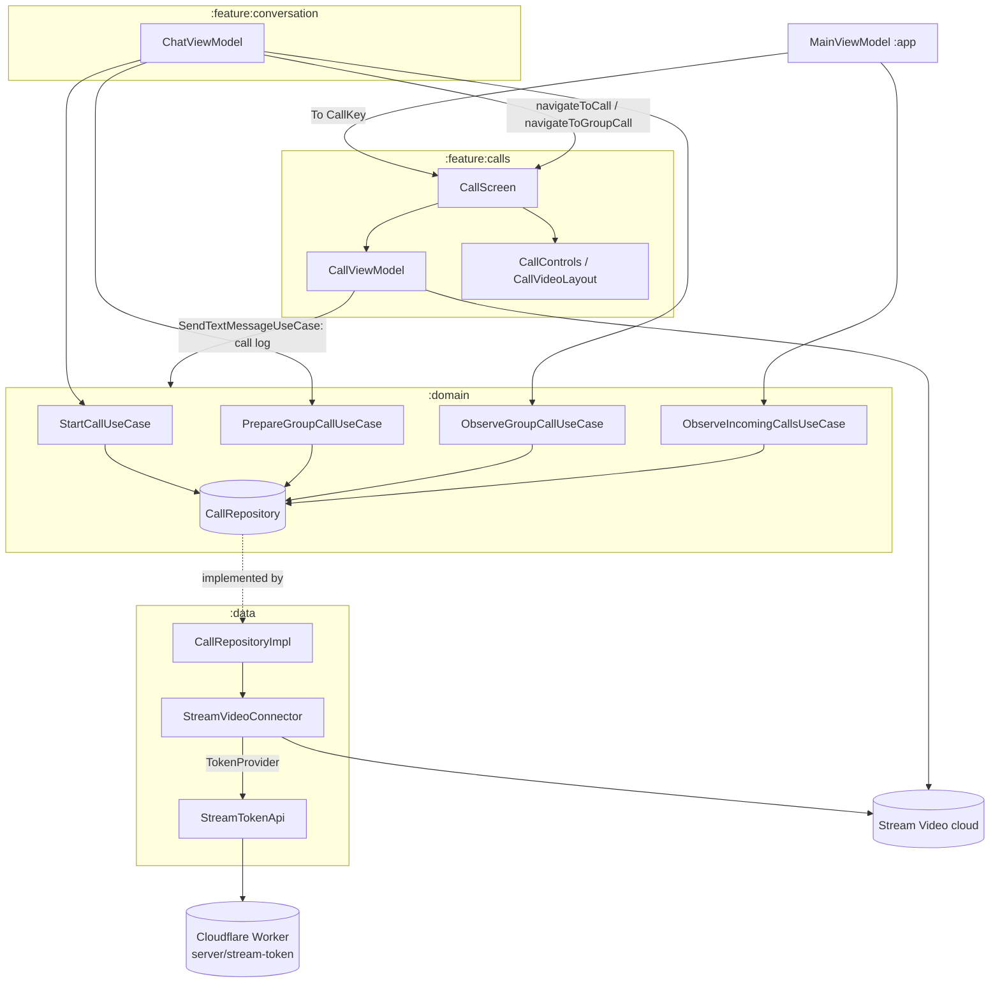
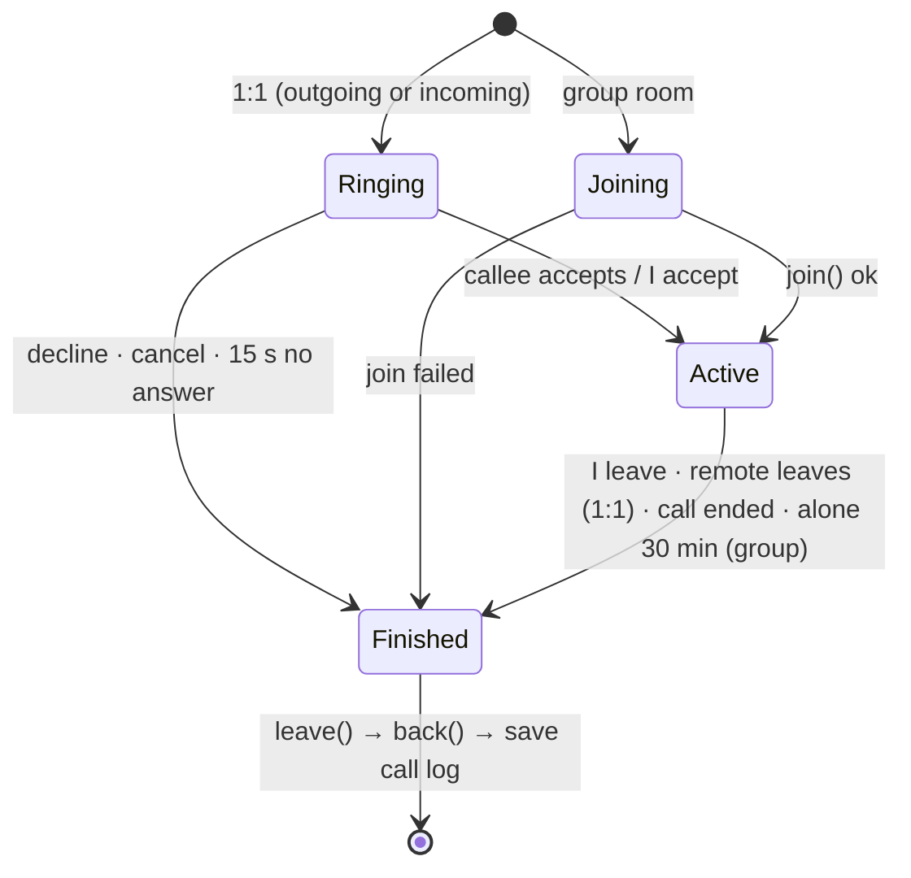
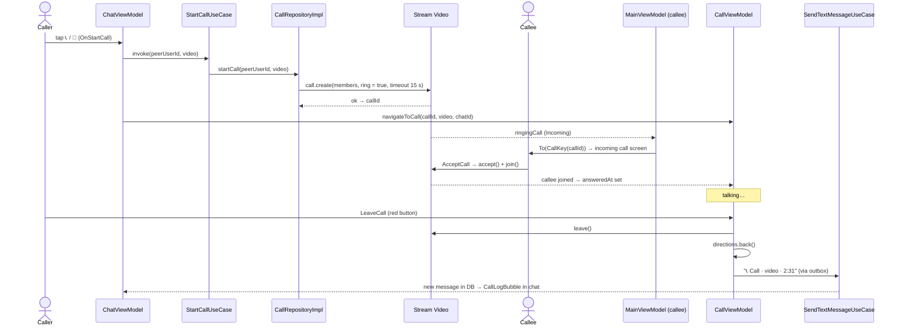

# `:feature:calls` — Audio and video calls

[← Back to README](../../../README.md)

The Relay server has **no calling, signalling or call push**, and its API cannot change. Calls are therefore built on **[Stream Video](https://getstream.io/video/)** (Android SDK 1.35):

- Stream user id = Relay `userId`, display name = Relay `displayName`.
- No separate sign-up is needed.
- Stream types never leave `:data` (`CallRepositoryImpl`, `StreamVideoConnector`) and this module.

| | |
|---|---|
| Module type | Android library (Compose, Hilt, KSP) |
| Depends on | `:domain`, `:core:common`, `:core:designsystem`, `:core:navigation`, Stream Video Compose + video filters |
| Screens | 1 (`CallScreen`) handling 1:1 calls (ringing) **and** group video chats (open room) |
| Source files | 9 Kotlin files |

Features:
- 1:1 audio and video calls with ringing and a 15 s no-answer timeout;
- Telegram-style **group video chat** that anyone in the group can join;
- full-screen video;
- **Picture-in-Picture**;
- emoji **reactions**;
- **raise hand**;
- **screen sharing**;
- **background blur / virtual backgrounds** (ML Kit);
- call history saved in the chat.

> Without FCM, calls ring only while the app is open or was recently in the background. Ringing a closed app needs Firebase push, which is planned and not implemented yet.

---

## 1. How the pieces fit



```text
ChatViewModel ─► StartCall/PrepareGroupCall/ObserveGroupCall UseCase ─► CallRepository
                                                          (impl: CallRepositoryImpl ─► StreamVideoConnector)
StreamVideoConnector ─TokenProvider─► StreamTokenApi ─► Cloudflare Worker ─► Relay /v1/users/me
MainViewModel ─ incoming call ─► To(CallKey) ─► CallScreen ─► CallViewModel ─► Stream Call
CallViewModel ─ finish() ─► SendTextMessageUseCase ("📞 Call · audio · 2:31" in the chat)
```

### Data-layer side (details in [data.md](data.md))

| Class | Role |
|---|---|
| `StreamVideoConnector` | Started from `App.onCreate`. When the Relay user is logged in it builds the Stream client, fetching the **first token from the token server** with 5 retries and backoff. Later tokens are refreshed by the SDK through a `TokenProvider`. On logout it disconnects. A release build with no token URL keeps calls disabled. |
| `CallRepositoryImpl` | `startCall` creates a `default` call with a random UUID and `ring = true`, with 15 s auto-cancel and incoming timeout. `observeIncomingCalls` emits ringing, not-yet-accepted calls. `prepareGroupCall` creates or gets the room `group_<chatId>` with `ring = false`. `observeGroupCall` reports the live participant count, re-polled every 30 s. |
| `server/stream-token` | Cloudflare Worker. Checks the Relay token through `/v1/users/me` and signs a 1-hour HS256 JWT. The Stream secret never ships in the APK. |

---

## 2. Screen contract

| Element | Values |
|---|---|
| NavKey | `CallKey(callId, video?, chatId?, group = false)`. `chatId` is set only for the caller (1:1) or for group rooms. |
| Intents | `OnCallAction(CallAction)` (Stream accept/decline/cancel/leave/mic/camera/…), `OnBack`, `OnFinished`, `OnSendReaction(emoji)`, `OnToggleHand`, `OnScreenSharePrepare`, `OnStartScreenShare(Intent?)`, `OnStopScreenShare`, `OnSelectBackground(CallBackground)` |
| UiState | `isVideo`, `isGroup`, `unavailable` (no Stream client), `raisedHands` (userId → name), `myHandRaised`, `background` |
| SideEffects | `ShowError(AppError)`, `NoAnswer` |
| Directions | `back()` → `AppNavigationParam.Back` |
| Use cases | `SendTextMessageUseCase` (call history). Everything else talks to the Stream `Call` object held by the ViewModel. |

The Stream `Call` object is kept **in the ViewModel**, not in a composable. A rotation or configuration change therefore does not drop the call.

---

## 3. `CallViewModel` lifecycle



| Concern | 1:1 call | Group video chat |
|---|---|---|
| Start | `RingingCallContent`; caller waits, callee accepts or declines | joins immediately (`call.join()`), no ringing |
| No answer | after 15 s plus 2 s grace: `reject(Cancel)`, `SideEffect.NoAnswer`, log `MISSED` | — |
| Remote leaves | call ends for me too (`observeEnd`) | room stays open |
| Ended by server / idle | `observeCallClosed`: `endedAt` set, or ringing state back to Idle after being live | only `endedAt` |
| Alone | — | closes automatically after **30 min** alone (`watchAloneInGroup`; the timer resets when someone joins) |
| Duration | from the moment the remote joined | from the room session `startedAt` |
| Call log in chat | **caller only** (`chatId != null`): `📞 Call · audio · 2:31` / `… missed/declined/canceled` | "Video chat started" is sent by `ChatViewModel`; **the last person to leave** sends `📞 Group call · video · 12:34` |

**`finish()`** runs exactly once:
1. Calls `leave()` on the main thread (errors ignored).
2. Calls `directions.back()`, so the screen always closes and never stays black.
3. Saves the call log under `NonCancellable`, so it survives the ViewModel being cleared.

`onCleared()` also calls `leave()` if `finish()` never ran.

**Back button** (`backAction`): incoming → decline, outgoing → cancel, active → leave.

### Extras

| Feature | How |
|---|---|
| Reactions 👍❤️😂😮👏🎉 | `call.sendReaction("reaction", emoji)`. Stream animates them on the sender's tile. Positioned below the top bar by a custom `Alignment` (no `offset`). |
| Raise hand | custom event `{type: "raise_hand", raised}` via `sendCustomEvent`. The local state flips optimistically and rolls back on failure. Others see "✋ Name" under the top bar. A hand disappears when its owner leaves. |
| Screen sharing | `MediaProjection` permission, then `call.startScreenSharing(data)`. Camera and mic state are saved before the system dialog and restored after it. PiP is paused while the dialog is open. The shared screen fills the view and cameras show as side tiles, the sharer first. |
| Background | `NONE`, `BLUR` (`BlurredBackgroundVideoFilter`) or an image `BRAND / SUNSET / NIGHT / NATURE` (`VirtualBackgroundVideoFilter`). Applied to **my camera only**. The images are bundled webp files of about 5–10 KB each. |
| Picture-in-Picture | Home or Back during a video call shows a small window. The overlays are hidden in PiP. If the call ends while in PiP, the app moves to the background (`moveTaskToBack`) instead of showing a chat in the PiP window. |
| Permissions | asked when the screen opens: `RECORD_AUDIO`, `CAMERA` (video only), `BLUETOOTH_CONNECT` (Android 12+). If refused, the call continues with that track off. |

---

## 4. `CallScreen` structure

```text
CallScreen
├─ BackHandler → OnBack
├─ unavailable? → "Calls are unavailable right now"
└─ CallPermissions + VideoTheme(brand colour)
   ├─ group  → FullScreenVideoCall (after permission dialog settles)
   └─ 1:1    → RingingCallContent
               ├─ accepted & video → FullScreenVideoCall
               ├─ accepted & audio → AudioCallContent + CallControls
               └─ rejected / no answer / idle → OnFinished
FullScreenVideoCall = Stream CallContent (videoContent = CallVideoContent, PiP config)
                      + top overlay (CallTopBar, RaisedHandsChip)
                      + bottom overlay (CallControls + MorePanel: reactions · raise hand · share · background)
```

Controls:
- **Video:** Camera · Flip · Mic · More · End.
- **Audio:** Mic · Speaker · End.

An "off" control is drawn inverted (white circle, black icon). The End button is a red 64 dp circle with a hang-up icon.

---

## 5. Outgoing 1:1 call: end to end



---

## 6. Every file in `:feature:calls` (src/main)

| File | Class(es) | Responsibility | Depends on / used by |
|---|---|---|---|
| `uz/relay/feature/calls/CallsEntries.kt` | `callsEntries()` | registers `entry<CallKey>` → `CallScreen` | called from `AppNavHost` |
| `uz/relay/feature/calls/di/CallsDirectionsModule.kt` | `CallsDirectionsModule` | Hilt `@Binds CallDirectionsImpl → CallContract.Directions` | ViewModelComponent |
| `uz/relay/feature/calls/call/CallContract.kt` | `CallContract` (Intent, SideEffect, UiState, Directions), `CallBackground` | screen contract and background options | `CallViewModel`, `CallScreen` |
| `uz/relay/feature/calls/call/CallViewModel.kt` | `CallViewModel` (+ assisted `Factory`) | Stream call lifecycle: accept/decline/cancel/leave, ring timeout, group join and alone-timeout, call log, raise hand, reactions, screen share, background filters | Stream `Call`, `SendTextMessageUseCase`, `CallContract.Directions` |
| `uz/relay/feature/calls/call/CallScreen.kt` | `CallScreen`, `CallContentHost`, `FullScreenVideoCall`, `rememberScreenShareLauncher`, `CallPermissions` | call UI host: ringing vs active, full-screen video, PiP, screen-share permission flow, runtime permissions | `CallViewModel`, Stream Compose UI, components |
| `uz/relay/feature/calls/call/CallDirectionsImpl.kt` | `CallDirectionsImpl` | `back()` → `AppNavigator.navigate(Back)` | `AppNavigator` |
| `uz/relay/feature/calls/call/CallBackgroundRes.kt` | `imageResOrNull()`, `imageRes()` | maps `CallBackground` to bundled `drawable-nodpi/call_bg_*` images | `CallViewModel`, `CallControls` |
| `uz/relay/feature/calls/call/components/CallControls.kt` | `CallControls`, `CallExtras`, `MorePanel`, `BackgroundRow`, `PillButton`, `RaisedHandsChip`, `CallTopBar`, `ControlButton` | bottom control bar, "More" panel (reactions, hand, share, background), top bar with name or "Video chat" and duration | `CallScreen` |
| `uz/relay/feature/calls/call/components/CallVideoLayout.kt` | `CallVideoContent`, `ScreenShareWithCameras`, `MyFloatingVideo`, `rememberBelowTopBarAlignment` | video area: participant grid, floating self view, screen-share layout; keeps reactions and the self view below the overlaid top bar | Stream `ParticipantsLayout`, `ParticipantVideo`, `ScreenShareVideoRenderer` |

Resources:
- strings in `values` (uz), `values-ru`, `values-en`;
- 4 background images in `drawable-nodpi`.

File count check: `find feature/calls/src/main -name '*.kt'` returns **9**.

---

## 7. Tests

| Test class | Type | What it checks |
|---|---|---|
| `CallViewModelTest` | Robolectric + Orbit Test (4) | Without a Stream client the screen is marked unavailable; any action closes it and no call log is written; group calls are always video; audio calls stay audio |
| `CallBackgroundResTest` | JVM (3) | `NONE`/`BLUR` have no image; every image background maps to its own drawable; `imageRes()` on a non-image background fails |

Paths that drive a live Stream `Call` (accept, ring timeout, leave, call-log text, raise hand, screen share) need a Stream test double and are verified on real devices. The call-log text format itself is covered by `CallLogFormatTest` in `:domain`.
