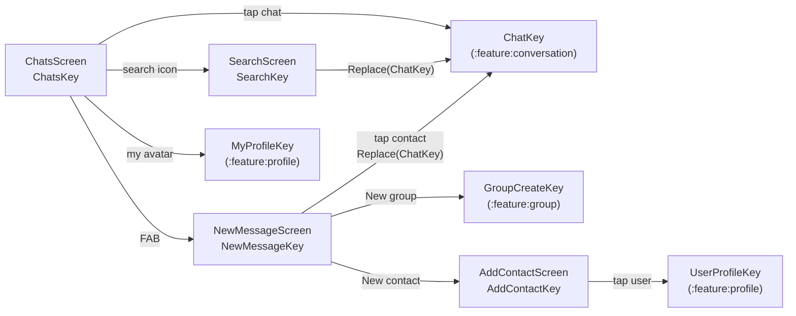

# `:feature:chats` — Chat list, search, new message & contacts

[← Back to README](../../../README.md)

## Role

The home of the app after sign-in: the chat list with **All / Direct / Groups** tabs, global search (users on the server + local chats by title), the "New message" screen (new group, new contact, contacts list) and adding a contact by username. Contacts are a **local, device-only list** (Relay has no contacts endpoint).

**Depends on:** `:domain`, `:core:common`, `:core:designsystem`, `:core:navigation`. Opens other features only through NavKeys (`ChatKey`, `GroupCreateKey`, `UserProfileKey`, `MyProfileKey`).

## Screen flow



```text
Chats ──search──► Search ──user/chat──► Chat (Replace)
  │──FAB──► NewMessage ──New group──► GroupCreate
  │            │──New contact──► AddContact ──tap user──► UserProfile
  │            └──tap contact──► Chat (Replace)
  │──my avatar──► MyProfile
  └──tap chat──► Chat
```

## Pattern

Contract + ViewModel + Screen + DirectionsImpl (Orbit MVI). Search screens use a common debounce pattern: the text is updated synchronously with `blockingIntent`, the previous search job is cancelled, and the server request starts after **300 ms** of no typing. See [README → End-to-End Execution Flow](../../../README.md#5-end-to-end-execution-flow).

## Screens

| Screen (NavKey) | Intents | UiState | SideEffects | Directions → target | Use cases |
|---|---|---|---|---|---|
| **Chats** (`ChatsKey`) | `OnRetrySync`, `OnChatClick`, `OnSearchClick`, `OnNewMessageClick`, `OnMyProfileClick`, `OnMute(chatId, MuteDuration)`, `OnUnmute` | `chats`, `userNames`, `me`, `connectionStatus`, `typing` (chatId → users, me excluded), `isBootstrapped`; derived `showSkeleton`, `showEmpty`, `chatsFor(tab)`, `unreadChatsIn(tab)` | `ShowError` (retryable only; snackbar with **Retry**), `ShowActionError` | `navigateToChat` → `To(ChatKey)`; `navigateToSearch` → `To(SearchKey)`; `navigateToNewMessage` → `To(NewMessageKey)`; `navigateToMyProfile` → `To(MyProfileKey)` | `ObserveChats`, `ObserveSyncStatus`, `ObserveUserNames`, `ObserveMe`, `ObserveConnectionStatus`, `ObserveTyping`, `RefreshChats`, `RefreshMe`, `SetChatMuted` |
| **Search** (`SearchKey`) | `OnQueryChange`, `OnClear`, `OnBack`, `OnChatClick`, `OnUserClick` | `query`, `results` (users), `chatResults` (local, by title, instant), `searchedQuery`, `isSearching`, `openingUserId`; derived `normalizedQuery` (trim, strip `@`), `showNothingFound` | `ShowError` | `back`; `navigateToChat` → `Replace(ChatKey)` | `SearchUsers`, `OpenDirectChat`, `ObserveChats` |
| **NewMessage** (`NewMessageKey`) | `OnBack`, `OnNewGroup`, `OnNewContact`, `OnContactClick`, `OnRemoveContact` | `contacts`, `isLoaded`, `openingUserId` | `ShowError` | `back`; `navigateToGroupCreate` → `To(GroupCreateKey())`; `navigateToAddContact` → `To(AddContactKey)`; `navigateToChat` → `Replace(ChatKey)` | `ObserveContacts`, `RemoveContact`, `OpenDirectChat` |
| **AddContact** (`AddContactKey`) | `OnQueryChange`, `OnClear`, `OnBack`, `OnAdd(user)`, `OnUserClick` | `query`, `results`, `searchedQuery`, `isSearching`, `contactIds`, `addingUserId`; derived `normalizedQuery`, `showNothingFound` | `ShowError`, `Added(name)` | `back`; `navigateToUserProfile` → `To(UserProfileKey)` | `SearchUsers`, `AddContact`, `ObserveContactIds` |

**Notable behaviour**

- **Chats** combines six database flows into one `UiState`, so the list updates by itself when a message arrives over the WebSocket. `ChatTab` (`ALL`, `DIRECT`, `GROUPS`) is a pure filter; tabs are a `HorizontalPager` (swipe like Telegram) with an unread-chats counter per tab. Skeleton rows are shown until the first sync (`isBootstrapped`).
- **Mute:** long-press a chat → `MuteSheet` (1 h / 8 h / 1 day / forever, or unmute). The duration is converted to an absolute end time in `SetChatMutedUseCase`.
- **Search** results open the chat with `Replace`, so "Back" from the chat returns to the list, not to search.
- **NewMessage:** removing a contact needs a long-press and a confirmation dialog.

## Components

| File | Purpose |
|---|---|
| `list/components/ChatRow.kt` | 76 dp chat row: avatar with online dot, name, mute/group icons, time, preview, unread badge, delivery status (✓/✓✓). |
| `list/components/ChatsTabs.kt` | All / Direct / Groups tabs with indicator and per-tab unread count. |
| `list/components/ChatsTopBar.kt` | App bar: logo + "SwiftChat" (or "Updating…" / "Connecting…"), search button, my avatar. |
| `list/components/EmptyChats.kt` | Empty state with a "New chat" button. |
| `list/components/MuteSheet.kt` | Long-press bottom sheet: mute durations or unmute. |

## Utilities

| File | Contents |
|---|---|
| `util/ChatPreviewText.kt` | `buildChatPreview(...)` → `AnnotatedString` for the preview line: italic "deleted", SYSTEM events as sentences, call logs with 📞/🎥, "You:" / "Name:" prefixes, coloured Photo / Video / File labels. |
| `util/ChatTime.kt` | `formatChatTime` (HH:mm today, "Yesterday", weekday within 7 days, dd.MM), `formatMuteUntil`. |
| `util/ErrorMessage.kt` | `AppError.messageRes()` (no internet, rate limited, unknown). |

## All files (26)

Paths are relative to `feature/chats/src/main/java/uz/relay/feature/chats/`.

| File | Class(es) | Responsibility | Depends on / used by |
|---|---|---|---|
| `ChatsEntries.kt` | `chatsEntries()` | Registers Chats, Search, NewMessage, AddContact. | `AppNavHost` |
| `di/ChatsDirectionsModule.kt` | `ChatsDirectionsModule` | Binds 4 `DirectionsImpl` classes. | Hilt |
| `list/ChatsContract.kt` | `ChatsContract`, `ChatTab` | Chat list contract and tab filter. | Screen, ViewModel |
| `list/ChatsViewModel.kt` | `ChatsViewModel` | Combines DB flows, starts sync, mute/unmute, navigation. | 9 use cases (see table) |
| `list/ChatsScreen.kt` | `ChatsScreen`, `ChatsScreenContent`, pager | List UI, retry snackbar, skeleton, FAB, mute sheet host. | `ChatsViewModel`, components |
| `list/ChatsDirectionsImpl.kt` | `ChatsDirectionsImpl` | To Chat / Search / NewMessage / MyProfile. | `AppNavigator` |
| `list/components/ChatRow.kt` | `ChatRow` | One chat row. | `ChatsScreen` |
| `list/components/ChatsTabs.kt` | `ChatsTabs` | Tab row. | `ChatsScreen` |
| `list/components/ChatsTopBar.kt` | `ChatsTopBar` | Top bar with connection state. | `ChatsScreen` |
| `list/components/EmptyChats.kt` | `EmptyChats` | Empty state. | `ChatsScreen` |
| `list/components/MuteSheet.kt` | `MuteSheet` | Mute options sheet. | `ChatsScreen` |
| `search/SearchContract.kt` | `SearchContract` | User + local chat search contract. | Screen, ViewModel |
| `search/SearchViewModel.kt` | `SearchViewModel` | Debounced server search, instant local chat match, open direct chat. | `SearchUsers`, `OpenDirectChat`, `ObserveChats` |
| `search/SearchScreen.kt` | `SearchScreen`, `SearchScreenContent`, `SectionLabel`, rows | Search UI. | `SearchViewModel` |
| `search/SearchDirectionsImpl.kt` | `SearchDirectionsImpl` | Back; `Replace(ChatKey)`. | `AppNavigator` |
| `newmessage/NewMessageContract.kt` | `NewMessageContract` | New message contract. | Screen, ViewModel |
| `newmessage/NewMessageViewModel.kt` | `NewMessageViewModel` | Observes contacts, removes contact, opens direct chat. | `ObserveContacts`, `RemoveContact`, `OpenDirectChat` |
| `newmessage/NewMessageScreen.kt` | `NewMessageScreen`, `NewMessageContent` | Action rows, contacts, remove dialog. | `NewMessageViewModel` |
| `newmessage/NewMessageDirectionsImpl.kt` | `NewMessageDirectionsImpl` | Back, GroupCreate, AddContact, `Replace(ChatKey)`. | `AppNavigator` |
| `addcontact/AddContactContract.kt` | `AddContactContract` | Add-by-username contract. | Screen, ViewModel |
| `addcontact/AddContactViewModel.kt` | `AddContactViewModel` | Debounced search, add contact. | `SearchUsers`, `AddContact`, `ObserveContactIds` |
| `addcontact/AddContactScreen.kt` | `AddContactScreen`, `AddContactContent` | Results with "Add" pill or ✓ "in contacts". | `AddContactViewModel` |
| `addcontact/AddContactDirectionsImpl.kt` | `AddContactDirectionsImpl` | Back; UserProfile. | `AppNavigator` |
| `util/ChatPreviewText.kt` | `buildChatPreview`, `PreviewColors` | Preview line builder. | `ChatRow` |
| `util/ChatTime.kt` | `formatChatTime`, `formatMuteUntil` | Time formatting. | `ChatRow`, `MuteSheet` |
| `util/ErrorMessage.kt` | `messageRes()` | Error → message. | Screens |

## Resources

`values` (Uzbek, default), `values-ru`, `values-en` — tab names, weekdays, preview prefixes, mute options, system-event sentences.

## Tests

| Kind | Classes |
|---|---|
| ViewModel | `ChatsViewModelTest`, `SearchViewModelTest`, `NewMessageViewModelTest`, `AddContactViewModelTest` |
| Compose UI | `ChatsScreenTest`, `NewMessageScreenTest`, `AddContactScreenTest` |
| Screenshot | `ChatsScreenshotTest` — list, empty state, new message; light & dark |
