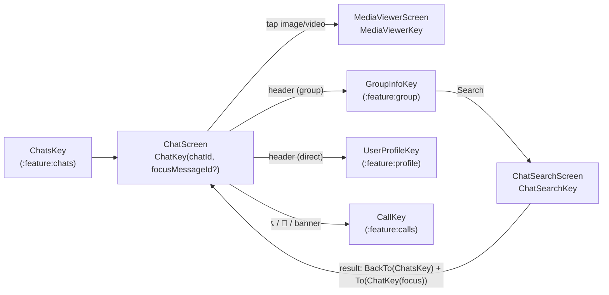
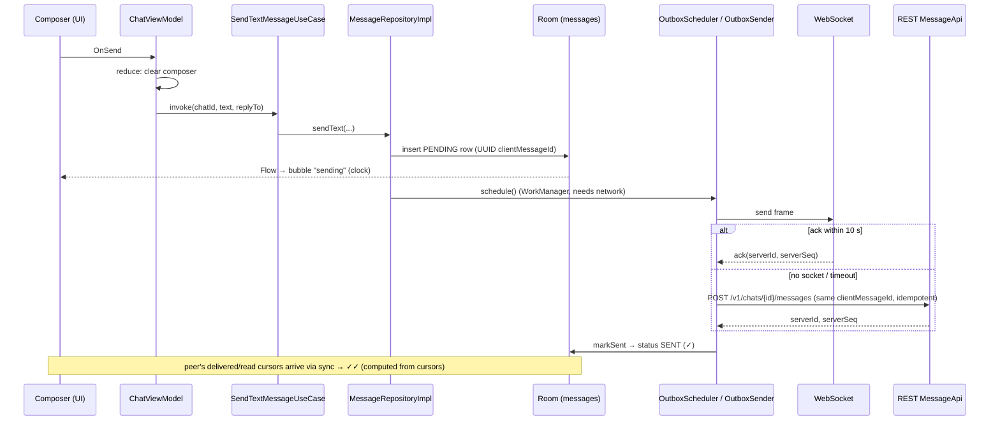

# `:feature:conversation` — Chat screen, in-chat search & media viewer

[← Back to README](../../../README.md)

## Role

The conversation itself: the message list, the composer (text, reply, edit, attachments), message actions (reply, edit, copy, delete, retry), read receipts, history paging, typing indicator, call buttons and the group video-chat banner. It also contains **in-chat search** (local) and the full-screen **media viewer** (zoomable images, video player, save to gallery).

The chat is **offline-first**: the screen only *observes* the local Room database. Sent messages appear immediately as "sending", and everything that arrives over the network is written to the database first and flows to the screen from there.

**Depends on:** `:domain`, `:core:common`, `:core:designsystem`, `:core:navigation`. Opens `GroupInfoKey`, `UserProfileKey` and `CallKey` through NavKeys.

## Screen flow



```text
Chats ──► Chat ──tap media──► MediaViewer
           │──header (group)──► GroupInfo ──Search──► ChatSearch ──result──► Chat (scrolls to message)
           │──header (direct)──► UserProfile
           └──📞/🎥/banner──► Call
```

## Pattern

Contract + ViewModel + Screen + DirectionsImpl (Orbit MVI). The three ViewModels need a runtime argument, so they use Hilt **assisted injection** (`@AssistedInject` + factory). See [README → End-to-End Execution Flow](../../../README.md#5-end-to-end-execution-flow).

## Screens

| Screen (NavKey) | Intents | UiState | SideEffects | Directions → target | Use cases |
|---|---|---|---|---|---|
| **Chat** (`ChatKey(chatId, focusMessageId?)`) | `OnBack`, `OnTextChange`, `OnSend`, `OnReply`, `OnEdit`, `OnCancelComposerMode`, `OnDelete`, `OnRetry`, `OnLoadOlder`, `OnBottomVisible`, `OnOpenInfo`, `OnAttach(Attachment)`, `OnCancelUpload`, `OnMediaClick`, `OnStartCall(video)`, `OnGroupCall` | `chat`, `items: List<ChatItem>`, `userNames`, `myUserId`, `typingUserIds`, `composerText`, `composerMode` (`None`/`Reply`/`Edit`), `hasMore`, `isLoadingOlder`, `memberCount`, `myRole`, `fileDownloads` (id → 0..1), `isPreparingMedia`, `isStartingCall`, `groupCallCount`, `memberIds`; derived `isGroup`, `canSend`, `canDeleteOthers` | `ShowError` (HTTP 401 suppressed), `OpenFile(path, mime)` | `back`; `navigateToGroupInfo`; `navigateToUserProfile`; `navigateToMediaViewer`; `navigateToCall` → `CallKey(callId, video, chatId)`; `navigateToGroupCall` → `CallKey(…, group = true)` | `ObserveMessages`, `ObserveChat`, `ObserveUserNames`, `ObserveMe`, `ObserveTyping`, `LoadLatestMessages`, `LoadOlderMessages`, `SendTextMessage`, `RetryMessage`, `EditMessage`, `DeleteMessage`, `SendTyping`, `MarkChatRead`, `ObserveMembers`, `RefreshMembers`, `SendMediaMessage`, `CancelUpload`, `DownloadMedia`, `StartCall`, `PrepareGroupCall`, `ObserveGroupCall` |
| **ChatSearch** (`ChatSearchKey(chatId)`) | `OnBack`, `OnQueryChange`, `OnClear`, `OnResultClick` | `query`, `results: List<Message>`, `searchedQuery`, `userNames`; derived `showNothingFound` | — | `back`; `openMessage` → `BackTo(ChatsKey)` then `To(ChatKey(chatId, focusMessageId))` | `SearchMessages`, `ObserveUserNames` |
| **MediaViewer** (`MediaViewerKey(chatId, clientMessageId)`) | `OnBack`, `OnPageChange(index)`, `OnSave(ViewerItem)` | `items: List<ViewerItem>`, `initialIndex`, `userNames`, `myUserId` | `Saved`, `ShowError` | `back` | `ObserveMessages`, `ObserveUserNames`, `ObserveMe`, `SaveMediaToGallery` (+ media `DataSource.Factory` for ExoPlayer) |

Message action rules live in `ChatContract.kt`: `canEdit()` (own text message, delivered to server, under 48 h, not a call-log entry), `canDelete(canDeleteOthers)` (own message, or group OWNER/ADMIN), `canReply()`.

## How the chat works

| Feature | Flow |
|---|---|
| **Loading** | On open: `observeData` combines messages, chat, names, me, typing and members; `buildChatItems` turns messages into list items (date separators, sender name on the first message of a run, avatar on the last). `loadLatest` fetches the newest page from the server in parallel. In a group, members are refreshed once and the group-call room is watched. |
| **Send text** | `OnSend` clears the composer immediately and calls `SendTextMessageUseCase`. The repository inserts a **PENDING** row (UUID `clientMessageId`) and schedules the outbox — the bubble shows "sending" without waiting for the network, also offline. |
| **Send media** | `OnAttach` (gallery via Photo Picker, camera, file — no runtime permissions). The composer text becomes the caption (not for files). `isPreparingMedia` blocks double sends while the file is copied and hashed. Upload progress is shown in the bubble; it can be cancelled. |
| **Reply / edit / delete** | Long-press opens `MessageMenuOverlay` (dimmed background, lifted bubble). Reply/Edit switch `composerMode`; edit calls `EditMessageUseCase`. Delete asks for confirmation; the server sends back a tombstone through sync. Cancelling *edit* clears the text, cancelling *reply* keeps it. |
| **Retry** | A failed outgoing message shows a red button → `RetryMessageUseCase`. |
| **Read receipts** | When the newest message is visible, the screen sends `OnBottomVisible`; the ViewModel calls `MarkChatReadUseCase` only if the newest `serverSeq` is higher than the last one sent. |
| **History paging** | The list is reversed (newest at the bottom). When the user scrolls within 8 items of the oldest one, `OnLoadOlder` loads the previous page (guarded by `hasMore` / `isLoadingOlder`). |
| **Typing** | Every text change (not in edit mode) calls `SendTypingUseCase`; the server throttles it. Other users' typing is shown in `ChatTopBar` (priority: typing → online → last seen / member count). |
| **Files** | Images/videos open in the viewer. Files are downloaded with progress (`fileDownloads`), then `OpenFile` launches an Android app via `FileProvider`. |
| **Calls** | Direct chat: 📞/🎥 → `StartCallUseCase` → call screen. Group: 🎥, the banner or a call-log bubble → `PrepareGroupCallUseCase`; if nobody is in the room yet, a "Video chat started" entry is posted to the chat first. |
| **Group call banner** | `ObserveGroupCallUseCase` gives the number of people in the room; when > 0 the banner "Video chat · N participants · Join" appears under the header. |
| **Media viewer** | `HorizontalPager` over all media of the chat; pinch zoom up to 5× (double-tap 2.5×); one ExoPlayer owned by the ViewModel (page changes are handled on the main thread); "Save" runs a foreground worker with a notification. |
| **Chat search** | Local only (the API has no message search), 200 ms debounce, matches highlighted. Tapping a result rebuilds the stack to Chats → Chat and scrolls to that message. |

### Sending a text message



```text
Composer ─OnSend─► ChatViewModel ─► SendTextMessageUseCase ─► MessageRepositoryImpl
                                                                  │ insert PENDING ─► Room ─► UI "sending"
                                                                  └ schedule ─► OutboxSender
OutboxSender ─► WebSocket (wait ack 10 s) ──or──► REST POST (same clientMessageId)
          └──► Room: SENT (✓) ──► later: peer cursors via sync ──► DELIVERED / READ (✓✓)
```

## Components

| File | Purpose |
|---|---|
| `chat/components/AttachSheet.kt` | Gallery (Photo Picker), Camera (FileProvider file), File picker — no runtime permissions needed. |
| `chat/components/CallLogBubble.kt` | Draws call-history text messages (`📞 Call · …`) as a call bubble with title, icon, duration; also `callTitleRes`. |
| `chat/components/ChatChips.kt` | `DateChip` and `SystemChip` ("Ali created the group"). |
| `chat/components/ChatTopBar.kt` | Header: back, avatar, name, status (typing / online / last seen / members), audio & video call buttons. |
| `chat/components/Composer.kt` | Input bar: reply/edit panel, attach, text field, send/save button. |
| `chat/components/GroupCallBanner.kt` | "Video chat · N participants" with a "Join" button. |
| `chat/components/MessageBubble.kt` | Text bubble, reply quote, meta (time, edited, ✓/✓✓), dispatch to media bubbles. |
| `chat/components/MessageMedia.kt` | Image/video bubble, file bubble, upload/download progress rings, play badge. |
| `chat/components/MessageMenu.kt` | Long-press overlay: Reply, Edit, Copy, Delete. |
| `chat/components/MessageRow.kt` | Left/right alignment, group avatar slot, retry button, click / long-press handling; wrapped in `SwipeToReplyBox`. |
| `chat/components/SwipeToReply.kt` | Telegram-style swipe-left-to-reply: the row follows the finger, a ↩ icon grows at the right edge, a haptic tick at 56dp, reply on release. Only leftward drags are claimed, so swipe-right (back) and vertical scrolling keep working. |

## Utilities

| File | Contents |
|---|---|
| `chat/ChatItems.kt` | `ChatItem` (DateSeparator / System / Bubble) and the pure function `buildChatItems(messages, isGroup)`. |
| `util/ChatTimeFormat.kt` | `formatMessageTime`, `dayStartMillis`, `formatDateSeparator` (Today / Yesterday / "24 September[, 2025]"). |
| `util/MediaFormat.kt` | `formatSize`, `formatSizeProgress`, `formatDuration`, `fileTypeLabel`. |
| `util/SystemText.kt` | `systemText(...)` — group created / members added / removed / left sentences. |
| `util/ErrorMessage.kt` | `AppError.messageRes()` — no internet, file too large (413), calls unavailable, call failed, rate limited, edit window expired, forbidden, unknown. |

## All files (29)

Paths are relative to `feature/conversation/src/main/java/uz/relay/feature/conversation/`.

| File | Class(es) | Responsibility | Depends on / used by |
|---|---|---|---|
| `ConversationEntries.kt` | `conversationEntries()` | Registers Chat, ChatSearch, MediaViewer. | `AppNavHost` |
| `di/ConversationDirectionsModule.kt` | `ConversationDirectionsModule` | Binds 3 `DirectionsImpl` classes. | Hilt |
| `chat/ChatContract.kt` | `ChatContract`, `ComposerMode`, `canEdit/canDelete/canReply` | Chat contract and message action rules. | Screen, ViewModel, components |
| `chat/ChatViewModel.kt` | `ChatViewModel` (assisted `chatId`) | Messages, composer, media, receipts, paging, typing, calls. | 21 use cases (see table) |
| `chat/ChatScreen.kt` | `ChatScreen`, `ChatScreenContent` | Chat UI, overlays, scroll effects, opening files. | `ChatViewModel`, components |
| `chat/ChatDirectionsImpl.kt` | `ChatDirectionsImpl` | Back, GroupInfo, UserProfile, MediaViewer, Call, GroupCall. | `AppNavigator` |
| `chat/ChatItems.kt` | `ChatItem`, `buildChatItems` | Messages → list items. | `ChatViewModel` |
| `chat/components/AttachSheet.kt` | `AttachSheet` | Attachment picker sheet. | `ChatScreen` |
| `chat/components/CallLogBubble.kt` | `CallLogBubble`, `callTitleRes` | Call-history bubble. | `MessageBubble` |
| `chat/components/ChatChips.kt` | `DateChip`, `SystemChip` | Centered chips. | `ChatScreen` |
| `chat/components/ChatTopBar.kt` | `ChatTopBar` | Chat header. | `ChatScreen` |
| `chat/components/Composer.kt` | `Composer` | Input bar. | `ChatScreen` |
| `chat/components/GroupCallBanner.kt` | `GroupCallBanner` | Group video-chat banner. | `ChatScreen` |
| `chat/components/MessageBubble.kt` | `MessageBubble`, `ReplyQuote`, `MessageMeta` | Text bubble and meta. | `MessageRow` |
| `chat/components/MessageMedia.kt` | `VisualMessageBubble`, `FileMessageBubble` | Media bubbles. | `MessageBubble` |
| `chat/components/MessageMenu.kt` | `MenuTarget`, `MessageMenuOverlay` | Long-press menu. | `ChatScreen` |
| `chat/components/MessageRow.kt` | `MessageRow` | Row layout and gestures. | `ChatScreen` |
| `chat/components/SwipeToReply.kt` | `SwipeToReplyBox` | Swipe left to reply (graphicsLayer translation, threshold haptic). | `MessageRow`, `rememberGestureThresholdHaptic` |
| `search/ChatSearchContract.kt` | `ChatSearchContract` | In-chat search contract. | Screen, ViewModel |
| `search/ChatSearchViewModel.kt` | `ChatSearchViewModel` (assisted `chatId`) | Local search, 200 ms debounce. | `SearchMessages`, `ObserveUserNames` |
| `search/ChatSearchScreen.kt` | `ChatSearchScreen`, `ChatSearchContent` | Search UI with highlighted matches. | `ChatSearchViewModel` |
| `search/ChatSearchDirectionsImpl.kt` | `ChatSearchDirectionsImpl` | Back; open message in chat. | `AppNavigator` |
| `viewer/MediaViewerContract.kt` | `MediaViewerContract`, `ViewerItem` | Viewer contract. | Screen, ViewModel |
| `viewer/MediaViewerViewModel.kt` | `MediaViewerViewModel` (assisted) | Viewer items, ExoPlayer, save to gallery. | `ObserveMessages`, `SaveMediaToGallery` … |
| `viewer/MediaViewerScreen.kt` | `MediaViewerScreen`, `ZoomableImage`, `VideoPage` | Pager, zoom, video controls. | `MediaViewerViewModel` |
| `viewer/MediaViewerDirectionsImpl.kt` | `MediaViewerDirectionsImpl` | Back. | `AppNavigator` |
| `util/ChatTimeFormat.kt` | time helpers | Message time and date separators. | `ChatScreen`, viewer |
| `util/ErrorMessage.kt` | `messageRes()` | Error → message. | Screens |
| `util/MediaFormat.kt` | size/duration helpers | Media labels. | `MessageMedia` |
| `util/SystemText.kt` | `systemText` | SYSTEM event sentences. | `SystemChip` |

## Resources

`values` (Uzbek, default), `values-ru`, `values-en`; `res/xml/conversation_file_paths.xml` defines FileProvider paths for camera photos and opened files.

## Tests

| Kind | Classes |
|---|---|
| Logic | `BuildChatItemsTest`, `MessageActionsTest` (helper: `TestMessages.kt`) |
| ViewModel | `ChatViewModelTest`, `ChatSearchViewModelTest` |
| Compose UI | `CallUiTest` (call-log bubbles, group-call banner, call buttons), `SwipeToReplyTest` (swipe left replies; swipe right, short swipes and undelivered messages don't) |
| Screenshot | `CallUiScreenshotTest` — header, banner, all call-log kinds; light & dark |
