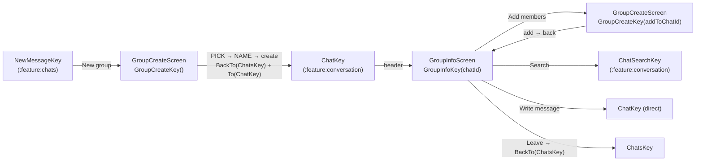

# `:feature:group` — Group creation & group info

[← Back to README](../../../README.md)

## Role

Creating a group chat (pick members → name it) and managing an existing group: members list with roles, rename, add/remove members, change roles (OWNER/ADMIN/MEMBER), mute, search in the group, write privately to a member, leave the group. The same "pick members" screen is reused to **add members** to an existing group.

Which buttons a user sees depends on their role — the rules come from `GroupPermissions` in `:domain` (same rules as the server).

**Depends on:** `:domain`, `:core:common`, `:core:designsystem`, `:core:navigation`.

## Screen flow



```text
NewMessage ──New group──► GroupCreate [PICK ─► NAME] ──create──► Chats ► Chat
Chat ──header──► GroupInfo ──Add members──► GroupCreate(addToChatId) [PICK only] ──► back
                    │──Search──► ChatSearch
                    │──member ► Write message──► direct Chat
                    └──Leave group──► Chats
```

## Pattern

Contract + ViewModel + Screen + DirectionsImpl (Orbit MVI); both ViewModels use assisted injection for their argument. See [README → End-to-End Execution Flow](../../../README.md#5-end-to-end-execution-flow).

## Screens

| Screen (NavKey) | Intents | UiState | SideEffects | Directions → target | Use cases |
|---|---|---|---|---|---|
| **GroupCreate** (`GroupCreateKey(addToChatId?)`) | `OnBack`, `OnQueryChange`, `OnToggle(user)`, `OnNext`, `OnTitleChange`, `OnCreate` | `addToChatId`, `step` (`PICK`/`NAME`), `query`, `candidates`, `selected`, `title`, `isSubmitting`; derived `isAddMode`, `selectedIds`, `canProceed`, `canCreate` (title 1–128) | `ShowError` | `back`; `openCreatedChat` → `BackTo(ChatsKey)` + `To(ChatKey)` | `ObserveKnownUsers`, `ObserveMembers`, `SearchUsers`, `CreateGroup`, `AddMembers` |
| **GroupInfo** (`GroupInfoKey(chatId)`) | `OnBack`, `OnToggleMute`, `OnSearch`, `OnAddMembers`, `OnRename`, `OnChangeRole`, `OnRemove`, `OnWriteMessage`, `OnLeave` | `chat`, `members`, `isBusy`; derived `myRole`, `canManage`, `onlineCount` | `ShowError` | `back`; `navigateToAddMembers` → `To(GroupCreateKey(addToChatId))`; `navigateToChatSearch`; `navigateToChat`; `backToChats` → `BackTo(ChatsKey)` | `ObserveChat`, `ObserveMembers`, `RefreshMembers`, `SetChatMuted`, `RenameGroup`, `ChangeMemberRole`, `RemoveMember`, `LeaveGroup`, `OpenDirectChat` |

**Notable behaviour**

- **Candidates** = users already known on the device + server search results (300 ms debounce), minus people already in the group (add mode).
- **Create mode** has two steps (pick → name). **Add mode** has only the pick step; "Next" adds the members and goes back.
- **GroupInfo** actions go through one guard (`isBusy`) so a double tap cannot send two requests. Rename uses `SwiftInputDialog`; remove/leave ask for confirmation with `SwiftDialog`. Tapping a member opens a bottom sheet (write message, make admin/member, remove) — options are filtered by `GroupPermissions`.

## All files (11)

Paths are relative to `feature/group/src/main/java/uz/relay/feature/group/`.

| File | Class(es) | Responsibility | Depends on / used by |
|---|---|---|---|
| `GroupEntries.kt` | `groupEntries()` | Registers GroupCreate and GroupInfo. | `AppNavHost` |
| `di/GroupDirectionsModule.kt` | `GroupDirectionsModule` | Binds 2 `DirectionsImpl` classes. | Hilt |
| `create/GroupCreateContract.kt` | `GroupCreateContract`, `Step` | Create / add-members contract. | Screen, ViewModel |
| `create/GroupCreateViewModel.kt` | `GroupCreateViewModel` (assisted `addToChatId`) | Candidates, debounced search, selection, create group, add members. | 5 use cases |
| `create/GroupCreateScreen.kt` | `GroupCreateScreen`, `GroupCreateContent`, pick/name steps, rows, chips | Create / add-members UI. | `GroupCreateViewModel` |
| `create/GroupCreateDirectionsImpl.kt` | `GroupCreateDirectionsImpl` | Back; open created chat. | `AppNavigator` |
| `info/GroupInfoContract.kt` | `GroupInfoContract` | Group info contract. | Screen, ViewModel |
| `info/GroupInfoViewModel.kt` | `GroupInfoViewModel` (assisted `chatId`) | Observe, refresh members, mute, rename, roles, remove, leave, write message. | 9 use cases |
| `info/GroupInfoScreen.kt` | `GroupInfoScreen`, `GroupInfoContent`, header, member rows, sheet, dialogs | Group info UI. | `GroupInfoViewModel` |
| `info/GroupInfoDirectionsImpl.kt` | `GroupInfoDirectionsImpl` | Back, AddMembers, ChatSearch, Chat, back to Chats. | `AppNavigator` |
| `util/ErrorMessage.kt` | `messageRes()` | Error → message (no internet, rate limited, forbidden/403, unknown). | Screens |

## Resources

`values` (Uzbek, default), `values-ru`, `values-en` — role names, member counts (plurals), dialogs.

## Tests

| Kind | Classes |
|---|---|
| ViewModel | `GroupCreateViewModelTest`, `GroupInfoViewModelTest` |
| Compose UI | `GroupInfoScreenTest` (manage actions only for admins, leave confirmation) |
| Screenshot | `GroupScreenshotTest` — group info; light & dark |

> Not covered by UI tests: dialogs with a focused text field (rename) — the blinking cursor keeps Robolectric's clock busy. Their logic is covered by ViewModel tests.
