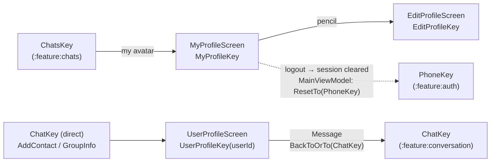

# `:feature:profile` — My profile, settings, edit profile & user profile

[← Back to README](../../../README.md)

## Role

- **My profile:** my name, phone, username, connection status, and app settings — notifications, **theme** (System / Light / Dark), **language** (Oʻzbekcha / Русский / English), and logout.
- **Edit profile:** change display name and username.
- **User profile:** another person's profile — write a message, mute, add to / remove from contacts.

**Depends on:** `:domain`, `:core:common`, `:core:designsystem`, `:core:navigation`.

## Screen flow



```text
Chats ──my avatar──► MyProfile ──pencil──► EditProfile
                        └──Logout──► (session cleared) ──MainViewModel──► Phone
Chat header / AddContact / GroupInfo ──► UserProfile ──Message──► Chat (existing one reused)
```

Logout has no Direction on purpose: when the session is cleared, `MainViewModel` (`:app`) sees `AuthState.LOGGED_OUT` and resets the whole stack to the phone screen — from any screen.

## Pattern

Contract + ViewModel + Screen + DirectionsImpl (Orbit MVI). See [README → End-to-End Execution Flow](../../../README.md#5-end-to-end-execution-flow).

## Screens

| Screen (NavKey) | Intents | UiState | SideEffects | Directions → target | Use cases |
|---|---|---|---|---|---|
| **MyProfile** (`MyProfileKey`) | `OnBack`, `OnEdit`, `OnNotificationsChange`, `OnThemeChange(ThemeMode)`, `OnLanguageChange(AppLanguage)`, `OnLogout` | `me`, `connectionStatus`, `themeMode`, `notificationsEnabled`, `language`, `loggingOut` | `ShowError` | `back`; `navigateToEditProfile` → `To(EditProfileKey)` | `ObserveMe`, `RefreshMe`, `ObserveConnectionStatus`, `ObserveThemeMode`, `SetThemeMode`, `ObserveNotificationsEnabled`, `SetNotificationsEnabled`, `ObserveLanguage`, `SetLanguage`, `Logout` |
| **EditProfile** (`EditProfileKey`) | `OnBack`, `OnNameChange`, `OnUsernameChange`, `OnSave` | `loaded`, `userId`, `name`, `username`, `initialName`, `initialUsername`, `usernameTaken`, `saving`; derived `usernameValid`, `saveEnabled` (valid **and** changed) | `ShowError` (taken username is shown on the field instead) | `back` | `ObserveMe` (read once), `UpdateProfile` |
| **UserProfile** (`UserProfileKey(userId)`) | `OnBack`, `OnMessage`, `OnToggleMute`, `OnToggleContact` | `user`, `chat`, `isBusy`, `isContact`; derived `muted` | `ContactAdded`, `ShowError` | `back`; `navigateToChat` → `BackToOrTo(ChatKey)` | `ObserveUser`, `RefreshUser`, `ObserveDirectChat`, `OpenDirectChat`, `SetChatMuted`, `ObserveContactIds`, `AddContact`, `RemoveContact` |

**Notable behaviour**

- Theme and language are chosen in one shared `OptionSheet` (bottom sheet with ✓). Changing the language recreates the activity in the new language; settings survive logout (they are device settings).
- Logout asks one short question in `SwiftDialog`; pressing twice cannot log out twice (`loggingOut`).
- UserProfile → "Message" reuses an existing chat on the back stack (`BackToOrTo`) instead of opening a second copy; if there is no chat yet, it is created on the server first. Mute also creates the direct chat if needed.

## Components & utilities

| File | Contents |
|---|---|
| `components/ProfileComponents.kt` | Shared profile UI: top bar, header (avatar, name, status), cards, icon tiles, info/setting rows, section labels, red "danger" row, action cards. |
| `util/ErrorMessage.kt` | `AppError.messageRes()` — no internet, rate limited, forbidden (403), not found (404), unknown. |
| `util/PhoneFormat.kt` | `formatPhone("+998…")` for display. |

## All files (17)

Paths are relative to `feature/profile/src/main/java/uz/relay/feature/profile/`.

| File | Class(es) | Responsibility | Depends on / used by |
|---|---|---|---|
| `ProfileEntries.kt` | `profileEntries()` | Registers MyProfile, EditProfile, UserProfile. | `AppNavHost` |
| `di/ProfileDirectionsModule.kt` | `ProfileDirectionsModule` | Binds 3 `DirectionsImpl` classes. | Hilt |
| `components/ProfileComponents.kt` | profile UI building blocks | Shared layout pieces. | All three screens |
| `me/MyProfileContract.kt` | `MyProfileContract` | Own profile + settings contract. | Screen, ViewModel |
| `me/MyProfileViewModel.kt` | `MyProfileViewModel` | Profile, connection, theme/notifications/language, logout. | 10 use cases |
| `me/MyProfileScreen.kt` | `MyProfileScreen`, `MyProfileContent`, `OptionSheet` | Profile & settings UI, logout dialog. | `MyProfileViewModel` |
| `me/MyProfileDirectionsImpl.kt` | `MyProfileDirectionsImpl` | Back; EditProfile. | `AppNavigator` |
| `edit/EditProfileContract.kt` | `EditProfileContract` | Edit form contract. | Screen, ViewModel |
| `edit/EditProfileViewModel.kt` | `EditProfileViewModel` | Loads profile once, filters input, saves. | `ObserveMe`, `UpdateProfile` |
| `edit/EditProfileScreen.kt` | `EditProfileScreen`, `EditProfileContent` | Edit UI (rules hint only on invalid input). | `EditProfileViewModel` |
| `edit/EditProfileDirectionsImpl.kt` | `EditProfileDirectionsImpl` | Back. | `AppNavigator` |
| `user/UserProfileContract.kt` | `UserProfileContract` | Other user's profile contract. | Screen, ViewModel |
| `user/UserProfileViewModel.kt` | `UserProfileViewModel` (assisted `userId`) | Observe/refresh user, open chat, mute, contact toggle. | 8 use cases |
| `user/UserProfileScreen.kt` | `UserProfileScreen`, `UserProfileContent` | User profile UI, remove-contact confirmation. | `UserProfileViewModel` |
| `user/UserProfileDirectionsImpl.kt` | `UserProfileDirectionsImpl` | Back; `BackToOrTo(ChatKey)`. | `AppNavigator` |
| `util/ErrorMessage.kt` | `messageRes()` | Error → message. | Screens |
| `util/PhoneFormat.kt` | `formatPhone` | Phone display format. | `MyProfileScreen` |

> Profile photos are **not implemented yet** — avatars show coloured initials.

## Resources

`values` (Uzbek, default), `values-ru`, `values-en` — settings labels, theme names (System / Light / Dark), language names (each in its own language), dialogs.

## Tests

| Kind | Classes |
|---|---|
| ViewModel | `MyProfileViewModelTest`, `EditProfileViewModelTest`, `UserProfileViewModelTest` |
| Compose UI | `MyProfileScreenTest` (notifications, language sheet, logout confirmation) |
| Screenshot | `ProfileScreenshotTest` — my profile, user profile; light & dark |
