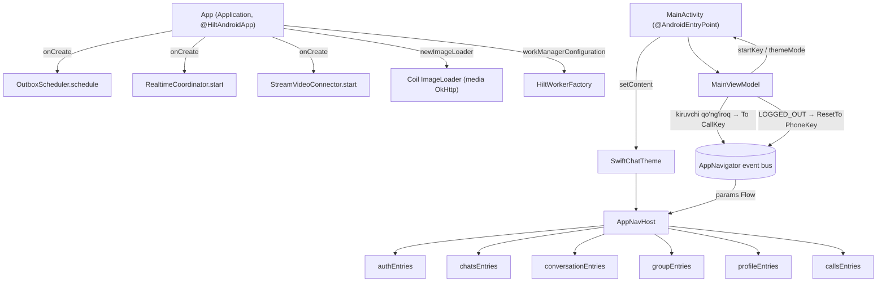
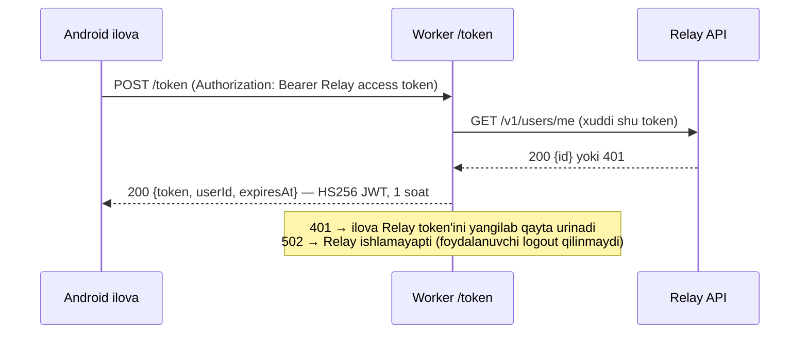

# `:app` — Ilova qobig'i

[← README'ga qaytish](../../../README.uz.md)

`:app` — loyihadagi yagona **Android application** moduli. Unda deyarli biznes mantiq yo'q. Uning vazifasi qolgan hamma narsani **yig'ish**:

- Hilt'ning ildiz (root) komponentini yaratish;
- uzoq ishlaydigan fon qismlarini ishga tushirish (realtime socket, outbox, Stream Video);
- yagona `MainActivity`ni joylashtirish;
- barcha feature ekranlari ro'yxatdan o'tadigan yagona navigatsiya back stack'iga egalik qilish.

| | |
|---|---|
| Modul turi | `com.android.application` (Compose, Hilt, KSP, kotlinx.serialization) |
| applicationId | `uz.relay.app`. O'zgarmasligi shart: Firebase loyihasi faqat shu paket uchun ro'yxatdan o'tgan, shuning uchun `applicationIdSuffix` ishlatilmaydi |
| SDK | compileSdk 37 · minSdk 26 · targetSdk 37 · Java 11 |
| Bog'liqliklar | `:domain`, `:data`, `:core:common`, `:core:designsystem`, `:core:navigation`, barcha oltita `:feature:*` moduli |
| Manba fayllar | 4 ta Kotlin fayl |

---

## 1. App moduli qismlarni qanday bog'laydi



```text
App (Application) ── onCreate ──► StrictMode(debug) → OutboxScheduler.schedule()
                                  → RealtimeCoordinator.start() → StreamVideoConnector.start()
MainActivity ──► MainViewModel (themeMode, startKey, kiruvchi qo'ng'iroqlar, logout'da reset)
     │
     └─ SwiftChatTheme ─► AppNavHost ◄── AppNavigationHandler.params (event bus)
                              │
                              └─ entryProvider { auth | chats | conversation | group | profile | calls }
```

---

## 2. Ishga tushish ketma-ketligi

| Qadam | Qayerda | Nima bo'ladi |
|---|---|---|
| 1 | `App.onCreate` | **Faqat debug'da:** `StrictMode` main thread'dagi disk/tarmoq ishlarini, yopilmay qolgan closeable va SQLite obyektlarini logga yozadi. U faqat ogohlantiradi, ilovani hech qachon yiqitmaydi. |
| 2 | `App.onCreate` | `OutboxScheduler.schedule()` oldingi sessiyada yuborilmay qolgan xabarlarni yana navbatga qo'yadi. |
| 3 | `App.onCreate` | `RealtimeCoordinator.start()` WebSocket'ni faqat foydalanuvchi tizimga kirgan **va** ilova ekranda bo'lganda ochiq ushlaydi. |
| 4 | `App.onCreate` | `StreamVideoConnector.start()` Stream Video client'ini Relay sessiyasiga bog'laydi. API key berilmagan bo'lsa, qo'ng'iroqlar o'chiq bo'ladi. |
| 5 | `MainActivity.attachBaseContext` | `AppLocaleManager.wrap` tanlangan tilni Android 8–12 da qo'llaydi. 13+ da buni tizimning `LocaleManager`i qiladi. |
| 6 | `MainActivity.onCreate` | Tizim splash ekrani `themeMode` **va** `startKey` ikkalasi ham aniq bo'lguncha ko'rinib turadi. Bu tema miltillashining va ikkinchi "soxta" splash'ning oldini oladi. |
| 7 | `MainActivity.onCreate` | `enableEdgeToEdge()`. Status bar va navigation bar ikonkalari telefon temasiga emas, **ilova** temasiga ergashadi. |
| 8 | `setContent` | `SwiftChatTheme(dark)` → `AppNavHost(navigationHandler, startKey)` |

`MainActivity`da tema qanday tanlanadi:

| `ThemeMode` | Natija |
|---|---|
| `DARK` | tungi |
| `SYSTEM` | `isSystemInDarkTheme()`ga ergashadi |
| `LIGHT` yoki hali yuklanmagan | kunduzgi |

---

## 3. `MainViewModel`

| A'zo | Turi | Ma'nosi |
|---|---|---|
| `themeMode` | `StateFlow<ThemeMode?>` | DataStore o'qilguncha `null` bo'ladi, shu sababli splash ekranda turadi |
| `startKey` | `StateFlow<NavKey?>` | birinchi `AuthState`ga qarab birinchi ekran: `LOGGED_IN → ChatsKey`, `NEEDS_PROFILE → ProfileSetupKey`, `LOGGED_OUT → PhoneKey` |
| `navigationHandler` | `AppNavigationHandler` | `AppNavHost`ga uzatiladi |
| init: kiruvchi qo'ng'iroqlar | — | `ObserveIncomingCallsUseCase` → `navigate(To(CallKey(callId)))` qo'ng'iroq ekranini istalgan ekrandan ochadi. `singleTop` uni ikki marta ochilishidan saqlaydi. |
| init: sessiya tugashi | — | `authState.drop(1).filter { LOGGED_OUT }` → `ResetTo(PhoneKey)`. Logout yoki istalgan ekranda bekor qilingan sessiya login ekraniga qaytaradi. |

---

## 4. `AppNavHost` va back stack qoidalari

`AppNavHost` **Navigation 3** ni ishlatadi:
- `rememberNavBackStack(startKey)` stack'ni yaratadi. Kalitlar `@Serializable`, shuning uchun stack process o'ldirilganda (process death) ham saqlanib qoladi.
- `NavDisplay` uni ikkita entry decorator bilan ko'rsatadi:
  - SaveableStateHolder — har bir ekranga o'zining `rememberSaveable` holatini beradi;
  - ViewModelStore — ekran stack'dan chiqqanda uning ViewModel'i tozalanadi.

Har bir navigatsiya buyrug'i event bus'dan (`AppNavigationHandler.params`) keladi va sof funksiya `MutableList<NavKey>.apply(param)` tomonidan qo'llanadi:

| Buyruq | Stack'ka ta'siri |
|---|---|
| `To(key, singleTop = true)` | `key`ni qo'shadi; `singleTop` bo'lsa va `key` allaqachon tepada bo'lsa, e'tiborsiz qoldiriladi |
| `Replace(key)` | tepadagi yozuvni olib tashlaydi, keyin `key`ni qo'shadi |
| `Back` | bittasini olib tashlaydi. Oxirgi yozuv **hech qachon** olib tashlanmaydi, chunki bo'sh stack `NavDisplay`ni yiqitadi. |
| `BackTo(key, inclusive)` | oxirgi `key`gacha qaytadi, `inclusive` bo'lsa uni ham olib tashlaydi. `key` stack'da bo'lmasa, hech narsa qilmaydi. |
| `BackToOrTo(key)` | `key` stack'da bo'lsa unga qaytadi, aks holda uni qo'shadi. Bu bir xil chatning ikkinchi nusxasi ochilishining oldini oladi. |
| `ResetTo(key)` | stack'ni tozalab, faqat `key`ni qoldiradi. Stack allaqachon aynan `[key]` bo'lsa, hech narsa qilmaydi. |

---

## 5. Manifest'dagi asosiy jihatlar

| Element | Qiymat / sabab |
|---|---|
| Shu yerda e'lon qilingan ruxsatlar | `INTERNET` |
| `:data`dan qo'shiladigan ruxsatlar | `ACCESS_NETWORK_STATE`, `FOREGROUND_SERVICE`, `FOREGROUND_SERVICE_DATA_SYNC`, `POST_NOTIFICATIONS`. Ular tarmoqni kuzatish va galereyaga saqlaydigan foreground worker uchun ishlatiladi. |
| Stream SDK'dan qo'shiladigan ruxsatlar | kamera, mikrofon va qo'ng'iroqqa oid ruxsatlar, manifest merging orqali |
| `android:localeConfig` | Android 13+ tizim sozlamalarida ilova tili tanlagichini ko'rsatadi (uz / ru / en) |
| `MainActivity` | yagona activity, `adjustResize` (xabar yozish paneli klaviatura ustida qoladi), `supportsPictureInPicture="true"` |
| `configChanges` | `screenSize\|smallestScreenSize\|screenLayout\|orientation`. Picture-in-Picture'ga kirish yoki chiqish activity'ni qayta yaratmaydi, shuning uchun video renderer'lar ishlashda davom etadi. |
| WorkManager initializer | `androidx.startup`dan olib tashlangan. `App` `HiltWorkerFactory` bilan `Configuration` beradi, shuning uchun worker'larga bog'liqliklar inject qilinadi. |

---

## 6. Build turlari, release va imzolash

| Sozlama | Debug | Release |
|---|---|---|
| ABI'lar | hammasi (emulyatorlar ham) | faqat `arm64-v8a`, `armeabi-v7a`. ML Kit va WebRTC native kutubxonalari har bir ABI uchun 20–35 MB. |
| Kodni qisqartirish (R8) | o'chiq | **hozircha o'chiq** (`optimization { enable = false }`). Rejalashtirilgan, hali amalga oshirilmagan. |
| Ilova nomi | "SwiftChat dev" (`src/debug/res`) | "SwiftChat" |
| AAB til bo'yicha bo'linishi | — | o'chirilgan (`bundle.language.enableSplit = false`), shuning uchun ilova ichida uz/ru/en o'rtasida almashish har doim ishlaydi |

**Release imzolash:**
- `signingConfigs.release` to'rtta qiymatni o'qiydi: `RELEASE_STORE_FILE`, `RELEASE_STORE_PASSWORD`, `RELEASE_KEY_ALIAS`, `RELEASE_KEY_PASSWORD`. Avval `local.properties`ga qaraydi, bo'lmasa xuddi shu nomli environment o'zgaruvchilaridan oladi (CI uchun).
- Biror qiymat yoki keystore fayli bo'lmasa, release build yiqilmaydi, balki **imzosiz** yig'iladi.
- Keystore (`/keystore/`, `*.jks`) va `local.properties` git'ga kirmaydi.

Imzolangan APK'lar **GitHub Releases**da e'lon qilinadi (`v1.0`, `v1.1`).

---

## 7. Uzluksiz integratsiya (`.github/workflows/ci.yml`)

`develop`/`master`ga ochilgan pull request'larda, `develop`ga push'larda va qo'lda ishga tushirilganda ishlaydi. Unda bitta job bor: `ubuntu-latest`, JDK 17 Temurin va Gradle keshi bilan.

| # | Qadam | Buyruq |
|---|---|---|
| 1 | Build | `./gradlew assembleDebug` |
| 2 | Unit + ViewModel + Compose UI testlari | `./gradlew testDebugUnitTest :domain:test` |
| 3 | Screenshot testlari (Roborazzi golden rasmlari) | `./gradlew verifyRoborazziDebug` |
| 4 | Token server testlari | `node --test server/stream-token/test/index.test.mjs` |
| 5 | Lint (xatolarda yiqiladi) | `./gradlew lintDebug` |
| 6 | Artifact'lar | yiqilganda hisobotlar (14 kun), muvaffaqiyatli bo'lganda `app-debug.apk` (7 kun) |

Workflow'ning boshqa sozlamalari:
- Bir branch'ga yangi push kelsa, eski ishga tushirish bekor qilinadi (`concurrency`).
- Workflow token'i repozitoriyga faqat o'qish huquqiga ega (`permissions: contents: read`).

---

## 8. Stream token serveri (`server/stream-token`)

Bu bog'liqliklarsiz kichik **Cloudflare Worker**. U Stream Video foydalanuvchi token'larini beradi, shuning uchun Stream **API Secret hech qachon APK ichiga tushmaydi**. Data qatlamidagi tafsilotlar [data.md](data.md)da.



```text
ilova ──POST /token + Bearer──► Worker ──GET /v1/users/me──► Relay
ilova ◄── {token,userId,expiresAt} ── Worker   (STREAM_API_SECRET bilan imzolangan, Cloudflare secret)
```

| Yo'l | Javob |
|---|---|
| `GET /health` | `{ "ok": true }` |
| `POST /token` | `200 {token, userId, expiresAt}`. Yaroqsiz yoki yo'q Relay token'i uchun 401, Relay ishlamasa 502, `STREAM_API_SECRET` sozlanmagan bo'lsa 500. |
| boshqa har qanday | 404 yoki 405 |

| Fayl | Vazifasi |
|---|---|
| `src/index.js` | Worker: Relay token'ini `/v1/users/me` orqali tekshiradi, keyin JWT'ni Web Crypto bilan imzolaydi |
| `wrangler.toml` | Worker nomi va `RELAY_BASE_URL`. Secret bu yerda **yo'q**; u `wrangler secret put` bilan beriladi. |
| `test/index.test.mjs` | 7 ta Node testi: imzo, muvaffaqiyat, 401, sarlavha yo'qligi, 502, secret yo'qligi, marshrutlash |
| `README.md` | deploy yo'riqnomasi |

---

## 9. `:app`dagi har bir fayl (src/main)

| Fayl | Klass(lar) | Vazifasi | Bog'liqliklar / kim ishlatadi |
|---|---|---|---|
| `uz/relay/app/App.kt` | `App` | Application. Hilt ildizi, outbox, realtime va Stream'ni ishga tushiradi, WorkManager konfiguratsiyasini (Hilt worker factory) va yagona Coil `ImageLoader`ni beradi, debug'da StrictMode'ni yoqadi. | `RealtimeCoordinator`, `OutboxScheduler`, `StreamVideoConnector`, `HiltWorkerFactory`, `ImageLoader` (`:data`) ni ishlatadi |
| `uz/relay/app/MainActivity.kt` | `MainActivity` | Yagona activity. Splash'ni ushlab turish, edge-to-edge, ilova tili (eski Android'da wrap + recreate), temani tanlash, `AppNavHost`ni joylashtiradi. | `MainViewModel`, `AppLocaleManager`, `SwiftChatTheme`, `AppNavHost` ni ishlatadi |
| `uz/relay/app/MainViewModel.kt` | `MainViewModel` | Splash uchun tema va boshlang'ich kalit, global kiruvchi qo'ng'iroq navigatsiyasi, sessiya tugaganda login'ga qaytarish. | `ObserveThemeModeUseCase`, `ObserveAuthStateUseCase`, `ObserveIncomingCallsUseCase`, `AppNavigator`, `AppNavigationHandler` ni ishlatadi |
| `uz/relay/app/navigation/AppNavHost.kt` | `AppNavHost`, `apply()`, `pop()` | Navigation 3 back stack'i. `AppNavigationParam` buyruqlarini qo'llaydi va har bir feature'ning `*Entries()` funksiyasini ro'yxatdan o'tkazadi. | `core:navigation`, barcha `:feature:*` entry funksiyalarini ishlatadi |
| `uz/relay/app/navigation/SwipeBackGesture.kt` | `Modifier.swipeBack(enabled)` | Ekranning istalgan joyidan o'ngga surib orqaga qaytish. Tizimdagi predictive back bilan bir xil hodisalarni yuboradi (`DirectNavigationEventInput` → `NavigationEventDispatcher`), shuning uchun `NavDisplay` ostidagi oldingi ekranni ko'rsatib animatsiya qiladi va ekranlardagi `BackHandler`lar birinchi ishlaydi. Kenglikning 35% idan o'tganda yoki tez surilganda bajariladi; gorizontal surishni o'zi ishlatadigan bolalar (pager, surib javob berish) ustun. | `AppNavHost` |

Fayllar sonini tekshirish: `find app/src/main -name '*.kt'` **4** ni qaytaradi.

---

## 10. Testlar

| Test | Turi | Izoh |
|---|---|---|
| `app/src/test/.../navigation/BackStackApplyTest.kt` | JVM (10 ta test) | har bir `AppNavigationParam` buyrug'ining back stack'ka ta'siri: single-top, replace, "orqaga" stekni hech qachon bo'shatmasligi, `BackTo` (inclusive / yo'q kalit), `BackToOrTo`, `ResetTo` |
| `app/src/test/.../navigation/SwipeBackGestureTest.kt` | Robolectric (4) | o'ngga uzun surish orqaga qaytaradi; qisqa sekin surish, chapga surish va o'chirilgan (root) ekranlarda qaytmaydi |
| `app/src/androidTest/.../ExampleInstrumentedTest.kt` | instrumented | shablon (stub) |

Ilova qobig'ining qolgan qismi feature testlari va CI build'lari orqali tekshiriladi.
