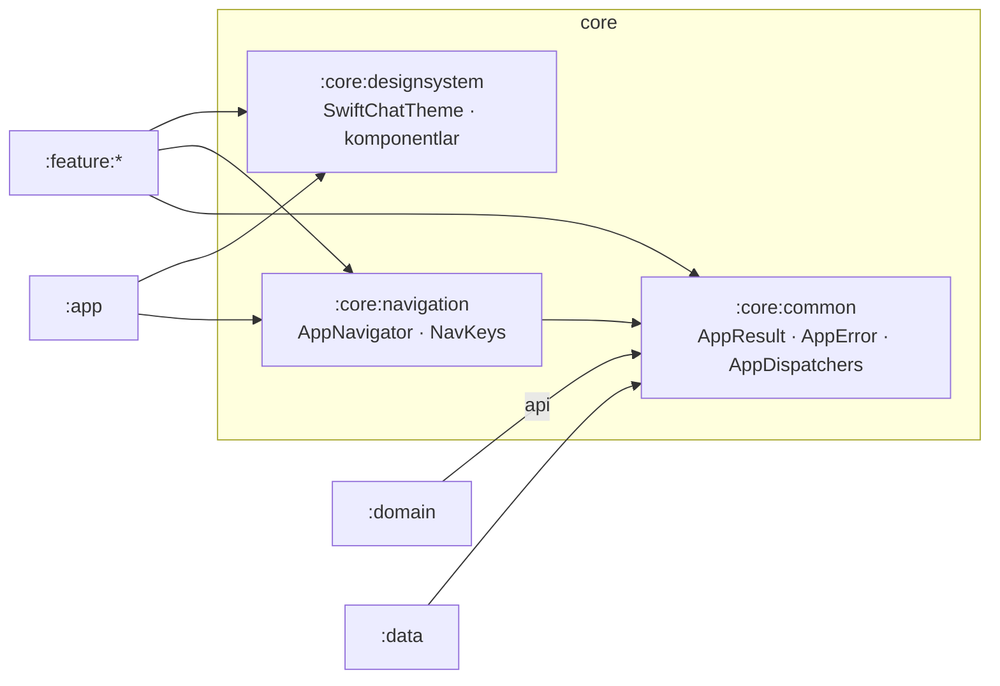
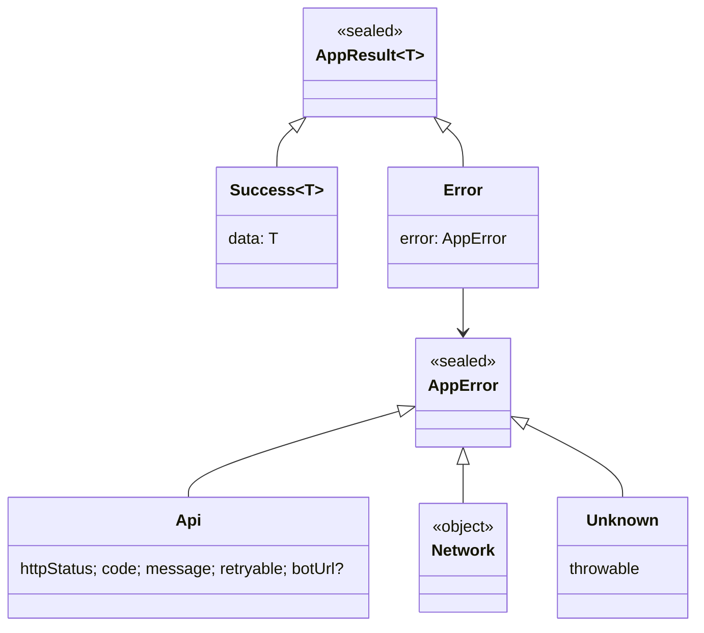
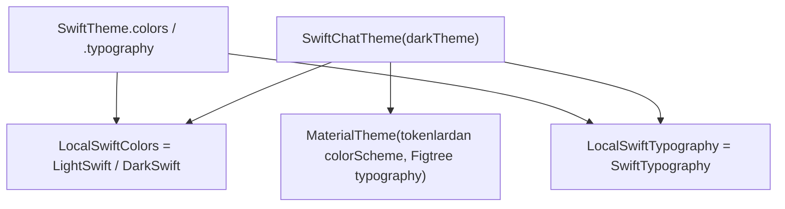
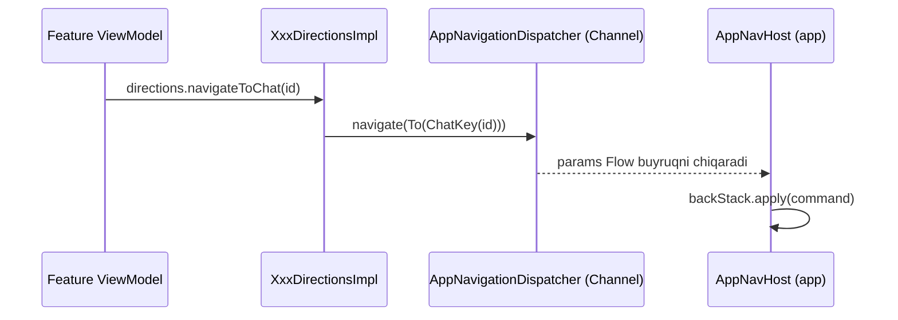

# `:core:*` — Umumiy poydevor

[← README'ga qaytish](../../../README.uz.md)

Uchta `core` moduli **boshqa barcha** modullar birgalikda ishlatadigan narsalarni saqlaydi. Ularning hech biri biror feature haqida bilmaydi.

| Modul | Turi | Maqsadi | Bog'liqliklar |
|---|---|---|---|
| [`:core:common`](#1-corecommon) | sof Kotlin/JVM | har bir qatlam foydalanadigan natija/xato turlari va dispatcher'lar | — |
| [`:core:designsystem`](#2-coredesignsystem) | Android library (Compose) | tema, rang/shrift tokenlari va qayta ishlatiladigan UI komponentlari | — |
| [`:core:navigation`](#3-corenavigation) | Android library | navigatsiya buyruqlari, NavKey'lar va ViewModel'lar bilan UI o'rtasidagi event bus | `:core:common` |



```text
:core:common ◄── :core:navigation
     ▲                ▲
     │ (api)          │
 :domain   :data   :feature:*  ──► :core:designsystem
                       ▲
                     :app  (uchalasini ham ishlatadi)
```

---

## 1. `:core:common`

Sof Kotlin moduli (`java-library`, Android'siz). U natijalar va xatolar ilova bo'ylab **qanday uzatilishini** belgilaydi. Repository'lar exception otish o'rniga qiymat qaytaradi.



| Tur | Ma'nosi |
|---|---|
| `AppResult<T>` | `Success(data)` yoki `Error(AppError)`. Extension'lar: `map`, `onSuccess`, `onError`. |
| `AppError.Api` | server xato body'si bilan javob berdi: HTTP status, `code`, xabar, `retryable`, ixtiyoriy `botUrl` (Telegram OTP bot havolasi) |
| `AppError.Network` | internet yo'q yoki vaqt tugadi (timeout) |
| `AppError.Unknown` | kutilmagan xato, masalan buzilgan JSON |
| `AppError.isRetryable` | `Api → retryable`, `Network → true`, `Unknown → false` |
| `ErrorCodes` | string konstantalar. **Server:** `INVALID_OTP`, `OTP_LOCKED`, `TELEGRAM_NOT_LINKED`, `USERNAME_TAKEN`, `RATE_LIMITED`, `EDIT_WINDOW_EXPIRED`, … **Media:** `PAYLOAD_TOO_LARGE`, `OFFSET_MISMATCH`, `UPLOAD_EXPIRED`, `SHA256_MISMATCH`, … **Faqat klient:** `CALLS_UNAVAILABLE`, `CALL_FAILED`, `MEDIA_FILE_MISSING` |
| `AppDispatchers(io, default, main)` | inject qilinadigan coroutine dispatcher'lar. Qiymatlarni `:data` beradi (`DispatchersModule`). |
| `@ApplicationScope` | butun ilova bo'yicha `CoroutineScope` (`SupervisorJob + Default`) uchun qualifier |

### Fayllar

| Fayl | Klass(lar) | Vazifasi | Bog'liqliklar / kim ishlatadi |
|---|---|---|---|
| `uz/relay/core/common/dispatcher/AppDispatchers.kt` | `AppDispatchers`, `@ApplicationScope` | dispatcher'lar to'plami va app-scope qualifier'i | `:data` DI'da beriladi; repository'lar, `StreamVideoConnector` ishlatadi |
| `uz/relay/core/common/result/AppError.kt` | `AppError`, `isRetryable`, `ErrorCodes` | xato modeli va xato kodlari konstantalari | `safeApiCall` (`:data`) yaratadi; har bir feature'ning `messageRes()` funksiyasi matnga aylantiradi |
| `uz/relay/core/common/result/AppResult.kt` | `AppResult`, extension'lar | muvaffaqiyat/xato o'rami | har bir repository va use case qaytaradi |

Fayllar sonini tekshirish: **3** ta fayl.

---

## 2. `:core:designsystem`

Barcha vizual qurilish bloklari shu yerda, shuning uchun har bir ekran bir xil ko'rinadi va tungi rejim hamma joyda ishlaydi. Ekranlar ranglarni hech qachon qo'lda yozmaydi. Ular `SwiftTheme.colors` / `SwiftTheme.typography`ni o'qiydi.

### 2.1 Tema



**Rang tokenlari** (`SwiftColors`, 34 ta token, kunduzgi va tungi palitralar). Brend rangi — `#5B4FE9`.

| Guruh | Tokenlar |
|---|---|
| Sirtlar | `bg`, `surface`, `surface2`, `page`, `card`, `cardBorder`, `wall` (chat foni), `menu`, `scrim`, `skeleton` |
| Matn va chiziqlar | `text`, `text2`, `line`, `outline`, `meta`, `metaOut`, `muted`, `onMuted` |
| Brend | `primary`, `onPrimary`, `primaryContainer`, `onPrimaryContainer` |
| Chat pufakchalari | `bubbleIn`, `bubbleOut`, `onBubbleOut`, `replyIn`, `replyOut`, `replyOutAccent`, `tickRead`, `chip`, `onChip` |
| Holat | `online`, `error`, `errorContainer` |

Qo'shimcha palitralar:
- `AvatarColors` (7 ta) — foydalanuvchi id'sining barqaror hash'i bo'yicha tanlanadi;
- `SenderNameColors` (4 ta) — guruh chatlaridagi ismlar uchun;
- `SettingsTileColors` — profil ekranidagi ikonka plitkalari uchun.

**Tipografiya** (`SwiftTypography`, Figtree shrifti 5 ta qalinlikda ilovaga qo'shilgan):

| Uslub | O'lcham / qalinlik |
|---|---|
| `displayTitle` | 28 Bold |
| `appTitle` | 22 ExtraBold |
| `title` | 17 Bold |
| `body` | 15 / qator balandligi 21 |
| `bodyStrong` | 16 SemiBold |
| `supporting` | 15 |
| `label` | 13 SemiBold |

### 2.2 Komponentlar

| Komponent | Nima u |
|---|---|
| `Avatar(name, colorSeed, size, online)` | bosh harflar va doimiy rangli doira, ixtiyoriy yashil online nuqta. Rasmli avatarlar hali amalga oshirilmagan. |
| `BrandTile(icon, …)` | yumshoq nur bilan dumaloq burchakli brend rangli ikonka plitkasi (auth ekranlari, dialoglar) |
| `CountBadge(count, muted)` | o'qilmaganlar hisoblagichi, 1–9 uchun mukammal doira, 99 dan oshsa "99+" |
| `ConnectionTitle(text)` | kichik spinner bilan "Ulanmoqda…" / "Yangilanmoqda…" sarlavhasi |
| `OfflineBanner(text)` | "Internet yo'q" banneri |
| `SkeletonChatRow` | chatlar ro'yxati uchun yuklanish placeholder'i |
| `SwiftPrimaryButton` / `SwiftTonalButton` | yuklanish holatiga ega 56 dp pill tugmalar |
| `SwiftDialog` | ilovaning yagona tasdiqlash dialogi: ikonka plitkasi, savol, ikkita teng pill tugma, `destructive` bo'lsa qizil |
| `SwiftInputDialog` | bitta matn maydonli dialog (masalan, guruh nomini o'zgartirish). Tasdiqlash faqat yaroqli va o'zgargan qiymatda yoqiladi. |
| `SwiftSwitch` | ikkala temada bir xil ko'rinadigan brend rangli switch |
| `SwiftFab` | brend soyali 60 dp floating action button |
| `SwiftLogoTile` / `SwiftWordmark` | logotip va "Swift**Chat**" yozuvi |
| `SwiftSnackbarHost` | ekranning **tepasida** ko'rsatiladigan snackbar |
| `SwiftTextField` | label chegarada joylashgan, leading/trailing slotlari bor 58 dp outlined maydon |
| `formatPresence(...)` | "online" / "oxirgi marta hozirgina / N daqiqa / N soat / kecha HH:mm / dd.MM.yyyy / yaqinda" |

Resurslar:
- 53 ta vektor ikonka (`ic_*.xml`, Lucide uslubida);
- 5 ta Figtree shrift fayli;
- o'zbek (asosiy), rus va ingliz tillaridagi presence matnlari.

### Fayllar

| Fayl | Klass(lar) | Vazifasi | Bog'liqliklar / kim ishlatadi |
|---|---|---|---|
| `uz/relay/core/designsystem/component/Avatar.kt` | `Avatar`, `avatarColor`, `initialsOf` | online nuqtali bosh harfli avatar | chatlar ro'yxati, chat sarlavhasi, profillar, a'zolar |
| `uz/relay/core/designsystem/component/BrandTile.kt` | `BrandTile` | brend ikonka plitkasi | auth ekranlari, bo'sh holatlar |
| `uz/relay/core/designsystem/component/Indicators.kt` | `CountBadge`, `ConnectionTitle`, `OfflineBanner`, `SkeletonChatRow` | kichik holat indikatorlari | chatlar ro'yxati, tablar |
| `uz/relay/core/designsystem/component/SwiftButtons.kt` | `SwiftPrimaryButton`, `SwiftTonalButton` | pill tugmalar | auth, profil, dialoglar |
| `uz/relay/core/designsystem/component/SwiftDialog.kt` | `SwiftDialog`, `SwiftInputDialog`, `SwiftSwitch` | dialoglar va switch | logout, o'chirish, chiqish, nomini o'zgartirish, sozlamalar |
| `uz/relay/core/designsystem/component/SwiftFab.kt` | `SwiftFab` | floating action button | chatlar ro'yxati ("yangi chat") |
| `uz/relay/core/designsystem/component/SwiftLogo.kt` | `SwiftLogoTile`, `SwiftWordmark` | logotip | chatlar ro'yxatining yuqori paneli |
| `uz/relay/core/designsystem/component/SwiftSnackbar.kt` | `SwiftSnackbarHost` | tepadagi snackbar | xato ko'rsatadigan har bir ekran |
| `uz/relay/core/designsystem/component/SwiftTextField.kt` | `SwiftTextField` | outlined matn maydoni | telefon, profil, guruh nomi, input dialog |
| `uz/relay/core/designsystem/theme/Color.kt` | `SwiftColors`, `LightSwift`, `DarkSwift`, `Brand`, palitralar | rang tokenlari | `Theme.kt`, barcha ekranlar |
| `uz/relay/core/designsystem/theme/Theme.kt` | `SwiftChatTheme`, `SwiftTheme`, local'lar | tema provayderi va Material'ga moslash | `MainActivity`, preview'lar, testlar |
| `uz/relay/core/designsystem/theme/Type.kt` | `FigtreeFontFamily`, `SwiftTypography`, `SwiftMaterialTypography` | tipografiya shkalasi | `Theme.kt` |
| `uz/relay/core/designsystem/util/Haptics.kt` | `rememberGestureThresholdHaptic` | gesture chegarasidan o'tilganda bitta yengil titrash | surib javob berish |
| `uz/relay/core/designsystem/util/Presence.kt` | `formatPresence` | online / oxirgi marta matni | chat sarlavhasi, kontaktlar, profillar |

Fayllar sonini tekshirish: **13** ta fayl.

---

## 3. `:core:navigation`

Feature'lar bir-birini hech qachon chaqirmaydi. ViewModel buyruq yuborib, **qayerga** borish kerakligini aytadi. Bu buyruqni back stack'ka faqat `:app` moduli qo'llaydi. Bu feature'larni mustaqil saqlaydi va navigatsiyani test qilish mumkin bo'ladi.

### 3.1 Event bus



```text
ViewModel → Directions (Contract'dagi interfeys) → DirectionsImpl → AppNavigator.navigate(param)
          → AppNavigationDispatcher (Channel, capacity 16) → AppNavigationHandler.params → AppNavHost.apply()
```

Qanday ishlaydi:
- `AppNavigationDispatcher` — `@Singleton`, u ham `AppNavigator`ni (yuboruvchi tomon, Directions ishlatadi), ham `AppNavigationHandler`ni (qabul qiluvchi tomon, UI ishlatadi) amalga oshiradi.
- U `StateFlow` o'rniga `Channel` ishlatadi, chunki navigatsiya holat emas, **hodisa** (event). Har bir buyruq **aynan bir marta** yetkaziladi, shuning uchun ekran burilganda u qayta ijro etilmaydi.

### 3.2 Buyruqlar (`AppNavigationParam`)

| Buyruq | Qo'llanilishi |
|---|---|
| `To(key, singleTop = true)` | ekranni ochish |
| `Replace(key)` | ekranni joriy ekran o'rniga ochish (masalan, qidiruv → chat) |
| `Back` | bitta ekran orqaga qaytish |
| `BackTo(key, inclusive = false)` | biror ekranga qaytish (masalan, guruhdan chiqqandan keyin) |
| `BackToOrTo(key)` | mavjud ekranga qaytish yoki u bo'lmasa ochish |
| `ResetTo(key)` | stack'ni tozalash, login va logout'da ishlatiladi |

### 3.3 NavKey'lar (hammasi `@Serializable`, shuning uchun stack process death'dan keyin ham saqlanadi)

| Kalit | Argumentlar | Ekran (modul) |
|---|---|---|
| `PhoneKey` | — | telefon raqam kiritish (auth) |
| `OtpKey` | `phone` | OTP kod (auth) |
| `ProfileSetupKey` | — | birinchi marta profil to'ldirish (auth) |
| `ChatsKey` | — | chatlar ro'yxati (chats) |
| `SearchKey` | — | global qidiruv (chats) |
| `NewMessageKey` | — | yangi xabar, kontaktlar (chats) |
| `AddContactKey` | — | kontakt qo'shish (chats) |
| `ChatKey` | `chatId`, `focusMessageId?` | suhbat (conversation) |
| `ChatSearchKey` | `chatId` | chat ichida qidiruv (conversation) |
| `MediaViewerKey` | `chatId`, `clientMessageId` | to'liq ekranli media (conversation) |
| `GroupCreateKey` | `addToChatId?` | guruh yaratish / a'zo qo'shish (group) |
| `GroupInfoKey` | `chatId` | guruh ma'lumoti (group) |
| `MyProfileKey` | — | mening profilim va sozlamalar (profile) |
| `EditProfileKey` | — | profilni tahrirlash (profile) |
| `UserProfileKey` | `userId` | boshqa foydalanuvchi profili (profile) |
| `CallKey` | `callId`, `video?`, `chatId?`, `group` | qo'ng'iroq ekrani (calls) |

### Fayllar

| Fayl | Klass(lar) | Vazifasi | Bog'liqliklar / kim ishlatadi |
|---|---|---|---|
| `uz/relay/core/navigation/AppNavigationParam.kt` | `AppNavigationParam` (+6 variant) | navigatsiya buyrug'i modeli | har bir `*DirectionsImpl` yuboradi, `AppNavHost` qo'llaydi |
| `uz/relay/core/navigation/AppNavigator.kt` | `AppNavigator` | yuboruvchi interfeys (`suspend navigate`) | `*DirectionsImpl` va `MainViewModel`ga inject qilinadi |
| `uz/relay/core/navigation/AppNavigationHandler.kt` | `AppNavigationHandler` | qabul qiluvchi interfeys (`params: Flow`) | `MainViewModel` → `AppNavHost` |
| `uz/relay/core/navigation/AppNavigationDispatcher.kt` | `AppNavigationDispatcher` | ikkala interfeysni amalga oshiruvchi Channel asosidagi event bus | `NavigationModule`da bog'langan |
| `uz/relay/core/navigation/di/NavigationModule.kt` | `NavigationModule` | ikkala interfeys uchun Hilt `@Binds` | Hilt SingletonComponent |
| `uz/relay/core/navigation/key/AuthKeys.kt` | `PhoneKey`, `OtpKey`, `ProfileSetupKey` | auth yo'nalishlari | auth feature, `MainViewModel` |
| `uz/relay/core/navigation/key/MainKeys.kt` | 13 ta kalit (yuqoridagi jadvalga qarang) | asosiy ilova yo'nalishlari | barcha feature'lar |

Fayllar sonini tekshirish: **7** ta fayl.

---

## 4. Testlar

| Modul | Test | Izoh |
|---|---|---|
| `:core:designsystem` | `SwiftDialogTest` (Robolectric) | tasdiqlash va bekor qilish tugmalari to'g'ri callback'larni chaqiradi |
| `:core:common` | — | bilvosita `:data` testlari (`SafeApiCallTest`) va ViewModel testlari orqali qamrab olingan |
| `:core:navigation` | — | hali amalga oshirilmagan |
