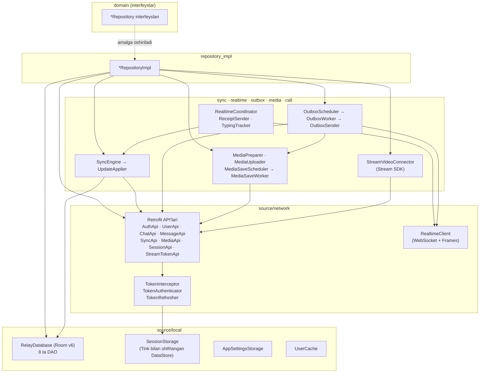
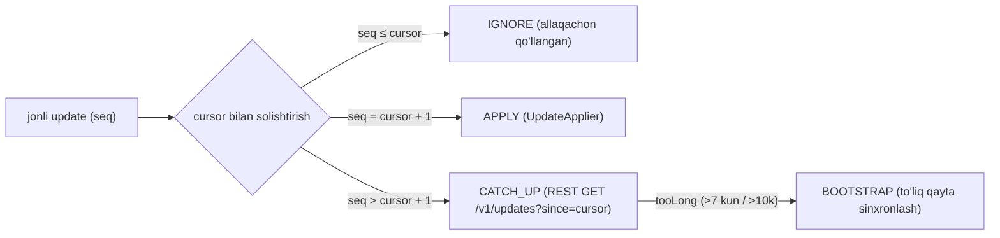

# `:data` — Ma'lumotlar qatlami

[← README'ga qaytish](../../../README.uz.md)

`:data` — tashqi dunyo bilan gaplashadigan yagona modul. U `:domain`da e'lon qilingan har bir repository interfeysini
Relay REST API (Retrofit), Relay WebSocket (OkHttp), lokal Room bazasi, shifrlangan DataStore sozlamalari, WorkManager
vazifalari va Stream Video SDK yordamida amalga oshiradi. UI ko'rsatadigan hamma narsa Room'dan o'qiladi
(**offline-first**): tarmoq javoblari va jonli socket yangilanishlari avval bazaga yoziladi, ekranlar esa bazani Kotlin
`Flow`lari orqali kuzatadi. Feature modullar hech qachon `:data`ga bog'lanmaydi — ular faqat domain interfeyslarini
ko'radi, amalga oshiruvchi klasslarni esa ish vaqtida Hilt bog'laydi.

- Paket: `uz.relay.data`
- Turi: Android kutubxona (Hilt, KSP, kotlinx.serialization, BuildConfig)
- Bog'liqligi: `:domain`, `:core:common`
- Manba fayllar: **92** (`data/src/main/java/uz/relay/data/**`)

---

## 1. Ichki tuzilma



```text
domain  *Repository (interfeyslar)
            ▲ amalga oshiriladi (Hilt @Binds, di/RepositoryModule)
repository_impl/*RepositoryImpl
   ├── source/network/api/*Api ──► interceptor/TokenInterceptor + TokenAuthenticator ──► TokenRefresher ──► SessionStorage
   ├── source/local/database (RelayDatabase, 8 ta DAO) ◄── UserCache
   ├── sync/SyncEngine ──► UpdateApplier ──► Room (bitta tranzaksiya)
   ├── outbox/OutboxScheduler ──► OutboxWorker ──► OutboxSender ──► RealtimeClient (WS) yoki MessageApi (REST)
   │                                                     └──► media/MediaUploader ──► MediaApi
   ├── media/MediaPreparer · MediaSaveScheduler ──► MediaSaveWorker ──► GallerySaver
   └── call/StreamVideoConnector ──► StreamTokenApi ──► Cloudflare Worker ──► Stream Video SDK
realtime/RealtimeCoordinator ──► RealtimeClient (frame'lar) ──► SyncEngine / ReceiptSender / TypingTracker
```

---

## 2. Konfiguratsiya (BuildConfig)

| Maydon | Qiymat / manba | Vazifasi |
|---|---|---|
| `BASE_URL` | `https://relay.zokirov-mob-dev.uz/` | Relay REST asosiy URL'i (uchala Retrofit nusxasi uchun) |
| `WS_URL` | `wss://relay.zokirov-mob-dev.uz/v1/ws` | Relay WebSocket |
| `STREAM_API_KEY` | `local.properties` | Ochiq Stream Video API kaliti (bo'sh bo'lsa qo'ng'iroqlar o'chiq) |
| `STREAM_TOKEN_URL` | `local.properties` | Stream token serveri (Cloudflare Worker) `…/token`. Bo'sh → debug'da dev token, release'da qo'ng'iroqlar o'chiq |

Ilovada hech qanday maxfiy kalit saqlanmaydi. Stream API secret faqat Cloudflare Worker'da (`server/stream-token`) turadi.

---

## 3. REST API

Uchta OkHttp/Retrofit klienti `di/NetworkModule`da yaratiladi va `di/Qualifiers.kt`dagi qualifier'lar bilan tanlanadi:

| Qualifier | Nima qo'shadi | Nima uchun |
|---|---|---|
| `@PublicClient` | faqat logging | login/OTP/refresh (token kutmasligi kerak) |
| `@AuthorizedClient` | `TokenInterceptor` (Bearer) + `TokenAuthenticator` (401 da refresh) | barcha oddiy API chaqiruvlari |
| `@MediaClient` | authorized bilan bir xil, body logging'siz, 60 s timeout | yuklash, yuklab olish, Coil, ExoPlayer |

JSON: kotlinx.serialization, `ignoreUnknownKeys = true` bilan (server shartnomasi faqat qo'shib boriladi, buzilmaydi).

| Interfeys (klient) | Metod | Yo'l | Parametrlar | Qaytaradi |
|---|---|---|---|---|
| **AuthApi** (`@PublicClient`) | POST | `v1/auth/otp/request` | body `OtpRequest` | `Unit` (204) |
| | POST | `v1/auth/otp/verify` | body `VerifyOtpRequest` | `TokenPairResponse` |
| | POST | `v1/auth/refresh` | body `RefreshTokenRequest` | `TokenPairResponse` |
| **SessionApi** (`@AuthorizedClient`) | POST | `v1/auth/logout` | – | `Unit` (204) |
| **UserApi** (`@AuthorizedClient`) | GET | `v1/users/me` | – | `UserMeResponse` |
| | PATCH | `v1/users/me` | body `UpdateMeRequest` | `UserMeResponse` |
| | GET | `v1/users/{id}` | path `id` | `UserResponse` |
| | GET | `v1/users/search` | query `q`, `limit=20` | `UserSearchResponse` |
| **ChatApi** (`@AuthorizedClient`) | GET | `v1/chats` | query `limit=100`, `cursor?` | `ChatListPageResponse` |
| | GET | `v1/chats/{id}` | path | `ChatResponse` |
| | POST | `v1/chats/direct` | body `CreateDirectRequest` | `ChatResponse` (olish yoki yaratish) |
| | POST | `v1/chats/group` | body `CreateGroupRequest` | `ChatResponse` |
| | PATCH | `v1/chats/{id}` | body `UpdateChatRequest` | `ChatResponse` |
| | PUT | `v1/chats/{id}/settings` | body `ChatSettingsRequest` | `ChatResponse` |
| | POST | `v1/chats/{id}/members` | body `AddMembersRequest` | `MembersResponse` |
| | DELETE | `v1/chats/{id}/members/{userId}` | path ×2 | `Unit` (204) |
| | PATCH | `v1/chats/{id}/members/{userId}` | body `ChangeRoleRequest` | `ChatMemberResponse` |
| | POST | `v1/chats/{id}/leave` | path | `Unit` (204) |
| **MessageApi** (`@AuthorizedClient`) | GET | `v1/chats/{id}/messages` | query `beforeSeq?`, `limit=50` | `MessagePageResponse` |
| | POST | `v1/chats/{id}/messages` | body `SendMessageRequest` | `SendMessageResultResponse` (`clientMessageId` bo'yicha idempotent) |
| | PATCH | `v1/messages/{serverId}` | body `EditMessageRequest` | `MessageResponse` (48 soatlik tahrirlash oynasi) |
| | DELETE | `v1/messages/{serverId}` | path | `Unit` (tombstone) |
| | POST | `v1/chats/{id}/read` | body `UpToSeqRequest` | `Unit` |
| | POST | `v1/chats/{id}/received` | body `UpToSeqRequest` | `Unit` |
| **SyncApi** (`@AuthorizedClient`) | GET | `v1/updates/state` | – | `UpdatesStateResponse` |
| | GET | `v1/updates` | query `since`, `limit=500` | `UpdatesPageResponse` |
| **MediaApi** (`@MediaClient`) | POST | `v1/media/uploads` | body `StartUploadRequest` | `StartUploadResponse` |
| | PUT | `v1/media/uploads/{uploadId}` | header `Upload-Offset`, xom body | `ChunkAckResponse` |
| | HEAD | `v1/media/uploads/{uploadId}` | path | `Response<Void>` (offset header'da) |
| **StreamTokenApi** (`@AuthorizedClient`) | POST | to'liq `@Url` = `STREAM_TOKEN_URL` | – | `StreamTokenResponse` |

Media fayllar `GET v1/media/{mediaId}` (`MessageMapper.kt`dagi `mediaUrl()` yasaydi) manzilidan `@MediaClient` OkHttp
klienti orqali yuklab olinadi — Coil (rasmlar), ExoPlayer (video, HTTP Range) va `MediaRepositoryImpl.download` (fayllar).

> Hali amalga oshirilmagan: limitlarni `GET /v1/server/info`dan o'qish — 100 MB yuklash chegarasi hozircha `MediaPreparer`dagi konstanta.

---

## 4. WebSocket (realtime)

`RealtimeClient` `WS_URL`ga bitta OkHttp WebSocket ulanishini ushlab turadi (ping 30 s). Token header'da emas, birinchi
frame'da yuboriladi.

| Yo'nalish | Frame (`type`) | Maydonlar |
|---|---|---|
| klient → server | `auth` | `token`, `deviceId`, `cursor` (birinchi bo'lishi shart, 10 s ichida) |
| | `send` | `clientMessageId`, `chatId`, `messageType`, `body?`, `mediaIds?`, `replyTo?` |
| | `read` / `received` | `chatId`, `upToSeq` |
| | `typing` | `chatId` |
| server → klient | `auth_ok` | `userId`, `updateSeq` |
| | `ack` | `clientMessageId`, `serverId`, `serverSeq`, `serverCreatedAt` |
| | `nack` | `clientMessageId`, `code`, `message`, `retryable` |
| | `update` | `updateSeq`, `kind`, `payload` |
| | `typing` | `chatId`, `userId` |
| | `presence` | `userId`, `online`, `lastSeenAt?` |
| | `error` | `code`, `message` |

Noma'lum frame turlari e'tiborsiz qoldiriladi (kelajakdagi o'zgarishlarga moslik uchun).

| Yopilish kodi | Ma'nosi | Klientning javobi |
|---|---|---|
| 4001 | access token muddati tugagan | `TokenRefresher.refresh`, darhol qayta ulanish |
| 4003 | ruxsat yo'q | bir marta refresh; ketma-ket ikkinchi 4003 → sessiyani tozalash |
| 4009 | sessiya boshqa ulanish bilan almashtirilgan | to'xtash (ikki socket bir-birini uzib yubormasligi uchun) |
| 4008 | auth vaqti tugagan | darhol qayta ulanish |
| boshqa / tarmoq | – | eksponensial backoff 1, 2, 4 … 30 s + jitter; tarmoq qaytganda `reconnectNow()` |

`RealtimeCoordinator` socket'ni faqat foydalanuvchi tizimga kirgan **va** ilova oldingi planda bo'lganda ochadi
(`ProcessLifecycleOwner`, fonga o'tganda 5 s kutish) va frame'larni yo'naltiradi:
`auth_ok` → outbox + catch-up · `update` → `SyncEngine.onLiveUpdate` · `presence` → `UserDao` · `typing` → `TypingTracker`.
`ack`/`nack`ni to'g'ridan-to'g'ri `OutboxSender` qabul qiladi.

---

## 5. Sinxronizatsiya algoritmi (`sync/`)

Foydalanuvchi uchun har bir o'zgarishning foydalanuvchiga xos, uzilishsiz `updateSeq` raqami bor. Oxirgi qo'llangan
qiymat — lokal **cursor** (`sync_state` jadvali).



| Bosqich | Nima sodir bo'ladi |
|---|---|
| **Bootstrap** (birinchi kirish / qayta sinxronlash) | `GET /v1/updates/state` (avval cursor) → `GET /v1/chats` sahifalab o'qiladi → yetishmayotgan foydalanuvchilar olinadi → bitta tranzaksiya: foydalanuvchilarni upsert qilish, chatlarni almashtirish, sinxronlangan xabarlarni o'chirish (outbox saqlanadi), cursor'larni tiklash, cursor'ni o'rnatish |
| **Catch-up** | `state.updateSeq`ga yetguncha `GET /v1/updates?since=cursor` sahifalab o'qiladi |
| **Live** | `classifyLiveUpdate` → IGNORE / APPLY / CATCH_UP, hammasi bitta `Mutex` ostida |
| **Apply** (`UpdateApplier`) | 1) tranzaksiyadan tashqarida tarmoq (yetishmayotgan chatlar/foydalanuvchilar); 2) bitta Room tranzaksiyasi: `message_new`, `message_edit` (faqat yangiroq `editVersion`), `message_delete` (tombstone), `read`/`delivered` (cursor'lar faqat oldinga siljiydi), `member`, `chat` qo'llanadi, keyin cursor = max(eski, yangi); 3) qo'shimcha ta'sirlar: "yozmoqda"ni tozalash, `received` belgisini yuborish |

"O'qildi"/"yetkazildi" belgilarini `ReceiptSender` yuboradi (ulangan bo'lsa socket orqali, aks holda REST orqali).

---

## 6. Room bazasi (`RelayDatabase`, versiya 6)

Fayl `relay.db`, `fallbackToDestructiveMigration(dropAllTables = true)`, TypeConverter `MediaConverters`
(`MediaItemEntity`larning JSON ro'yxati).

| Jadval (Entity) | Kalit | Muhim ustunlar |
|---|---|---|
| `chats` (`ChatEntity`) | `id` | type, title, peerUserId, ichki oxirgi xabar, unreadCount, readUpToSeq, topSeq, muted, mutedUntil |
| `users` (`UserEntity`) | `id` | displayName, username, avatar, online, lastSeenAt, phone (faqat o'z profilim) |
| `messages` (`MessageEntity`) | `clientMessageId` | chatId, serverId?, serverSeq?, type, body, replyTo, tahrir/o'chirish belgilari, `status` (PENDING/SENT/FAILED), media JSON |
| `chat_members` (`ChatMemberEntity`) | (`chatId`,`userId`) | role, joinedAt |
| `member_cursors` (`MemberCursorEntity`) | (`chatId`,`userId`) | readUpToSeq, deliveredUpToSeq |
| `uploads` (`UploadEntity`) | `clientMessageId` | lokal fayl, sha256, uploadId, mediaId, chunkSize, confirmedBytes, completed |
| `contacts` (`ContactEntity`) | `userId` | addedAt (kontaktlar faqat lokal) |
| `sync_state` (`SyncStateEntity`) | `id = 0` | updateSeq (sinxronizatsiya cursor'i) |

| DAO | Asosiy amallar |
|---|---|
| `ChatDao` | chatlar ro'yxati JOIN suhbatdosh + a'zo cursor'lari (`ChatListItem`), bitta/shaxsiy chat, faqat oldinga yuradigan `markRead`, `replaceAll` |
| `ChatMemberDao` | a'zolar JOIN users, rol bo'yicha tartiblangan (`MemberItem`), replace/upsert/delete |
| `ContactDao` | kontaktlar JOIN users, id'lar, insert/delete |
| `MemberCursorDao` | read/delivered cursor'larni faqat oldinga `raise` qilish |
| `MessageDao` | kuzatish (avval kutayotganlar), lokal LIKE qidiruv, tahrir/o'chirish tombstone'lari, outbox navbati (`nextPending`, `markSent`, `markFailed`) |
| `SyncStateDao` | cursor'ni olish/kuzatish/o'rnatish |
| `UploadDao` | yuklash sessiyasi + jarayon |
| `UserDao` | foydalanuvchilar, presence, ismlar xaritasi |

---

## 7. Modellarni o'girish (DTO → Entity → Domain)

| Server DTO (`model/response`) | Room entity | Domain model | Mapper |
|---|---|---|---|
| `TokenPairResponse` | – (`SessionStorage`dagi `Session`) | – | `mapper/Mappers.kt` |
| `UserMeResponse`, `UserResponse` | `UserEntity` | `User` | `mapper/UserMapper.kt` |
| `ChatResponse`, `MessagePreviewResponse` | `ChatEntity` (+ `LastMessageEmbedded`) | `ChatSummary`, `LastMessage` | `mapper/ChatMapper.kt` |
| `MessageResponse`, `MediaMetaResponse` | `MessageEntity`, `MediaItemEntity` (+ `UploadEntity`) | `Message`, `MessageMedia`, `UploadProgress` | `mapper/MessageMapper.kt` |
| `ChatMemberResponse` | `ChatMemberEntity` | `ChatMember` | `mapper/MemberMapper.kt` |
| `SystemMessageBodyResponse` (body ichidagi JSON) | xabar body'si sifatida saqlanadi | `SystemEvent` | `ChatMapper.kt`dagi `parseSystemEvent` |

Xabar holati (✓ / ✓✓) **saqlanmaydi**: `outgoingStatus()` SENDING / SENT / DELIVERED / READ holatini yuborish holati va
boshqa a'zolarning read/delivered cursor'laridan hisoblaydi — shuning uchun bitta cursor yangilanishi oldingi barcha
xabarlarni birdaniga belgilaydi.

---

## 8. Umumiy imkoniyatlar

### Token boshqaruvi
- `TokenInterceptor` xotiradagi sessiyadan `Authorization: Bearer <access>` qo'shadi.
- `TokenAuthenticator` HTTP 401 ga javob beradi: bir marta refresh qiladi va so'rovni takrorlaydi.
- `TokenRefresher` — refresh qilinadigan **yagona joy** (REST 401 va WS 4001/4003), `Mutex` bilan himoyalangan —
  server refresh token'larni almashtirib turadi, shuning uchun ikkita parallel refresh sessiyani bekor qilib yuboradi (`TOKEN_REUSED`).
- `SessionStorage` token'larni Tink AES-256-GCM bilan shifrlangan DataStore'da saqlaydi, kalit Android Keystore bilan o'ralgan.
- `safeApiCall` istisnolarni `AppResult.Error(AppError.Api | Network | Unknown)`ga aylantiradi; bekor qilish (cancellation) qayta tashlanadi.

### Outbox (oflayn yuborish)
1. `MessageRepositoryImpl` UUID `clientMessageId` bilan `PENDING` qatorini yozadi → xabar darhol ko'rinadi.
2. `OutboxScheduler` noyob WorkManager ishini navbatga qo'yadi (tarmoq talab qilinadi, eksponensial backoff).
3. `OutboxSender` FIFO tartibida yuboradi: avval media'ni yuklaydi, keyin socket orqali urinib, `ack`ni 10 s gacha kutadi,
   bo'lmasa xuddi shu `clientMessageId` bilan REST'ga o'tadi (idempotent — dublikat bo'lmaydi). Qayta urinsa bo'ladigan
   xatolar navbatni to'xtatadi; doimiy xatolar xabarni `FAILED` deb belgilaydi (foydalanuvchi qayta yuborishi mumkin).

### Media
- **Tayyorlash** (`MediaPreparer`): tanlangan faylni SHA-256 hisoblagan holda ilova xotirasiga nusxalaydi, turini aniqlaydi,
  o'lcham/davomiylikni o'qiydi, ≤8 KB thumbnail va video poster yasaydi; 100 MB dan katta fayllarni rad etadi.
- **Yuklash** (`MediaUploader`): davom ettiriladigan bo'lakli (chunked) yuklash — sessiya ochiladi, bo'laklar server tasdiqlagan
  offset'ga PUT qilinadi, `OFFSET_MISMATCH`da HEAD bilan qayta so'raladi, muddati o'tgan sessiyalar qayta boshlanadi;
  har bir bo'lakdan keyin jarayon saqlanadi.
- **Yuklab olish** (`MediaRepositoryImpl.download`): jarayon ko'rsatkichi bilan `.part` faylga oqim, lokal/keshdagi nusxalardan qayta foydalanadi.
- **Galereyaga saqlash**: `MediaSaveScheduler` → `MediaSaveWorker` (foreground, dataSync) → `GallerySaver` (MediaStore
  `Pictures/SwiftChat` yoki `Movies/SwiftChat`), jarayon/tayyor/xato bildirishnomalari bilan (`MediaSaveNotifications`).

### Boshqalar
- `AppLocaleManager` — ilova tili (Android 13+ da tizim `LocaleManager`, undan pastda SharedPreferences + context o'rash).
- `AppSettingsStorage` — mavzu va bildirishnoma sozlamalari (DataStore, chiqishdan keyin ham saqlanadi).
- `NetworkMonitor` — internet mavjudligi `StateFlow`i.
- `TypingTracker` — xotiradagi "yozmoqda…" holati, 5 s TTL bilan (`TypingRepository`ni amalga oshiradi).
- `UserCache` — yetishmayotgan foydalanuvchi profillarini oladi (bir vaqtda ko'pi bilan 4 ta).
- `StreamVideoConnector` — Stream Video klientini Relay sessiyasiga bog'laydi: kirishda token serveridan birinchi token'ni
  oladi (qayta urinishlar 2→16 s), klientni quradi, token'larni `TokenProvider` orqali yangilaydi; chiqishda logout qiladi.
- `CallRepositoryImpl` — 1:1 jiringlaydigan qo'ng'iroqlar (15 s da avtomatik bekor), kiruvchi qo'ng'iroqlar oqimi, guruh video
  xonalari (`group_<chatId>`, jiringlamasdan) va ulardagi ishtirokchilar soni.

### Dependency injection (`di/`)

| Modul | Nimani taqdim etadi |
|---|---|
| `NetworkModule` | `Json`, logger, 3 ta OkHttp klienti, 3 ta Retrofit nusxasi |
| `ApiModule` | 8 ta Retrofit API interfeysi |
| `DatabaseModule` | `RelayDatabase` va uning 8 ta DAO'si |
| `MediaModule` | media klientidagi Coil `ImageLoader` va Media3 `DataSource.Factory` |
| `DispatchersModule` | `AppDispatchers` va ilova bo'ylab `@ApplicationScope CoroutineScope` |
| `RepositoryModule` | 11 ta domain repository interfeysining `@Binds`lari |
| `Qualifiers.kt` | `@PublicClient`, `@AuthorizedClient`, `@MediaClient` |

---

## 9. Repository'larni amalga oshirish

| Amalga oshirish | Domain interfeysi | Ishlatadi | Roli |
|---|---|---|---|
| `AuthRepositoryImpl` | `AuthRepository` | AuthApi, SessionApi, SessionStorage, RealtimeClient, OutboxScheduler, MediaFiles, RelayDatabase | auth holati, OTP bilan kirish, profil-to'ldirish bayrog'i, tartibli chiqish va tozalash |
| `UserRepositoryImpl` | `UserRepository` | UserApi, UserDao, SessionStorage | o'z profilim, boshqa foydalanuvchilar, qidiruv, ismlar xaritasi |
| `ChatRepositoryImpl` | `ChatRepository` | ChatApi, ChatDao, SyncEngine, UserCache, UserDao, SessionStorage | chatlar ro'yxati/bitta chat/shaxsiy chat, sinxronizatsiya holati, yangilash, shaxsiy chat ochish, ovozsiz qilish |
| `MessageRepositoryImpl` | `MessageRepository` | MessageApi, Message/Chat/User/MemberCursor/Upload DAO'lari, MediaPreparer, OutboxScheduler, ReceiptSender, RealtimeClient, UserCache | xabarlar, tarixni sahifalash, outbox orqali yuborish, tahrir/o'chirish, o'qildi, yozmoqda, lokal qidiruv |
| `GroupRepositoryImpl` | `GroupRepository` | ChatApi, Chat/ChatMember/Message/MemberCursor/User DAO'lari, UserCache, SessionStorage | a'zolar, yaratish, qo'shish/chiqarish, rollar, nom o'zgartirish, chiqish |
| `ContactRepositoryImpl` | `ContactRepository` | ContactDao, UserDao, UserCache | lokal kontaktlar |
| `MediaRepositoryImpl` | `MediaRepository` | media OkHttp, MediaFiles, MediaSaveScheduler | jarayon bilan yuklab olish, galereyaga saqlashni rejalashtirish |
| `SettingsRepositoryImpl` | `SettingsRepository` | AppSettingsStorage, AppLocaleManager | mavzu, bildirishnomalar, til |
| `ConnectionRepositoryImpl` | `ConnectionRepository` | NetworkMonitor, RealtimeClient, SyncEngine | umumiy holat OFFLINE > UPDATING > CONNECTING > CONNECTED |
| `CallRepositoryImpl` | `CallRepository` | StreamVideoConnector, Stream SDK | 1:1 qo'ng'iroqlar, kiruvchi qo'ng'iroqlar, guruh xonalari |
| `TypingTracker` (`realtime/`) | `TypingRepository` | – | xotiradagi "yozmoqda" holati |

---

## 10. Barcha fayllar

Yo'llar `data/src/main/java/uz/relay/data/`ga nisbatan.

| Fayl | Klass(lar) | Vazifasi | Bog'liqligi / kim ishlatadi |
|---|---|---|---|
| `call/StreamVideoConnector.kt` | `StreamVideoConnector` | Relay sessiyasiga bog'langan Stream Video klientining hayot sikli; token provider | AuthRepository, UserRepository, StreamTokenApi / App, CallRepositoryImpl |
| `connection/NetworkMonitor.kt` | `NetworkMonitor` | internet mavjudligi `StateFlow`i | ConnectivityManager / RealtimeCoordinator, ConnectionRepositoryImpl |
| `di/ApiModule.kt` | `ApiModule` | Retrofit API'larini taqdim etadi | Retrofit nusxalari / repository'lar |
| `di/DatabaseModule.kt` | `DatabaseModule` | Room bazasi va DAO'larni taqdim etadi | Room / repository'lar, sync |
| `di/DispatchersModule.kt` | `DispatchersModule` | `AppDispatchers`, `@ApplicationScope` scope | core:common / uzoq yashovchi komponentlar |
| `di/MediaModule.kt` | `MediaModule` | media klientidagi Coil ImageLoader, ExoPlayer DataSource | @MediaClient / App, MediaViewer |
| `di/NetworkModule.kt` | `NetworkModule` | Json, logger, 3 ta OkHttp klienti, 3 ta Retrofit | interceptor'lar / ApiModule |
| `di/Qualifiers.kt` | `PublicClient`, `AuthorizedClient`, `MediaClient` | klient qualifier'lari | DI modullari |
| `di/RepositoryModule.kt` | `RepositoryModule` | repository interfeyslarini bog'laydi | domain / barcha feature'lar |
| `locale/AppLocaleManager.kt` | `AppLocaleManager` | ilova tili, Android 8–12 uchun context o'rash | SettingsRepositoryImpl, MainActivity |
| `mapper/ChatMapper.kt` | funksiyalar | chat DTO → entity → `ChatSummary`; tizim hodisasini tahlil qilish; tur enum'lari | SyncEngine, UpdateApplier, ChatRepositoryImpl |
| `mapper/Mappers.kt` | funksiyalar | `TokenPairResponse` → `Session` | AuthRepositoryImpl, TokenRefresher |
| `mapper/MemberMapper.kt` | funksiyalar | a'zo DTO → entity → `ChatMember` | GroupRepositoryImpl, UpdateApplier |
| `mapper/MessageMapper.kt` | `PeerCursors`, funksiyalar | xabar/media o'girish, cursor'lardan holat, `mediaUrl`, yuborish so'rovi | MessageRepositoryImpl, OutboxSender, UpdateApplier |
| `mapper/UserMapper.kt` | funksiyalar | foydalanuvchi DTO ↔ entity ↔ `User` | UserRepositoryImpl, UserCache |
| `media/GallerySaver.kt` | `GallerySaver` | yuklab olish + MediaStore'ga yozish | MediaSaveWorker |
| `media/MediaFiles.kt` | `MediaFiles` | outbox/yuklab olish papkalari, chiqishda tozalash | MediaPreparer, MediaRepositoryImpl, AuthRepositoryImpl |
| `media/MediaPreparer.kt` | `MediaPreparer` | nusxalash, SHA-256, metama'lumot, thumbnail, poster | MessageRepositoryImpl |
| `media/MediaSaveNotifications.kt` | `MediaSaveNotifications` | kanal + jarayon/tayyor/xato bildirishnomalari | MediaSaveWorker |
| `media/MediaSaveScheduler.kt` | `MediaSaveScheduler` | galereyaga saqlash ishini navbatga qo'yish | MediaRepositoryImpl |
| `media/MediaSaveWorker.kt` | `MediaSaveWorker` | media'ni saqlaydigan foreground WorkManager vazifasi | GallerySaver, bildirishnomalar |
| `media/MediaUploader.kt` | `MediaUploader` | davom ettiriladigan bo'lakli yuklash | MediaApi, UploadDao / OutboxSender |
| `model/request/AuthRequests.kt` | `OtpRequest`, `VerifyOtpRequest`, `RefreshTokenRequest` | auth so'rov body'lari | AuthApi |
| `model/request/ChatRequests.kt` | `CreateDirectRequest`, `CreateGroupRequest`, `UpdateChatRequest`, `ChatSettingsRequest`, `AddMembersRequest`, `ChangeRoleRequest` | chat/guruh so'rov body'lari | ChatApi |
| `model/request/MessageRequests.kt` | `SendMessageRequest`, `EditMessageRequest`, `StartUploadRequest` | xabar/yuklash body'lari | MessageApi, MediaApi |
| `model/request/UpdateMeRequest.kt` | `UpdateMeRequest` | profil PATCH body'si | UserApi |
| `model/request/UpToSeqRequest.kt` | `UpToSeqRequest` | read/received belgisi body'si | MessageApi |
| `model/response/ChatResponses.kt` | `ChatResponse`, `MessagePreviewResponse`, `ChatListPageResponse` | chat DTO'lari | ChatApi |
| `model/response/ErrorResponse.kt` | `ErrorResponse` | server xato body'si | safeApiCall |
| `model/response/MediaResponses.kt` | `StartUploadResponse`, `ChunkAckResponse` | yuklash DTO'lari | MediaApi |
| `model/response/MemberResponses.kt` | `ChatMemberResponse`, `MembersResponse`, `UserSearchResponse` | a'zo/qidiruv DTO'lari | ChatApi, UserApi |
| `model/response/MessagePageResponse.kt` | `MessagePageResponse`, `SendMessageResultResponse` | tarix sahifasi, yuborish natijasi | MessageApi |
| `model/response/MessageResponse.kt` | `MessageResponse`, `MediaMetaResponse`, `SystemMessageBodyResponse` | xabar DTO'lari | MessageApi, sync |
| `model/response/StreamTokenResponse.kt` | `StreamTokenResponse` | token serveri javobi | StreamTokenApi |
| `model/response/SyncResponses.kt` | `UpdatesStateResponse`, `UpdateResponse`, `UpdatesPageResponse`, `UpdateKinds`, payload'lar | sync DTO'lari | SyncApi, UpdateApplier |
| `model/response/TokenPairResponse.kt` | `TokenPairResponse` | login/refresh token'lari | AuthApi |
| `model/response/UserMeResponse.kt` | `UserMeResponse` | o'z profilim (telefon bilan) | UserApi |
| `model/response/UserResponse.kt` | `UserResponse` | ochiq profil | UserApi, ChatResponse |
| `outbox/OutboxScheduler.kt` | `OutboxScheduler` | noyob outbox ishini navbatga qo'yish/bekor qilish | MessageRepositoryImpl, RealtimeCoordinator, App |
| `outbox/OutboxSender.kt` | `OutboxSender`, `FlushResult` | FIFO yuboruvchi (yuklash → socket yoki REST) | RealtimeClient, MessageApi, MediaUploader |
| `outbox/OutboxWorker.kt` | `OutboxWorker` | `flush()`ni ishga tushiruvchi WorkManager worker | OutboxSender |
| `realtime/RealtimeCoordinator.kt` | `RealtimeCoordinator` | login + oldingi plan bo'yicha socket'ni yoqish/o'chirish; frame'larni yo'naltirish | RealtimeClient, SyncEngine / App |
| `realtime/ReceiptSender.kt` | `ReceiptSender` | read/received belgilarini socket yoki REST orqali yuborish | MessageRepositoryImpl, UpdateApplier |
| `realtime/TypingTracker.kt` | `TypingTracker` | xotiradagi "yozmoqda" holati, `TypingRepository` | RealtimeCoordinator / chat ekranlari |
| `repository_impl/AuthRepositoryImpl.kt` | `AuthRepositoryImpl` | §9 ga qarang | |
| `repository_impl/CallRepositoryImpl.kt` | `CallRepositoryImpl` | §9 ga qarang | |
| `repository_impl/ChatRepositoryImpl.kt` | `ChatRepositoryImpl` | §9 ga qarang | |
| `repository_impl/ConnectionRepositoryImpl.kt` | `ConnectionRepositoryImpl` | §9 ga qarang | |
| `repository_impl/ContactRepositoryImpl.kt` | `ContactRepositoryImpl` | §9 ga qarang | |
| `repository_impl/GroupRepositoryImpl.kt` | `GroupRepositoryImpl` | §9 ga qarang | |
| `repository_impl/MediaRepositoryImpl.kt` | `MediaRepositoryImpl` | §9 ga qarang | |
| `repository_impl/MessageRepositoryImpl.kt` | `MessageRepositoryImpl` | §9 ga qarang | |
| `repository_impl/SettingsRepositoryImpl.kt` | `SettingsRepositoryImpl` | §9 ga qarang | |
| `repository_impl/UserRepositoryImpl.kt` | `UserRepositoryImpl` | §9 ga qarang | |
| `source/local/AppSettingsStorage.kt` | `AppSettingsStorage` | mavzu/bildirishnomalar uchun DataStore | SettingsRepositoryImpl |
| `source/local/Session.kt` | `Session` | token'lar, userId, deviceId | SessionStorage |
| `source/local/SessionStorage.kt` | `SessionStorage` | shifrlangan sessiya ombori + xotira keshi | interceptor'lar, repository'lar, RealtimeClient |
| `source/local/cache/UserCache.kt` | `UserCache` | yetishmayotgan profillarni olish | UserApi / sync, repository'lar |
| `source/local/database/RelayDatabase.kt` | `RelayDatabase` | Room bazasi v6, 8 ta entity | DatabaseModule |
| `source/local/database/dao/ChatDao.kt` | `ChatDao`, `ChatListItem` | JOIN'li chat so'rovlari | ChatRepositoryImpl, sync |
| `source/local/database/dao/ChatMemberDao.kt` | `ChatMemberDao`, `MemberItem` | a'zo so'rovlari | GroupRepositoryImpl, sync |
| `source/local/database/dao/ContactDao.kt` | `ContactDao` | kontaktlar JOIN users | ContactRepositoryImpl |
| `source/local/database/dao/MemberCursorDao.kt` | `MemberCursorDao` | faqat oldinga yuradigan cursor'lar | sync, MessageRepositoryImpl |
| `source/local/database/dao/MessageDao.kt` | `MessageDao` | xabarlar, tombstone'lar, outbox navbati | MessageRepositoryImpl, OutboxSender, sync |
| `source/local/database/dao/SyncStateDao.kt` | `SyncStateDao` | sinxronizatsiya cursor'i | SyncEngine |
| `source/local/database/dao/UploadDao.kt` | `UploadDao` | yuklash sessiyalari/jarayoni | MediaUploader, MessageRepositoryImpl |
| `source/local/database/dao/UserDao.kt` | `UserDao`, `UserName` | foydalanuvchilar, presence, ismlar | repository'lar, RealtimeCoordinator |
| `source/local/database/entity/ChatEntity.kt` | `ChatEntity`, `LastMessageEmbedded` | `chats` jadvali | ChatDao |
| `source/local/database/entity/ChatMemberEntity.kt` | `ChatMemberEntity` | `chat_members` jadvali | ChatMemberDao |
| `source/local/database/entity/ContactEntity.kt` | `ContactEntity` | `contacts` jadvali | ContactDao |
| `source/local/database/entity/MediaItemEntity.kt` | `MediaItemEntity`, `MediaConverters` | media JSON ustuni + converter | MessageEntity |
| `source/local/database/entity/MemberCursorEntity.kt` | `MemberCursorEntity` | `member_cursors` jadvali | MemberCursorDao |
| `source/local/database/entity/MessageEntity.kt` | `MessageEntity`, `SendStatus` | `messages` jadvali | MessageDao |
| `source/local/database/entity/SyncStateEntity.kt` | `SyncStateEntity` | `sync_state` jadvali | SyncStateDao |
| `source/local/database/entity/UploadEntity.kt` | `UploadEntity` | `uploads` jadvali | UploadDao |
| `source/local/database/entity/UserEntity.kt` | `UserEntity` | `users` jadvali | UserDao |
| `source/network/api/AuthApi.kt` | `AuthApi` | OTP va refresh endpoint'lari | AuthRepositoryImpl, TokenRefresher |
| `source/network/api/ChatApi.kt` | `ChatApi` | chat va a'zo endpoint'lari | ChatRepositoryImpl, GroupRepositoryImpl, sync |
| `source/network/api/MediaApi.kt` | `MediaApi` | davom ettiriladigan yuklash endpoint'lari | MediaUploader |
| `source/network/api/MessageApi.kt` | `MessageApi` | tarix, yuborish, tahrir, o'chirish, belgilar | MessageRepositoryImpl, OutboxSender, ReceiptSender |
| `source/network/api/SessionApi.kt` | `SessionApi` | chiqish (logout) | AuthRepositoryImpl |
| `source/network/api/StreamTokenApi.kt` | `StreamTokenApi` | Stream token serveri | StreamVideoConnector |
| `source/network/api/SyncApi.kt` | `SyncApi` | yangilanishlar holati va lentasi | SyncEngine |
| `source/network/api/UserApi.kt` | `UserApi` | me, user, qidiruv | UserRepositoryImpl, UserCache |
| `source/network/interceptor/TokenAuthenticator.kt` | `TokenAuthenticator` | 401 da refresh va takrorlash | TokenRefresher |
| `source/network/interceptor/TokenInterceptor.kt` | `TokenInterceptor` | Bearer header'ini qo'shadi | SessionStorage |
| `source/network/interceptor/TokenRefresher.kt` | `TokenRefresher`, `RefreshOutcome` | bir vaqtda faqat bitta refresh (single-flight) | AuthApi, SessionStorage / authenticator, RealtimeClient |
| `source/network/realtime/Frames.kt` | `ClientFrame`, `ServerFrame` | WebSocket frame turlari + JSON yordamchilari | RealtimeClient |
| `source/network/realtime/RealtimeClient.kt` | `RealtimeClient`, `RealtimeState` | WebSocket, handshake, yopilish kodlari, backoff | RealtimeCoordinator, OutboxSender |
| `sync/SyncEngine.kt` | `SyncEngine` | bootstrap, catch-up, uzilish (gap) mantig'i | SyncApi, ChatApi, DAO'lar, UpdateApplier |
| `sync/UpdateApplier.kt` | `UpdateApplier` | update turlarini Room'ga qo'llaydi | DAO'lar, ReceiptSender, TypingTracker |
| `utils/SafeApiCall.kt` | `safeApiCall` | Retrofit chaqiruvi → `AppResult` | barcha repository'lar |

Jami: **92 ta fayl**.

---

## 11. Testlar

| Test klassi | Nimani tekshiradi |
|---|---|
| `mapper/MessageMapperTest` | entity → domain xabar (egasi, tizim hodisalari, media, yuklash jarayoni, yuborish so'rovi) |
| `mapper/OutgoingStatusTest` | a'zo cursor'laridan ✓/✓✓ holati |
| `utils/SafeApiCallTest` | HTTP/JSON xatolari, qayta urinsa bo'ladigan 5xx/429, IO, serialization, bekor qilish |
| `ExampleUnitTest` | shablon (namuna) |

Ishga tushirish: `./gradlew :data:testDebugUnitTest`
