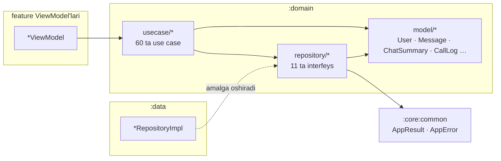

# `:domain` — Biznes qatlami

[← README'ga qaytish](../../../README.uz.md)

`:domain` — Clean Architecture'ning markazi. Unda **sof Kotlin** (JVM, Android'siz) biznes modellari, ilovaning
qolgan qismi murojaat qiladigan repository **interfeyslari** va **use case**'lar — har bir foydalanuvchi amali uchun
bitta kichik klass — joylashgan. Feature modullar (UI) faqat `:domain`ga bog'lanadi; `:data` esa uning repository
interfeyslarini amalga oshiradi. `:domain` Retrofit, Room, Stream yoki Android haqida hech narsa bilmagani uchun biznes
qoidalari (validatsiya, ruxsatlar, qo'ng'iroq yozuvi formati) oddiy JUnit bilan millisekundlarda test qilinadi, ma'lumot
manbasini esa UI'ga tegmasdan almashtirish mumkin.

- Paket: `uz.relay.domain`
- Turi: JVM kutubxona (`java-library` + Kotlin JVM + `java-test-fixtures`)
- Bog'liqligi: `:core:common` (`api` sifatida — `AppResult` / `AppError` domain API'ning bir qismi)
- Manba fayllar: **86** = 15 ta model fayli + 11 ta repository interfeysi + 60 ta use case

---

## 1. Ichki tuzilma



```text
feature *ViewModel ──► usecase/<soha>/<Amal>UseCase ──► repository/<Soha>Repository (interfeys)
                                   │                               ▲
                                   └──────► model/*  ◄─────────────┘ :data'da amalga oshiriladi (*RepositoryImpl)
natijalar: AppResult<T> = Success(data) | Error(AppError)   (:core:common'dan)
```

Har bir use case — `@Inject constructor(repository)` va `operator fun invoke(...)`ga ega klass, shuning uchun ViewModel
uni funksiya kabi chaqiradi: `requestOtp(phone)`. Ko'p use case'lar faqat repository'ga uzatadi; quyida **logic** deb
belgilanganlari esa o'zidan qoida qo'shadi.

---

## 2. Modellar (`model/`)

| Fayl | Turlar | Ma'nosi |
|---|---|---|
| `AppLanguage.kt` | `AppLanguage` (UZ, RU, EN) | ilova ichidagi til, BCP-47 tegi bilan; noma'lum teg → UZ |
| `AuthState.kt` | `AuthState` (LOGGED_OUT, NEEDS_PROFILE, LOGGED_IN) | boshlang'ich ekranni tanlaydi |
| `CallLog.kt` | `CallOutcome`, `CallLog`, `CallLogFormat` | chatda oddiy matn sifatida saqlanadigan qo'ng'iroq tarixi yozuvi, masalan `📞 Call · audio · 2:31`, `📞 Group call · video · started`; `format`/`parse`/`duration` |
| `Chat.kt` | `ChatType`, `MessageType`, `MessageStatus`, `ChatSummary`, `LastMessage`, `SystemEvent` | chatlar ro'yxati qatori, oxirgi xabar ko'rinishi, yetkazilish holati (SENDING → SENT → DELIVERED → READ yoki FAILED), tahlil qilingan SYSTEM hodisasi |
| `ChatMember.kt` | `MemberRole`, `ChatMember`, `GroupPermissions` | guruh a'zosi va server bilan bir xil ruxsat qoidalari (boshqarish, rolni o'zgartirish, chiqarish, boshqalarning xabarini o'chirish) |
| `ConnectionStatus.kt` | `ConnectionStatus` | OFFLINE > UPDATING > CONNECTING > CONNECTED (sarlavhadagi indikator) |
| `Media.kt` | `MediaKind`, `MessageMedia`, `UploadProgress`, `Attachment`, `DownloadState` | xabarga biriktirilgan media, yuklash jarayoni, tanlangan fayl, yuklab olish jarayoni/tugashi |
| `Message.kt` | `Message` | bitta chat xabari (clientMessageId, serverId/seq, javob, tahrirlangan/o'chirilgan, holat, media, yuklash) |
| `MuteDuration.kt` | `MuteDuration` | 1 soat, 8 soat, 1 kun, butunlay |
| `OtpRules.kt` | `OtpRules` | OTP kod uzunligi (6) |
| `RecentEmojis.kt` | `RecentEmojis` | so'nggi ishlatilgan emojilar qoidasi: `push` emojini boshiga qo'yadi, takrorini olib tashlaydi, ko'pi bilan `MAX` (24) ta saqlaydi |
| `ProfileRules.kt` | `ProfileRules` | ism 1–128 belgi, username `[a-zA-Z0-9_]{3,32}` (server bilan bir xil) |
| `SyncStatus.kt` | `SyncStatus` | sinxronlanmoqda / bootstrap tugagan bayroqlari |
| `ThemeMode.kt` | `ThemeMode` (SYSTEM, LIGHT, DARK) | ilova mavzusi |
| `User.kt` | `User` | profil (id, username, displayName, avatar, phone, online, lastSeenAt) |

---

## 3. Repository interfeyslari (`repository/`)

| Interfeys | Metodlar | Amalga oshiruvchi |
|---|---|---|
| `AuthRepository` | `authState: Flow<AuthState>`, `requestOtp(phone)`, `verifyOtp(phone, code): Boolean (isNewUser)`, `completeProfileSetup()`, `logout()` | `AuthRepositoryImpl` |
| `UserRepository` | `updateProfile(name, username)`, `observeMe()`, `refreshMe()`, `observeUserNames()`, `search(query)`, `observeUser(id)`, `refreshUser(id)`, `observeKnownUsers()` | `UserRepositoryImpl` |
| `ChatRepository` | `observeChats()`, `observeChat(id)`, `observeDirectChat(peerId)`, `observeSyncStatus()`, `refresh()`, `openDirect(peerId)`, `setMuted(chatId, muted, mutedUntil?)` | `ChatRepositoryImpl` |
| `MessageRepository` | `observeMessages`, `loadLatest`, `loadOlder` (→ hasMore), `sendText`, `sendMedia`, `cancelUpload`, `retry`, `edit`, `delete`, `sendTyping`, `markRead`, `search` | `MessageRepositoryImpl` |
| `GroupRepository` | `observeMembers`, `refreshMembers`, `createGroup`, `addMembers`, `removeMember`, `changeRole`, `rename`, `leave` | `GroupRepositoryImpl` |
| `ContactRepository` | `observeContacts()`, `observeContactIds()`, `add(userId)`, `remove(userId)` (lokal, faqat qurilmada) | `ContactRepositoryImpl` |
| `MediaRepository` | `download(media, fileName): Flow<DownloadState>`, `saveToGallery(media, fileName)` | `MediaRepositoryImpl` |
| `SettingsRepository` | `themeMode` / `setThemeMode`, `notificationsEnabled` / `setNotificationsEnabled`, `language` / `setLanguage`, `recentEmojis` / `addRecentEmoji` | `SettingsRepositoryImpl` |
| `ConnectionRepository` | `status: Flow<ConnectionStatus>` | `ConnectionRepositoryImpl` |
| `TypingRepository` | `typing: Flow<Map<chatId, Set<userId>>>` | `TypingTracker` |
| `CallRepository` | `startCall(peerUserId, video)`, `observeIncomingCalls()`, `prepareGroupCall(chatId, memberIds)`, `observeGroupCall(chatId)` | `CallRepositoryImpl` (Stream Video) |

Xato bilan tugashi mumkin bo'lgan suspend funksiyalar `AppResult<T>` qaytaradi; kuzatuvlar esa lokal bazaga tayangan
`Flow<T>` qaytaradi.

---

## 4. Use case'lar (`usecase/`) — 60 ta

| Paket | Use case | Vazifasi |
|---|---|---|
| `auth` | `RequestOtpUseCase` | serverdan OTP yuborishni so'rash (Telegram bot orqali) |
| | `VerifyOtpUseCase` | kodni tekshirish; foydalanuvchi yangimi-yo'qligini qaytaradi |
| | `CompleteProfileSetupUseCase` | birinchi profil to'ldirilganini belgilash |
| | `ObserveAuthStateUseCase` | LOGGED_OUT / NEEDS_PROFILE / LOGGED_IN holatini kuzatish |
| | `LogoutUseCase` | chiqish va lokal ma'lumotlarni tozalash |
| `call` | `StartCallUseCase` | foydalanuvchiga qo'ng'iroq qilish (1:1 audio/video) |
| | `ObserveIncomingCallsUseCase` | kiruvchi qo'ng'iroq id'lari |
| | `PrepareGroupCallUseCase` | guruh video xonasini olish yoki yaratish |
| | `ObserveGroupCallUseCase` | guruh xonasidagi ishtirokchilar (0 = yo'q) |
| `chat` | `ObserveChatsUseCase` | chatlar ro'yxati |
| | `ObserveChatUseCase` | bitta chat |
| | `ObserveDirectChatUseCase` | foydalanuvchi bilan shaxsiy chat (bo'lsa) |
| | `ObserveSyncStatusUseCase` | sinxronizatsiya bayroqlari |
| | `ObserveConnectionStatusUseCase` | sarlavhadagi ulanish holati |
| | `ObserveTypingUseCase` | har bir chatda kim yozayotgani |
| | `OpenDirectChatUseCase` | shaxsiy chatni olish yoki yaratish |
| | `RefreshChatsUseCase` | bootstrap / catch-up sinxronizatsiya |
| | `SetChatMutedUseCase` **logic** | ovozsiz rejimni yoqish/o'chirish yoki `MuteDuration`ni aniq tugash vaqtiga aylantirish |
| `contact` | `AddContactUseCase` | lokal kontakt qo'shish |
| | `RemoveContactUseCase` | lokal kontaktni o'chirish |
| | `ObserveContactsUseCase` | kontaktlar ro'yxati |
| | `ObserveContactIdsUseCase` | kontakt id'lari to'plami |
| `group` | `CreateGroupUseCase` **logic** | guruh yaratish (nom trim qilinadi) |
| | `RenameGroupUseCase` **logic** | guruh nomini o'zgartirish (nom trim qilinadi) |
| | `AddMembersUseCase` | a'zo qo'shish |
| | `RemoveMemberUseCase` | a'zoni chiqarish |
| | `ChangeMemberRoleUseCase` | admin / oddiy a'zo qilish |
| | `LeaveGroupUseCase` | guruhdan chiqish |
| | `ObserveMembersUseCase` | a'zolar ro'yxati |
| | `RefreshMembersUseCase` | a'zolarni serverdan qayta yuklash |
| `media` | `SendMediaMessageUseCase` **logic** | rasm/video/fayl yuborish (bo'sh izoh → izohsiz) |
| | `CancelUploadUseCase` | yuklashni bekor qilish |
| | `DownloadMediaUseCase` | jarayon ko'rsatkichi bilan yuklab olish |
| | `SaveMediaToGalleryUseCase` | telefon galereyasiga saqlash |
| `message` | `SendTextMessageUseCase` **logic** | matn yuborish (trim qilinadi; bo'sh matn yuborilmaydi) |
| | `EditMessageUseCase` **logic** | matnni tahrirlash (trim qilinadi) |
| | `DeleteMessageUseCase` | xabarni o'chirish |
| | `RetryMessageUseCase` | yuborilmagan xabarni qayta yuborish |
| | `LoadLatestMessagesUseCase` | eng yangi sahifa |
| | `LoadOlderMessagesUseCase` | eski sahifa (→ hasMore) |
| | `MarkChatReadUseCase` | "o'qildi" belgisini yuborish |
| | `ObserveMessagesUseCase` | chat xabarlari |
| | `SearchMessagesUseCase` **logic** | lokal qidiruv (bo'sh so'rov → bo'sh natija, bazaga murojaatsiz) |
| | `SendTypingUseCase` | "yozmoqda…" signali |
| `settings` | `ObserveThemeModeUseCase` / `SetThemeModeUseCase` | mavzu |
| | `ObserveLanguageUseCase` / `SetLanguageUseCase` | til |
| | `ObserveNotificationsEnabledUseCase` / `SetNotificationsEnabledUseCase` | bildirishnomalar tugmasi |
| | `ObserveRecentEmojisUseCase` / `AddRecentEmojiUseCase` | so'nggi ishlatilgan emojilar (chatdagi emoji paneli) |
| `user` | `ObserveMeUseCase` | mening profilim |
| | `RefreshMeUseCase` | profilimni qayta yuklash |
| | `UpdateProfileUseCase` | ism / username'ni o'zgartirish |
| | `ObserveUserUseCase` / `RefreshUserUseCase` | boshqa foydalanuvchi profili |
| | `ObserveUserNamesUseCase` | id → ism xaritasi (guruhdagi yuboruvchilar, tizim matnlari uchun) |
| | `ObserveKnownUsersUseCase` | qurilmada keshlangan foydalanuvchilar (guruh yaratishdagi nomzodlar) |
| | `SearchUsersUseCase` **logic** | username bo'yicha qidirish (trim qiladi, `@`ni olib tashlaydi; bo'sh → bo'sh, serverga so'rovsiz) |

---

## 5. Barcha fayllar

Yo'llar `domain/src/main/java/uz/relay/domain/`ga nisbatan.

| Fayl | Klass(lar) | Vazifasi | Kim ishlatadi |
|---|---|---|---|
| `model/AppLanguage.kt` | `AppLanguage` | til enum'i | settings, profile |
| `model/AuthState.kt` | `AuthState` | auth holati | MainViewModel, auth |
| `model/CallLog.kt` | `CallOutcome`, `CallLog`, `CallLogFormat` | qo'ng'iroq tarixi formati | chat, calls, chatlar ro'yxatidagi ko'rinish |
| `model/Chat.kt` | `ChatType`, `MessageType`, `MessageStatus`, `ChatSummary`, `LastMessage`, `SystemEvent` | chat modellari | chats, conversation, group |
| `model/ChatMember.kt` | `MemberRole`, `ChatMember`, `GroupPermissions` | a'zolar va ruxsatlar | group, conversation |
| `model/ConnectionStatus.kt` | `ConnectionStatus` | ulanish indikatori | chats, profile |
| `model/Media.kt` | `MediaKind`, `MessageMedia`, `UploadProgress`, `Attachment`, `DownloadState` | media modellari | conversation |
| `model/Message.kt` | `Message` | xabar modeli | conversation |
| `model/MuteDuration.kt` | `MuteDuration` | ovozsiz qilish variantlari | chats |
| `model/OtpRules.kt` | `OtpRules` | OTP uzunligi | auth |
| `model/ProfileRules.kt` | `ProfileRules` | profil validatsiyasi | auth, profile |
| `model/RecentEmojis.kt` | `RecentEmojis` | so'nggi emojilar qoidasi | AppSettingsStorage, FakeSettingsRepository |
| `model/SyncStatus.kt` | `SyncStatus` | sinxronizatsiya bayroqlari | chats |
| `model/ThemeMode.kt` | `ThemeMode` | mavzu enum'i | app, profile |
| `model/User.kt` | `User` | foydalanuvchi modeli | hamma joyda |
| `repository/AuthRepository.kt` | `AuthRepository` | auth shartnomasi | auth use case'lari |
| `repository/CallRepository.kt` | `CallRepository` | qo'ng'iroqlar shartnomasi | call use case'lari |
| `repository/ChatRepository.kt` | `ChatRepository` | chatlar shartnomasi | chat use case'lari |
| `repository/ConnectionRepository.kt` | `ConnectionRepository` | ulanish shartnomasi | `ObserveConnectionStatusUseCase` |
| `repository/ContactRepository.kt` | `ContactRepository` | kontaktlar shartnomasi | contact use case'lari |
| `repository/GroupRepository.kt` | `GroupRepository` | guruhlar shartnomasi | group use case'lari |
| `repository/MediaRepository.kt` | `MediaRepository` | media shartnomasi | media use case'lari |
| `repository/MessageRepository.kt` | `MessageRepository` | xabarlar shartnomasi | message/media use case'lari |
| `repository/SettingsRepository.kt` | `SettingsRepository` | sozlamalar shartnomasi | settings use case'lari |
| `repository/TypingRepository.kt` | `TypingRepository` | "yozmoqda" shartnomasi | `ObserveTypingUseCase` |
| `repository/UserRepository.kt` | `UserRepository` | foydalanuvchilar shartnomasi | user use case'lari |
| `usecase/auth/CompleteProfileSetupUseCase.kt` | `CompleteProfileSetupUseCase` | §4 ga qarang | ProfileSetup |
| `usecase/auth/LogoutUseCase.kt` | `LogoutUseCase` | §4 ga qarang | MyProfile |
| `usecase/auth/ObserveAuthStateUseCase.kt` | `ObserveAuthStateUseCase` | §4 ga qarang | MainViewModel |
| `usecase/auth/RequestOtpUseCase.kt` | `RequestOtpUseCase` | §4 ga qarang | Phone, Otp |
| `usecase/auth/VerifyOtpUseCase.kt` | `VerifyOtpUseCase` | §4 ga qarang | Otp |
| `usecase/call/ObserveGroupCallUseCase.kt` | `ObserveGroupCallUseCase` | §4 ga qarang | Chat |
| `usecase/call/ObserveIncomingCallsUseCase.kt` | `ObserveIncomingCallsUseCase` | §4 ga qarang | MainViewModel |
| `usecase/call/PrepareGroupCallUseCase.kt` | `PrepareGroupCallUseCase` | §4 ga qarang | Chat |
| `usecase/call/StartCallUseCase.kt` | `StartCallUseCase` | §4 ga qarang | Chat |
| `usecase/chat/ObserveChatsUseCase.kt` | `ObserveChatsUseCase` | §4 ga qarang | Chats, Search |
| `usecase/chat/ObserveChatUseCase.kt` | `ObserveChatUseCase` | §4 ga qarang | Chat, GroupInfo |
| `usecase/chat/ObserveConnectionStatusUseCase.kt` | `ObserveConnectionStatusUseCase` | §4 ga qarang | Chats, MyProfile |
| `usecase/chat/ObserveDirectChatUseCase.kt` | `ObserveDirectChatUseCase` | §4 ga qarang | UserProfile |
| `usecase/chat/ObserveSyncStatusUseCase.kt` | `ObserveSyncStatusUseCase` | §4 ga qarang | Chats |
| `usecase/chat/ObserveTypingUseCase.kt` | `ObserveTypingUseCase` | §4 ga qarang | Chats, Chat |
| `usecase/chat/OpenDirectChatUseCase.kt` | `OpenDirectChatUseCase` | §4 ga qarang | Search, NewMessage, UserProfile, GroupInfo |
| `usecase/chat/RefreshChatsUseCase.kt` | `RefreshChatsUseCase` | §4 ga qarang | Chats |
| `usecase/chat/SetChatMutedUseCase.kt` | `SetChatMutedUseCase` | §4 ga qarang | Chats, UserProfile, GroupInfo |
| `usecase/contact/AddContactUseCase.kt` | `AddContactUseCase` | §4 ga qarang | AddContact, UserProfile |
| `usecase/contact/ObserveContactIdsUseCase.kt` | `ObserveContactIdsUseCase` | §4 ga qarang | AddContact, UserProfile |
| `usecase/contact/ObserveContactsUseCase.kt` | `ObserveContactsUseCase` | §4 ga qarang | NewMessage |
| `usecase/contact/RemoveContactUseCase.kt` | `RemoveContactUseCase` | §4 ga qarang | NewMessage, UserProfile |
| `usecase/group/AddMembersUseCase.kt` | `AddMembersUseCase` | §4 ga qarang | GroupCreate (qo'shish rejimi) |
| `usecase/group/ChangeMemberRoleUseCase.kt` | `ChangeMemberRoleUseCase` | §4 ga qarang | GroupInfo |
| `usecase/group/CreateGroupUseCase.kt` | `CreateGroupUseCase` | §4 ga qarang | GroupCreate |
| `usecase/group/LeaveGroupUseCase.kt` | `LeaveGroupUseCase` | §4 ga qarang | GroupInfo |
| `usecase/group/ObserveMembersUseCase.kt` | `ObserveMembersUseCase` | §4 ga qarang | Chat, GroupInfo, GroupCreate |
| `usecase/group/RefreshMembersUseCase.kt` | `RefreshMembersUseCase` | §4 ga qarang | Chat, GroupInfo |
| `usecase/group/RemoveMemberUseCase.kt` | `RemoveMemberUseCase` | §4 ga qarang | GroupInfo |
| `usecase/group/RenameGroupUseCase.kt` | `RenameGroupUseCase` | §4 ga qarang | GroupInfo |
| `usecase/media/CancelUploadUseCase.kt` | `CancelUploadUseCase` | §4 ga qarang | Chat |
| `usecase/media/DownloadMediaUseCase.kt` | `DownloadMediaUseCase` | §4 ga qarang | Chat |
| `usecase/media/SaveMediaToGalleryUseCase.kt` | `SaveMediaToGalleryUseCase` | §4 ga qarang | MediaViewer |
| `usecase/media/SendMediaMessageUseCase.kt` | `SendMediaMessageUseCase` | §4 ga qarang | Chat |
| `usecase/message/DeleteMessageUseCase.kt` | `DeleteMessageUseCase` | §4 ga qarang | Chat |
| `usecase/message/EditMessageUseCase.kt` | `EditMessageUseCase` | §4 ga qarang | Chat |
| `usecase/message/LoadLatestMessagesUseCase.kt` | `LoadLatestMessagesUseCase` | §4 ga qarang | Chat |
| `usecase/message/LoadOlderMessagesUseCase.kt` | `LoadOlderMessagesUseCase` | §4 ga qarang | Chat |
| `usecase/message/MarkChatReadUseCase.kt` | `MarkChatReadUseCase` | §4 ga qarang | Chat |
| `usecase/message/ObserveMessagesUseCase.kt` | `ObserveMessagesUseCase` | §4 ga qarang | Chat, MediaViewer |
| `usecase/message/RetryMessageUseCase.kt` | `RetryMessageUseCase` | §4 ga qarang | Chat |
| `usecase/message/SearchMessagesUseCase.kt` | `SearchMessagesUseCase` | §4 ga qarang | ChatSearch |
| `usecase/message/SendTextMessageUseCase.kt` | `SendTextMessageUseCase` | §4 ga qarang | Chat, Call (qo'ng'iroq tarixi) |
| `usecase/message/SendTypingUseCase.kt` | `SendTypingUseCase` | §4 ga qarang | Chat |
| `usecase/settings/AddRecentEmojiUseCase.kt` | `AddRecentEmojiUseCase` | §4 ga qarang | ChatViewModel |
| `usecase/settings/ObserveLanguageUseCase.kt` | `ObserveLanguageUseCase` | §4 ga qarang | MyProfile |
| `usecase/settings/ObserveNotificationsEnabledUseCase.kt` | `ObserveNotificationsEnabledUseCase` | §4 ga qarang | MyProfile |
| `usecase/settings/ObserveRecentEmojisUseCase.kt` | `ObserveRecentEmojisUseCase` | §4 ga qarang | ChatViewModel |
| `usecase/settings/ObserveThemeModeUseCase.kt` | `ObserveThemeModeUseCase` | §4 ga qarang | MainViewModel, MyProfile |
| `usecase/settings/SetLanguageUseCase.kt` | `SetLanguageUseCase` | §4 ga qarang | MyProfile |
| `usecase/settings/SetNotificationsEnabledUseCase.kt` | `SetNotificationsEnabledUseCase` | §4 ga qarang | MyProfile |
| `usecase/settings/SetThemeModeUseCase.kt` | `SetThemeModeUseCase` | §4 ga qarang | MyProfile |
| `usecase/user/ObserveKnownUsersUseCase.kt` | `ObserveKnownUsersUseCase` | §4 ga qarang | GroupCreate |
| `usecase/user/ObserveMeUseCase.kt` | `ObserveMeUseCase` | §4 ga qarang | Chats, Chat, MyProfile, EditProfile, MediaViewer |
| `usecase/user/ObserveUserNamesUseCase.kt` | `ObserveUserNamesUseCase` | §4 ga qarang | Chats, Chat, ChatSearch, MediaViewer |
| `usecase/user/ObserveUserUseCase.kt` | `ObserveUserUseCase` | §4 ga qarang | UserProfile |
| `usecase/user/RefreshMeUseCase.kt` | `RefreshMeUseCase` | §4 ga qarang | Chats, MyProfile |
| `usecase/user/RefreshUserUseCase.kt` | `RefreshUserUseCase` | §4 ga qarang | UserProfile |
| `usecase/user/SearchUsersUseCase.kt` | `SearchUsersUseCase` | §4 ga qarang | Search, AddContact, GroupCreate |
| `usecase/user/UpdateProfileUseCase.kt` | `UpdateProfileUseCase` | §4 ga qarang | ProfileSetup, EditProfile |

Jami: **86 ta fayl**.

---

## 6. Test fixture'lari va testlar

`domain/src/testFixtures/` har bir feature modul testlari bilan `testImplementation(testFixtures(project(":domain")))`
orqali bo'lishiladi:

| Fayl | Tarkibi |
|---|---|
| `FakeRepositories.kt` | barcha 11 ta repository'ning xotiradagi soxta (fake) nusxalari (`FakeAuthRepository`, `FakeUserRepository`, `FakeChatRepository`, `FakeMessageRepository`, `FakeGroupRepository`, `FakeContactRepository`, `FakeMediaRepository`, `FakeSettingsRepository`, `FakeConnectionRepository`, `FakeTypingRepository`, `FakeCallRepository`) — holat `MutableStateFlow`da, natijalarni sozlash mumkin, chaqiruvlar yozib boriladi |
| `MainDispatcherRule.kt` | ViewModel testlari uchun `Dispatchers.Main`ni almashtiruvchi JUnit qoidasi |
| `TestData.kt` | tayyor `User`, `ChatSummary`, `ChatMember`, API xatolari |

| Test klassi | Nimani tekshiradi |
|---|---|
| `model/CallLogFormatTest` | qo'ng'iroq yozuvi formati ↔ parse (ikki tomonga), guruh formati, noto'g'ri matn, davomiyliklar |
| `model/ProfileRulesTest` | username/ism qoidalari |
| `model/GroupPermissionsTest` | OWNER / ADMIN / MEMBER ruxsatlari |
| `model/RecentEmojisTest` | eng yangisi birinchi, takrorlarsiz, ko'pi bilan 24 ta |
| `usecase/UseCaseLogicTest` | foydalanuvchi qidiruvi, xabar qidiruvi, ovozsiz rejim tugash vaqti, media izohi |

Ishga tushirish: `./gradlew :domain:test`
