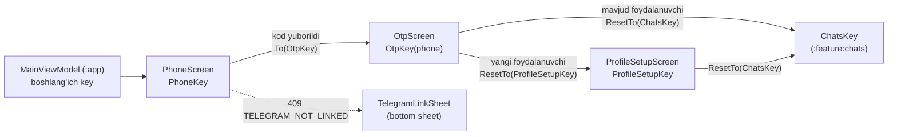

# `:feature:auth` — Kirish va profilni sozlash

[← README'ga qaytish](../../../README.uz.md)

## Vazifasi

Foydalanuvchi asosiy ilovaga kirishidan oldin ko'radigan hamma narsa: telefon raqamini kiritish, Relay Telegram boti yuboradigan bir martalik kodni (OTP) yozish va yangi foydalanuvchilar uchun ism hamda username tanlash. Boshlang'ich ekranni `:app` modulidagi `MainViewModel` hal qiladi (tizimdan chiqqan → `PhoneKey`, profil to'ldirilmagan → `ProfileSetupKey`, kirgan → `ChatsKey`).

**Bog'liqliklar:** `:domain`, `:core:common`, `:core:designsystem`, `:core:navigation`. Hech qachon `:data` yoki boshqa feature'larga bog'lanmaydi.

## Ekranlar oqimi



```text
MainViewModel ──► Phone ──(OTP so'raldi)──► Otp ──(yangi foydalanuvchi)──► ProfileSetup ──► Chats
                    │                         └──(mavjud foydalanuvchi)────────────────► Chats
                    └──(409 TELEGRAM_NOT_LINKED)──► TelegramLinkSheet (botni ochish / qayta yuborish)
```

## Pattern

Har bir ekran **Contract + ViewModel + Screen + DirectionsImpl** to'rtligidan iborat (Orbit MVI). Screen `Intent`larni `onEventDispatcher`ga yuboradi, ViewModel `UiState`ni yangilaydi va bir martalik `SideEffect`larni chiqaradi, navigatsiya esa `Contract.Directions` → `AppNavigator` orqali o'tadi. To'liq tushuntirish README'ning [boshidan oxirigacha bajarilish oqimi](../../../README.uz.md#5-boshidan-oxirigacha-ishlash-oqimi) bo'limida.

## Ekranlar

| Ekran (NavKey) | Intent'lar | UiState | SideEffect'lar | Directions → manzil | Use case'lar |
|---|---|---|---|---|---|
| **Phone** (`PhoneKey`) | `OnPhoneChange`, `OnGetCode`, `OnOpenBot`, `OnResendCode`, `OnDismissTelegramSheet` | `digits`, `loading`, `botUrl` (409 `TELEGRAM_NOT_LINKED` kelganda o'rnatiladi); hisoblanadigan `continueEnabled` (9 ta raqam) | `ShowError`, `OpenUrl` | `navigateToOtp` → `To(OtpKey(phone))` | `RequestOtpUseCase` |
| **Otp** (`OtpKey(phone)`, assisted ViewModel) | `OnCodeChange`, `OnResendCode`, `OnBack` | `phone`, `codeLength` (6), `code`, `status` (`Input` / `Wrong(attemptsLeft)` / `Expired` / `Locked`), `verifying`, `resending`, `secondsLeft` (60 s taymer); hisoblanadigan `inputEnabled` | `ShowError`, `Shake` | `back`; `navigateToProfileSetup` → `ResetTo(ProfileSetupKey)`; `navigateToChats` → `ResetTo(ChatsKey)` | `RequestOtpUseCase`, `VerifyOtpUseCase` |
| **ProfileSetup** (`ProfileSetupKey`) | `OnNameChange`, `OnUsernameChange`, `OnSuggestionClick`, `OnContinue` | `name`, `username`, `usernameTaken`, `suggestions`, `saving`; hisoblanadigan `nameValid`, `usernameValid`, `continueEnabled` (qoidalar `ProfileRules`dan) | `ShowError` | `navigateToChats` → `ResetTo(ChatsKey)` | `UpdateProfileUseCase`, `CompleteProfileSetupUseCase` |

**E'tiborga molik xatti-harakatlar**

- **Phone:** maydon faqat raqamlarni qabul qiladi (ko'pi bilan 9 ta); `+998` qotirilgan prefiks sifatida ko'rsatiladi, bo'shliqlar esa `LocalPhoneTransformation` orqali faqat ko'rinishda qo'shiladi. Server `409 TELEGRAM_NOT_LINKED` qaytarsa, javobda bot havolasi bo'ladi — ekran snackbar o'rniga `TelegramLinkSheet`ni ochadi.
- **Otp:** 6-raqam kiritilishi bilan tekshiruv avtomatik boshlanadi. `INVALID_OTP` urinishlar sonini kamaytiradi (ko'pi bilan 5 ta) va kataklarni silkitadi; 5-noto'g'ri kod yoki `OTP_LOCKED` holatni `Locked`ga o'tkazadi; `OTP_EXPIRED` holatni `Expired`ga o'tkazadi. "Qayta yuborish" 60 soniyalik taymerni qayta boshlaydi va 5 ta yangi urinish beradi.
- **ProfileSetup:** username kiritish `a–z A–Z 0–9 _` belgilari bilan cheklangan (ko'pi bilan 32 ta). `409 USERNAME_TAKEN` kelganda ekran ikkita taklif beradi (`<name>_dev`, `<name>01`). Qoidalar eslatmasi faqat kiritilgan qiymat noto'g'ri bo'lganda ko'rinadi.

## Komponentlar

| Fayl | Vazifasi |
|---|---|
| `otp/components/OtpCodeInput.kt` | Yashirin matn maydoni ustidagi oltita OTP katagi; ViewModel `Shake` chiqarganda silkinish animatsiyasini o'ynatadi. |
| `phone/components/TelegramLinkSheet.kt` | Telefon raqamini Telegram botiga ulash uchun raqamlangan qadamlar, "Botni ochish" va "Kodni qayta yuborish" tugmalari bo'lgan bottom sheet. |
| `profile/components/AvatarPicker.kt` | Kamera belgisi va "+" nishonli dumaloq avatar o'rni. **Faqat ko'rinish — rasm yuklash hali qilinmagan.** |

## Yordamchi fayllar

| Fayl | Mazmuni |
|---|---|
| `util/ErrorMessage.kt` | `AppError.messageRes()` → matn resursi (internet yo'q, juda ko'p urinish / 429, OTP yetkazib bo'lmadi, noma'lum). |
| `util/PhoneFormat.kt` | `UZ_PREFIX = "+998"`, `UZ_PHONE_DIGITS = 9`, `formatLocalPhone`, `formatFullPhone`, `LocalPhoneTransformation` (offset mapping'li VisualTransformation). |

## Barcha fayllar (19)

Yo'llar `feature/auth/src/main/java/uz/relay/feature/auth/` ga nisbatan berilgan.

| Fayl | Klass(lar) | Vazifasi | Bog'liqlik / kim ishlatadi |
|---|---|---|---|
| `AuthEntries.kt` | `authEntries()` | Phone, Otp va ProfileSetup ekranlarini ularning NavKey'lariga ro'yxatdan o'tkazadi. | `AppNavHost` (`:app`) chaqiradi |
| `di/AuthDirectionsModule.kt` | `AuthDirectionsModule` | Uchta `DirectionsImpl` klassini ularning `Contract.Directions`iga Hilt `@Binds` qiladi. | Hilt `ViewModelComponent` |
| `phone/PhoneContract.kt` | `PhoneContract` (Intent, SideEffect, UiState, Directions) | Telefon kiritish ekranining contract'i. | Screen, ViewModel |
| `phone/PhoneViewModel.kt` | `PhoneViewModel` | Raqamlarni tekshiradi, OTP so'raydi, Telegram ulanmagan holatni boshqaradi. | `RequestOtpUseCase`, `PhoneContract.Directions` |
| `phone/PhoneScreen.kt` | `PhoneScreen`, `PhoneScreenContent` | Holatli ekran (snackbar, bot havolasini ochish) + preview va testlar ishlatadigan holatsiz content. | `PhoneViewModel`, `TelegramLinkSheet` |
| `phone/PhoneDirectionsImpl.kt` | `PhoneDirectionsImpl` | `OtpKey(phone)` ga o'tadi. | `AppNavigator` |
| `phone/components/TelegramLinkSheet.kt` | `TelegramLinkSheet` | Telegram botini ulash oynasi. | `PhoneScreen` |
| `otp/OtpContract.kt` | `OtpContract` (+ `Status`, `MAX_ATTEMPTS`, `RESEND_SECONDS`) | Kod ekranining contract'i. | Screen, ViewModel |
| `otp/OtpViewModel.kt` | `OtpViewModel` (assisted `phone`) | Kodni tekshiradi, urinishlarni sanaydi, qayta yuborish taymeri, yangi/mavjud foydalanuvchini yo'naltiradi. | `RequestOtpUseCase`, `VerifyOtpUseCase` |
| `otp/OtpScreen.kt` | `OtpScreen`, `OtpScreenContent`, holat qatorlari, bloklangan karta, qayta yuborish taymeri | OTP UI; `Shake` side effect'larini kod kiritish komponentiga uzatadi. | `OtpViewModel`, `OtpCodeInput` |
| `otp/OtpDirectionsImpl.kt` | `OtpDirectionsImpl` | Orqaga; ProfileSetup yoki Chats'ga `ResetTo`. | `AppNavigator` |
| `otp/components/OtpCodeInput.kt` | `OtpCodeInput` | Silkinish animatsiyali 6 katakli kod kiritish. | `OtpScreen` |
| `profile/ProfileSetupContract.kt` | `ProfileSetupContract` | Ism/username formasining contract'i. | Screen, ViewModel |
| `profile/ProfileSetupViewModel.kt` | `ProfileSetupViewModel` | Kiritishni filtrlaydi, profilni saqlaydi, 409 kelganda username taklif qiladi, sozlashni yakunlaydi. | `UpdateProfileUseCase`, `CompleteProfileSetupUseCase` |
| `profile/ProfileSetupScreen.kt` | `ProfileSetupScreen`, `ProfileSetupScreenContent`, `SuggestionChip` | Profil sozlash UI. | `ProfileSetupViewModel`, `AvatarPicker` |
| `profile/ProfileSetupDirectionsImpl.kt` | `ProfileSetupDirectionsImpl` | `ResetTo(ChatsKey)`. | `AppNavigator` |
| `profile/components/AvatarPicker.kt` | `AvatarPicker` | Avatar o'rni (faqat ko'rinish). | `ProfileSetupScreen` |
| `util/ErrorMessage.kt` | `messageRes()` | Xato → tarjima qilingan xabar. | Ekranlar |
| `util/PhoneFormat.kt` | telefon yordamchilari | `+998` formatlash va vizual transformatsiya. | `PhoneScreen`, `OtpScreen` |

## Resurslar

`res/values/strings.xml` (o'zbekcha, asosiy), `values-ru/strings.xml`, `values-en/strings.xml`. "N ta urinish qoldi" uchun plurals bor (ruschada `few`/`many` shakllari).

## Testlar

| Turi | Klasslar |
|---|---|
| ViewModel (orbit-test + fake'lar) | `PhoneViewModelTest`, `OtpViewModelTest`, `ProfileSetupViewModelTest` |
| Compose UI (Robolectric) | `PhoneScreenTest`, `OtpScreenTest`, `ProfileSetupScreenTest` |
| Screenshot (Roborazzi) | `AuthScreenshotTest` — telefon, noto'g'ri OTP, band username; yorug' va tungi tema |
