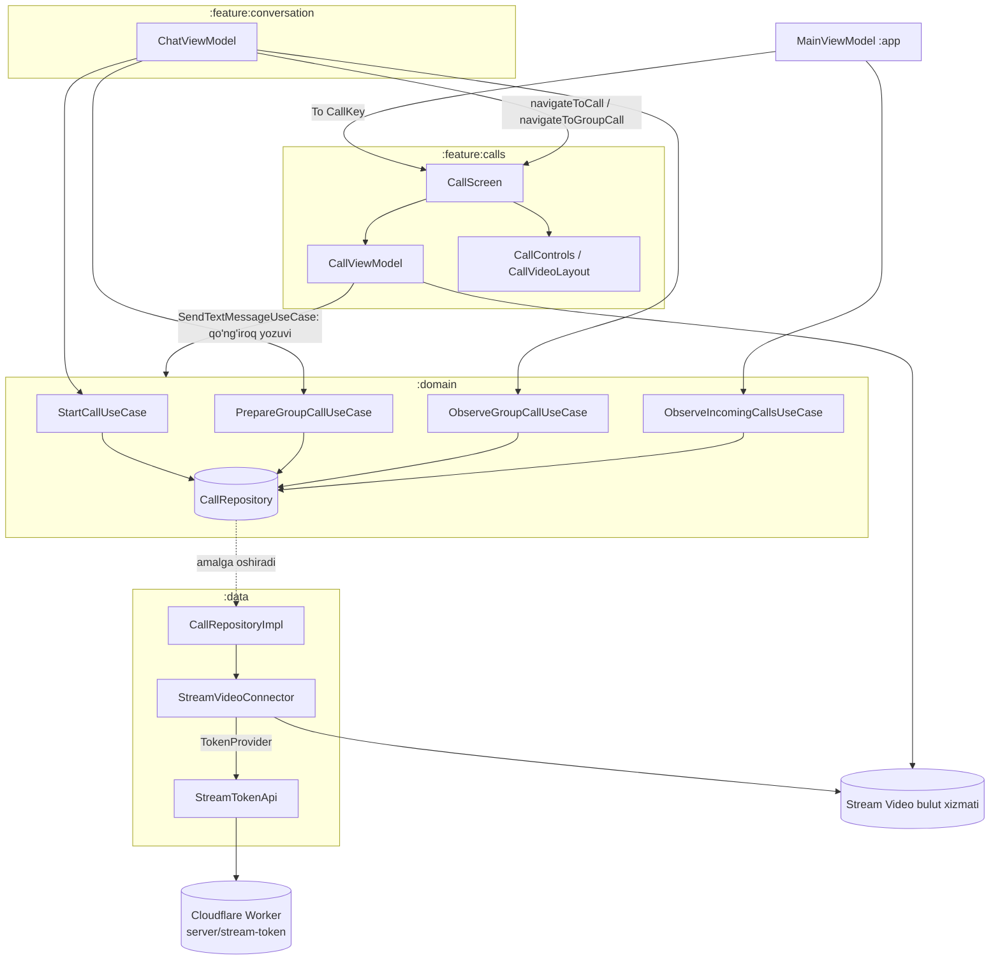
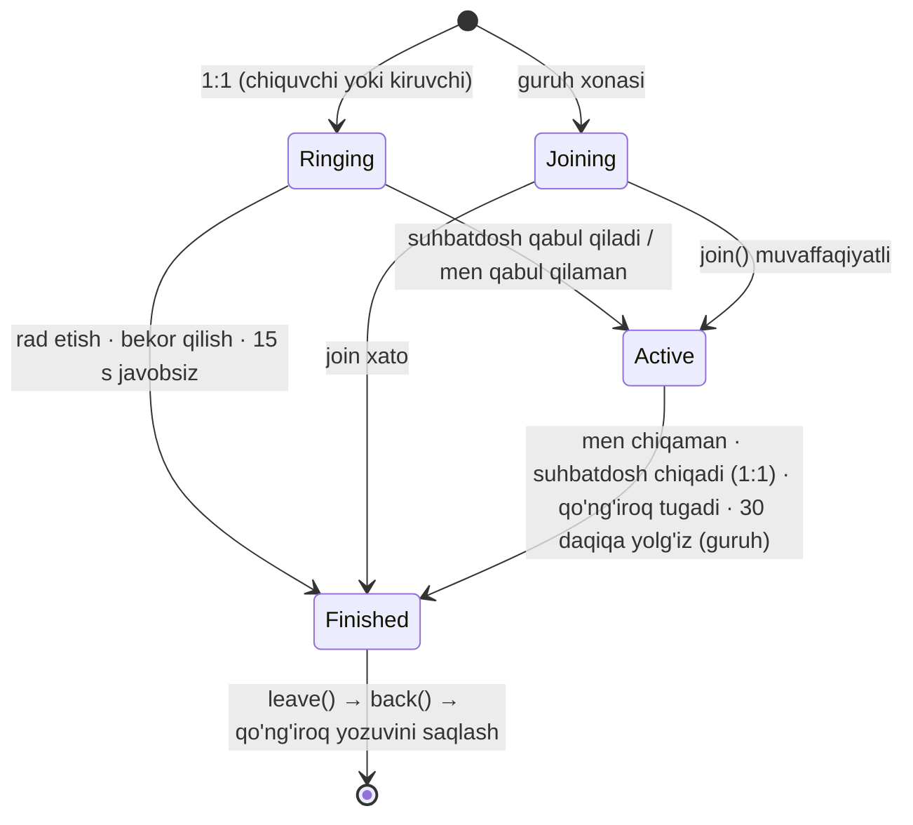
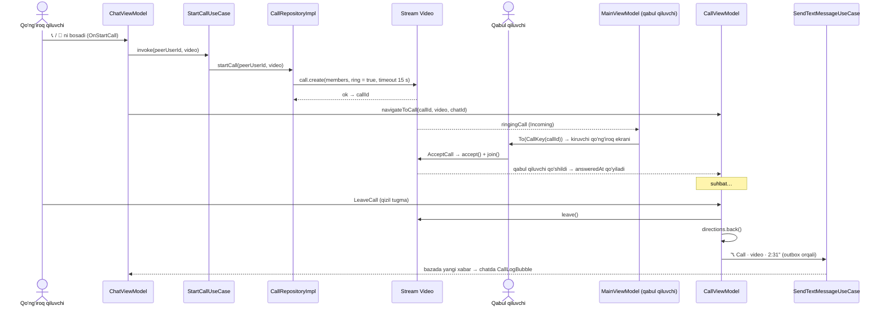

# `:feature:calls` — Audio va video qo'ng'iroqlar

[← README'ga qaytish](../../../README.uz.md)

Relay serverida **qo'ng'iroq, signaling va qo'ng'iroq push'i yo'q**, uning API'sini esa o'zgartirib bo'lmaydi. Shu sababli qo'ng'iroqlar **[Stream Video](https://getstream.io/video/)** (Android SDK 1.35) ustiga qurilgan:

- Stream foydalanuvchi id'si = Relay `userId`, ko'rinadigan ism = Relay `displayName`.
- Alohida ro'yxatdan o'tish kerak emas.
- Stream tiplari `:data` (`CallRepositoryImpl`, `StreamVideoConnector`) va shu moduldan tashqariga chiqmaydi.

| | |
|---|---|
| Modul turi | Android library (Compose, Hilt, KSP) |
| Bog'liqliklar | `:domain`, `:core:common`, `:core:designsystem`, `:core:navigation`, Stream Video Compose + video filtrlar |
| Ekranlar | 1 ta (`CallScreen`): 1:1 qo'ng'iroqlarni (jiringlash bilan) **va** guruh video chatlarini (ochiq xona) boshqaradi |
| Manba fayllar | 9 ta Kotlin fayl |

Imkoniyatlar:
- jiringlash va 15 soniyalik javobsiz tugash bilan 1:1 audio va video qo'ng'iroqlar;
- guruhdagi istalgan odam qo'shila oladigan Telegram uslubidagi **guruh video chati**;
- to'liq ekranli video;
- **Picture-in-Picture**;
- emoji **reaksiyalar**;
- **qo'l ko'tarish**;
- **ekranni ulashish**;
- **orqa fonni xiralashtirish / virtual fonlar** (ML Kit);
- chatda saqlanadigan qo'ng'iroqlar tarixi.

> FCM bo'lmagani uchun qo'ng'iroqlar faqat ilova ochiq yoki yaqinda fonga o'tgan bo'lsa jiringlaydi. Yopiq ilovani jiringlatish uchun Firebase push kerak; u rejalashtirilgan, hali amalga oshirilmagan.

---

## 1. Qismlar qanday birlashadi



```text
ChatViewModel ─► StartCall/PrepareGroupCall/ObserveGroupCall UseCase ─► CallRepository
                                                          (impl: CallRepositoryImpl ─► StreamVideoConnector)
StreamVideoConnector ─TokenProvider─► StreamTokenApi ─► Cloudflare Worker ─► Relay /v1/users/me
MainViewModel ─ kiruvchi qo'ng'iroq ─► To(CallKey) ─► CallScreen ─► CallViewModel ─► Stream Call
CallViewModel ─ finish() ─► SendTextMessageUseCase (chatda "📞 Call · audio · 2:31")
```

### Data qatlami tomoni (tafsilotlar [data.md](data.md)da)

| Klass | Vazifasi |
|---|---|
| `StreamVideoConnector` | `App.onCreate`dan ishga tushadi. Relay foydalanuvchisi tizimga kirganda Stream client'ini quradi, **birinchi token'ni token serveridan** 5 ta urinish va kutish (backoff) bilan oladi. Keyingi token'larni SDK `TokenProvider` orqali yangilaydi. Logout'da uziladi. Token URL'i berilmagan release build'da qo'ng'iroqlar o'chiq qoladi. |
| `CallRepositoryImpl` | `startCall` tasodifiy UUID va `ring = true` bilan `default` qo'ng'iroq yaratadi, 15 soniyalik avtomatik bekor qilish va kiruvchi timeout bilan. `observeIncomingCalls` jiringlayotgan, hali qabul qilinmagan qo'ng'iroqlarni chiqaradi. `prepareGroupCall` `group_<chatId>` xonasini `ring = false` bilan yaratadi yoki oladi. `observeGroupCall` jonli ishtirokchilar sonini beradi, har 30 soniyada qayta so'raydi. |
| `server/stream-token` | Cloudflare Worker. Relay token'ini `/v1/users/me` orqali tekshiradi va 1 soatlik HS256 JWT'ni imzolaydi. Stream secret hech qachon APK ichiga tushmaydi. |

---

## 2. Ekran kontrakti

| Element | Qiymatlar |
|---|---|
| NavKey | `CallKey(callId, video?, chatId?, group = false)`. `chatId` faqat qo'ng'iroq qiluvchida (1:1) yoki guruh xonalarida beriladi. |
| Intent'lar | `OnCallAction(CallAction)` (Stream accept/decline/cancel/leave/mic/camera/…), `OnBack`, `OnFinished`, `OnSendReaction(emoji)`, `OnToggleHand`, `OnScreenSharePrepare`, `OnStartScreenShare(Intent?)`, `OnStopScreenShare`, `OnSelectBackground(CallBackground)` |
| UiState | `isVideo`, `isGroup`, `unavailable` (Stream client yo'q), `raisedHands` (userId → ism), `myHandRaised`, `background` |
| SideEffect'lar | `ShowError(AppError)`, `NoAnswer` |
| Directions | `back()` → `AppNavigationParam.Back` |
| Use case'lar | `SendTextMessageUseCase` (qo'ng'iroqlar tarixi). Qolgan hamma narsa ViewModel ushlab turgan Stream `Call` obyekti bilan ishlaydi. |

Stream `Call` obyekti composable'da emas, **ViewModel'da** saqlanadi. Shu sababli ekran burilishi yoki konfiguratsiya o'zgarishi qo'ng'iroqni uzmaydi.

---

## 3. `CallViewModel` hayot sikli



| Masala | 1:1 qo'ng'iroq | Guruh video chati |
|---|---|---|
| Boshlanish | `RingingCallContent`; qo'ng'iroq qiluvchi kutadi, qabul qiluvchi qabul qiladi yoki rad etadi | darhol qo'shiladi (`call.join()`), jiringlash yo'q |
| Javob yo'q | 15 s + 2 s zaxira vaqtdan keyin: `reject(Cancel)`, `SideEffect.NoAnswer`, `MISSED` yoziladi | — |
| Suhbatdosh chiqadi | qo'ng'iroq men uchun ham tugaydi (`observeEnd`) | xona ochiq qoladi |
| Server tugatdi / bo'sh holat | `observeCallClosed`: `endedAt` qo'yildi yoki jonli bo'lgandan keyin jiringlash holati Idle'ga qaytdi | faqat `endedAt` |
| Yolg'iz | — | **30 daqiqa** yolg'iz qolinsa avtomatik yopiladi (`watchAloneInGroup`; kimdir qo'shilsa taymer qayta boshlanadi) |
| Davomiylik | suhbatdosh qo'shilgan paytdan | xona sessiyasining `startedAt`idan |
| Chatdagi qo'ng'iroq yozuvi | **faqat qo'ng'iroq qiluvchi** (`chatId != null`): `📞 Call · audio · 2:31` / `… missed/declined/canceled` | "Video chat boshlandi"ni `ChatViewModel` yuboradi; `📞 Group call · video · 12:34`ni **oxirgi chiqqan odam** yuboradi |

**`finish()`** aynan bir marta ishlaydi:
1. Main thread'da `leave()`ni chaqiradi (xatolar e'tiborsiz qoldiriladi).
2. `directions.back()`ni chaqiradi, shunda ekran har doim yopiladi va hech qachon qora bo'lib qolmaydi.
3. Qo'ng'iroq yozuvini `NonCancellable` ichida saqlaydi, shuning uchun u ViewModel tozalanganda ham yo'qolmaydi.

`finish()` hech qachon ishlamagan bo'lsa, `onCleared()` ham `leave()`ni chaqiradi.

**Orqaga tugmasi** (`backAction`): kiruvchi → rad etish, chiquvchi → bekor qilish, faol → chiqish.

### Qo'shimchalar

| Imkoniyat | Qanday |
|---|---|
| Reaksiyalar 👍❤️😂😮👏🎉 | `call.sendReaction("reaction", emoji)`. Stream ularni yuboruvchining plitkasida animatsiya qiladi. Maxsus `Alignment` bilan yuqori panel ostiga joylashtiriladi (`offset` ishlatilmaydi). |
| Qo'l ko'tarish | `sendCustomEvent` orqali `{type: "raise_hand", raised}` custom event'i. Mahalliy holat oldindan (optimistik) o'zgaradi va xato bo'lsa qaytariladi. Boshqalar yuqori panel ostida "✋ Ism"ni ko'radi. Qo'l egasi chiqib ketsa, belgi yo'qoladi. |
| Ekranni ulashish | `MediaProjection` ruxsati, keyin `call.startScreenSharing(data)`. Kamera va mikrofon holati tizim dialogidan oldin saqlanadi va undan keyin tiklanadi. Dialog ochiq paytda PiP to'xtatib turiladi. Ulashilgan ekran butun maydonni egallaydi, kameralar esa yon plitkalarda, birinchi bo'lib ulashayotgan odamniki. |
| Orqa fon | `NONE`, `BLUR` (`BlurredBackgroundVideoFilter`) yoki `BRAND / SUNSET / NIGHT / NATURE` rasmlaridan biri (`VirtualBackgroundVideoFilter`). Faqat **mening kameramga** qo'llanadi. Rasmlar ilovaga qo'shilgan, har biri taxminan 5–10 KB bo'lgan webp fayllar. |
| Picture-in-Picture | Video qo'ng'iroq paytida Home yoki Orqaga bosilsa kichik oyna ko'rsatiladi. PiP'da ustki qatlamlar yashiriladi. Qo'ng'iroq PiP'da tugasa, PiP oynasida chat ko'rsatish o'rniga ilova fonga o'tadi (`moveTaskToBack`). |
| Ruxsatlar | ekran ochilganda so'raladi: `RECORD_AUDIO`, `CAMERA` (faqat video), `BLUETOOTH_CONNECT` (Android 12+). Rad etilsa, qo'ng'iroq shu trek o'chiq holda davom etadi. |

---

## 4. `CallScreen` tuzilmasi

```text
CallScreen
├─ BackHandler → OnBack
├─ unavailable? → "Qo'ng'iroqlar hozircha ishlamayapti"
└─ CallPermissions + VideoTheme(brend rangi)
   ├─ guruh  → FullScreenVideoCall (ruxsat dialogi yopilgandan keyin)
   └─ 1:1    → RingingCallContent
               ├─ qabul qilindi & video → FullScreenVideoCall
               ├─ qabul qilindi & audio → AudioCallContent + CallControls
               └─ rad etildi / javobsiz / idle → OnFinished
FullScreenVideoCall = Stream CallContent (videoContent = CallVideoContent, PiP config)
                      + yuqori qatlam (CallTopBar, RaisedHandsChip)
                      + pastki qatlam (CallControls + MorePanel: reaksiyalar · qo'l ko'tarish · ulashish · orqa fon)
```

Boshqaruv tugmalari:
- **Video:** Kamera · Almashtirish · Mikrofon · Ko'proq · Tugatish.
- **Audio:** Mikrofon · Karnay · Tugatish.

"O'chiq" tugma teskari ranglarda chiziladi (oq doira, qora ikonka). Tugatish tugmasi go'shak ikonkali qizil 64 dp doira.

---

## 5. Chiquvchi 1:1 qo'ng'iroq: boshidan oxirigacha



---

## 6. `:feature:calls`dagi har bir fayl (src/main)

| Fayl | Klass(lar) | Vazifasi | Bog'liqliklar / kim ishlatadi |
|---|---|---|---|
| `uz/relay/feature/calls/CallsEntries.kt` | `callsEntries()` | `entry<CallKey>` → `CallScreen`ni ro'yxatdan o'tkazadi | `AppNavHost`dan chaqiriladi |
| `uz/relay/feature/calls/di/CallsDirectionsModule.kt` | `CallsDirectionsModule` | Hilt `@Binds CallDirectionsImpl → CallContract.Directions` | ViewModelComponent |
| `uz/relay/feature/calls/call/CallContract.kt` | `CallContract` (Intent, SideEffect, UiState, Directions), `CallBackground` | ekran kontrakti va orqa fon variantlari | `CallViewModel`, `CallScreen` |
| `uz/relay/feature/calls/call/CallViewModel.kt` | `CallViewModel` (+ assisted `Factory`) | Stream qo'ng'iroq hayot sikli: qabul qilish/rad etish/bekor qilish/chiqish, jiringlash timeout'i, guruhga qo'shilish va yolg'izlik timeout'i, qo'ng'iroq yozuvi, qo'l ko'tarish, reaksiyalar, ekran ulashish, orqa fon filtrlari | Stream `Call`, `SendTextMessageUseCase`, `CallContract.Directions` |
| `uz/relay/feature/calls/call/CallScreen.kt` | `CallScreen`, `CallContentHost`, `FullScreenVideoCall`, `rememberScreenShareLauncher`, `CallPermissions` | qo'ng'iroq UI host'i: jiringlash va faol holat, to'liq ekranli video, PiP, ekran ulashish ruxsati oqimi, runtime ruxsatlar | `CallViewModel`, Stream Compose UI, komponentlar |
| `uz/relay/feature/calls/call/CallDirectionsImpl.kt` | `CallDirectionsImpl` | `back()` → `AppNavigator.navigate(Back)` | `AppNavigator` |
| `uz/relay/feature/calls/call/CallBackgroundRes.kt` | `imageResOrNull()`, `imageRes()` | `CallBackground`ni ilovaga qo'shilgan `drawable-nodpi/call_bg_*` rasmlariga moslaydi | `CallViewModel`, `CallControls` |
| `uz/relay/feature/calls/call/components/CallControls.kt` | `CallControls`, `CallExtras`, `MorePanel`, `BackgroundRow`, `PillButton`, `RaisedHandsChip`, `CallTopBar`, `ControlButton` | pastki boshqaruv paneli, "Ko'proq" paneli (reaksiyalar, qo'l, ulashish, orqa fon), ism yoki "Video chat" va davomiylik ko'rsatiladigan yuqori panel | `CallScreen` |
| `uz/relay/feature/calls/call/components/CallVideoLayout.kt` | `CallVideoContent`, `ScreenShareWithCameras`, `MyFloatingVideo`, `rememberBelowTopBarAlignment` | video maydoni: ishtirokchilar to'ri, suzuvchi o'z kamerasi, ekran ulashish layout'i; reaksiyalar va o'z kamerasini ustki yuqori panel ostida ushlab turadi | Stream `ParticipantsLayout`, `ParticipantVideo`, `ScreenShareVideoRenderer` |

Resurslar:
- `values` (uz), `values-ru`, `values-en` dagi matnlar;
- `drawable-nodpi`dagi 4 ta orqa fon rasmi.

Fayllar sonini tekshirish: `find feature/calls/src/main -name '*.kt'` **9** ni qaytaradi.

---

## 7. Testlar

| Test klassi | Turi | Nimani tekshiradi |
|---|---|---|
| `CallViewModelTest` | Robolectric + Orbit Test (4) | Stream client bo'lmasa ekran "ishlamayapti" holatida; istalgan harakat ekranni yopadi va qo'ng'iroq yozuvi yuborilmaydi; guruh qo'ng'irog'i doim video; audio qo'ng'iroq audio bo'lib qoladi |
| `CallBackgroundResTest` | JVM (3) | `NONE`/`BLUR` rasmsiz; har bir rasmli fon o'z drawable'iga ega; rasmsiz fonda `imageRes()` xato beradi |

Jonli Stream `Call` bilan ishlaydigan qismlar (qabul qilish, jiringlash taymeri, chiqish, qo'ng'iroq yozuvi matni, qo'l ko'tarish, ekran ulashish) Stream test dublyorini talab qiladi va real qurilmada tekshiriladi. Qo'ng'iroq yozuvi formatining o'zi `:domain`dagi `CallLogFormatTest` bilan qamrab olingan.
