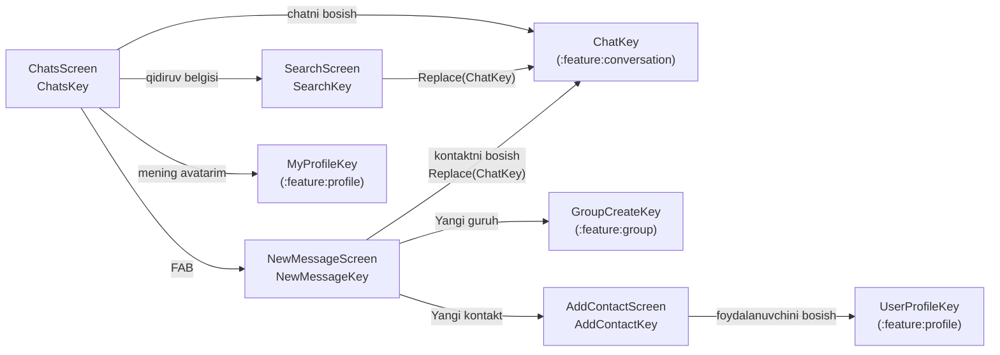

# `:feature:chats` — Chatlar ro'yxati, qidiruv, yangi xabar va kontaktlar

[← README'ga qaytish](../../../README.uz.md)

## Vazifasi

Kirishdan keyingi ilovaning asosiy sahifasi: **Hammasi / Shaxsiy / Guruhlar** tablari bilan chatlar ro'yxati, umumiy qidiruv (serverdagi foydalanuvchilar + nomi bo'yicha lokal chatlar), "Yangi xabar" ekrani (yangi guruh, yangi kontakt, kontaktlar ro'yxati) va username bo'yicha kontakt qo'shish. Kontaktlar — **faqat qurilmada saqlanadigan lokal ro'yxat** (Relay'da kontaktlar endpoint'i yo'q).

**Bog'liqliklar:** `:domain`, `:core:common`, `:core:designsystem`, `:core:navigation`. Boshqa feature'larni faqat NavKey'lar orqali ochadi (`ChatKey`, `GroupCreateKey`, `UserProfileKey`, `MyProfileKey`).

## Ekranlar oqimi



```text
Chats ──qidiruv──► Search ──foydalanuvchi/chat──► Chat (Replace)
  │──FAB──► NewMessage ──Yangi guruh──► GroupCreate
  │            │──Yangi kontakt──► AddContact ──foydalanuvchini bosish──► UserProfile
  │            └──kontaktni bosish──► Chat (Replace)
  │──mening avatarim──► MyProfile
  └──chatni bosish──► Chat
```

## Pattern

Contract + ViewModel + Screen + DirectionsImpl (Orbit MVI). Qidiruv ekranlari umumiy debounce pattern'idan foydalanadi: matn `blockingIntent` bilan sinxron yangilanadi, oldingi qidiruv job'i bekor qilinadi va server so'rovi yozish to'xtagandan **300 ms** keyin boshlanadi. Batafsil: [README → boshidan oxirigacha ishlash oqimi](../../../README.uz.md#5-boshidan-oxirigacha-ishlash-oqimi).

## Ekranlar

| Ekran (NavKey) | Intent'lar | UiState | SideEffect'lar | Directions → manzil | Use case'lar |
|---|---|---|---|---|---|
| **Chats** (`ChatsKey`) | `OnRetrySync`, `OnChatClick`, `OnSearchClick`, `OnNewMessageClick`, `OnMyProfileClick`, `OnMute(chatId, MuteDuration)`, `OnUnmute` | `chats`, `userNames`, `me`, `connectionStatus`, `typing` (chatId → foydalanuvchilar, men bundan mustasno), `isBootstrapped`; hisoblanadigan `showSkeleton`, `showEmpty`, `chatsFor(tab)`, `unreadChatsIn(tab)` | `ShowError` (faqat qayta urinsa bo'ladigan xatolar; **Qayta urinish** tugmali snackbar), `ShowActionError` | `navigateToChat` → `To(ChatKey)`; `navigateToSearch` → `To(SearchKey)`; `navigateToNewMessage` → `To(NewMessageKey)`; `navigateToMyProfile` → `To(MyProfileKey)` | `ObserveChats`, `ObserveSyncStatus`, `ObserveUserNames`, `ObserveMe`, `ObserveConnectionStatus`, `ObserveTyping`, `RefreshChats`, `RefreshMe`, `SetChatMuted` |
| **Search** (`SearchKey`) | `OnQueryChange`, `OnClear`, `OnBack`, `OnChatClick`, `OnUserClick` | `query`, `results` (foydalanuvchilar), `chatResults` (lokal, nomi bo'yicha, darhol), `searchedQuery`, `isSearching`, `openingUserId`; hisoblanadigan `normalizedQuery` (trim, `@`ni olib tashlash), `showNothingFound` | `ShowError` | `back`; `navigateToChat` → `Replace(ChatKey)` | `SearchUsers`, `OpenDirectChat`, `ObserveChats` |
| **NewMessage** (`NewMessageKey`) | `OnBack`, `OnNewGroup`, `OnNewContact`, `OnContactClick`, `OnRemoveContact` | `contacts`, `isLoaded`, `openingUserId` | `ShowError` | `back`; `navigateToGroupCreate` → `To(GroupCreateKey())`; `navigateToAddContact` → `To(AddContactKey)`; `navigateToChat` → `Replace(ChatKey)` | `ObserveContacts`, `RemoveContact`, `OpenDirectChat` |
| **AddContact** (`AddContactKey`) | `OnQueryChange`, `OnClear`, `OnBack`, `OnAdd(user)`, `OnUserClick` | `query`, `results`, `searchedQuery`, `isSearching`, `contactIds`, `addingUserId`; hisoblanadigan `normalizedQuery`, `showNothingFound` | `ShowError`, `Added(name)` | `back`; `navigateToUserProfile` → `To(UserProfileKey)` | `SearchUsers`, `AddContact`, `ObserveContactIds` |

**E'tiborga molik xatti-harakatlar**

- **Chats** oltita baza Flow'ini bitta `UiState`ga birlashtiradi, shuning uchun WebSocket orqali xabar kelganda ro'yxat o'zi yangilanadi. `ChatTab` (`ALL`, `DIRECT`, `GROUPS`) — oddiy filtr; tablar `HorizontalPager` (Telegram'dagidek surish bilan) va har bir tabda o'qilmagan chatlar hisoblagichi bor. Birinchi sinxronizatsiyagacha (`isBootstrapped`) skeleton qatorlar ko'rsatiladi.
- **Ovozsiz qilish:** chatni bosib turish → `MuteSheet` (1 soat / 8 soat / 1 kun / butunlay yoki ovozni yoqish). Muddat `SetChatMutedUseCase` ichida mutlaq tugash vaqtiga aylantiriladi.
- **Search** natijalari chatni `Replace` bilan ochadi, shuning uchun chatdan "Orqaga" bosilganda qidiruvga emas, ro'yxatga qaytiladi.
- **NewMessage:** kontaktni o'chirish uchun bosib turish va tasdiqlash dialogi kerak.

## Komponentlar

| Fayl | Vazifasi |
|---|---|
| `list/components/ChatRow.kt` | 76 dp chat qatori: online nuqtali avatar, nom, ovozsiz/guruh belgilari, vaqt, preview, o'qilmaganlar nishoni, yetkazish holati (✓/✓✓). |
| `list/components/ChatsTabs.kt` | Indikatorli va har bir tab uchun o'qilmaganlar soni ko'rsatiladigan Hammasi / Shaxsiy / Guruhlar tablari. |
| `list/components/ChatsTopBar.kt` | App bar: logo + "SwiftChat" (yoki "Yangilanmoqda…" / "Ulanmoqda…"), qidiruv tugmasi, mening avatarim. |
| `list/components/EmptyChats.kt` | "Yangi chat" tugmali bo'sh holat. |
| `list/components/MuteSheet.kt` | Bosib turishda ochiladigan bottom sheet: ovozsiz qilish muddatlari yoki ovozni yoqish. |

## Yordamchi fayllar

| Fayl | Mazmuni |
|---|---|
| `util/ChatPreviewText.kt` | `buildChatPreview(...)` → preview qatori uchun `AnnotatedString`: kursiv "o'chirilgan", SYSTEM hodisalari gap ko'rinishida, 📞/🎥 bilan qo'ng'iroq yozuvlari, "Siz:" / "Ism:" prefikslari, rangli Rasm / Video / Fayl yorliqlari. |
| `util/ChatTime.kt` | `formatChatTime` (bugun HH:mm, "Kecha", 7 kun ichida hafta kuni, dd.MM), `formatMuteUntil`. |
| `util/ErrorMessage.kt` | `AppError.messageRes()` (internet yo'q, juda ko'p urinish, noma'lum). |

## Barcha fayllar (26)

Yo'llar `feature/chats/src/main/java/uz/relay/feature/chats/` ga nisbatan berilgan.

| Fayl | Klass(lar) | Vazifasi | Bog'liqlik / kim ishlatadi |
|---|---|---|---|
| `ChatsEntries.kt` | `chatsEntries()` | Chats, Search, NewMessage, AddContact'ni ro'yxatdan o'tkazadi. | `AppNavHost` |
| `di/ChatsDirectionsModule.kt` | `ChatsDirectionsModule` | 4 ta `DirectionsImpl` klassini bind qiladi. | Hilt |
| `list/ChatsContract.kt` | `ChatsContract`, `ChatTab` | Chatlar ro'yxati contract'i va tab filtri. | Screen, ViewModel |
| `list/ChatsViewModel.kt` | `ChatsViewModel` | Baza Flow'larini birlashtiradi, sinxronizatsiyani boshlaydi, ovozsiz qilish/ovozni yoqish, navigatsiya. | 9 ta use case (jadvalga qarang) |
| `list/ChatsScreen.kt` | `ChatsScreen`, `ChatsScreenContent`, pager | Ro'yxat UI, qayta urinish snackbar'i, skeleton, FAB, mute sheet. | `ChatsViewModel`, komponentlar |
| `list/ChatsDirectionsImpl.kt` | `ChatsDirectionsImpl` | Chat / Search / NewMessage / MyProfile'ga o'tadi. | `AppNavigator` |
| `list/components/ChatRow.kt` | `ChatRow` | Bitta chat qatori. | `ChatsScreen` |
| `list/components/ChatsTabs.kt` | `ChatsTabs` | Tablar qatori. | `ChatsScreen` |
| `list/components/ChatsTopBar.kt` | `ChatsTopBar` | Ulanish holati ko'rsatiladigan yuqori panel. | `ChatsScreen` |
| `list/components/EmptyChats.kt` | `EmptyChats` | Bo'sh holat. | `ChatsScreen` |
| `list/components/MuteSheet.kt` | `MuteSheet` | Ovozsiz qilish variantlari oynasi. | `ChatsScreen` |
| `search/SearchContract.kt` | `SearchContract` | Foydalanuvchi + lokal chat qidiruvi contract'i. | Screen, ViewModel |
| `search/SearchViewModel.kt` | `SearchViewModel` | Debounce'li server qidiruvi, lokal chatlarni darhol topish, shaxsiy chatni ochish. | `SearchUsers`, `OpenDirectChat`, `ObserveChats` |
| `search/SearchScreen.kt` | `SearchScreen`, `SearchScreenContent`, `SectionLabel`, qatorlar | Qidiruv UI. | `SearchViewModel` |
| `search/SearchDirectionsImpl.kt` | `SearchDirectionsImpl` | Orqaga; `Replace(ChatKey)`. | `AppNavigator` |
| `newmessage/NewMessageContract.kt` | `NewMessageContract` | Yangi xabar contract'i. | Screen, ViewModel |
| `newmessage/NewMessageViewModel.kt` | `NewMessageViewModel` | Kontaktlarni kuzatadi, kontaktni o'chiradi, shaxsiy chatni ochadi. | `ObserveContacts`, `RemoveContact`, `OpenDirectChat` |
| `newmessage/NewMessageScreen.kt` | `NewMessageScreen`, `NewMessageContent` | Amal qatorlari, kontaktlar, o'chirish dialogi. | `NewMessageViewModel` |
| `newmessage/NewMessageDirectionsImpl.kt` | `NewMessageDirectionsImpl` | Orqaga, GroupCreate, AddContact, `Replace(ChatKey)`. | `AppNavigator` |
| `addcontact/AddContactContract.kt` | `AddContactContract` | Username bo'yicha qo'shish contract'i. | Screen, ViewModel |
| `addcontact/AddContactViewModel.kt` | `AddContactViewModel` | Debounce'li qidiruv, kontakt qo'shish. | `SearchUsers`, `AddContact`, `ObserveContactIds` |
| `addcontact/AddContactScreen.kt` | `AddContactScreen`, `AddContactContent` | "Qo'shish" tugmasi yoki ✓ "kontaktlarda" belgisi bilan natijalar. | `AddContactViewModel` |
| `addcontact/AddContactDirectionsImpl.kt` | `AddContactDirectionsImpl` | Orqaga; UserProfile. | `AppNavigator` |
| `util/ChatPreviewText.kt` | `buildChatPreview`, `PreviewColors` | Preview qatorini yasovchi. | `ChatRow` |
| `util/ChatTime.kt` | `formatChatTime`, `formatMuteUntil` | Vaqtni formatlash. | `ChatRow`, `MuteSheet` |
| `util/ErrorMessage.kt` | `messageRes()` | Xato → xabar. | Ekranlar |

## Resurslar

`values` (o'zbekcha, asosiy), `values-ru`, `values-en` — tab nomlari, hafta kunlari, preview prefikslari, ovozsiz qilish variantlari, tizim hodisalari gaplari.

## Testlar

| Turi | Klasslar |
|---|---|
| ViewModel | `ChatsViewModelTest`, `SearchViewModelTest`, `NewMessageViewModelTest`, `AddContactViewModelTest` |
| Compose UI | `ChatsScreenTest`, `NewMessageScreenTest`, `AddContactScreenTest` |
| Screenshot | `ChatsScreenshotTest` — ro'yxat, bo'sh holat, yangi xabar; yorug' va tungi tema |
