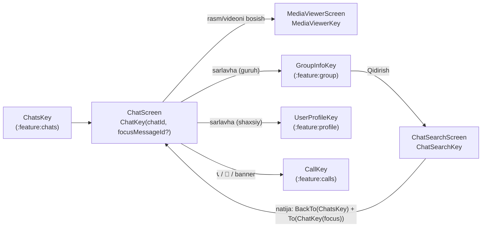
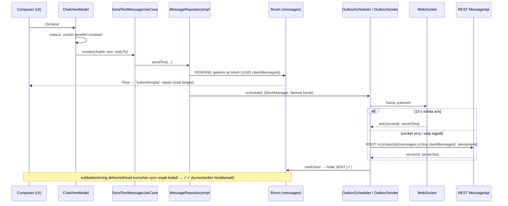

# `:feature:conversation` — Chat ekrani, chat ichida qidiruv va media ko'ruvchi

[← README'ga qaytish](../../../README.uz.md)

## Vazifasi

Suhbatning o'zi: xabarlar ro'yxati, yozish paneli (matn, javob berish, tahrirlash, ilovalar), xabar amallari (javob berish, tahrirlash, nusxalash, o'chirish, qayta yuborish), o'qildi belgilari, tarixni sahifalab yuklash, "yozmoqda" indikatori, qo'ng'iroq tugmalari va guruh video chati banneri. Shuningdek, **chat ichida qidiruv** (lokal) va to'liq ekranli **media ko'ruvchi** (kattalashtiriladigan rasmlar, video pleyer, galereyaga saqlash) ham shu modulda.

Chat **offline-first**: ekran faqat lokal Room bazasini *kuzatadi*. Yuborilgan xabarlar darhol "yuborilmoqda" bo'lib ko'rinadi, tarmoqdan keladigan hamma narsa esa avval bazaga yoziladi va ekranga o'sha yerdan keladi.

**Bog'liqliklar:** `:domain`, `:core:common`, `:core:designsystem`, `:core:navigation`. `GroupInfoKey`, `UserProfileKey` va `CallKey`ni NavKey'lar orqali ochadi.

## Ekranlar oqimi



```text
Chats ──► Chat ──mediani bosish──► MediaViewer
           │──sarlavha (guruh)──► GroupInfo ──Qidirish──► ChatSearch ──natija──► Chat (xabargacha aylantiradi)
           │──sarlavha (shaxsiy)──► UserProfile
           └──📞/🎥/banner──► Call
```

## Pattern

Contract + ViewModel + Screen + DirectionsImpl (Orbit MVI). Uchala ViewModel'ga ishga tushish vaqtida argument kerak, shuning uchun ular Hilt **assisted injection**dan (`@AssistedInject` + factory) foydalanadi. Batafsil: [README → boshidan oxirigacha ishlash oqimi](../../../README.uz.md#5-boshidan-oxirigacha-ishlash-oqimi).

## Ekranlar

| Ekran (NavKey) | Intent'lar | UiState | SideEffect'lar | Directions → manzil | Use case'lar |
|---|---|---|---|---|---|
| **Chat** (`ChatKey(chatId, focusMessageId?)`) | `OnBack`, `OnTextChange`, `OnSend`, `OnReply`, `OnEdit`, `OnCancelComposerMode`, `OnDelete`, `OnRetry`, `OnLoadOlder`, `OnBottomVisible`, `OnOpenInfo`, `OnAttach(Attachment)`, `OnCancelUpload`, `OnMediaClick`, `OnStartCall(video)`, `OnGroupCall`, `OnEmojiPicked(emoji)` | `chat`, `items: List<ChatItem>`, `userNames`, `myUserId`, `typingUserIds`, `composerText`, `composerMode` (`None`/`Reply`/`Edit`), `hasMore`, `isLoadingOlder`, `memberCount`, `myRole`, `fileDownloads` (id → 0..1), `isPreparingMedia`, `isStartingCall`, `groupCallCount`, `memberIds`, `recentEmojis`; hisoblanadigan `isGroup`, `canSend`, `canDeleteOthers` | `ShowError` (HTTP 401 ko'rsatilmaydi), `OpenFile(path, mime)` | `back`; `navigateToGroupInfo`; `navigateToUserProfile`; `navigateToMediaViewer`; `navigateToCall` → `CallKey(callId, video, chatId)`; `navigateToGroupCall` → `CallKey(…, group = true)` | `ObserveMessages`, `ObserveChat`, `ObserveUserNames`, `ObserveMe`, `ObserveTyping`, `LoadLatestMessages`, `LoadOlderMessages`, `SendTextMessage`, `RetryMessage`, `EditMessage`, `DeleteMessage`, `SendTyping`, `MarkChatRead`, `ObserveMembers`, `RefreshMembers`, `SendMediaMessage`, `CancelUpload`, `DownloadMedia`, `StartCall`, `PrepareGroupCall`, `ObserveGroupCall`, `ObserveRecentEmojis`, `AddRecentEmoji` |
| **ChatSearch** (`ChatSearchKey(chatId)`) | `OnBack`, `OnQueryChange`, `OnClear`, `OnResultClick` | `query`, `results: List<Message>`, `searchedQuery`, `userNames`; hisoblanadigan `showNothingFound` | — | `back`; `openMessage` → `BackTo(ChatsKey)`, keyin `To(ChatKey(chatId, focusMessageId))` | `SearchMessages`, `ObserveUserNames` |
| **MediaViewer** (`MediaViewerKey(chatId, clientMessageId)`) | `OnBack`, `OnPageChange(index)`, `OnSave(ViewerItem)` | `items: List<ViewerItem>`, `initialIndex`, `userNames`, `myUserId` | `Saved`, `ShowError` | `back` | `ObserveMessages`, `ObserveUserNames`, `ObserveMe`, `SaveMediaToGallery` (+ ExoPlayer uchun media `DataSource.Factory`) |

Xabar amallari qoidalari `ChatContract.kt` faylida: `canEdit()` (o'zimning matnli xabarim, serverga yetgan, 48 soatdan oshmagan, qo'ng'iroq yozuvi emas), `canDelete(canDeleteOthers)` (o'zimning xabarim yoki guruhda OWNER/ADMIN), `canReply()`.

## Chat qanday ishlaydi

| Imkoniyat | Oqim |
|---|---|
| **Yuklash** | Ochilganda: `observeData` xabarlar, chat, ismlar, men, "yozmoqda" va a'zolarni birlashtiradi; `buildChatItems` xabarlarni ro'yxat elementlariga aylantiradi (sana ajratgichlari, ketma-ketlikning birinchi xabarida yuboruvchi ismi, oxirgisida avatar). `loadLatest` parallel ravishda serverdan eng yangi sahifani oladi. Guruhda a'zolar bir marta yangilanadi va guruh qo'ng'irog'i xonasi kuzatiladi. |
| **Matn yuborish** | `OnSend` yozish panelini darhol tozalaydi va `SendTextMessageUseCase`ni chaqiradi. Repository **PENDING** qatorini (UUID `clientMessageId`) qo'shadi va outbox'ni rejalashtiradi — xabar tarmoqni kutmasdan, hatto offline'da ham "yuborilmoqda" bo'lib ko'rinadi. |
| **Media yuborish** | `OnAttach` (Photo Picker orqali galereya, kamera, fayl — runtime ruxsatlar kerak emas). Yozish panelidagi matn izohga aylanadi (fayllar uchun emas). Fayl nusxalanib, xesh hisoblanayotganda `isPreparingMedia` ikki marta yuborishni bloklaydi. Yuklash jarayoni xabar ichida ko'rsatiladi va uni bekor qilish mumkin. |
| **Javob berish / tahrirlash / o'chirish** | Bosib turish `MessageMenuOverlay`ni ochadi (xiralashgan fon, ko'tarilgan xabar). Reply/Edit `composerMode`ni almashtiradi; tahrirlash `EditMessageUseCase`ni chaqiradi. O'chirish tasdiqlashni so'raydi; server sinxronizatsiya orqali tombstone qaytaradi. *Tahrirlash* bekor qilinsa matn tozalanadi, *javob berish* bekor qilinsa matn qoladi. |
| **Emoji** | Yozish panelidagi 😊 tugmasi klaviaturani `EmojiPanel` bilan almashtiradi (balandligi oxirgi klaviatura bilan bir xil, boshida 280dp; belgi ⌨ ga aylanadi). Tepada kategoriyalar, birinchisi — "So'nggi" (🕘), agar bo'sh bo'lmasa. Bosilganda `OnEmojiPicked` → emoji matnga qo'shiladi va `AddRecentEmojiUseCase` uni saqlaydi (eng yangisi birinchi, ko'pi bilan 24 ta, DataStore). Maydonni bosish, Orqaga yoki javob/tahrirlash rejimiga o'tish panelni yopadi. |
| **Katta emoji** | Faqat 1–3 ta emojidan iborat va javob bo'lmagan matnli xabar (`emojiOnlyCount`, ICU grafema klasterlari — API 26 da ishlaydi) `EmojiMessage` orqali pufakchasiz chiziladi: 56 / 44 / 36sp, vaqt qora fonli kapsulada. Xabar tarmoqlanish tartibi: media → qo'ng'iroq yozuvi → faqat emoji → matn. |
| **Qayta yuborish** | Yuborilmagan chiquvchi xabarda qizil tugma chiqadi → `RetryMessageUseCase`. |
| **O'qildi belgilari** | Eng yangi xabar ko'rinib turganda ekran `OnBottomVisible` yuboradi; ViewModel `MarkChatReadUseCase`ni faqat eng yangi `serverSeq` oxirgi yuborilganidan katta bo'lsa chaqiradi. |
| **Tarixni sahifalash** | Ro'yxat teskari (eng yangisi pastda). Foydalanuvchi eng eski xabarga 8 ta element qolguncha aylantirsa, `OnLoadOlder` oldingi sahifani yuklaydi (`hasMore` / `isLoadingOlder` bilan himoyalangan). |
| **Yozmoqda** | Har bir matn o'zgarishi (tahrirlash rejimidan tashqari) `SendTypingUseCase`ni chaqiradi; server uni cheklaydi. Boshqalarning yozayotgani `ChatTopBar`da ko'rsatiladi (ustuvorlik: yozmoqda → online → oxirgi marta / a'zolar soni). |
| **Fayllar** | Rasm va videolar ko'ruvchida ochiladi. Fayllar jarayon ko'rsatilgan holda yuklab olinadi (`fileDownloads`), keyin `OpenFile` `FileProvider` orqali Android ilovasini ishga tushiradi. |
| **Qo'ng'iroqlar** | Shaxsiy chat: 📞/🎥 → `StartCallUseCase` → qo'ng'iroq ekrani. Guruh: 🎥, banner yoki qo'ng'iroq yozuvi → `PrepareGroupCallUseCase`; xonada hali hech kim bo'lmasa, avval chatga "Video chat boshlandi" yozuvi yuboriladi. |
| **Guruh qo'ng'irog'i banneri** | `ObserveGroupCallUseCase` xonadagi odamlar sonini beradi; u > 0 bo'lsa, sarlavha ostida "Video chat · N ishtirokchi · Qo'shilish" banneri chiqadi. |
| **Media ko'ruvchi** | Chatdagi barcha media bo'yicha `HorizontalPager`; barmoq bilan 5× gacha kattalashtirish (ikki marta bosish 2.5×); ViewModel'ga tegishli bitta ExoPlayer (sahifa almashishi main thread'da qayta ishlanadi); "Saqlash" bildirishnomali foreground worker'ni ishga tushiradi. |
| **Chat ichida qidiruv** | Faqat lokal (API'da xabar qidiruvi yo'q), 200 ms debounce, mosliklar ajratib ko'rsatiladi. Natija bosilganda stek Chats → Chat qilib qayta quriladi va o'sha xabargacha aylantiriladi. |

### Matnli xabar yuborish



```text
Composer ─OnSend─► ChatViewModel ─► SendTextMessageUseCase ─► MessageRepositoryImpl
                                                                  │ PENDING qo'shish ─► Room ─► UI "yuborilmoqda"
                                                                  └ schedule ─► OutboxSender
OutboxSender ─► WebSocket (10 s ack kutadi) ──yoki──► REST POST (o'sha clientMessageId)
          └──► Room: SENT (✓) ──► keyin: sync orqali suhbatdosh kursorlari ──► DELIVERED / READ (✓✓)
```

## Komponentlar

| Fayl | Vazifasi |
|---|---|
| `chat/components/AttachSheet.kt` | Galereya (Photo Picker), Kamera (FileProvider fayli), Fayl tanlash — runtime ruxsatlar kerak emas. |
| `chat/components/CallLogBubble.kt` | Qo'ng'iroq tarixi matnli xabarlarini (`📞 Call · …`) sarlavha, belgi va davomiylik bilan qo'ng'iroq xabari qilib chizadi; shuningdek `callTitleRes`. |
| `chat/components/ChatChips.kt` | `DateChip` va `SystemChip` ("Ali guruhni yaratdi"). |
| `chat/components/ChatTopBar.kt` | Sarlavha: orqaga, avatar, nom, holat (yozmoqda / online / oxirgi marta / a'zolar), audio va video qo'ng'iroq tugmalari. |
| `chat/components/Composer.kt` | Yozish paneli: javob/tahrirlash paneli, ilova qo'shish, matn maydoni, yuborish/saqlash tugmasi. |
| `chat/components/GroupCallBanner.kt` | "Qo'shilish" tugmali "Video chat · N ishtirokchi". |
| `chat/components/MessageBubble.kt` | Matnli xabar, javob iqtibosi, meta (vaqt, tahrirlangan, ✓/✓✓), media xabarlarga yo'naltirish. |
| `chat/components/MessageMedia.kt` | Rasm/video xabari, fayl xabari, yuklash/yuklab olish jarayoni halqalari, play belgisi. |
| `chat/components/MessageMenu.kt` | Bosib turishda chiqadigan oyna: Javob berish, Tahrirlash, Nusxalash, O'chirish. |
| `chat/components/MessageRow.kt` | Chap/o'ng tekislash, guruh avatari joyi, qayta yuborish tugmasi, bosish / bosib turishni qayta ishlash; `SwipeToReplyBox` bilan o'ralgan. |
| `chat/components/EmojiPanel.kt` | Klaviatura o'rnidagi emoji paneli: kategoriya tugmalari (birinchisi "So'nggi"), moslashuvchan 44dp to'r; bir nechtasini tanlash uchun panel ochiq qoladi. |
| `chat/components/EmojiMessage.kt` | Pufakchasiz katta emoji xabari (1–3 ta), meta qora fonli kapsulada. |
| `chat/components/SwipeToReply.kt` | Telegram'dagidek chapga surib javob berish: qator barmoq ortidan siljiydi, o'ng chetda ↩ belgisi kattalashadi, 56dp'da yengil titrash, qo'yib yuborilganda javob. Faqat chapga surish ushlanadi, shuning uchun o'ngga surish (orqaga) va vertikal scroll ishlayveradi. |

## Yordamchi fayllar

| Fayl | Mazmuni |
|---|---|
| `chat/ChatItems.kt` | `ChatItem` (DateSeparator / System / Bubble) va sof funksiya `buildChatItems(messages, isGroup)`. |
| `chat/emoji/EmojiText.kt` | `emojiOnlyCount(text)` — matn faqat 1..`MAX_LARGE_EMOJI` (3) ta emoji bo'lsa ularning soni, aks holda `null`; ICU `BreakIterator` grafema klasterlari (`EXTENDED_PICTOGRAPHIC` API 29 talab qiladi, minSdk 26). |
| `chat/emoji/EmojiCatalog.kt` | `EmojiCategory`, `EmojiCatalog` — 9 ta ichki kategoriya (smayllar, odamlar, hayvonlar, ovqat, sayohat, faoliyat, buyumlar, belgilar, bayroqlar); kutubxonasiz. |
| `util/ChatTimeFormat.kt` | `formatMessageTime`, `dayStartMillis`, `formatDateSeparator` (Bugun / Kecha / "24-sentabr[, 2025]"). |
| `util/MediaFormat.kt` | `formatSize`, `formatSizeProgress`, `formatDuration`, `fileTypeLabel`. |
| `util/SystemText.kt` | `systemText(...)` — guruh yaratildi / a'zolar qo'shildi / chiqarildi / chiqib ketdi gaplari. |
| `util/ErrorMessage.kt` | `AppError.messageRes()` — internet yo'q, fayl juda katta (413), qo'ng'iroqlar mavjud emas, qo'ng'iroq amalga oshmadi, juda ko'p urinish, tahrirlash muddati o'tdi, taqiqlangan, noma'lum. |

## Barcha fayllar (34)

Yo'llar `feature/conversation/src/main/java/uz/relay/feature/conversation/` ga nisbatan berilgan.

| Fayl | Klass(lar) | Vazifasi | Bog'liqlik / kim ishlatadi |
|---|---|---|---|
| `ConversationEntries.kt` | `conversationEntries()` | Chat, ChatSearch, MediaViewer'ni ro'yxatdan o'tkazadi. | `AppNavHost` |
| `di/ConversationDirectionsModule.kt` | `ConversationDirectionsModule` | 3 ta `DirectionsImpl` klassini bind qiladi. | Hilt |
| `chat/ChatContract.kt` | `ChatContract`, `ComposerMode`, `canEdit/canDelete/canReply` | Chat contract'i va xabar amallari qoidalari. | Screen, ViewModel, komponentlar |
| `chat/ChatViewModel.kt` | `ChatViewModel` (assisted `chatId`) | Xabarlar, yozish paneli, media, o'qildi belgilari, sahifalash, yozmoqda, qo'ng'iroqlar. | 21 ta use case (jadvalga qarang) |
| `chat/ChatScreen.kt` | `ChatScreen`, `ChatScreenContent` | Chat UI, ustki oynalar, aylantirish effektlari, fayllarni ochish. | `ChatViewModel`, komponentlar |
| `chat/ChatDirectionsImpl.kt` | `ChatDirectionsImpl` | Orqaga, GroupInfo, UserProfile, MediaViewer, Call, GroupCall. | `AppNavigator` |
| `chat/ChatItems.kt` | `ChatItem`, `buildChatItems` | Xabarlar → ro'yxat elementlari. | `ChatViewModel` |
| `chat/components/AttachSheet.kt` | `AttachSheet` | Ilova tanlash oynasi. | `ChatScreen` |
| `chat/components/CallLogBubble.kt` | `CallLogBubble`, `callTitleRes` | Qo'ng'iroq tarixi xabari. | `MessageBubble` |
| `chat/components/ChatChips.kt` | `DateChip`, `SystemChip` | Markazlashgan chip'lar. | `ChatScreen` |
| `chat/components/ChatTopBar.kt` | `ChatTopBar` | Chat sarlavhasi. | `ChatScreen` |
| `chat/components/Composer.kt` | `Composer` | Yozish paneli. | `ChatScreen` |
| `chat/components/GroupCallBanner.kt` | `GroupCallBanner` | Guruh video chati banneri. | `ChatScreen` |
| `chat/components/MessageBubble.kt` | `MessageBubble`, `ReplyQuote`, `MessageMeta` | Matnli xabar va meta. | `MessageRow` |
| `chat/components/MessageMedia.kt` | `VisualMessageBubble`, `FileMessageBubble` | Media xabarlar. | `MessageBubble` |
| `chat/components/MessageMenu.kt` | `MenuTarget`, `MessageMenuOverlay` | Bosib turish menyusi. | `ChatScreen` |
| `chat/components/MessageRow.kt` | `MessageRow` | Qator joylashuvi va imo-ishoralar. | `ChatScreen` |
| `chat/components/EmojiMessage.kt` | `EmojiMessage` | Pufakchasiz katta emoji. | `MessageBubble` |
| `chat/components/EmojiPanel.kt` | `EmojiPanel` | Emoji tanlash paneli. | `ChatScreen`, `EmojiCatalog` |
| `chat/components/SwipeToReply.kt` | `SwipeToReplyBox` | Chapga surib javob berish (graphicsLayer orqali siljish, chegarada titrash). | `MessageRow`, `rememberGestureThresholdHaptic` |
| `chat/emoji/EmojiCatalog.kt` | `EmojiCategory`, `EmojiCatalog` | Kategoriyalar bo'yicha ichki emoji ro'yxati. | `EmojiPanel` |
| `chat/emoji/EmojiText.kt` | `emojiOnlyCount`, `MAX_LARGE_EMOJI` | Faqat emojidan iborat matnni aniqlash. | `MessageBubble` |
| `search/ChatSearchContract.kt` | `ChatSearchContract` | Chat ichida qidiruv contract'i. | Screen, ViewModel |
| `search/ChatSearchViewModel.kt` | `ChatSearchViewModel` (assisted `chatId`) | Lokal qidiruv, 200 ms debounce. | `SearchMessages`, `ObserveUserNames` |
| `search/ChatSearchScreen.kt` | `ChatSearchScreen`, `ChatSearchContent` | Mosliklar ajratib ko'rsatilgan qidiruv UI. | `ChatSearchViewModel` |
| `search/ChatSearchDirectionsImpl.kt` | `ChatSearchDirectionsImpl` | Orqaga; xabarni chatda ochish. | `AppNavigator` |
| `viewer/MediaViewerContract.kt` | `MediaViewerContract`, `ViewerItem` | Ko'ruvchi contract'i. | Screen, ViewModel |
| `viewer/MediaViewerViewModel.kt` | `MediaViewerViewModel` (assisted) | Ko'ruvchi elementlari, ExoPlayer, galereyaga saqlash. | `ObserveMessages`, `SaveMediaToGallery` … |
| `viewer/MediaViewerScreen.kt` | `MediaViewerScreen`, `ZoomableImage`, `VideoPage` | Pager, kattalashtirish, video boshqaruvi. | `MediaViewerViewModel` |
| `viewer/MediaViewerDirectionsImpl.kt` | `MediaViewerDirectionsImpl` | Orqaga. | `AppNavigator` |
| `util/ChatTimeFormat.kt` | vaqt yordamchilari | Xabar vaqti va sana ajratgichlari. | `ChatScreen`, ko'ruvchi |
| `util/ErrorMessage.kt` | `messageRes()` | Xato → xabar. | Ekranlar |
| `util/MediaFormat.kt` | hajm/davomiylik yordamchilari | Media yorliqlari. | `MessageMedia` |
| `util/SystemText.kt` | `systemText` | SYSTEM hodisalari gaplari. | `SystemChip` |

## Resurslar

`values` (o'zbekcha, asosiy), `values-ru`, `values-en`; `res/xml/conversation_file_paths.xml` kamera rasmlari va ochiladigan fayllar uchun FileProvider yo'llarini belgilaydi.

## Testlar

| Turi | Klasslar |
|---|---|
| Mantiq | `BuildChatItemsTest`, `MessageActionsTest` (yordamchi: `TestMessages.kt`), `EmojiTextTest` (1–3 emoji; 3 tadan ko'pi oddiy matn; ZWJ/bayroq/keycap bittadan sanaladi; matn yoki aralash — faqat emoji emas; katalogdagi har bir emoji aniqlanadi) |
| ViewModel | `ChatViewModelTest` (shu jumladan emoji tanlansa matnga qo'shilishi va so'nggilarga saqlanishi), `ChatSearchViewModelTest` |
| Compose UI | `CallUiTest` (qo'ng'iroq yozuvlari, guruh qo'ng'irog'i banneri, qo'ng'iroq tugmalari), `SwipeToReplyTest` (chapga surish javob beradi; o'ngga, qisqa surish va yetkazilmagan xabarda javob yo'q) |
| Screenshot | `CallUiScreenshotTest` — sarlavha, banner, barcha turdagi qo'ng'iroq yozuvlari; `EmojiScreenshotTest` — katta emoji xabarlari va emoji paneli; yorug' va tungi tema |
