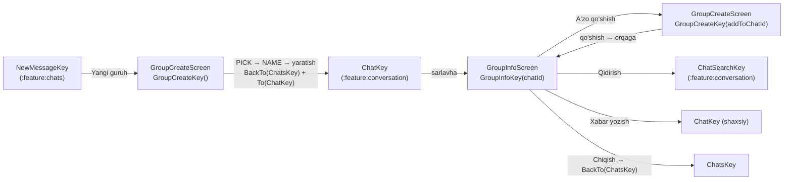

# `:feature:group` — Guruh yaratish va guruh ma'lumoti

[← README'ga qaytish](../../../README.uz.md)

## Vazifasi

Guruh chatini yaratish (a'zolarni tanlash → nom berish) va mavjud guruhni boshqarish: rollari bilan a'zolar ro'yxati, nomini o'zgartirish, a'zo qo'shish/chiqarish, rollarni o'zgartirish (OWNER/ADMIN/MEMBER), ovozsiz qilish, guruh ichida qidirish, a'zoga shaxsiy yozish, guruhdan chiqish. "A'zolarni tanlash" ekrani mavjud guruhga **a'zo qo'shish** uchun ham qayta ishlatiladi.

Foydalanuvchi qaysi tugmalarni ko'rishi uning roliga bog'liq — qoidalar `:domain` dagi `GroupPermissions`dan olinadi (server qoidalari bilan bir xil).

**Bog'liqliklar:** `:domain`, `:core:common`, `:core:designsystem`, `:core:navigation`.

## Ekranlar oqimi



```text
NewMessage ──Yangi guruh──► GroupCreate [PICK ─► NAME] ──yaratish──► Chats ► Chat
Chat ──sarlavha──► GroupInfo ──A'zo qo'shish──► GroupCreate(addToChatId) [faqat PICK] ──► orqaga
                    │──Qidirish──► ChatSearch
                    │──a'zo ► Xabar yozish──► shaxsiy Chat
                    └──Guruhdan chiqish──► Chats
```

## Pattern

Contract + ViewModel + Screen + DirectionsImpl (Orbit MVI); ikkala ViewModel ham o'z argumenti uchun assisted injection'dan foydalanadi. Batafsil: [README → boshidan oxirigacha ishlash oqimi](../../../README.uz.md#5-boshidan-oxirigacha-ishlash-oqimi).

## Ekranlar

| Ekran (NavKey) | Intent'lar | UiState | SideEffect'lar | Directions → manzil | Use case'lar |
|---|---|---|---|---|---|
| **GroupCreate** (`GroupCreateKey(addToChatId?)`) | `OnBack`, `OnQueryChange`, `OnToggle(user)`, `OnNext`, `OnTitleChange`, `OnCreate` | `addToChatId`, `step` (`PICK`/`NAME`), `query`, `candidates`, `selected`, `title`, `isSubmitting`; hisoblanadigan `isAddMode`, `selectedIds`, `canProceed`, `canCreate` (nom 1–128) | `ShowError` | `back`; `openCreatedChat` → `BackTo(ChatsKey)` + `To(ChatKey)` | `ObserveKnownUsers`, `ObserveMembers`, `SearchUsers`, `CreateGroup`, `AddMembers` |
| **GroupInfo** (`GroupInfoKey(chatId)`) | `OnBack`, `OnToggleMute`, `OnSearch`, `OnAddMembers`, `OnRename`, `OnChangeRole`, `OnRemove`, `OnWriteMessage`, `OnLeave` | `chat`, `members`, `isBusy`; hisoblanadigan `myRole`, `canManage`, `onlineCount` | `ShowError` | `back`; `navigateToAddMembers` → `To(GroupCreateKey(addToChatId))`; `navigateToChatSearch`; `navigateToChat`; `backToChats` → `BackTo(ChatsKey)` | `ObserveChat`, `ObserveMembers`, `RefreshMembers`, `SetChatMuted`, `RenameGroup`, `ChangeMemberRole`, `RemoveMember`, `LeaveGroup`, `OpenDirectChat` |

**E'tiborga molik xatti-harakatlar**

- **Nomzodlar** = qurilmada allaqachon ma'lum foydalanuvchilar + server qidiruvi natijalari (300 ms debounce), guruhda bor odamlar bundan mustasno (qo'shish rejimida).
- **Yaratish rejimi** ikki qadamdan iborat (tanlash → nom berish). **Qo'shish rejimida** faqat tanlash qadami bor; "Keyingi" a'zolarni qo'shadi va orqaga qaytadi.
- **GroupInfo** amallari bitta himoyadan (`isBusy`) o'tadi, shuning uchun ikki marta bosish ikkita so'rov yubora olmaydi. Nomni o'zgartirish `SwiftInputDialog`dan foydalanadi; chiqarish/chiqib ketish `SwiftDialog` bilan tasdiq so'raydi. A'zoni bosish bottom sheet'ni ochadi (xabar yozish, admin/a'zo qilish, chiqarish) — variantlar `GroupPermissions` bo'yicha filtrlanadi.

## Barcha fayllar (11)

Yo'llar `feature/group/src/main/java/uz/relay/feature/group/` ga nisbatan berilgan.

| Fayl | Klass(lar) | Vazifasi | Bog'liqlik / kim ishlatadi |
|---|---|---|---|
| `GroupEntries.kt` | `groupEntries()` | GroupCreate va GroupInfo'ni ro'yxatdan o'tkazadi. | `AppNavHost` |
| `di/GroupDirectionsModule.kt` | `GroupDirectionsModule` | 2 ta `DirectionsImpl` klassini bind qiladi. | Hilt |
| `create/GroupCreateContract.kt` | `GroupCreateContract`, `Step` | Yaratish / a'zo qo'shish contract'i. | Screen, ViewModel |
| `create/GroupCreateViewModel.kt` | `GroupCreateViewModel` (assisted `addToChatId`) | Nomzodlar, debounce'li qidiruv, tanlash, guruh yaratish, a'zo qo'shish. | 5 ta use case |
| `create/GroupCreateScreen.kt` | `GroupCreateScreen`, `GroupCreateContent`, tanlash/nom qadamlari, qatorlar, chip'lar | Yaratish / a'zo qo'shish UI. | `GroupCreateViewModel` |
| `create/GroupCreateDirectionsImpl.kt` | `GroupCreateDirectionsImpl` | Orqaga; yaratilgan chatni ochish. | `AppNavigator` |
| `info/GroupInfoContract.kt` | `GroupInfoContract` | Guruh ma'lumoti contract'i. | Screen, ViewModel |
| `info/GroupInfoViewModel.kt` | `GroupInfoViewModel` (assisted `chatId`) | Kuzatish, a'zolarni yangilash, ovozsiz qilish, nomni o'zgartirish, rollar, chiqarish, chiqib ketish, xabar yozish. | 9 ta use case |
| `info/GroupInfoScreen.kt` | `GroupInfoScreen`, `GroupInfoContent`, sarlavha, a'zo qatorlari, sheet, dialoglar | Guruh ma'lumoti UI. | `GroupInfoViewModel` |
| `info/GroupInfoDirectionsImpl.kt` | `GroupInfoDirectionsImpl` | Orqaga, AddMembers, ChatSearch, Chat, Chats'ga qaytish. | `AppNavigator` |
| `util/ErrorMessage.kt` | `messageRes()` | Xato → xabar (internet yo'q, juda ko'p urinish, taqiqlangan/403, noma'lum). | Ekranlar |

## Resurslar

`values` (o'zbekcha, asosiy), `values-ru`, `values-en` — rol nomlari, a'zolar soni (plurals), dialoglar.

## Testlar

| Turi | Klasslar |
|---|---|
| ViewModel | `GroupCreateViewModelTest`, `GroupInfoViewModelTest` |
| Compose UI | `GroupInfoScreenTest` (boshqaruv amallari faqat adminlar uchun, chiqishni tasdiqlash) |
| Screenshot | `GroupScreenshotTest` — guruh ma'lumoti; yorug' va tungi tema |

> UI testlar qamramagan: fokuslangan matn maydonli dialoglar (nomni o'zgartirish) — miltillovchi kursor Robolectric soatini doim band qilib turadi. Ularning mantig'i ViewModel testlari bilan qoplangan.
