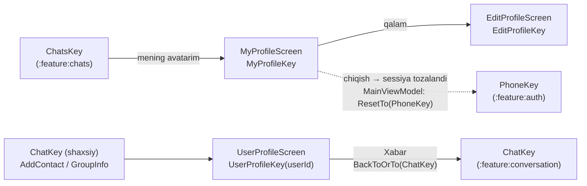

# `:feature:profile` — Mening profilim, sozlamalar, profilni tahrirlash va foydalanuvchi profili

[← README'ga qaytish](../../../README.uz.md)

## Vazifasi

- **Mening profilim:** ismim, telefonim, username'im, ulanish holati va ilova sozlamalari — bildirishnomalar, **tema** (Tizim / Kunduzgi / Tungi), **til** (Oʻzbekcha / Русский / English) va tizimdan chiqish.
- **Profilni tahrirlash:** ism va username'ni o'zgartirish.
- **Foydalanuvchi profili:** boshqa odamning profili — xabar yozish, ovozsiz qilish, kontaktlarga qo'shish / kontaktlardan o'chirish.

**Bog'liqliklar:** `:domain`, `:core:common`, `:core:designsystem`, `:core:navigation`.

## Ekranlar oqimi



```text
Chats ──mening avatarim──► MyProfile ──qalam──► EditProfile
                              └──Chiqish──► (sessiya tozalandi) ──MainViewModel──► Phone
Chat sarlavhasi / AddContact / GroupInfo ──► UserProfile ──Xabar──► Chat (mavjudi qayta ishlatiladi)
```

Chiqish uchun ataylab Direction yo'q: sessiya tozalanganda `MainViewModel` (`:app`) `AuthState.LOGGED_OUT`ni ko'radi va butun stekni telefon ekraniga qaytaradi — istalgan ekrandan.

## Pattern

Contract + ViewModel + Screen + DirectionsImpl (Orbit MVI). Batafsil: [README → boshidan oxirigacha ishlash oqimi](../../../README.uz.md#5-boshidan-oxirigacha-ishlash-oqimi).

## Ekranlar

| Ekran (NavKey) | Intent'lar | UiState | SideEffect'lar | Directions → manzil | Use case'lar |
|---|---|---|---|---|---|
| **MyProfile** (`MyProfileKey`) | `OnBack`, `OnEdit`, `OnNotificationsChange`, `OnThemeChange(ThemeMode)`, `OnLanguageChange(AppLanguage)`, `OnLogout` | `me`, `connectionStatus`, `themeMode`, `notificationsEnabled`, `language`, `loggingOut` | `ShowError` | `back`; `navigateToEditProfile` → `To(EditProfileKey)` | `ObserveMe`, `RefreshMe`, `ObserveConnectionStatus`, `ObserveThemeMode`, `SetThemeMode`, `ObserveNotificationsEnabled`, `SetNotificationsEnabled`, `ObserveLanguage`, `SetLanguage`, `Logout` |
| **EditProfile** (`EditProfileKey`) | `OnBack`, `OnNameChange`, `OnUsernameChange`, `OnSave` | `loaded`, `userId`, `name`, `username`, `initialName`, `initialUsername`, `usernameTaken`, `saving`; hisoblanadigan `usernameValid`, `saveEnabled` (to'g'ri **va** o'zgargan) | `ShowError` (band username o'rniga maydonning o'zida ko'rsatiladi) | `back` | `ObserveMe` (bir marta o'qiladi), `UpdateProfile` |
| **UserProfile** (`UserProfileKey(userId)`) | `OnBack`, `OnMessage`, `OnToggleMute`, `OnToggleContact` | `user`, `chat`, `isBusy`, `isContact`; hisoblanadigan `muted` | `ContactAdded`, `ShowError` | `back`; `navigateToChat` → `BackToOrTo(ChatKey)` | `ObserveUser`, `RefreshUser`, `ObserveDirectChat`, `OpenDirectChat`, `SetChatMuted`, `ObserveContactIds`, `AddContact`, `RemoveContact` |

**E'tiborga molik xatti-harakatlar**

- Tema va til bitta umumiy `OptionSheet`da tanlanadi (✓ belgili bottom sheet). Til o'zgarganda activity yangi tilda qayta yaratiladi; sozlamalar tizimdan chiqqandan keyin ham saqlanadi (ular qurilma sozlamalari).
- Chiqish `SwiftDialog`da bitta qisqa savol beradi; ikki marta bosish ikki marta chiqara olmaydi (`loggingOut`).
- UserProfile → "Xabar" ikkinchi nusxani ochish o'rniga stekdagi mavjud chatni qayta ishlatadi (`BackToOrTo`); hali chat bo'lmasa, avval serverda yaratiladi. Ovozsiz qilish ham kerak bo'lsa shaxsiy chatni yaratadi.

## Komponentlar va yordamchi fayllar

| Fayl | Mazmuni |
|---|---|
| `components/ProfileComponents.kt` | Umumiy profil UI: yuqori panel, sarlavha (avatar, ism, holat), kartalar, belgi plitkalari, ma'lumot/sozlama qatorlari, bo'lim yorliqlari, qizil "xavfli" qator, amal kartalari. |
| `util/ErrorMessage.kt` | `AppError.messageRes()` — internet yo'q, juda ko'p urinish, taqiqlangan (403), topilmadi (404), noma'lum. |
| `util/PhoneFormat.kt` | Ko'rsatish uchun `formatPhone("+998…")`. |

## Barcha fayllar (17)

Yo'llar `feature/profile/src/main/java/uz/relay/feature/profile/` ga nisbatan berilgan.

| Fayl | Klass(lar) | Vazifasi | Bog'liqlik / kim ishlatadi |
|---|---|---|---|
| `ProfileEntries.kt` | `profileEntries()` | MyProfile, EditProfile, UserProfile'ni ro'yxatdan o'tkazadi. | `AppNavHost` |
| `di/ProfileDirectionsModule.kt` | `ProfileDirectionsModule` | 3 ta `DirectionsImpl` klassini bind qiladi. | Hilt |
| `components/ProfileComponents.kt` | profil UI qismlari | Umumiy joylashuv qismlari. | Uchala ekran |
| `me/MyProfileContract.kt` | `MyProfileContract` | O'z profilim + sozlamalar contract'i. | Screen, ViewModel |
| `me/MyProfileViewModel.kt` | `MyProfileViewModel` | Profil, ulanish, tema/bildirishnomalar/til, chiqish. | 10 ta use case |
| `me/MyProfileScreen.kt` | `MyProfileScreen`, `MyProfileContent`, `OptionSheet` | Profil va sozlamalar UI, chiqish dialogi. | `MyProfileViewModel` |
| `me/MyProfileDirectionsImpl.kt` | `MyProfileDirectionsImpl` | Orqaga; EditProfile. | `AppNavigator` |
| `edit/EditProfileContract.kt` | `EditProfileContract` | Tahrirlash formasi contract'i. | Screen, ViewModel |
| `edit/EditProfileViewModel.kt` | `EditProfileViewModel` | Profilni bir marta yuklaydi, kiritishni filtrlaydi, saqlaydi. | `ObserveMe`, `UpdateProfile` |
| `edit/EditProfileScreen.kt` | `EditProfileScreen`, `EditProfileContent` | Tahrirlash UI (qoidalar eslatmasi faqat noto'g'ri kiritishda). | `EditProfileViewModel` |
| `edit/EditProfileDirectionsImpl.kt` | `EditProfileDirectionsImpl` | Orqaga. | `AppNavigator` |
| `user/UserProfileContract.kt` | `UserProfileContract` | Boshqa foydalanuvchi profili contract'i. | Screen, ViewModel |
| `user/UserProfileViewModel.kt` | `UserProfileViewModel` (assisted `userId`) | Foydalanuvchini kuzatish/yangilash, chatni ochish, ovozsiz qilish, kontaktni almashtirish. | 8 ta use case |
| `user/UserProfileScreen.kt` | `UserProfileScreen`, `UserProfileContent` | Foydalanuvchi profili UI, kontaktni o'chirishni tasdiqlash. | `UserProfileViewModel` |
| `user/UserProfileDirectionsImpl.kt` | `UserProfileDirectionsImpl` | Orqaga; `BackToOrTo(ChatKey)`. | `AppNavigator` |
| `util/ErrorMessage.kt` | `messageRes()` | Xato → xabar. | Ekranlar |
| `util/PhoneFormat.kt` | `formatPhone` | Telefonni ko'rsatish formati. | `MyProfileScreen` |

> Profil rasmlari **hali qilinmagan** — avatarlarda rangli bosh harflar ko'rsatiladi.

## Resurslar

`values` (o'zbekcha, asosiy), `values-ru`, `values-en` — sozlamalar yorliqlari, tema nomlari (Tizim / Kunduzgi / Tungi), til nomlari (har biri o'z tilida), dialoglar.

## Testlar

| Turi | Klasslar |
|---|---|
| ViewModel | `MyProfileViewModelTest`, `EditProfileViewModelTest`, `UserProfileViewModelTest` |
| Compose UI | `MyProfileScreenTest` (bildirishnomalar, til oynasi, chiqishni tasdiqlash) |
| Screenshot | `ProfileScreenshotTest` — mening profilim, foydalanuvchi profili; yorug' va tungi tema |
